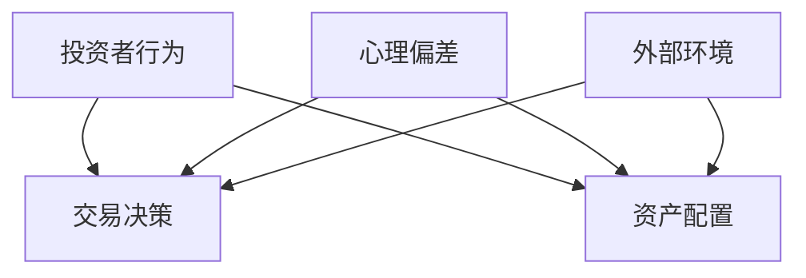
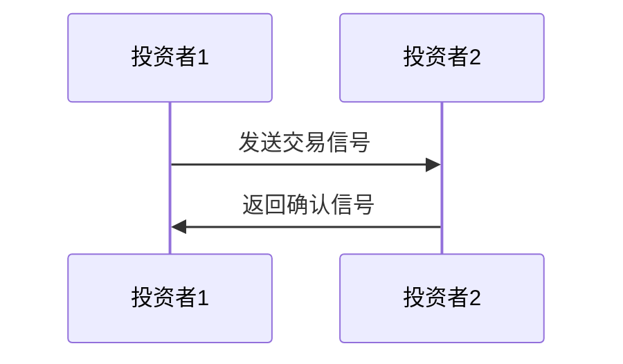
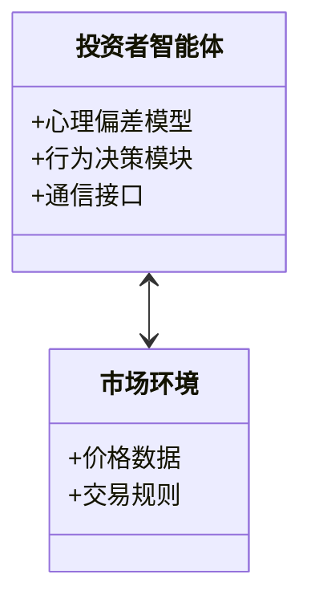

                 


---

# 多智能体系统模拟投资者心理偏差

> 关键词：多智能体系统, 投资者心理偏差, 行为金融学, 系统模拟, 人工智能

> 摘要：本文探讨了如何利用多智能体系统（MAS）模拟投资者心理偏差，从理论基础到实际应用，详细分析了多智能体系统的架构设计、投资者心理偏差的建模方法以及系统实现的各个环节。通过结合行为金融学和认知科学，本文提出了一种基于多智能体的投资者行为模拟框架，并通过实际案例分析验证了该框架的有效性。

---

## 第1章: 多智能体系统与投资者心理偏差概述

### 1.1 多智能体系统的定义与特点

多智能体系统（Multi-Agent Systems, MAS）是由多个智能体（Agent）组成的分布式系统，这些智能体能够通过交互和协作完成复杂任务。与传统单智能体系统相比，MAS具有以下特点：

- **分布式性**：多个智能体独立运行，协同完成任务。
- **自主性**：每个智能体具有自主决策能力。
- **反应性**：智能体能够实时感知环境并做出反应。
- **协作性**：智能体之间通过通信和协作完成共同目标。

### 1.2 投资者心理偏差的定义与分类

投资者心理偏差是指投资者在决策过程中由于认知偏差或情绪影响而产生的非理性行为。常见的投资者心理偏差包括：

- **过度自信偏差**：投资者过度相信自己的判断能力。
- **损失厌恶**：投资者对损失的厌恶程度高于对收益的偏好。
- **从众心理**：投资者盲目跟随市场潮流。
- **确认偏差**：投资者倾向于寻找与自己观点一致的信息。

### 1.3 本章小结

本章介绍了多智能体系统的基本概念和特点，以及投资者心理偏差的定义和分类。多智能体系统的分布式和自主性特点使其成为模拟投资者行为的理想工具。

---

## 第2章: 投资者心理偏差的建模与分析

### 2.1 投资者心理偏差的建模方法

#### 2.1.1 心理偏差的数学建模

投资者心理偏差可以通过数学模型进行描述。例如，损失厌恶可以通过以下公式表示：

$$
\text{效用} = \text{收益} - \text{损失} \times \text{损失厌恶系数}
$$

#### 2.1.2 心理偏差与行为的关系模型

心理偏差与投资者行为之间的关系可以通过行为模型进行描述。例如，过度自信的投资者可能倾向于过度交易：

$$
\text{交易频率} = f(\text{过度自信程度})
$$

#### 2.1.3 心理偏差的层次分析模型

层次分析模型（AHP）可以用于分析不同心理偏差对投资者行为的影响。以下是一个层次结构图：



---

### 2.2 多智能体系统中的心理偏差模拟框架

#### 2.2.1 模拟框架的设计

心理偏差模拟框架包括以下几个步骤：

1. **智能体行为建模**：定义智能体的行为规则。
2. **通信与协作**：智能体之间的信息交互。
3. **实验设计**：设计模拟实验并进行验证。

#### 2.2.2 实验结果分析

通过模拟实验可以观察心理偏差对市场行为的影响。例如，过度自信的投资者可能导致市场波动加剧。

---

## 第3章: 多智能体系统的算法实现

### 3.1 智能体通信与协作算法

#### 3.1.1 通信协议设计

智能体之间的通信可以通过消息传递机制实现。以下是一个简单的通信流程图：



#### 3.1.2 协作算法实现

协作算法可以通过分布式协商机制实现。例如，使用协商协议（Negotiation Protocol）进行资源分配。

---

## 第4章: 系统架构与实现细节

### 4.1 系统架构设计

系统架构包括以下几个模块：



### 4.2 心理偏差模拟的数学模型

心理偏差的数学模型可以表示为：

$$
P(\text{决策}) = f(\text{心理偏差}, \text{市场环境})
$$

---

## 第5章: 项目实战与案例分析

### 5.1 环境安装与配置

需要安装以下工具和库：

- Python编程语言
- 多智能体模拟框架（如Repast）
- 数据可视化工具（如Matplotlib）

### 5.2 核心代码实现

以下是投资者心理偏差模拟的核心代码示例：

```python
import random

class InvestorAgent:
    def __init__(self, id,心理偏差参数):
        self.id = id
        self.心理偏差参数 = 心理偏差参数

    def decision(self, 市场环境):
        # 根据心理偏差参数和市场环境做出决策
        return 随机选择
```

### 5.3 案例分析与结果解读

通过模拟实验可以观察不同心理偏差对市场行为的影响。例如，过度自信的投资者可能导致市场波动加剧。

---

## 第6章: 结论与展望

### 6.1 本章小结

本文通过多智能体系统模拟了投资者心理偏差，提出了一个完整的模拟框架，并通过实际案例验证了该框架的有效性。

### 6.2 未来研究方向

未来的研究可以进一步优化心理偏差模型，引入更复杂的认知模型，并扩展到更复杂的金融市场场景。

---

作者：AI天才研究院 & 禅与计算机程序设计艺术

