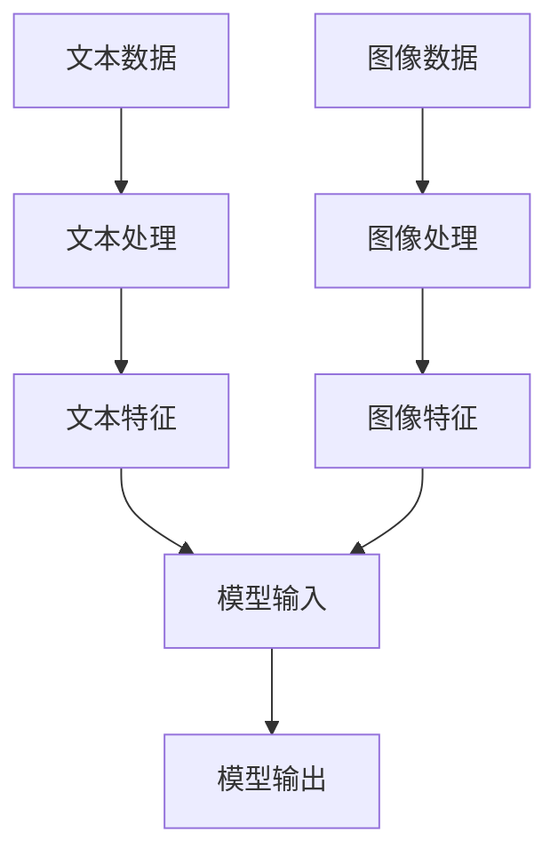
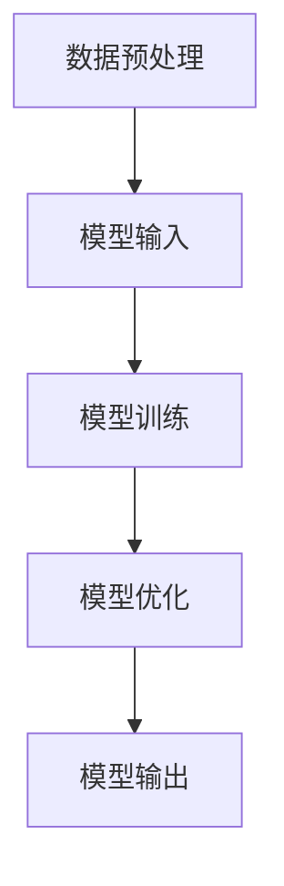
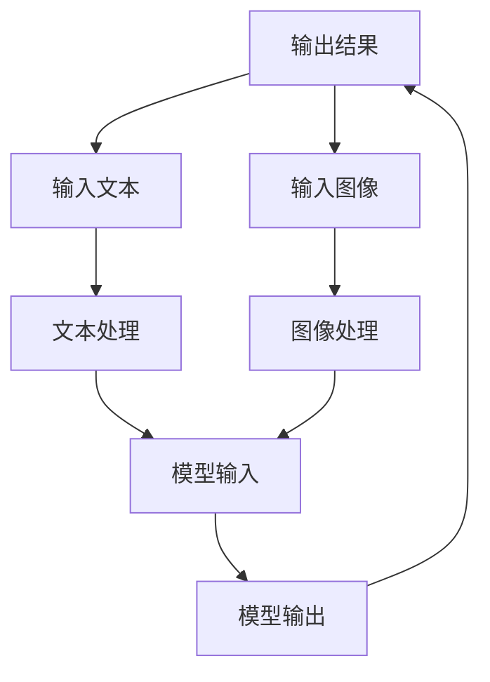

                 


# 多模态 AI Agent 开发：整合 LLM 与计算机视觉

> 关键词：多模态 AI Agent，LLM，计算机视觉，算法原理，系统设计

> 摘要：本文详细介绍了多模态 AI Agent 的开发过程，重点探讨了如何整合大型语言模型（LLM）与计算机视觉技术。文章从背景、核心概念、算法原理、系统设计到项目实战，全面解析了多模态 AI Agent 的开发方法，结合实际案例和代码实现，帮助读者掌握这一前沿技术。

---

## 第一部分: 多模态 AI Agent 开发背景与基础

### 第1章: 多模态 AI Agent 概述

#### 1.1 多模态 AI Agent 的定义与特点

多模态 AI Agent 是一种能够同时处理多种数据类型（如文本、图像、语音等）的智能体，具备以下特点：
- **多模态处理能力**：能够理解和处理多种数据类型。
- **协同工作**：不同模态的数据可以互补，提升任务效果。
- **实时交互**：能够与用户进行实时对话和交互。

#### 1.2 多模态 AI Agent 的问题背景

- **当前 AI 技术的局限性**：单一模态的模型在处理复杂任务时能力有限。
- **多模态整合的必要性**：通过整合不同模态的数据，提升模型的泛化能力和准确性。
- **问题解决的路径**：通过多模态数据的协同处理，提升任务的效果和用户体验。

#### 1.3 多模态 AI Agent 的应用领域

- **智能客服**：结合文本和图像信息，提供更智能的服务。
- **智能助手**：通过多模态输入，提供更自然的交互体验。
- **智慧教育**：结合图像和文本，提供个性化的学习支持。
- **智慧医疗**：整合医学图像和病历文本，辅助诊断。

#### 1.4 本章小结

本章介绍了多模态 AI Agent 的基本概念、问题背景和应用领域，为后续内容奠定了基础。

---

### 第2章: 多模态 AI Agent 的核心概念与联系

#### 2.1 多模态数据的整合与处理

- **文本数据的处理**：包括文本清洗、分词、嵌入等。
- **图像数据的处理**：包括图像预处理、特征提取等。
- **数据融合的方法**：如特征级融合、决策级融合。

#### 2.2 LLM 与计算机视觉的结合

- **LLM 的基本原理**：基于 transformer 的大语言模型，能够理解上下文。
- **计算机视觉的核心技术**：如 CNN、GAN 等。
- **两者的协同工作原理**：通过多模态输入，提升模型的理解能力。

#### 2.3 实体关系图与算法流程图

- **实体关系图（ER图）**：展示系统中的实体及其关系。
- **算法流程图（Mermaid）**：展示多模态数据处理和模型训练的流程。



---

### 第3章: 多模态 AI Agent 的算法原理

#### 3.1 多模态数据处理算法

- **文本预处理**：包括分词、去停用词、嵌入生成。
- **图像特征提取**：使用 CNN 提取图像特征。
- **数据融合算法**：如注意力机制、加权融合。

#### 3.2 多模态模型训练算法

- **模型结构设计**：包括编码器和解码器的设计。
- **模型训练流程**：数据预处理、模型训练、参数优化。
- **模型优化方法**：如学习率调整、早停等。

#### 3.3 算法流程图（Mermaid）



---

### 第4章: 多模态 AI Agent 的数学模型与公式

#### 4.1 文本处理的数学模型

- **词嵌入模型（如 Word2Vec）**：通过 skip-gram 或 CBOW 模型生成词向量。
- **句子表示模型（如 BERT）**：基于 transformer 的预训练模型。
- **文本生成模型（如 GPT）**：基于自回归的生成模型。

#### 4.2 图像处理的数学模型

- **卷积神经网络（CNN）**：通过卷积层提取图像特征。
- **图像分割模型（如 U-Net）**：用于图像分割任务。
- **图像生成模型（如 GAN）**：通过生成对抗网络生成图像。

#### 4.3 多模态融合的数学模型

- **模型融合方法**：如加性融合、乘性融合。
- **注意力机制**：通过自注意力机制实现跨模态对齐。
- **融合模型公式**：如 $f(x) = \alpha x_{\text{text}} + (1-\alpha)x_{\text{image}}$。

#### 4.4 具体公式与解释

- **词嵌入公式**：$x_i = \text{Embedding}(w_i)$。
- **注意力机制公式**：$\alpha_i = \frac{\exp(e_i)}{\sum_j \exp(e_j)}$，其中 $e_i$ 是第 $i$ 个词的注意力得分。
- **融合模型公式**：$y = \text{Concat}(x_{\text{text}}, x_{\text{image}}) \cdot W + b$。

---

### 第5章: 多模态 AI Agent 的系统分析与架构设计

#### 5.1 项目场景介绍

- **项目目标**：开发一个多模态 AI Agent，能够处理文本和图像信息。
- **项目范围**：包括数据采集、模型训练、系统部署。
- **项目约束**：计算资源限制、模型性能要求。

#### 5.2 系统功能设计

- **功能模块划分**：数据处理模块、模型训练模块、交互模块。
- **功能流程设计**：用户输入 -> 数据处理 -> 模型推理 -> 输出结果。
- **功能交互设计**：支持文本和图像输入，提供多模态输出。

#### 5.3 系统架构设计

- **分层架构设计**：包括数据层、业务逻辑层、表现层。
- **微服务架构设计**：数据处理服务、模型推理服务、前端服务。
- **数据流设计**：数据输入 -> 数据处理 -> 模型推理 -> 结果输出。

#### 5.4 系统接口设计

- **数据接口**：RESTful API，如 POST /api/process。
- **交互接口**：WebSocket 实时通信。

#### 5.5 系统交互流程图（Mermaid）



---

### 第6章: 多模态 AI Agent 的项目实战

#### 6.1 环境安装

- **Python 3.8+**
- **深度学习框架（如 TensorFlow、PyTorch）**
- **图像处理库（如 OpenCV、Pillow）**
- **文本处理库（如 NLTK、spaCy）**

#### 6.2 系统核心实现源代码

```python
import tensorflow as tf
from tensorflow.keras import layers

def text_processor(input_text):
    # 文本预处理
    tokenizer = tf.keras.preprocessing.text.Tokenizer()
    tokenizer.fit_on_texts([input_text])
    text_sequence = tokenizer.texts_to_sequences([input_text])[0]
    return text_sequence

def image_processor(input_image):
    # 图像预处理
    image = tf.image.load_image(input_image, 'channels_last')
    image = tf.image.resize(image, (224, 224))
    image = tf.keras.applications.mobilenet.preprocess_input(image)
    return image

def model_architecture():
    # 模型结构设计
    input_text = layers.Input(shape=(None,), dtype='int32')
    input_image = layers.Input(shape=(224, 224, 3))
    
    text_embeddings = layers.Embedding(vocab_size, 128)(input_text)
    text_embeddings = layers.LSTM(64)(text_embeddings)
    
    image_embeddings = layers.Conv2D(32, (3,3), activation='relu')(input_image)
    image_embeddings = layers.Flatten()(image_embeddings)
    image_embeddings = layers.Dense(64, activation='relu')(image_embeddings)
    
    concatenated = layers.Concatenate()([text_embeddings, image_embeddings])
    output = layers.Dense(2, activation='softmax')(concatenated)
    
    model = tf.keras.Model(inputs=[input_text, input_image], outputs=output)
    return model
```

#### 6.3 代码应用解读与分析

- **文本处理部分**：使用 `Tokenizer` 进行文本分词，生成词序列。
- **图像处理部分**：加载图像并进行预处理，适配模型输入。
- **模型结构设计**：包括文本和图像的特征提取，以及最终的融合与分类。

#### 6.4 实际案例分析

- **案例背景**：开发一个多模态客服系统，支持文本和图像输入。
- **案例实现**：用户输入文本描述问题，同时上传相关图像，系统结合文本和图像信息提供解决方案。
- **案例分析**：通过多模态输入，系统能够更准确地理解用户需求，提供更优质的服务。

#### 6.5 本章小结

本章通过实际项目案例，详细讲解了多模态 AI Agent 的开发过程，包括环境安装、代码实现和案例分析。

---

## 第七章: 总结与展望

### 7.1 最佳实践 tips

- **数据质量**：确保输入数据的多样性和准确性。
- **模型优化**：通过调参和优化策略提升模型性能。
- **系统设计**：合理设计系统架构，确保系统的可扩展性和可维护性。

### 7.2 小结

本文详细介绍了多模态 AI Agent 的开发过程，从背景、核心概念到算法原理、系统设计和项目实战，全面解析了这一前沿技术。

### 7.3 注意事项

- **性能问题**：多模态处理可能需要较高的计算资源。
- **数据隐私**：处理敏感数据时需注意隐私保护。
- **模型泛化能力**：确保模型在不同场景下的泛化能力。

### 7.4 拓展阅读

- **多模态学习**：研究多模态数据的联合学习方法。
- **自适应学习**：探索模型的自适应能力。
- **人机协作**：研究人机协作的优化方法。

---

# 作者：AI天才研究院/AI Genius Institute & 禅与计算机程序设计艺术 /Zen And The Art of Computer Programming

---

**本文为多模态 AI Agent 开发系列文章的第一篇，后续文章将深入探讨更多技术细节和实战案例。**

