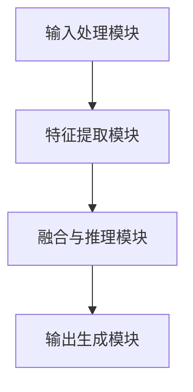

                 


# 多模态内容理解AI Agent：整合LLM与多媒体分析

## 关键词：多模态AI，LLM，多媒体分析，AI Agent，深度学习

## 摘要：本文探讨了多模态内容理解AI Agent的设计与实现，详细介绍了整合大语言模型（LLM）与多媒体分析技术的核心原理、系统架构及应用场景。通过理论分析与实践案例相结合，展示了如何构建一个能够处理文本、图像、语音等多种数据类型的智能代理系统。

---

# 多模态内容理解AI Agent：整合LLM与多媒体分析

## 引言

随着人工智能技术的飞速发展，单一模态的数据处理已经难以满足复杂场景的需求。多模态内容理解作为一种新兴的技术，整合了文本、图像、语音等多种数据类型，能够更全面地理解用户意图和场景信息。本文将深入探讨多模态内容理解AI Agent的设计与实现，重点分析如何整合大语言模型（LLM）与多媒体分析技术，构建一个高效、智能的多模态AI系统。

---

## 第一部分：多模态内容理解AI Agent的背景与概述

### 第1章：多模态内容理解的基本概念

#### 1.1 多模态数据的定义与特点

多模态数据指的是结合了多种数据类型的复杂数据结构，例如文本、图像、语音、视频等。与单一模态数据相比，多模态数据能够提供更丰富的信息，使AI系统能够更全面地理解用户需求和场景。

- **特点：**
  - **信息丰富性：** 多模态数据能够提供更全面的信息，帮助系统更准确地理解输入内容。
  - **互补性：** 不同模态的数据可以互补，例如在图像中难以识别的细节可以通过文本进行补充。
  - **复杂性：** 处理多模态数据需要考虑不同模态之间的关联与协同。

#### 1.2 问题背景与技术挑战

传统的人工智能系统通常基于单一模态数据进行处理，例如仅处理文本或仅处理图像。然而，这种方法在复杂场景下往往表现不足，难以应对用户的多样化需求。多模态内容理解技术通过整合多种数据类型，能够更准确地捕捉用户意图，提升系统的智能水平。

- **技术挑战：**
  - **数据融合：** 如何有效地整合不同模态的数据，避免信息冗余或遗漏。
  - **模型训练：** 需要设计能够同时处理多种数据类型的深度学习模型。
  - **计算效率：** 处理多模态数据通常需要更高的计算资源，如何优化模型以降低计算成本是关键。

---

### 第2章：多模态AI Agent的核心目标

多模态AI Agent的目标是通过整合多种数据类型，提供更智能、更自然的交互方式。与传统AI系统相比，多模态AI Agent能够更好地理解用户的意图和需求，提供更个性化的服务。

- **核心目标：**
  - **提升理解能力：** 通过整合文本、图像、语音等多种数据，更准确地理解用户需求。
  - **增强交互体验：** 提供更自然、更丰富的交互方式，例如通过图像和文本的结合提供更直观的结果展示。
  - **支持复杂任务：** 能够处理需要多模态数据协同的任务，例如智能客服、医疗诊断等。

---

## 第二部分：多模态AI Agent的核心技术

### 第3章：大语言模型（LLM）与多媒体分析技术

#### 3.1 大语言模型（LLM）的概述

大语言模型是一种基于深度学习的自然语言处理模型，能够理解和生成人类语言。LLM的核心优势在于其强大的上下文理解和生成能力，能够处理复杂的文本任务。

- **LLM的特点：**
  - **大规模训练数据：** LLM通常基于海量的文本数据进行训练，能够捕捉语言的复杂模式。
  - **深度神经网络：** 通过多层神经网络结构，LLM能够捕捉文本的语义信息。
  - **可扩展性：** LLM可以应用于多种任务，例如文本生成、机器翻译、问答系统等。

#### 3.2 多媒体分析技术

多媒体分析技术是指对图像、语音、视频等非文本数据进行处理和理解的技术。通过分析这些数据，AI系统能够提取有用的特征信息，例如图像中的物体识别、语音中的情感分析等。

- **多媒体分析的核心技术：**
  - **图像识别：** 通过卷积神经网络（CNN）对图像进行分类、目标检测等。
  - **语音识别：** 使用循环神经网络（RNN）或变换器（Transformer）对语音信号进行识别。
  - **视频分析：** 结合图像识别和时间序列分析，对视频内容进行理解和分析。

---

### 第4章：多模态数据融合与协同

#### 4.1 多模态数据融合的方法

多模态数据融合是指将不同模态的数据进行整合，以获得更全面的信息。常见的融合方法包括：

- **早期融合：** 在数据预处理阶段将不同模态的数据进行合并。
- **晚期融合：** 在特征提取阶段或决策阶段对不同模态的数据进行融合。
- **层次化融合：** 根据数据的层次结构进行多级融合。

#### 4.2 多模态数据协同的优势

通过整合不同模态的数据，多模态AI Agent能够利用各模态的优势，弥补单一模态的不足。例如，当文本信息不足以准确描述某个场景时，图像信息可以提供额外的支持。

- **优势：**
  - **提高准确性：** 多模态数据的协同能够提升系统的识别和理解能力。
  - **增强鲁棒性：** 当某一模态的数据不可用或不准确时，其他模态的数据可以提供补充。
  - **丰富交互方式：** 多模态数据的协同能够支持更多样化的交互方式。

---

## 第三部分：多模态AI Agent的系统架构与设计

### 第5章：系统架构设计

#### 5.1 系统功能设计

多模态AI Agent的系统功能设计需要涵盖以下方面：

- **输入处理：** 接收多种模态的数据输入，例如文本、图像、语音等。
- **特征提取：** 对不同模态的数据进行特征提取，例如文本的词向量、图像的物体特征等。
- **融合与推理：** 将不同模态的特征进行融合，并通过推理得出最终的结果。
- **输出生成：** 根据推理结果生成相应的输出，例如文本回复、图像标注等。

#### 5.2 系统架构图

以下是多模态AI Agent的系统架构图，展示了各模块之间的关系：



---

### 第6章：系统实现与项目实战

#### 6.1 项目背景与目标

本项目旨在构建一个多模态AI Agent，整合LLM与多媒体分析技术，实现对文本、图像等多种数据类型的处理与理解。

#### 6.2 项目环境与工具

- **编程语言：** Python
- **深度学习框架：** TensorFlow
- **自然语言处理库：** Hugging Face Transformers
- **图像处理库：** OpenCV

#### 6.3 核心代码实现

以下是多模态AI Agent的核心代码实现：

```python
import tensorflow as tf
from tensorflow.keras import layers
import cv2
import numpy as np
from transformers import AutoTokenizer, AutoModel

# 加载预训练的LLM模型
tokenizer = AutoTokenizer.from_pretrained('bert-base-uncased')
model = AutoModel.from_pretrained('bert-base-uncased')

# 图像处理函数
def process_image(image_path):
    image = cv2.imread(image_path)
    if image is None:
        return None
    # 转换为RGB格式
    image = cv2.cvtColor(image, cv2.COLOR_BGR2RGB)
    return image

# 多模态融合函数
def multimodal_fusion(text, image):
    # 处理文本
    inputs = tokenizer(text, return_tensors='np', padding=True, truncation=True)
    text_features = model(inputs.input_ids, inputs.attention_mask).last_hidden_state[:, 0, :]
    
    # 处理图像
    image = process_image(image)
    if image is None:
        return None
    # 图像特征提取（假设已经有预训练的图像特征）
    image_features = ...  # 根据具体需求实现
    
    # 融合特征
    fused_features = tf.keras.layers.Concatenate()([text_features, image_features])
    return fused_features
```

---

## 第四部分：总结与展望

### 第7章：总结与展望

#### 7.1 核心内容总结

本文详细探讨了多模态内容理解AI Agent的设计与实现，重点分析了如何整合LLM与多媒体分析技术，构建一个高效、智能的多模态AI系统。通过理论分析与实践案例相结合，展示了多模态数据融合的优势与挑战。

#### 7.2 未来展望

随着人工智能技术的不断发展，多模态内容理解技术将得到更广泛的应用。未来的研究方向包括：

- **更高效的融合方法：** 探索更先进的多模态数据融合技术，提高系统的准确性和效率。
- **多模态交互：** 研究更自然的多模态交互方式，例如手势识别、情感计算等。
- **边缘计算与实时性：** 提升系统的计算效率，使其能够应用于实时性要求较高的场景。

---

## 作者：AI天才研究院/AI Genius Institute & 禅与计算机程序设计艺术 /Zen And The Art of Computer Programming

---

**本文由AI天才研究院与禅与计算机程序设计艺术联合出品，转载请注明出处。**

---

通过以上内容，我们系统地探讨了多模态内容理解AI Agent的设计与实现，从理论到实践，全面解析了整合LLM与多媒体分析技术的核心原理与应用场景。希望本文能够为相关领域的研究者和开发者提供有价值的参考与启发。

