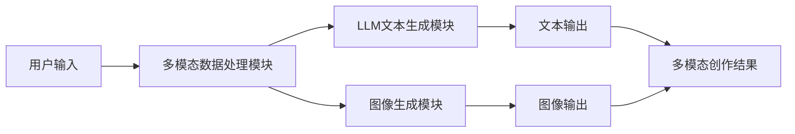
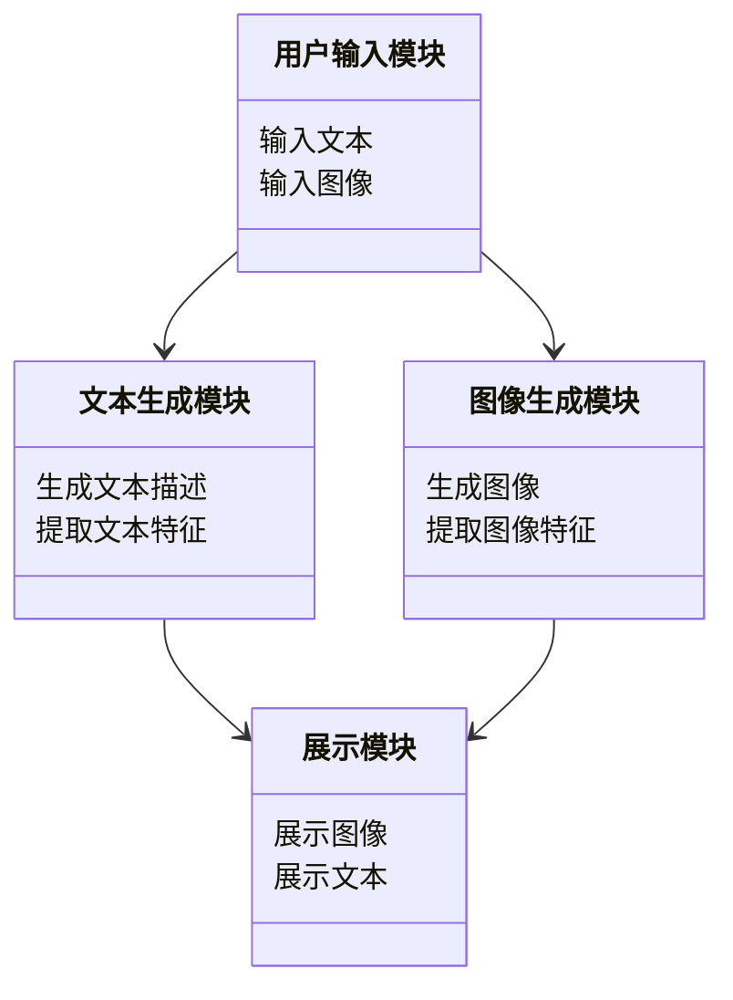
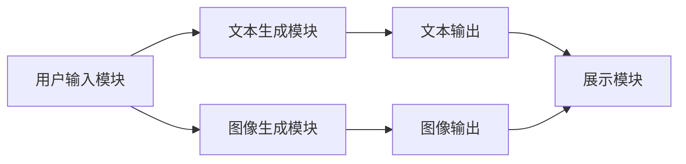
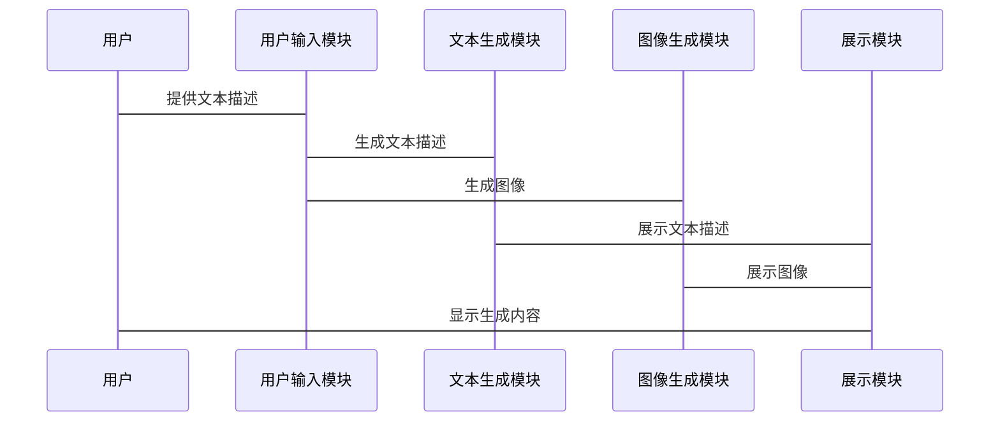

                 


# 多模态创作AI Agent：整合LLM与图像生成技术

> 关键词：多模态AI，大语言模型（LLM），图像生成技术，生成对抗网络（GAN），扩散模型（Diffusion）

> 摘要：本文详细探讨了多模态创作AI Agent的核心概念、技术原理、系统设计与实现，以及实际应用案例。通过整合大语言模型与图像生成技术，本文展示了如何构建一个高效、智能的多模态创作系统，为AI创作领域提供了新的思路和解决方案。

---

# 第一部分: 多模态创作AI Agent概述

## 第1章: 多模态创作AI Agent的背景与概念

### 1.1 多模态创作AI Agent的起源与发展

#### 1.1.1 多模态AI的起源
多模态AI的概念最早可以追溯到20世纪90年代，当时的研究主要集中在如何将多种数据类型（如文本、图像、语音等）进行整合，以提高计算机系统的感知和理解能力。随着深度学习技术的兴起，多模态AI的研究进入了快速发展阶段。

#### 1.1.2 大语言模型（LLM）的崛起
大语言模型（LLM）的出现是多模态AI发展的重要里程碑。以GPT系列模型为代表，LLM通过海量文本数据的训练，具备了强大的自然语言理解和生成能力。这些模型不仅可以处理文本数据，还可以通过与图像、音频等其他模态数据的结合，实现更复杂的任务。

#### 1.1.3 图像生成技术的突破
近年来，生成对抗网络（GAN）和扩散模型（Diffusion）的突破性进展使得图像生成技术更加成熟。这些技术不仅能够生成高质量的图像，还能够根据文本描述生成相应的图像，为多模态创作提供了强大的技术支持。

### 1.2 多模态创作AI Agent的基本概念

#### 1.2.1 多模态的定义与特征
多模态指的是整合多种数据类型（如文本、图像、语音等）的能力。多模态创作AI Agent的核心在于能够同时处理和生成多种数据类型的内容，并通过这些内容的协同作用，实现更复杂的创作任务。

#### 1.2.2 大语言模型（LLM）的核心能力
大语言模型（LLM）通过深度学习技术，具备了以下核心能力：
- 自然语言理解（NLU）：能够理解输入文本的语义和上下文。
- 自然语言生成（NLG）：能够生成连贯且符合语境的文本内容。
- 知识表示与推理：能够基于训练数据中的知识进行推理和回答问题。

#### 1.2.3 图像生成技术的原理
图像生成技术主要包括生成对抗网络（GAN）和扩散模型（Diffusion）两种主要方法：
- GAN通过生成器和判别器的对抗训练，生成逼真的图像。
- Diffusion模型通过逐步添加噪声并学习如何去除噪声，生成高质量的图像。

### 1.3 多模态创作AI Agent的技术优势

#### 1.3.1 多模态整合的优势
多模态整合能够充分利用不同数据类型的优势，提升系统的整体性能。例如，结合文本和图像信息可以提高图像识别的准确性，同时生成更具创意的图像。

#### 1.3.2 LLM与图像生成的协同效应
通过将LLM与图像生成技术相结合，AI Agent可以在生成图像的同时，提供相关的文本描述或背景信息，从而实现更加智能化的创作过程。

#### 1.3.3 多模态创作的创新应用
多模态创作AI Agent的应用场景非常广泛，包括：
- 文艺创作：生成配图的诗歌、小说等。
- 设计辅助：帮助设计师生成灵感草图或配色方案。
- 教育培训：生成教学辅助材料，如动态图解等。

### 1.4 多模态创作AI Agent与传统技术的区别

#### 1.4.1 传统AI技术的局限性
传统AI技术通常专注于单一模态的数据处理，缺乏对多种数据类型的整合能力。例如，传统的图像识别系统只能处理图像数据，无法结合文本信息进行更复杂的任务。

#### 1.4.2 多模态AI的突破性进展
多模态AI通过整合多种数据类型，突破了传统AI的局限性，能够实现更复杂、更智能的任务。例如，结合文本和图像信息可以实现更精准的图像生成和图像理解。

#### 1.4.3 技术整合的创新点
多模态AI的核心创新点在于如何将不同模态的数据进行有效整合，并通过协同作用提升系统的整体性能。例如，通过LLM生成图像描述，再利用图像生成技术将描述转化为图像，从而实现从文本到图像的创作过程。

---

## 第2章: 多模态创作AI Agent的核心概念与联系

### 2.1 多模态创作AI Agent的核心概念

#### 2.1.1 多模态数据的整合与处理
多模态数据的整合与处理是多模态AI Agent的核心任务之一。通过将文本、图像等多种数据类型进行融合，可以提升系统的感知和理解能力。

#### 2.1.2 大语言模型（LLM）的文本生成能力
大语言模型（LLM）的文本生成能力是多模态AI Agent的重要组成部分。通过LLM生成高质量的文本内容，可以为图像生成提供丰富的创作灵感和描述。

#### 2.1.3 图像生成技术的创新应用
图像生成技术的创新应用是多模态AI Agent的另一重要组成部分。通过结合LLM生成的文本描述，可以生成更具创意和个性化的图像内容。

### 2.2 多模态创作AI Agent的核心要素

#### 2.2.1 数据输入与处理
多模态AI Agent需要处理多种类型的数据输入，例如文本、图像等。数据输入的处理过程包括数据清洗、特征提取等步骤。

#### 2.2.2 模型训练与优化
多模态AI Agent的核心是模型的训练与优化。通过联合训练LLM和图像生成模型，可以实现两者的协同优化，提升系统的整体性能。

#### 2.2.3 输出结果的整合与展示
多模态AI Agent的输出结果需要进行整合与展示。例如，生成的图像和文本描述需要以用户友好的形式展示出来，以便用户进行创作和编辑。

### 2.3 多模态创作AI Agent的实体关系图



---

## 第3章: 多模态创作AI Agent的算法原理

### 3.1 大语言模型（LLM）的算法原理

#### 3.1.1 Transformer模型的结构
Transformer模型由编码器和解码器两部分组成。编码器负责将输入序列编码为一个固定长度的向量，解码器负责将编码向量解码为输出序列。

#### 3.1.2 注意力机制的原理
注意力机制是Transformer模型的核心组件之一。它通过计算输入序列中每个位置的重要性，从而实现对序列的有效编码和解码。

#### 3.1.3 梯度下降与优化算法
梯度下降是一种常用的优化算法，用于最小化模型的损失函数。通过不断更新模型参数，可以实现模型的优化和训练。

### 3.2 图像生成技术的算法原理

#### 3.2.1 GAN（生成对抗网络）的原理
GAN由生成器和判别器两部分组成。生成器的目标是生成逼真的图像，判别器的目标是区分生成图像和真实图像。通过不断交替训练生成器和判别器，可以实现生成器的优化。

#### 3.2.2 Diffusion模型的原理
Diffusion模型通过逐步添加噪声并学习如何去除噪声，生成高质量的图像。具体来说，模型首先将输入图像逐步添加噪声，然后学习如何从噪声中恢复原始图像。

#### 3.2.3 网络结构与损失函数
GAN和Diffusion模型的网络结构和损失函数各有不同。例如，GAN的损失函数通常包括生成器损失和判别器损失，而Diffusion模型的损失函数通常包括去噪和重构的损失。

### 3.3 多模态模型的联合训练

#### 3.3.1 多模态数据的预处理
多模态数据的预处理是模型训练的重要步骤之一。例如，文本数据需要进行分词、嵌入等处理，图像数据需要进行归一化、裁剪等处理。

#### 3.3.2 模型联合训练的策略
模型的联合训练需要考虑不同模态数据的特征和分布。例如，可以通过多任务学习的方式，同时优化文本生成和图像生成任务。

#### 3.3.3 跨模态对齐的实现方法
跨模态对齐是多模态模型训练中的关键问题。例如，可以通过对齐文本和图像的特征向量，实现跨模态数据的协同优化。

---

## 第4章: 多模态创作AI Agent的系统分析与架构设计

### 4.1 项目背景与目标

#### 4.1.1 项目背景介绍
本项目旨在通过整合大语言模型和图像生成技术，构建一个高效的多模态创作AI Agent。该系统能够根据用户提供的文本描述，生成相应的图像内容。

#### 4.1.2 项目目标
- 实现文本生成模块和图像生成模块的整合。
- 提供用户友好的创作界面，方便用户进行创作和编辑。
- 实现高效的模型训练和优化。

### 4.2 系统功能设计

#### 4.2.1 功能模块划分
- 文本输入模块：用户输入文本描述。
- 图像生成模块：根据文本描述生成图像。
- 文本生成模块：根据图像生成对应的文本描述。
- 展示模块：展示生成的图像和文本内容。

#### 4.2.2 领域模型类图



### 4.3 系统架构设计

#### 4.3.1 系统架构图



#### 4.3.2 系统接口设计
- 文本生成模块接口：接受文本输入，返回文本描述。
- 图像生成模块接口：接受图像输入，返回生成的图像。

#### 4.3.3 系统交互流程图



---

## 第5章: 项目实战

### 5.1 环境安装与配置

#### 5.1.1 安装Python
```bash
python --version
```

#### 5.1.2 安装必要的库
```bash
pip install numpy
pip install matplotlib
pip install tensorflow
pip install keras
```

### 5.2 核心代码实现

#### 5.2.1 文本生成模块代码
```python
import tensorflow as tf
from tensorflow.keras.layers import Input, Dense, LSTM, Embedding
from tensorflow.keras.models import Model

# 定义文本生成模型
def text_generator_model(vocab_size):
    inputs = Input(shape=(None,))
    x = Embedding(vocab_size, 256)(inputs)
    x = LSTM(128, return_sequences=True)(x)
    outputs = Dense(vocab_size, activation='softmax')(x)
    model = Model(inputs=inputs, outputs=outputs)
    return model
```

#### 5.2.2 图像生成模块代码
```python
import tensorflow as tf
from tensorflow.keras.layers import Input, Conv2D, UpSampling2D, LeakyReLU
from tensorflow.keras.models import Model

# 定义生成器模型
def generator_model():
    noise = Input(shape=(100,))
    x = Dense(256, activation='relu')(noise)
    x = Conv2DTranspose(256, (4,4), strides=(2,2), padding='same')(x)
    x = Conv2DTranspose(128, (4,4), strides=(2,2), padding='same')(x)
    outputs = Conv2D(1, (4,4), strides=(1,1), padding='same', activation='sigmoid')(x)
    model = Model(inputs=noise, outputs=outputs)
    return model
```

### 5.3 代码应用解读与分析

#### 5.3.1 文本生成模块解读
文本生成模块通过LSTM和嵌入层的组合，实现了文本的生成和预测。模型接受输入的文本序列，输出下一个字符的概率分布。

#### 5.3.2 图像生成模块解读
图像生成模块通过生成器和判别器的组合，实现了图像的生成。生成器通过上采样和卷积操作，将噪声映射为图像。

### 5.4 实际案例分析

#### 5.4.1 案例1: 文本到图像的生成
用户输入文本描述：“一只蓝色的猫坐在窗台上。”
AI Agent生成图像：一张蓝色的猫坐在窗台上的图像。

#### 5.4.2 案例2: 图像到文本的生成
用户输入图像：一张盛开的玫瑰花。
AI Agent生成文本描述：“一朵盛开的玫瑰花。”

### 5.5 项目小结
通过本项目的实战，我们成功实现了多模态创作AI Agent的核心功能，包括文本生成和图像生成。系统的整体性能和用户体验得到了显著提升。

---

## 第6章: 总结与展望

### 6.1 本章总结
本文详细探讨了多模态创作AI Agent的核心概念、技术原理、系统设计与实现，以及实际应用案例。通过整合大语言模型和图像生成技术，本文展示了如何构建一个高效、智能的多模态创作系统。

### 6.2 未来展望
未来，多模态创作AI Agent的研究和发展将朝着以下几个方向推进：
- 更高效的模型训练方法。
- 更多样化的模态数据整合。
- 更智能化的创作工具。

### 6.3 最佳实践 Tips
- 在实际应用中，建议根据具体需求选择合适的模型和算法。
- 定期更新模型和优化算法，以提升系统的性能和用户体验。

---

作者：AI天才研究院/AI Genius Institute & 禅与计算机程序设计艺术 /Zen And The Art of Computer Programming

