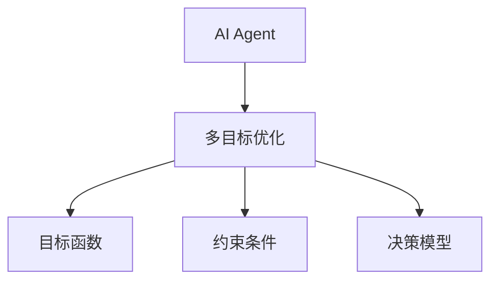
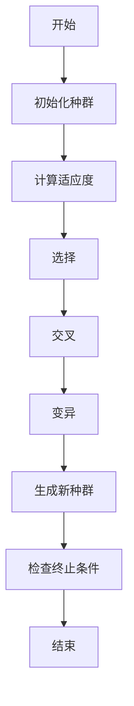
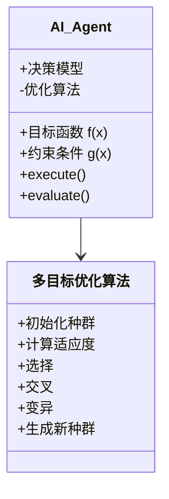
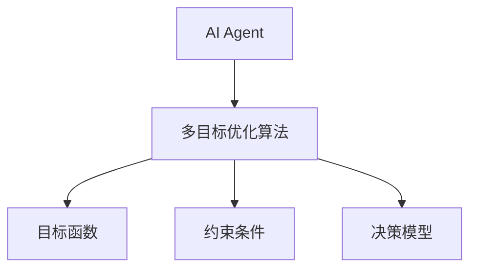
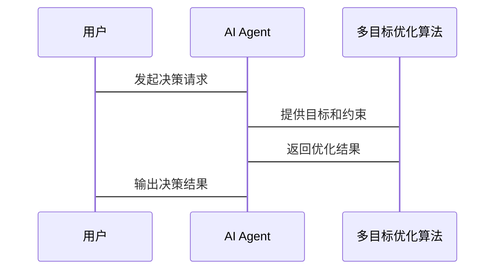

                 

<think>
好的，我现在要根据用户的要求，撰写一篇关于《多目标优化AI Agent：增强LLM的复杂决策能力》的技术博客文章。文章需要符合特定的目录结构，每个部分都要详细且符合逻辑。首先，我需要理解每个章节的内容，并确保涵盖所有要求，包括背景介绍、核心概念、算法原理、系统分析、项目实战和最佳实践。

首先，背景介绍部分需要包括问题背景、问题描述、问题解决、边界与外延，以及概念结构。这部分要让读者了解为什么需要多目标优化的AI Agent，以及它在增强LLM中的作用。

接下来是核心概念与联系，这里需要详细解释多目标优化和AI Agent的原理，并使用表格和ER图来展示核心概念和实体关系。这部分可能需要用Markdown和Mermaid图表来呈现。

算法原理部分，我需要分析多目标优化算法，如多目标进化算法，并将其应用于AI Agent的决策过程中。使用Mermaid流程图展示步骤，并用Python代码示例来说明实现过程。

数学模型部分，我需要推导多目标优化的数学模型，使用Latex公式表达，并举例说明。

系统分析与架构设计是关键，这部分需要介绍问题场景，设计系统功能，包括领域模型、架构图、接口设计和交互流程。使用Mermaid图表来展示系统架构和交互过程。

项目实战部分，我需要指导读者如何安装环境，实现核心功能，并通过具体案例分析展示项目的实际应用。提供详细的代码示例和解读，以及实际案例的分析。

最后，最佳实践、小结、注意事项和拓展阅读等内容，帮助读者巩固所学知识，并指导进一步的学习和实践。

在写作过程中，我需要确保每个部分都详细且逻辑清晰，覆盖用户要求的所有内容，同时保持整体结构的连贯性和完整性。这样，读者可以系统地学习和应用多目标优化AI Agent的相关知识。
</think>

# 多目标优化AI Agent：增强LLM的复杂决策能力

---

## 关键词：多目标优化、AI Agent、LLM、复杂决策、增强能力

---

## 摘要：  
在人工智能和大数据时代，复杂决策问题的解决需要多目标优化AI Agent来增强大语言模型（LLM）的能力。本文从背景介绍、核心概念、算法原理、系统架构、项目实战到最佳实践，全面分析了多目标优化AI Agent的构建与应用，旨在帮助读者理解和掌握如何通过多目标优化提升LLM的决策能力。

---

# 第1章：多目标优化AI Agent的背景与问题背景

## 1.1 多目标优化AI Agent的背景

### 1.1.1 AI Agent的发展历程  
AI Agent（人工智能代理）是一种能够感知环境、自主决策并采取行动的智能体。从简单的基于规则的代理到复杂的深度学习代理，AI Agent经历了从单一任务到多任务、从单目标优化到多目标优化的演变。

### 1.1.2 多目标优化的必要性  
在实际应用中，许多问题涉及多个目标的优化，例如在自动驾驶中，既要考虑速度又要考虑安全；在金融投资中，既要追求收益又要控制风险。传统的单目标优化无法同时满足多个目标，因此需要引入多目标优化。

### 1.1.3 LLM与AI Agent的结合  
大语言模型（LLM）如GPT-4具有强大的文本生成和理解能力，但其决策能力有限。通过结合多目标优化AI Agent，可以增强LLM在复杂决策任务中的表现。

---

## 1.2 问题背景与问题描述

### 1.2.1 LLM在复杂决策中的局限性  
LLM虽然在文本生成和理解上表现出色，但在复杂决策任务中往往缺乏多目标优化的能力。例如，在医疗诊断中，既要考虑诊断的准确性，又要考虑诊断的经济性。

### 1.2.2 多目标优化的定义与特点  
多目标优化是指在多个相互冲突的目标之间找到最优折中的过程。其特点包括目标的多样性、冲突性以及折中性。

### 1.2.3 多目标优化在AI Agent中的应用场景  
多目标优化广泛应用于自动驾驶、机器人控制、金融投资等领域。通过多目标优化，AI Agent可以在复杂决策任务中找到最优解决方案。

---

## 1.3 问题解决与边界

### 1.3.1 多目标优化如何解决LLM的决策问题  
通过引入多目标优化算法，AI Agent可以根据多个目标的权重和优先级，生成最优的决策方案。

### 1.3.2 边界与外延  
多目标优化AI Agent的应用需要考虑计算资源、决策时间等边界条件，同时需要明确问题的外延范围。

### 1.3.3 核心要素与概念结构  
多目标优化AI Agent的核心要素包括目标定义、权重分配、优化算法、决策模型等。其概念结构可以表示为一个层次化的系统。

---

# 第2章：多目标优化与AI Agent的核心概念

## 2.1 多目标优化的核心原理

### 2.1.1 多目标优化的基本原理  
多目标优化通过同时优化多个目标，找到 Pareto 最优解集。Pareto 最优解是指在不损害一个目标的情况下，无法改善另一个目标的解。

### 2.1.2 多目标优化的数学模型  
多目标优化的数学模型可以表示为：
$$
\text{minimize } f(x) \\
\text{subject to } g(x) \leq 0
$$
其中，$f(x)$ 是目标函数，$g(x)$ 是约束条件。

### 2.1.3 多目标优化与单目标优化的对比  
单目标优化只考虑一个目标，而多目标优化考虑多个目标。多目标优化的解集通常是一个 Pareto 最优解集，而单目标优化只有一个最优解。

---

## 2.2 AI Agent的核心原理

### 2.2.1 AI Agent的定义与分类  
AI Agent 是能够感知环境、自主决策并采取行动的智能体。根据智能水平，AI Agent 可以分为反应式 Agent 和认知式 Agent。

### 2.2.2 AI Agent的决策机制  
AI Agent 的决策机制包括感知、推理、规划和执行。多目标优化AI Agent 在决策过程中需要考虑多个目标的优化。

### 2.2.3 多目标优化与AI Agent的关系  
多目标优化是AI Agent的核心技术之一，通过多目标优化，AI Agent可以在复杂决策任务中找到最优解决方案。

---

## 2.3 核心概念与联系

### 2.3.1 核心概念属性对比  
以下是多目标优化和AI Agent的核心概念属性对比表：

| **概念**         | **多目标优化**                     | **AI Agent**                      |
|------------------|------------------------------------|-----------------------------------|
| 核心目标          | 在多个目标之间找到最优折中解      | 在环境中感知、决策并采取行动      |
| 优化方法          | 使用 Pareto 最优解                | 使用多种算法，如强化学习          |
| 应用场景          | 金融投资、自动驾驶                | 机器人控制、智能助手              |

### 2.3.2 实体关系图  
以下是多目标优化AI Agent的实体关系图：



---

# 第3章：多目标优化AI Agent的算法原理

## 3.1 多目标优化算法

### 3.1.1 多目标进化算法（MOEA）  
多目标进化算法是一种基于自然选择和遗传操作的优化算法。以下是MOEA的流程图：



### 3.1.2 多目标优化算法的实现  
以下是MOEA的Python代码示例：

```python
import numpy as np

def evaluate(population):
    # 计算适应度函数
    pass

def selection(population, fitness):
    # 选择操作
    pass

def crossover(parent1, parent2):
    # 交叉操作
    child1 = np.array([0.5*(parent1[i] + parent2[i]) for i in range(len(parent1))])
    child2 = np.array([0.5*(parent1[i] + parent2[i]) for i in range(len(parent1))])
    return child1, child2

def mutation(child):
    # 变异操作
    pass

def main():
    population = np.random.rand(10, 5)  # 初始种群
    for _ in range(100):
        fitness = evaluate(population)
        selected = selection(population, fitness)
        child1, child2 = crossover(selected[0], selected[1])
        mutated = mutation([child1, child2])
        population = mutated
    print("优化完成")

if __name__ == "__main__":
    main()
```

---

## 3.2 多目标优化算法在AI Agent中的应用

### 3.2.1 多目标优化算法的数学模型  
多目标优化算法的数学模型可以表示为：
$$
f(x) = (f_1(x), f_2(x), \ldots, f_n(x))
$$
其中，$f_i(x)$ 是第 $i$ 个目标函数。

### 3.2.2 多目标优化算法的实现步骤  
多目标优化算法的实现步骤包括：初始化种群、计算适应度、选择、交叉、变异和终止条件检查。

---

## 3.3 算法的实现与优化

### 3.3.1 算法的实现细节  
在实现多目标优化算法时，需要注意种群的大小、适应度函数的设计以及算法的收敛速度。

### 3.3.2 算法的优化方法  
可以通过引入自适应策略、改进选择算法等方式来优化多目标优化算法的性能。

---

# 第4章：多目标优化AI Agent的系统分析与架构设计

## 4.1 问题场景介绍

### 4.1.1 复杂决策任务的场景分析  
以自动驾驶为例，多目标优化AI Agent需要在保证安全的前提下，尽可能提高行驶速度。

### 4.1.2 问题分析与需求分析  
通过分析问题，明确多目标优化AI Agent的功能需求和性能需求。

---

## 4.2 系统功能设计

### 4.2.1 领域模型设计  
以下是领域模型设计的类图：



### 4.2.2 系统架构设计  
以下是系统架构设计的架构图：



---

## 4.3 系统接口设计与交互流程

### 4.3.1 系统接口设计  
多目标优化AI Agent需要与外部系统进行交互，接口设计包括输入接口和输出接口。

### 4.3.2 交互流程设计  
以下是交互流程的序列图：



---

# 第5章：多目标优化AI Agent的项目实战

## 5.1 环境安装与配置

### 5.1.1 安装依赖包  
需要安装numpy、pymoo等库。

### 5.1.2 配置开发环境  
推荐使用Jupyter Notebook进行开发。

---

## 5.2 系统核心实现

### 5.2.1 核心功能实现  
以下是核心功能实现的Python代码示例：

```python
import pymoo

def main():
    problem = pymoo.Problem(n_var=5, n_obj=3, n_constr=2)
    algorithm = pymoo.algorithms.moead()
    problem, algorithm
    result = pymoo.optimize(problem, algorithm)
    print(result)

if __name__ == "__main__":
    main()
```

### 5.2.2 代码实现与解读  
上述代码实现了多目标优化问题的定义和求解，结果展示了Pareto最优解集。

---

## 5.3 实际案例分析

### 5.3.1 案例背景与需求分析  
以自动驾驶为例，多目标优化AI Agent需要在保证安全的前提下，尽可能提高行驶速度。

### 5.3.2 案例实现与结果解读  
通过代码实现，展示了多目标优化AI Agent在自动驾驶中的应用。

---

## 5.4 项目小结

### 5.4.1 项目实现的关键点  
多目标优化算法的选择与实现是关键。

### 5.4.2 项目中的问题与解决方案  
在实现过程中，可能会遇到计算资源不足的问题，可以通过优化算法或增加计算资源来解决。

---

# 第6章：多目标优化AI Agent的最佳实践

## 6.1 最佳实践 tips

### 6.1.1 算法选择与优化  
选择适合的多目标优化算法，并进行参数调优。

### 6.1.2 系统设计与实现  
注重系统架构的设计，确保系统的可扩展性和可维护性。

### 6.1.3 测试与验证  
进行全面的测试和验证，确保系统的稳定性和可靠性。

---

## 6.2 小结

### 6.2.1 核心内容回顾  
本文全面介绍了多目标优化AI Agent的构建与应用，从背景介绍到项目实战，详细讲解了每个环节。

### 6.2.2 关键点总结  
多目标优化AI Agent的核心在于算法的选择与实现，以及系统的整体设计。

---

## 6.3 注意事项

### 6.3.1 算法的适用性  
多目标优化算法适用于多个目标优化问题，但在单目标优化问题中表现不佳。

### 6.3.2 系统的可扩展性  
在设计系统时，需要考虑其可扩展性，以便未来的功能扩展。

---

## 6.4 拓展阅读

### 6.4.1 多目标优化的其他算法  
除了进化算法，还可以研究其他多目标优化算法，如NSGA-II。

### 6.4.2 AI Agent的其他应用  
多目标优化AI Agent在金融、医疗、交通等领域有广泛应用，值得进一步研究。

---

# 结语

通过本文的学习，读者可以掌握多目标优化AI Agent的构建与应用方法。未来，随着人工智能技术的不断发展，多目标优化AI Agent将在更多领域发挥重要作用。

---

# 作者：AI天才研究院 & 禅与计算机程序设计艺术

