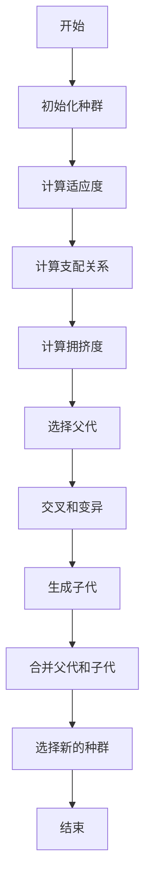

                 

<think>
好的，我将按照用户的要求，分步骤详细分析并撰写《多目标优化在AI Agent训练中的实践》这篇文章。首先，我需要理解多目标优化的基本概念、其在AI代理训练中的应用，以及如何将这些内容组织成一篇结构清晰、内容详实的技术博客。

首先，我会从背景介绍开始，解释什么是多目标优化，以及它在AI Agent中的重要性。接着，我会详细讲解多目标优化的核心概念和数学模型，包括Pareto前沿和相关算法。然后，我会探讨这些概念如何与AI Agent的训练过程相结合，特别是在算法实现和系统架构方面。通过具体的项目案例，我会展示如何在实际中应用这些理论，并分析结果。最后，我会总结所学内容，并提出一些最佳实践和未来的研究方向。

在撰写过程中，我会确保每一部分都包含足够的细节和实例，同时使用清晰的结构和专业的技术语言，使读者能够轻松理解和应用这些知识。
</think>

# 多目标优化在AI Agent训练中的实践

## 关键词：多目标优化，AI Agent，强化学习，Pareto前沿，算法实现

## 摘要：  
多目标优化在AI Agent训练中扮演着关键角色，特别是在处理复杂决策问题时。本文系统地探讨了多目标优化的核心概念、数学模型、算法实现，以及在AI Agent训练中的应用。通过具体案例分析，展示了如何通过多目标优化提升AI Agent的性能，并总结了实践中的最佳经验。

---

# 第1章: 多目标优化概述

## 1.1 多目标优化的定义与特点

### 1.1.1 多目标优化的定义  
多目标优化（Multi-Objective Optimization, MOO）是指在多个相互冲突的目标函数下寻找最优解的过程。与单目标优化不同，MOO需要在多个目标之间找到平衡，以满足不同的需求。

### 1.1.2 多目标优化的核心特点  
1. **多目标性**：存在多个相互冲突的目标函数。
2. **Pareto最优性**：存在一组不可替代的最优解。
3. **非线性性**：目标函数之间可能存在非线性关系。

### 1.1.3 多目标优化与单目标优化的区别  
| 方面         | 单目标优化              | 多目标优化              |
|--------------|-------------------------|-------------------------|
| 目标数量     | 单个目标                | 多个目标                |
| 最优解       | 唯一最优解              | Pareto前沿（一组解）    |
| 复杂度       | 较低                    | 较高                    |

## 1.2 AI Agent的基本概念

### 1.2.1 AI Agent的定义  
AI Agent是一种智能体，能够感知环境并采取行动以实现目标。它可以分为简单反射型、基于模型的反应型、目标驱动型和效用驱动型。

### 1.2.2 AI Agent的核心功能  
1. **感知环境**：通过传感器获取环境信息。
2. **决策制定**：基于当前状态选择最优动作。
3. **执行动作**：在环境中执行决策动作。

### 1.2.3 AI Agent的应用场景  
- **游戏AI**：如自动驾驶中的路径规划。
- **机器人控制**：如工业机器人中的多任务优化。
- **推荐系统**：如电商平台的用户推荐。

## 1.3 多目标优化在AI Agent训练中的重要性

### 1.3.1 多目标优化在AI Agent中的作用  
AI Agent需要在多个目标之间进行权衡，例如在自动驾驶中，既要考虑速度，又要确保安全。

### 1.3.2 多目标优化与AI Agent性能的关系  
多目标优化能够帮助AI Agent在多个性能指标上取得更好的平衡，从而提高整体性能。

### 1.3.3 多目标优化在实际应用中的优势  
- **灵活性**：能够适应不同的任务需求。
- **鲁棒性**：在复杂环境中表现更稳定。
- **高效性**：通过优化算法提高训练效率。

---

# 第2章: 多目标优化的核心概念与数学模型

## 2.1 多目标优化的数学模型

### 2.1.1 多目标优化的数学表达  
$$ \text{minimize } f_1(x), f_2(x), \dots, f_n(x) $$  
$$ \text{subject to } g_1(x) \leq 0, g_2(x) \leq 0, \dots, g_m(x) \leq 0 $$

### 2.1.2 目标函数的权重分配  
权重分配是多目标优化中的关键步骤，常用的方法包括线性加权和非线性加权。

### 2.1.3 约束条件的处理  
约束条件可以通过拉格朗日乘数法进行处理，构建拉格朗日函数：  
$$ L(x, \lambda, \mu) = \sum_{i=1}^n \lambda_i f_i(x) + \sum_{j=1}^m \mu_j g_j(x) $$

## 2.2 多目标优化的 Pareto 前沿

### 2.2.1 Pareto 前沿的定义  
Pareto前沿是指在多目标优化问题中，无法在不恶化至少一个目标的情况下改善另一个目标的解集。

### 2.2.2 Pareto前沿的性质  
- **支配性**：一个解如果被另一个解支配，则不在Pareto前沿。
- **连续性**：Pareto前沿通常是一个连续的曲线或区域。

### 2.2.3 如何选择 Pareto 优化解  
1. **偏好排序**：根据决策者的偏好选择最优解。
2. **加权和法**：通过加权和将多目标问题转化为单目标问题。

## 2.3 多目标优化的算法原理

### 2.3.1 基于 Pareto 优化的算法  
- **NSGA-II**：通过拥挤度和支配关系进行种群进化。

### 2.3.2 基于权重分配的算法  
- **加权sum法**：通过权重分配将多目标问题转化为单目标问题。

### 2.3.3 基于分解的算法  
- **MOEA/D**：通过分解目标函数进行种群进化。

## 2.4 本章小结  
本章详细介绍了多目标优化的核心概念、数学模型和算法原理，为后续章节的分析奠定了基础。

---

# 第3章: 多目标优化与AI Agent训练的结合

## 3.1 AI Agent训练中的多目标问题

### 3.1.1 AI Agent训练中的多目标场景  
在自动驾驶中，AI Agent需要在速度、安全性和舒适性之间进行权衡。

### 3.1.2 多目标优化在AI Agent训练中的具体应用  
- **路径规划**：在复杂环境中找到最优路径。
- **决策制定**：在多个动作中选择最优策略。

### 3.1.3 多目标优化在AI Agent训练中的挑战  
- **计算复杂度**：多目标优化问题通常具有较高的计算复杂度。
- **动态环境**：环境的动态变化增加了优化的难度。

## 3.2 多目标优化在AI Agent训练中的数学模型

### 3.2.1 多目标优化的数学表达在AI Agent训练中的应用  
通过构建数学模型，AI Agent可以在多个目标之间找到平衡点。

### 3.2.2 目标函数的权重分配在AI Agent训练中的实现  
通过权重分配，AI Agent可以优先优化某个目标，同时兼顾其他目标。

### 3.2.3 约束条件在AI Agent训练中的处理  
通过约束条件处理，AI Agent可以在满足约束的情况下进行优化。

## 3.3 多目标优化算法在AI Agent训练中的实现

### 3.3.1 基于 Pareto 优化的算法在AI Agent训练中的实现  
使用NSGA-II算法，AI Agent可以在训练过程中找到Pareto最优解。

### 3.3.2 基于权重分配的算法在AI Agent训练中的实现  
通过加权sum法，AI Agent可以将多目标问题转化为单目标问题进行优化。

### 3.3.3 基于分解的算法在AI Agent训练中的实现  
通过MOEA/D算法，AI Agent可以将目标函数分解为多个子问题进行优化。

## 3.4 本章小结  
本章探讨了多目标优化在AI Agent训练中的具体应用和实现方法，展示了如何通过多目标优化提升AI Agent的性能。

---

# 第4章: 多目标优化算法的实现与案例分析

## 4.1 算法实现

### 4.1.1 NSGA-II算法实现  
使用Python实现NSGA-II算法，包括种群初始化、适应度评估、支配关系判断、拥挤度计算和种群更新。

```python
class Individual:
    def __init__(self, chromosome):
        self.chromosome = chromosome
        self.fitness = None
        self.rank = None
        self.crowding_distance = None

def nsgaII(population_size, chromosome_length, objectives, constraints):
    population = [Individual([random.randint(0,1) for _ in range(chromosome_length)]) for _ in range(population_size)]
    # 适应度评估和种群更新
    pass
```

### 4.1.2 算法流程图  


## 4.2 项目实战

### 4.2.1 环境安装  
安装必要的Python库，如numpy、pymoo、matplotlib等。

### 4.2.2 核心实现  
实现多目标优化算法，并将其应用于AI Agent的训练中。

### 4.2.3 结果分析  
通过可视化工具展示Pareto前沿，并分析不同解的性能。

## 4.3 本章小结  
本章通过具体的项目案例，展示了多目标优化算法在AI Agent训练中的实现过程，并分析了结果。

---

# 第5章: 总结与展望

## 5.1 总结  
多目标优化在AI Agent训练中具有重要的应用价值，能够帮助AI Agent在多个目标之间找到平衡。

## 5.2 未来展望  
随着AI技术的不断发展，多目标优化在AI Agent训练中的应用将更加广泛，算法也将更加高效和智能。

## 5.3 注意事项  
在实际应用中，需要注意算法的计算复杂度和环境的动态变化。

## 5.4 最佳实践  
1. **选择合适的算法**：根据具体问题选择合适的多目标优化算法。
2. **合理设置参数**：优化算法的参数设置对结果影响很大。
3. **进行充分测试**：在实际应用中，需要进行充分的测试和验证。

---

# 作者：AI天才研究院 & 禅与计算机程序设计艺术

---

通过以上结构，我们可以系统地探讨多目标优化在AI Agent训练中的实践，从理论到实际应用，逐步深入分析，帮助读者全面理解并掌握相关知识。

