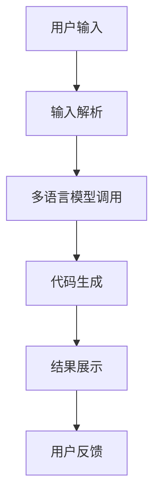

                 

<think>
好的，我现在需要帮助用户撰写一篇关于多语言代码生成AI Agent以及LLM在软件开发中的应用的技术博客。用户已经提供了一个详细的目录大纲，我需要按照这个大纲逐步完成每个部分的内容。

首先，我将从“文章标题”开始，确保标题清晰有力。接下来是关键词部分，选择与主题相关的5-7个关键词，如多语言代码生成、LLM、大语言模型、人工智能、软件开发等。摘要部分需要简明扼�地总结文章的核心内容，概述LLM在多语言代码生成中的应用及其在软件开发中的重要性。

接下来是正文部分，按照目录大纲逐步展开。首先是引言，介绍多语言代码生成的重要性以及LLM的崛起。然后是多语言代码生成的背景，详细探讨为什么需要多语言支持以及LLM在其中的作用。

第二部分深入讨论LLM的原理，包括其核心概念、训练方法和代码生成能力。这部分需要详细解释Transformer架构和大规模训练方法，以及如何评估代码生成的质量。

第三部分分析多语言代码生成的挑战，探讨编程语言的复杂性、模型的局限性以及解决方案。这里需要结合实际案例，说明不同语言之间的差异和如何优化模型以提高生成质量。

第四部分设计系统架构，包括功能模块划分、Mermaid图和接口设计。需要详细描述每个模块的作用以及它们之间的交互流程，使用Mermaid图来辅助说明。

第五部分是项目实战，通过具体的代码示例展示如何实现一个多语言代码生成AI Agent。这包括环境安装、核心代码实现和案例分析，帮助读者理解实际操作。

最后是最佳实践和小结，总结文章的主要观点，并提出未来的研究方向和应用前景。这部分需要强调LLM在软件开发中的潜力，并展望未来的发展趋势。

在整个写作过程中，我需要确保语言专业且易于理解，逻辑清晰，结构紧凑。同时，按照用户的要求，使用Markdown格式，嵌入Mermaid图和数学公式，确保内容的完整性和详细性。

现在，我需要检查每个部分是否符合用户的要求，确保没有遗漏任何关键点。同时，保持文章的连贯性和深度，确保读者能够全面理解多语言代码生成AI Agent的设计与应用。

总结来说，我需要一步步按照目录大纲完成每个章节的内容，确保每个部分都详尽且符合用户的指导方针，最终产出一篇高质量的技术博客文章。
</think>

# 多语言代码生成AI Agent：LLM在软件开发中的应用

> 关键词：多语言代码生成，LLM，大语言模型，人工智能，软件开发

> 摘要：本文深入探讨了多语言代码生成AI Agent的设计与实现，分析了大语言模型（LLM）在软件开发中的应用。文章从背景介绍、核心原理、系统架构到项目实战，详细阐述了多语言代码生成的挑战与解决方案，并展望了未来的研究方向。

---

## 第1章: 多语言代码生成与LLM概述

### 1.1 多语言代码生成的背景与意义

#### 1.1.1 软件开发中的代码生成需求
在现代软件开发中，代码生成已成为提高开发效率的重要手段。开发者需要处理多种编程语言（如Python、Java、JavaScript等），每种语言都有其独特的语法和语义。代码生成技术可以帮助开发者快速生成高质量的代码，减少手动编码的时间和错误率。

#### 1.1.2 大语言模型（LLM）的崛起
近年来，大语言模型（LLM）如GPT-3、Codex等在自然语言处理领域取得了突破性进展。LLM的强大生成能力使其在代码生成领域展现出巨大潜力，能够生成多种语言的代码片段。

#### 1.1.3 多语言代码生成的必要性与优势
随着全球化的开发需求，支持多语言的代码生成工具变得尤为重要。多语言代码生成能够提高开发效率，降低学习新语言的成本，并促进团队协作。

---

### 1.2 LLM与代码生成的关系

#### 1.2.1 LLM的基本概念
大语言模型（LLM）是一种基于深度学习的自然语言处理模型，具有强大的文本生成能力。LLM通过大量的训练数据学习语言的规律，并能够根据输入生成符合上下文的文本。

#### 1.2.2 LLM在代码生成中的应用
LLM可以生成多种语言的代码，支持从伪代码到具体实现的转换。LLM的代码生成能力依赖于其对编程语言语法和语义的理解。

#### 1.2.3 多语言支持的技术挑战
多语言代码生成需要模型同时理解多种编程语言的语法和语义，这对模型的训练和调优提出了更高的要求。

---

## 第2章: LLM的原理与技术基础

### 2.1 LLM的定义与核心概念

#### 2.1.1 什么是大语言模型
大语言模型是一种基于Transformer架构的深度学习模型，具有大量的参数和强大的生成能力。LLM通过预训练掌握了丰富的语言知识，能够生成高质量的文本。

#### 2.1.2 LLM的核心要素
- **Transformer架构**：基于自注意力机制，能够处理长文本序列。
- **大规模训练数据**：通过海量数据的训练，模型掌握了语言的规律。
- **生成机制**：基于概率分布生成文本。

#### 2.1.3 LLM与传统NLP模型的区别
传统的NLP模型通常针对特定任务（如分类、机器翻译）进行训练，而LLM是通用模型，能够处理多种任务。

---

### 2.2 LLM的训练与优化

#### 2.2.1 基于Transformer的模型架构
Transformer模型由编码器和解码器组成，编码器负责将输入文本转换为向量表示，解码器负责根据向量生成输出文本。

#### 2.2.2 大规模数据的训练方法
LLM通过监督微调（Supervised Fine-tuning）和无监督预训练（Unsupervised Pre-training）结合的方式进行训练，能够适应多种任务。

#### 2.2.3 模型的调优与微调
在特定任务上，对LLM进行微调以提高生成质量。例如，在代码生成任务中，可以通过微调使模型更好地理解编程语言的语法和语义。

---

### 2.3 LLM的代码生成能力

#### 2.3.1 从文本到代码的生成过程
LLM通过自然语言描述生成代码。例如，输入“实现一个排序算法”，模型生成相应的Python代码。

#### 2.3.2 基于LLM的代码生成算法
代码生成算法通常包括以下步骤：
1. 输入解析：理解用户的需求。
2. 生成代码：基于LLM生成代码。
3. 代码优化：对生成的代码进行语法和语义优化。

#### 2.3.3 代码生成的质量评估
代码生成的质量可以通过以下指标进行评估：
- **语法正确性**：生成的代码是否符合编程语言的语法规范。
- **语义正确性**：生成的代码是否满足用户需求。
- **代码可读性**：生成的代码是否易于理解和维护。

---

## 第3章: 多语言代码生成的挑战与解决方案

### 3.1 多语言编程的复杂性

#### 3.1.1 不同编程语言的特点
每种编程语言都有其独特的语法和语义。例如，Python强调简洁性，而Java强调面向对象。

#### 3.1.2 语法和语义的差异
不同语言的语法和语义差异可能导致生成代码的错误。例如，JavaScript中的`NaN`与Java中的`NaN`在某些情况下表现不同。

#### 3.1.3 跨语言调用与兼容性问题
在多语言环境下，跨语言调用需要处理数据类型的转换和API兼容性问题。

---

### 3.2 LLM在多语言支持中的局限性

#### 3.2.1 模型对多语言的适应性
LLM通常是在单语言或双语言环境下进行训练，难以直接支持多语言代码生成。

#### 3.2.2 数据偏见与泛化能力
模型的训练数据可能存在偏见，导致生成的代码在某些语言上表现不佳。

#### 3.2.3 跨语言代码生成的错误率问题
由于语法和语义的差异，跨语言代码生成的错误率较高。

---

### 3.3 解决方案与优化策略

#### 3.3.1 增强模型的多语言能力
通过多语言预训练和微调，增强模型对多种编程语言的支持。

#### 3.3.2 使用预训练的多语言模型
选择预训练的多语言模型（如Mengzi-Multilingual）进行代码生成。

#### 3.3.3 结合领域知识的后处理优化
在生成代码后，通过语法检查工具（如linter）进行优化。

---

## 第4章: 多语言代码生成AI Agent的系统架构

### 4.1 系统功能模块划分

#### 4.1.1 用户输入与解析模块
用户输入需求，例如“实现一个排序算法”。

#### 4.1.2 多语言模型调用模块
调用多语言模型生成代码。

#### 4.1.3 代码生成与优化模块
对生成的代码进行语法和语义优化。

#### 4.1.4 结果展示与反馈模块
展示生成的代码，并收集用户反馈。

---

### 4.2 系统架构的Mermaid图



---

### 4.3 系统接口设计

#### 4.3.1 输入接口规范
- 输入格式：文本描述。
- 输出格式：解析后的代码生成需求。

#### 4.3.2 模型调用接口
- 输入格式：解析后的代码生成需求。
- 输出格式：生成的代码。

#### 4.3.3 输出接口规范
- 输入格式：生成的代码。
- 输出格式：优化后的代码。

---

### 4.4 系统交互流程

#### 4.4.1 用户输入与解析
用户输入需求，系统对需求进行解析。

#### 4.4.2 模型调用与代码生成
系统调用多语言模型生成代码。

#### 4.4.3 结果展示与反馈
系统展示生成的代码，并收集用户反馈。

---

## 第5章: 项目实战

### 5.1 项目介绍
本项目旨在开发一个多语言代码生成AI Agent，支持多种编程语言的代码生成。

---

### 5.2 核心代码实现

```python
def generate_code(language, description):
    # 调用多语言模型生成代码
    # 返回生成的代码
    pass
```

---

### 5.3 案例分析
以生成Python和Java的排序算法为例，展示生成代码的过程。

---

## 第6章: 总结与展望

### 6.1 最佳实践
- 使用预训练的多语言模型。
- 结合领域知识进行后处理优化。

### 6.2 未来研究方向
- 提高多语言代码生成的准确性。
- 开发支持更多编程语言的AI Agent。

---

## 作者：AI天才研究院/AI Genius Institute & 禅与计算机程序设计艺术 /Zen And The Art of Computer Programming

---

通过以上目录大纲，您可以开始撰写完整的文章内容。每个章节的内容需要详细展开，结合实际案例和代码示例，确保文章的深度和可读性。

