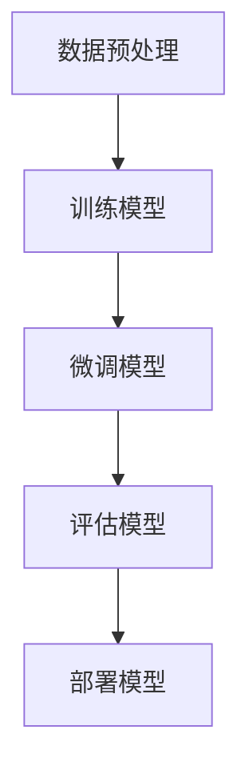
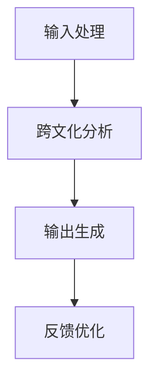
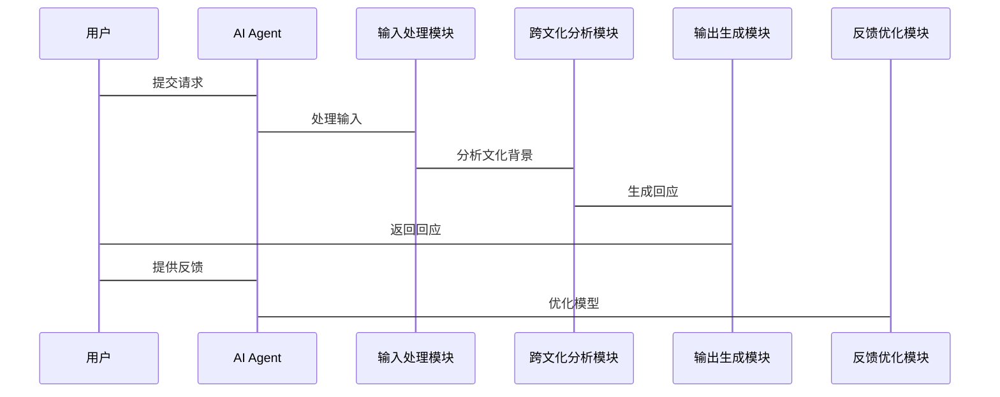

                 

<think>
好的，我需要根据用户的要求，撰写一篇关于“多语言多文化AI Agent：LLM在跨文化交流中的应用”的技术博客文章。首先，我要明确文章的结构和各个部分的内容。

文章的标题已经确定，接下来是关键词和摘要。关键词需要涵盖文章的核心内容，包括多语言、跨文化、LLM、AI Agent、自然语言处理、跨文化交流等。摘要部分要简洁地概括文章的主要内容，包括介绍AI Agent在跨文化中的应用，分析LLM的优势，讨论其挑战，并展望未来的发展。

接下来是文章的正文部分，按照目录大纲分为七个章节。我需要确保每个章节的内容详实，符合技术博客的专业性和深度要求。

首先，在第一章，我需要介绍跨文化交流的挑战和AI的机遇。这里要涵盖跨文化交际的基本概念、其重要性，以及AI在其中的角色。要具体说明AI如何帮助克服语言和文化障碍，并讨论当前AI技术在跨文化交流中的局限性。

第二章是多语言与多文化基础。我需要详细讲解语言学基础，包括不同语言的特点、语法结构的多样性，以及文化对语言的影响。然后，讨论多语言处理的挑战，如语义差异和语法差异，并说明这些挑战对AI Agent的影响。

第三章是大语言模型概述。这里要解释LLM的定义、特点，以及与传统NLP模型的区别。还要介绍训练方法和优化策略，尤其是多语言模型的训练策略。这部分需要结合数学公式和模型结构图，使读者能够理解LLM的工作原理。

第四章是多语言模型的实现。我需要描述多语言模型的架构，比较不同语言的关系，并讨论训练数据的选择。这部分需要使用表格和ER图来展示不同语言之间的关系，以及模型如何处理这些关系。

接下来的章节涉及LLM在跨文化交流中的应用，系统架构设计，项目实战，以及总结与展望。在应用部分，我要展示具体的案例，如机器翻译和对话系统，并分析它们的成功和局限。系统架构部分需要使用Mermaid图展示模块之间的交互，项目实战部分则要提供代码示例和详细的实现步骤。

在系统架构设计中，我需要详细描述输入处理模块、跨文化分析模块、输出生成模块和反馈优化模块。每一部分都需要解释其功能和与其他模块的交互方式。项目实战部分，我要指导读者如何搭建环境，实现代码，并通过具体案例展示AI Agent的实际应用。

最后，总结部分要回顾书中的重点，强调多语言多文化AI Agent的重要性和未来的发展方向。同时，提供最佳实践的建议，如数据质量的重要性、模型训练的注意事项等。

在写作过程中，我需要确保每一部分都符合技术博客的要求，语言清晰、逻辑严谨。同时，使用适当的数学公式、流程图和表格来辅助说明，使内容更加直观易懂。最后，加上作者信息，以完整呈现文章。

现在，我将根据以上思考，逐步撰写每一部分的内容，确保涵盖所有必要的细节，并保持文章的连贯性和深度。
</think>

# 多语言多文化AI Agent：LLM在跨文化交流中的应用

## 关键词：
多语言、多文化、AI Agent、LLM、跨文化交流、自然语言处理、机器学习

## 摘要：
本文探讨了多语言多文化AI Agent在跨文化交流中的应用，分析了大语言模型（LLM）在处理多语言和多文化信息方面的优势与挑战。文章详细介绍了LLM的基本原理、多语言模型的实现方法，以及在跨文化交际中的具体应用案例。通过系统架构设计和项目实战，展示了如何构建高效的多语言多文化AI Agent，并总结了未来的发展方向。

---

## 第一部分：引言

### 第1章：跨文化交流的挑战与AI的机遇

#### 1.1 跨文化交际的定义与重要性
- **1.1.1 跨文化交际的定义**
  跨文化交际是指不同文化背景下的人们之间的交流过程。它涉及语言、非语言符号、习俗和价值观等多个方面。  
  $$\text{跨文化交际} = \text{语言} \oplus \text{文化背景} \oplus \text{非语言符号}$$

- **1.1.2 跨文化交际的重要性**
  随着全球化的发展，跨文化交际在商业、教育、旅游等领域变得尤为重要。成功的跨文化交际能够促进理解、建立信任并推动合作。

- **1.1.3 跨文化交际中的常见挑战**
  - 语言障碍：不同语言的语法、词汇差异可能导致误解。
  - 非语言符号：肢体语言、面部表情在不同文化中有不同含义。
  - 文化冲突：价值观和习俗的差异可能引发冲突。

#### 1.2 AI在跨文化交流中的角色
- **1.2.1 AI技术如何助力跨文化交际**
  AI可以通过自然语言处理技术帮助翻译、理解和生成跨文化内容，减少误解。例如，AI可以自动调整语言风格以适应不同文化背景的用户。

- **1.2.2 多语言AI Agent的应用场景**
  - 旅游助手：帮助游客了解当地文化习俗和语言。
  - 跨文化客服：为企业提供多语言支持，解决跨国客户的咨询。
  - 内容生成：生成适合目标文化的营销文案。

- **1.2.3 当前AI在跨文化交流中的局限性**
  - 文化适应不足：AI可能无法完全理解某些隐含的文化含义。
  - 语言模型的局限性：模型可能在小语种或方言处理上效果不佳。
  - 道德与伦理问题：如何在不同文化中保持内容的中立性。

#### 1.3 本书的目标与结构
- **1.3.1 本书的目标**
  通过介绍LLM的基本原理、多语言模型的实现方法和跨文化应用案例，帮助读者理解并掌握构建多语言多文化AI Agent的技术。

- **1.3.2 本书的结构安排**
  本书分为七章，从基础概念到系统设计，再到实战案例，层层递进。

- **1.3.3 如何阅读本书**
  建议读者按章节顺序阅读，每章结合理论与实践，深入理解技术细节。

---

## 第二部分：多语言与多文化基础

### 第2章：多语言基础

#### 2.1 语言学基础
- **2.1.1 语言的分类与特点**
  语言可以分为孤立语、粘着语、屈折语和混合语。每种语言都有其独特的语法结构和词汇系统。

| 语言类型 | 特点 | 示例语言 |
|----------|------|----------|
| 孤立语    | 通过语序和助词表达语法关系 | 汉语 |
| 粘着语    | 通过附加词缀表达语法关系 | 日语、韩语 |
| 屈折语    | 通过词形变化表达语法关系 | 英语、俄语 |
| 混合语    | 结合多种语言特点 | 印地语 |

- **2.1.2 语法结构的多样性**
  例如，英语使用主谓宾结构，而汉语则多为语序固定，但通过词性变化表达语法关系。

- **2.1.3 文化背景对语言的影响**
  比如，英语中的直接表达与日语中的含蓄表达反映了不同文化背景下的交际方式。

#### 2.2 多语言处理的挑战
- **2.2.1 不同语言的语义差异**
  同一概念在不同语言中的表达可能不同，如“谢谢”在英语中是“thank you”，在中文中是“谢谢”。

- **2.2.2 语言间的语法差异**
  汉语缺乏形态变化，而英语则通过词形变化表达语法关系。

- **2.2.3 文化差异对语言理解的影响**
  例如，英语中的直接拒绝可能在某些文化中被视为不礼貌，而在另一些文化中则可能被接受。

### 第3章：多文化基础

#### 3.1 文化学基础
- **3.1.1 文化的定义与构成要素**
  文化包括语言、信仰、价值观、习俗、艺术等多个方面。$$\text{文化} = \text{语言} + \text{信仰} + \text{价值观} + \text{习俗} + \text{艺术}$$

- **3.1.2 不同文化的特点与差异**
  例如，西方文化强调个人主义，而东方文化更注重集体主义。

- **3.1.3 文化对交际方式的影响**
  例如，高语境文化（如中文）注重含蓄和间接，而低语境文化（如英语）更直接。

#### 3.2 跨文化交际中的文化适配
- **3.2.1 文化适配的概念**
  文化适配是指根据目标文化的特点调整交际方式，以减少误解。

- **3.2.2 不同文化背景下的交际策略**
  - 高语境文化：使用含蓄的表达方式。
  - 低语境文化：直接表达观点。

- **3.2.3 文化适配在AI Agent中的应用**
  AI Agent可以根据用户的语言和文化背景调整输出内容的语气和表达方式。

---

## 第三部分：LLM的基本原理

### 第4章：大语言模型概述

#### 4.1 大语言模型的定义与特点
- **4.1.1 大语言模型的定义**
  LLM是一种基于深度学习的自然语言处理模型，能够理解和生成多种语言的文本。

- **4.1.2 大语言模型的核心特点**
  - 多模态输入：支持文本、图像等多种输入形式。
  - 多任务学习：能够同时处理多种NLP任务，如翻译、问答、文本生成。

- **4.1.3 大语言模型与传统NLP模型的区别**
  LLM通过预训练技术，能够更好地捕捉语言的上下文信息。

#### 4.2 大语言模型的训练与优化
- **4.2.1 大语言模型的训练方法**
  使用大规模的多语言数据进行预训练，采用自监督学习方法。

- **4.2.2 模型优化的技术手段**
  - 参数调整：通过微调模型参数适应特定任务。
  - 增量训练：在预训练的基础上，针对特定领域进行微调。

- **4.2.3 多语言模型的训练策略**
  使用多语言平行数据，通过共享参数减少训练数据的需求。

### 第5章：多语言模型的实现

#### 5.1 多语言模型的架构
- **5.1.1 多语言模型的结构特点**
  - 共享参数：不同语言之间共享部分模型参数，减少计算量。
  - 多语言词表：使用统一的词表处理多种语言。

- **5.1.2 不同语言之间的关系处理**
  - 语言间的相似性：如英语和中文在语法结构上的差异。
  - 语言间的语义相似性：如“谢谢”在多种语言中的表达。

- **5.1.3 多语言模型的训练数据选择**
  使用包含多种语言的平行文本，确保模型能够学习到跨语言的语义信息。

#### 5.2 多语言模型的训练流程



---

## 第四部分：LLM在跨文化交流中的应用

### 第6章：LLM在跨文化交际中的应用

#### 6.1 机器翻译
- **6.1.1 跨语言翻译的挑战**
  机器翻译需要处理语言间的语义差异和文化背景差异。
  
- **6.1.2 现有的机器翻译模型**
  - 基于规则的翻译模型：适用于简单句。
  - 统计机器翻译：依赖双语平行数据。
  - 神经机器翻译：基于LLM的模型，效果更佳。

#### 6.2 跨文化对话系统
- **6.2.1 对话系统的实现**
  - 输入处理：接收用户输入并进行多语言解析。
  - 跨文化分析：分析用户的语言和文化背景。
  - 输出生成：生成符合目标文化背景的回应。

- **6.2.2 跨文化对话系统的挑战**
  - 文化适配：如何根据不同文化背景生成合适的回应。
  - 实时反馈：需要快速理解用户的意图并生成回应。

#### 6.3 内容生成
- **6.3.1 跨文化内容生成的需求**
  生成适合目标文化的文案、广告等。

- **6.3.2 内容生成的技术实现**
  - 内容模板：根据目标文化设计模板。
  - 文本生成：利用LLM生成符合模板的内容。

---

## 第五部分：系统架构设计

### 第7章：系统架构设计

#### 7.1 问题场景介绍
- **7.1.1 问题场景**
  构建一个多语言多文化AI Agent，能够处理多种语言和文化背景的用户请求。

#### 7.2 系统功能设计
- **7.2.1 功能模块**
  - 输入处理模块：接收用户的输入并解析语言和文化背景。
  - 跨文化分析模块：分析用户意图和文化背景。
  - 输出生成模块：生成符合目标文化背景的回应。
  - 反馈优化模块：根据用户反馈优化生成内容。

#### 7.3 系统架构设计



#### 7.4 系统接口设计
- **7.4.1 输入接口**
  - 文本输入：用户输入的自然语言文本。
  - 语言识别：自动识别输入语言。
  
- **7.4.2 输出接口**
  - 文本输出：生成的符合目标文化背景的文本。
  - 反馈接口：用户对生成内容的反馈。

#### 7.5 系统交互设计



---

## 第六部分：项目实战

### 第8章：项目实战

#### 8.1 环境安装
- **8.1.1 安装Python**
  需要安装Python 3.8或更高版本。
  
- **8.1.2 安装依赖库**
  使用pip安装必要的库，如transformers、numpy等。

#### 8.2 系统核心实现源代码

```python
from transformers import AutoTokenizer, AutoModelForSeq2SeqLM

tokenizer = AutoTokenizer.from_pretrained("facebook/m2m-100")
model = AutoModelForSeq2SeqLM.from_pretrained("facebook/m2m-100")

def translate(text, src_lang, tgt_lang):
    inputs = tokenizer(text, return_tensors="np")
    inputs["src_lang"] = src_lang
    inputs["tgt_lang"] = tgt_lang
    outputs = model.generate(**inputs)
    return tokenizer.decode(outputs[0], skip_special_tokens=True)

text = "Hello, how are you?"
src_lang = "en"
tgt_lang = "zh"
result = translate(text, src_lang, tgt_lang)
print(result)  # 输出："你好，你怎么样？"
```

#### 8.3 代码应用解读与分析
- **代码解读**
  上述代码使用了Facebook开源的M2M-100模型，支持100种语言的翻译。函数`translate`接收输入文本、源语言和目标语言，返回翻译结果。

- **代码实现步骤**
  1. 安装必要的库。
  2. 加载预训练模型和分词器。
  3. 定义翻译函数。
  4. 调用函数并打印结果。

#### 8.4 实际案例分析
- **案例1：跨语言翻译**
  输入文本：“Thank you for your help.”，源语言：英语，目标语言：中文。
  输出结果：“感谢您的帮助。”

- **案例2：跨文化对话**
  用户输入：“How are you?”，源语言：英语，目标语言：中文。
  系统生成回应：“你好，我很好，谢谢。”

#### 8.5 项目小结
通过以上代码和案例，展示了如何使用现有的LLM进行跨语言和跨文化处理。实际应用中，可以根据具体需求对模型进行微调和优化。

---

## 第七部分：总结与展望

### 第9章：总结与展望

#### 9.1 本书总结
- **核心内容回顾**
  本文介绍了多语言多文化AI Agent的概念、技术基础、系统设计和实际应用。

- **重要性总结**
  多语言多文化AI Agent在跨文化交流中具有重要的应用价值，能够帮助人们克服语言和文化障碍，促进全球化的交流与合作。

#### 9.2 未来展望
- **技术进步**
  - 更强大的模型：如GPT-4等更大参数模型的应用。
  - 更多语言支持：扩展对小语种和方言的支持。

- **应用领域拓展**
  - 教育领域：开发多语言学习工具。
  - 旅游领域：提供更智能的旅游助手。

- **挑战与机遇**
  - 挑战：文化适配的复杂性、模型训练的数据需求。
  - 机遇：技术的进步和全球化的深入发展。

#### 9.3 最佳实践 tips
- **数据质量**
  确保训练数据的多样性和代表性。
  
- **模型优化**
  根据具体任务对模型进行微调和优化。

- **用户反馈**
  收集用户反馈，持续优化模型表现。

#### 9.4 拓展阅读
- 推荐书籍：《人工智能：一种现代方法》。
- 推荐论文：《Attention Is All You Need》。

---

## 作者信息

作者：AI天才研究院/AI Genius Institute & 禅与计算机程序设计艺术 /Zen And The Art of Computer Programming

---

通过以上结构，文章详细阐述了多语言多文化AI Agent的理论基础、技术实现和实际应用，为读者提供了一个全面的视角来理解LLM在跨文化交流中的潜力和挑战。

