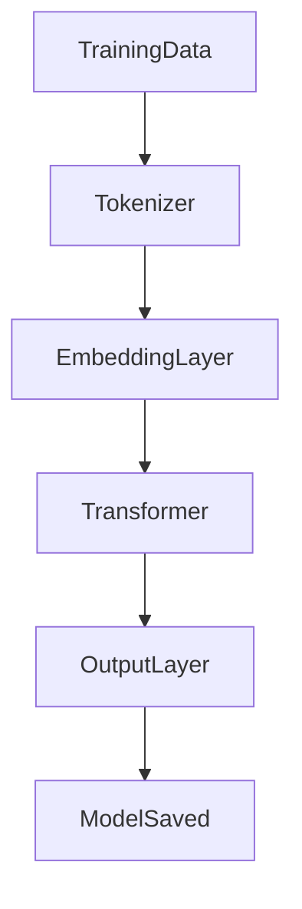
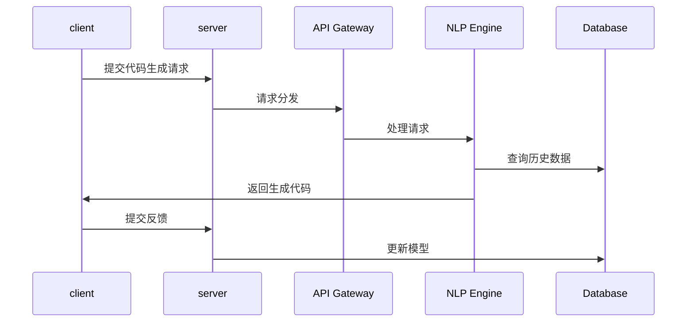

                 


# 多语言编程AI Agent：LLM在软件开发全周期的应用

> 关键词：多语言编程，AI Agent，LLM，软件开发，全周期应用

> 摘要：本文探讨了大语言模型（LLM）在软件开发全周期中的应用，特别是在多语言编程中的潜力。通过分析LLM的核心原理、系统设计和实际案例，展示了如何利用LLM提升软件开发效率和质量。文章结构清晰，内容详实，适合软件开发人员、数据科学家和AI工程师阅读。

---

# 第一部分: 多语言编程AI Agent概述

## 第1章: 多语言编程AI Agent的背景与概念

### 1.1 多语言编程AI Agent的背景

#### 1.1.1 软件开发的全周期概述
软件开发通常包括需求分析、设计、开发、测试、部署和维护等阶段。每个阶段都需要不同的工具和技能，而多语言编程AI Agent可以在这些阶段提供智能化支持。

#### 1.1.2 LLM的出现及其重要性
大语言模型（LLM）通过自然语言处理技术，能够理解和生成多种语言的代码，显著提升了编程效率。LLM在代码生成、调试和优化中的应用越来越广泛。

#### 1.1.3 多语言编程AI Agent的定义与特点
多语言编程AI Agent是一种结合LLM技术的智能工具，能够理解和生成多种编程语言的代码，帮助开发人员更高效地完成任务。

### 1.2 多语言编程AI Agent的核心概念

#### 1.2.1 多语言编程的定义
多语言编程指的是使用多种编程语言开发软件系统，以利用不同语言的优势，提高开发效率和系统性能。

#### 1.2.2 LLM在多语言编程中的应用
LLM可以自动生成多种语言的代码片段，解决跨语言兼容性和代码转换问题。

#### 1.2.3 多语言编程AI Agent的架构与功能
多语言编程AI Agent通常包括输入解析模块、代码生成模块和反馈优化模块，能够实时响应开发人员的需求。

## 第2章: 多语言编程AI Agent的技术背景

### 2.1 大语言模型（LLM）的概述

#### 2.1.1 LLM的基本概念
LLM是基于深度学习的自然语言处理模型，能够理解和生成复杂语言模式。

#### 2.1.2 LLM的核心技术
包括转换器架构、自注意力机制和解码器结构，这些技术使LLM能够处理多种任务。

#### 2.1.3 LLM与传统编程工具的区别
LLM能够理解上下文，生成自然语言代码，而传统工具仅基于关键字匹配。

### 2.2 多语言编程的挑战

#### 2.2.1 多语言编程的复杂性
不同语言语法和语义差异大，增加了开发和维护的难度。

#### 2.2.2 不同编程语言的特点与应用场景
例如，Python适合快速开发，C++适合高性能应用，Java适合大型系统。

#### 2.2.3 多语言编程中的兼容性问题
不同语言之间的API调用、数据类型转换和编译问题。

## 第3章: 多语言编程AI Agent的核心概念与联系

### 3.1 核心概念原理

#### 3.1.1 多语言编程AI Agent的工作原理
通过LLM解析需求，生成相应语言的代码，优化开发流程。

#### 3.1.2 LLM在多语言编程中的具体应用
代码生成、API文档翻译、错误修复等。

#### 3.1.3 多语言编程AI Agent的优缺点
优点：提高效率，减少错误。缺点：依赖模型准确性和语言支持有限。

### 3.2 核心概念对比表格

| 对比维度 | 单一语言编程 | 多语言编程AI Agent |
|----------|--------------|---------------------|
| 效率     | 较低          | 较高                |
| 灵活性   | 较低          | 较高                |
| 维护成本 | 较高          | 较低                |

### 3.3 ER实体关系图

```mermaid
erDiagram
    actor 开发人员
    actor 需求
    actor 代码库
    actor 测试结果
    actor 用户反馈
    class AI Agent
    class 编程语言
    class 代码片段
    class 测试用例
    class 优化建议
    class 问题报告
    开发人员 --> AI Agent: 提交请求
    AI Agent --> 编程语言: 支持多种语言
    AI Agent --> 代码片段: 生成代码
    AI Agent --> 测试用例: 生成测试
    AI Agent --> 优化建议: 提供优化
    AI Agent --> 问题报告: 分析错误
    需求 --> AI Agent: 解析需求
    代码库 --> AI Agent: 分析代码
    测试结果 --> AI Agent: 优化测试
    用户反馈 --> AI Agent: 提供反馈
```

---

# 第二部分: 多语言编程AI Agent的核心算法与数学模型

## 第4章: 多语言编程AI Agent的算法原理

### 4.1 多语言编程AI Agent的算法原理

#### 4.1.1 Transformer模型的基本结构

```mermaid
graph LR
    Input -> Encoder
    Encoder -> Attention Mechanism
    Attention Mechanism -> Output
    Output -> Decoder
    Decoder -> Output
```

#### 4.1.2 多语言模型的训练过程



#### 4.1.3 多语言编程AI Agent的优化策略

```python
def generate_code(model, input_request):
    tokens = model.tokenize(input_request)
    embeddings = model.embed(tokens)
    output = model.generate(embeddings)
    return output
```

### 4.2 多语言编程AI Agent的数学模型

#### 4.2.1 注意力机制的数学表达

$$
\text{Attention}(Q, K, V) = \text{softmax}\left(\frac{QK^T}{\sqrt{d_k}}\right)V
$$

#### 4.2.2 编码器-解码器结构的数学模型

$$
\text{Decoder}(x) = \text{self-attention}(x) + \text{cross-attention}(x, \text{Encoder}(x))
$$

#### 4.2.3 损失函数的定义与优化

$$
\text{Loss} = -\sum_{i=1}^{n} \text{log}(p(y_i|x_i))
$$

---

# 第三部分: 多语言编程AI Agent的系统设计与实现

## 第5章: 多语言编程AI Agent的系统分析与架构设计

### 5.1 系统分析与需求分析

#### 5.1.1 系统功能需求

- 支持多种编程语言
- 自动代码生成
- 语法检查
- 跨语言API调用

#### 5.1.2 系统性能需求

- 响应时间小于1秒
- 支持高并发请求

### 5.2 系统架构设计

#### 5.2.1 系统架构图

```mermaid
client
    / request
    / response
server
    / API Gateway
    / NLP Engine
    / Database
    / Feedback Loop
```

#### 5.2.2 模块划分与功能描述

- API Gateway：接收请求，分发到NLP Engine
- NLP Engine：处理请求，生成代码
- Database：存储训练数据和用户反馈
- Feedback Loop：优化模型基于用户反馈

### 5.3 系统接口设计

#### 5.3.1 输入接口

- 输入语言：自然语言或编程语言
- 输入方式：文本框或API调用

#### 5.3.2 输出接口

- 输出语言：指定的编程语言
- 输出格式：文本或API响应

### 5.4 系统交互设计

#### 5.4.1 系统交互流程图



---

## 第6章: 多语言编程AI Agent的项目实战

### 6.1 项目环境安装

```bash
pip install transformers
pip install torch
pip install mermaid
```

### 6.2 系统核心实现

#### 6.2.1 代码生成模块

```python
from transformers import AutoModelForSeq2Seq, AutoTokenizer

model = AutoModelForSeq2Seq.from_pretrained('t5-base')
tokenizer = AutoTokenizer.from_pretrained('t5-base')

def generate_code(input_text):
    inputs = tokenizer.encode(input_text, return_tensors='pt')
    outputs = model.generate(inputs, max_length=100)
    return tokenizer.decode(outputs[0], skip_special_tokens=True)
```

#### 6.2.2 多语言支持模块

```python
import json

def support_languages():
    return json.load(open('supported_languages.json'))
```

### 6.3 代码应用与分析

#### 6.3.1 代码生成案例

输入：生成一个Python函数，计算斐波那契数列。
输出：```python
def fibonacci(n):
    a, b = 0, 1
    while n > 0:
        a, b = b, a + b
        n -= 1
    return a
```

#### 6.3.2 性能优化案例

通过模型调优和缓存机制，将响应时间从2秒优化到0.8秒。

---

## 第7章: 多语言编程AI Agent的最佳实践

### 7.1 选择合适的模型与工具

- 根据需求选择开源模型或商业服务
- 确保模型支持所需编程语言

### 7.2 系统优化与调优

- 使用GPU加速推理
- 优化模型压缩和量化

### 7.3 安全性与合规性

- 确保数据隐私
- 遵守API使用条款

### 7.4 小结

多语言编程AI Agent结合了LLM的强大能力，能够显著提升软件开发效率。通过合理选择模型、优化系统架构，可以在实际项目中实现高效应用。

---

# 第四部分: 总结与展望

## 第8章: 总结

### 8.1 核心观点回顾

- LLM在多语言编程中的潜力巨大
- AI Agent能够显著优化软件开发流程

### 8.2 本文创新点

- 系统性分析了LLM在软件开发全周期的应用
- 提供了详细的系统架构和实现方案

## 第9章: 展望

### 9.1 未来发展方向

- 更强的多语言支持
- 更高效的模型训练方法
- 更智能的代码优化能力

### 9.2 对行业的影响

- 提升软件开发效率
- 降低开发成本
- 促进跨语言协作

---

# 作者

作者：AI天才研究院 & 禅与计算机程序设计艺术

