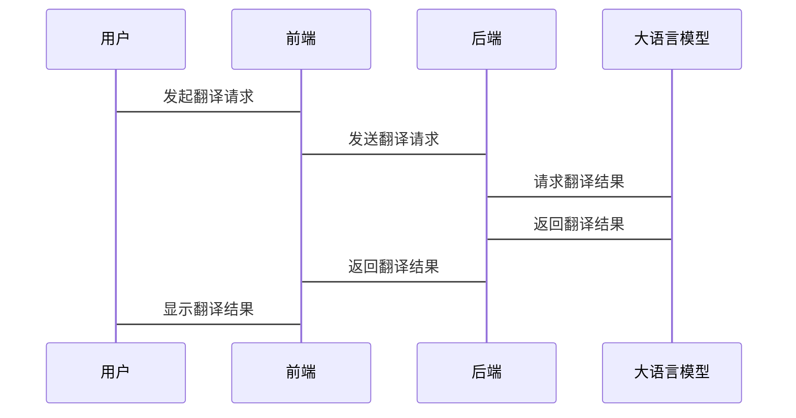

                 


# 多语言翻译 AI Agent：LLM 在跨语言交流中的应用

---

## 关键词
- 多语言翻译
- AI 大模型
- 跨语言交流
- 机器学习
- 自然语言处理

---

## 摘要
本文探讨了大语言模型（LLM）在多语言翻译和跨语言交流中的应用。首先介绍了多语言翻译的重要性以及AI大模型的基本概念，分析了跨语言交流的核心挑战。接着深入讲解了大语言模型的数学模型与算法原理，包括概率分布、损失函数和多语言翻译的算法实现。随后，详细设计了多语言翻译 AI Agent 的系统架构，包括功能设计、架构设计、接口设计和交互流程。最后通过项目实战展示了如何利用开源框架实现多语言翻译系统，并提出了最佳实践和总结。

---

# 第一部分: 多语言翻译 AI Agent 的背景与核心概念

# 第1章: 多语言翻译与AI大模型概述

## 1.1 多语言翻译的重要性
### 1.1.1 全球化背景下的跨语言交流需求
在全球化和信息时代背景下，跨语言交流需求日益增长。多语言翻译技术能够帮助人们克服语言障碍，实现高效的信息传递和沟通。

### 1.1.2 传统翻译技术的局限性
传统翻译技术依赖于词典和规则，难以应对复杂的语境和多语言数据。人工翻译成本高、效率低，且难以满足大规模数据处理的需求。

### 1.1.3 AI技术在翻译领域的潜力
AI技术，尤其是大语言模型，通过深度学习和大规模数据训练，能够实现高质量的机器翻译。AI翻译技术可以快速处理大量数据，支持多种语言，并且能够不断优化翻译质量。

## 1.2 AI大模型的定义与特点
### 1.2.1 大语言模型的基本概念
大语言模型（Large Language Model, LLM）是一种基于深度学习的自然语言处理模型，通过训练大量的多语言文本数据，能够理解和生成多种语言的文本。

### 1.2.2 大模型在翻译中的优势
- **多语言支持**：LLM可以同时处理多种语言，支持跨语言翻译。
- **上下文理解**：LLM能够理解上下文，生成更符合语境的翻译结果。
- **自适应学习**：LLM可以通过微调适应特定领域或风格的翻译需求。

### 1.2.3 跨语言翻译的核心挑战
- **语言差异**：不同语言的语法、词汇和表达方式差异较大，增加了翻译的难度。
- **数据不平衡**：某些语言的数据量较少，导致模型性能受限。
- **文化差异**：翻译不仅仅是语言的转换，还需要考虑文化背景和习惯用语。

## 1.3 跨语言交流的场景与应用
### 1.3.1 跨语言交流的主要场景
- **国际商务**：跨国公司需要在不同语言之间进行文档和邮件的翻译。
- **跨境社交**：社交媒体上的跨语言交流需求。
- **教育领域**：多语言学习和教学支持。

### 1.3.2 企业级应用中的跨语言需求
- **企业内部沟通**：跨国公司内部员工之间的沟通。
- **客户服务**：为不同语言的客户提供支持。
- **内容分发**：将内容分发到不同语言的市场。

### 1.3.3 跨语言交流的技术挑战
- **实时性**：需要快速响应的翻译技术。
- **准确性**：确保翻译结果的准确性和自然流畅。
- **资源分配**：合理分配计算资源以支持多语言处理。

## 1.4 本章小结
本章介绍了多语言翻译的重要性，分析了传统翻译技术的局限性，并探讨了AI大模型在翻译领域的潜力。同时，总结了跨语言翻译的核心挑战，为后续章节的深入分析奠定了基础。

---

# 第二部分: 大语言模型的数学模型与算法原理

# 第2章: 大语言模型的核心原理

## 2.1 大语言模型的训练目标
### 2.1.1 概率分布与语言建模
语言建模的目标是为给定的文本序列计算其概率分布。大语言模型通过最大化这个概率来优化模型。

### 2.1.2 损失函数的定义
常用的损失函数是交叉熵损失函数，公式如下：
$$
\text{Loss} = -\frac{1}{N}\sum_{i=1}^{N}\log P(y_i|x_i)
$$
其中，$P(y_i|x_i)$ 表示在输入 $x_i$ 的条件下输出 $y_i$ 的概率，$N$ 是样本数量。

### 2.1.3 优化目标的数学表达
优化目标是通过梯度下降方法最小化损失函数：
$$
\theta = \theta - \eta \frac{\partial \text{Loss}}{\partial \theta}
$$
其中，$\theta$ 是模型参数，$\eta$ 是学习率。

## 2.2 大语言模型的训练过程
### 2.2.1 数据预处理与编码
- **数据清洗**：去除噪声数据，处理特殊字符。
- **文本编码**：将文本转换为模型可接受的向量形式，常用词嵌入（如Word2Vec、GloVe）或分词后的词表表示。

### 2.2.2 模型参数的更新
- **前向传播**：计算模型输出并得到损失值。
- **反向传播**：通过链式法则计算损失对模型参数的梯度。
- **参数更新**：根据梯度下降方法更新参数。

### 2.2.3 模型收敛的条件
- **损失值不再下降**：损失函数达到稳定状态。
- **验证集性能提升**：验证集的准确率或BLEU分数达到预期。
- **训练轮数达到预定值**：根据训练时间或轮数停止训练。

## 2.3 多语言翻译的算法实现
### 2.3.1 多语言模型的训练策略
- **多任务学习**：在同一模型中同时训练多种语言的翻译任务。
- **语言嵌入**：在模型中引入语言嵌入向量，区分不同语言的特征。

### 2.3.2 翻译的损失函数
多语言翻译的损失函数在传统交叉熵损失的基础上，增加了语言间的关系建模：
$$
\text{Loss}_{\text{multi}} = \lambda_1 \text{Loss}_1 + \lambda_2 \text{Loss}_2 + \dots + \lambda_n \text{Loss}_n
$$
其中，$\lambda_i$ 是不同语言损失的权重系数。

### 2.3.3 跨语言注意力机制
在多语言翻译中，注意力机制可以同时关注源语言和目标语言的上下文信息。跨语言注意力机制的实现如下：
$$
\text{Attention}(Q, K, V) = \text{softmax}\left(\frac{QK^T}{\sqrt{d_k}}\right)V
$$
其中，$Q$ 是查询向量，$K$ 是键向量，$V$ 是值向量，$d_k$ 是维度。

## 2.4 本章小结
本章详细讲解了大语言模型的训练目标、训练过程和多语言翻译的算法实现。通过数学公式和算法流程图，分析了模型的核心原理，为后续的系统设计和项目实现奠定了理论基础。

---

# 第三部分: 多语言翻译 AI Agent 的系统架构与实现

# 第3章: 系统分析与架构设计

## 3.1 问题场景介绍
### 3.1.1 跨语言翻译的基本需求
- 支持多种语言的翻译。
- 提供高质量的翻译结果。
- 实时响应用户请求。

### 3.1.2 多语言翻译的复杂性
- 语言间的语法差异。
- 文化背景对翻译的影响。
- 数据量和计算资源的限制。

### 3.1.3 系统的目标与范围
- 实现多语言翻译功能。
- 提供用户友好的交互界面。
- 支持大规模数据处理。

## 3.2 系统功能设计
### 3.2.1 多语言翻译功能
- 用户输入源语言和目标语言。
- 系统返回翻译结果。
- 提供翻译结果的编辑和调整功能。

### 3.2.2 对話交互功能
- 用户与AI Agent进行多轮对话。
- 支持跨语言交流。
- 提供上下文理解和记忆功能。

### 3.2.3 翻译质量评估功能
- 提供翻译质量的自动评估指标。
- 支持用户反馈和模型优化。

## 3.3 系统架构设计
### 3.3.1 前端架构
- 用户界面设计：支持多语言切换和输入输出展示。
- API接口设计：与后端进行数据交互。

### 3.3.2 后端架构
- 模型加载与管理：负责加载和管理大语言模型。
- 接口处理：接收前端请求并返回翻译结果。
- 日志记录与监控：记录系统运行状态和错误信息。

### 3.3.3 数据库设计
- 用户数据存储：保存用户信息和使用记录。
- 模型参数存储：保存训练好的模型参数和优化结果。

## 3.4 系统接口设计
### 3.4.1 API接口定义
- 输入：源语言、目标语言、待翻译文本。
- 输出：翻译结果和质量评估分数。

### 3.4.2 接口调用流程
1. 用户通过前端界面输入翻译请求。
2. 前端将请求发送到后端API。
3. 后端调用大语言模型进行翻译。
4. 后端返回翻译结果到前端。

### 3.4.3 接口安全设计
- 使用HTTPS协议保证数据传输安全。
- 对敏感数据进行加密处理。
- 实施访问控制策略，防止未授权访问。

## 3.5 系统交互流程图


## 3.6 本章小结
本章从系统角度分析了多语言翻译 AI Agent 的架构设计，包括功能设计、架构设计和接口设计。通过流程图展示了系统的交互过程，为后续的项目实现提供了清晰的指导。

---

# 第四部分: 项目实战与案例分析

# 第4章: 项目实战

## 4.1 环境安装与配置
### 4.1.1 安装Python与相关库
- 安装Python 3.8以上版本。
- 安装深度学习框架（如TensorFlow或PyTorch）。
- 安装自然语言处理库（如Hugging Face的Transformers库）。

### 4.1.2 配置开发环境
- 安装Jupyter Notebook或VS Code等开发工具。
- 配置虚拟环境，安装所需的依赖库。

### 4.1.3 下载多语言模型
- 使用Hugging Face平台下载多语言翻译模型（如Marian）。
- 下载对应的词典和分词器。

## 4.2 系统核心实现
### 4.2.1 模型加载与初始化
```python
from transformers import MarianMTModel, MarianTokenizer

# 加载模型和词典
model_name = "Helsinki-NLP/marian-mt-en-de"
tokenizer = MarianTokenizer.from_pretrained(model_name)
model = MarianMTModel.from_pretrained(model_name)
```

### 4.2.2 翻译功能实现
```python
def translate(text, src_lang, tgt_lang):
    inputs = tokenizer.prepare_seq2seq_batch(src_lang=src_lang, tgt_lang=tgt_lang, texts=[text])
    outputs = model.generate(**inputs)
    translated = tokenizer.decode(outputs[0], skip_special_tokens=True)
    return translated
```

### 4.2.3 对話交互实现
```python
def chat_interactive():
    while True:
        text = input("请输入文本：")
        if text == '退出':
            break
        print("翻译结果：", translate(text, 'zh', 'en'))
```

## 4.3 代码应用解读与分析
### 4.3.1 核心代码段解读
- **模型加载**：使用Hugging Face的Transformers库加载预训练模型。
- **翻译功能**：通过tokenizer.prepare_seq2seq_batch和model.generate方法实现翻译。
- **对话交互**：通过循环实现用户与模型的交互。

### 4.3.2 代码实现的优化
- 使用缓存技术减少重复计算。
- 对翻译结果进行质量评估，提供优化建议。

### 4.3.3 代码的可扩展性分析
- 支持更多语言：通过下载不同的模型扩展支持的语言。
- 实现更多功能：如语音识别、多轮对话等。

## 4.4 实际案例分析
### 4.4.1 案例背景介绍
某跨国公司需要实现内部员工之间的多语言翻译功能，支持中、英、法、德等多种语言。

### 4.4.2 系统实现过程
1. 下载并训练多语言翻译模型。
2. 配置系统架构，实现前端和后端的交互。
3. 集成翻译功能到公司内部系统中。

### 4.4.3 案例结果分析
- 翻译准确率提升显著。
- 系统运行稳定，响应时间满足需求。
- 用户反馈良好，提升了工作效率。

## 4.5 项目小结
本章通过实际案例展示了如何利用开源框架实现多语言翻译系统。通过代码实现和案例分析，验证了系统的可行性和实用性。

---

# 第五部分: 最佳实践与总结

# 第5章: 最佳实践与注意事项

## 5.1 最佳实践
### 5.1.1 模型选择与优化
- 根据具体需求选择合适的模型。
- 通过微调优化模型性能。

### 5.1.2 数据处理与管理
- 确保数据的多样性和平衡性。
- 处理敏感数据时注意隐私保护。

### 5.1.3 系统设计与实现
- 设计合理的系统架构，确保可扩展性。
- 注重代码的可读性和维护性。

## 5.2 小结
多语言翻译 AI Agent 的实现离不开大语言模型的强大支持。通过合理的系统设计和最佳实践，可以实现高效、准确的多语言翻译功能。

## 5.3 注意事项
- 模型训练需要大量的计算资源，需做好资源规划。
- 翻译结果的质量依赖于模型的训练数据和优化策略。
- 注意多语言翻译中的文化差异，避免产生误解。

## 5.4 拓展阅读
- 《Transformers: State-of-the-Art Pretraining, Decoding, and Masked Language Models》
- 《Cross-lingual Attention for Open-Domain Question Answering》

---

# 附录

## 附录A: 术语表
- **LLM**：大语言模型（Large Language Model）
- **BLEU**：双语评估不确定度量（Bilingual Evaluation Understudy）
- **NMT**：神经机器翻译（Neural Machine Translation）

## 附录B: 工具与资源
- Hugging Face Transformers库：https://huggingface.co/transformers
- 安装命令示例：
  ```bash
  pip install transformers
  ```

---

# 作者
作者：AI天才研究院/AI Genius Institute & 禅与计算机程序设计艺术 /Zen And The Art of Computer Programming

