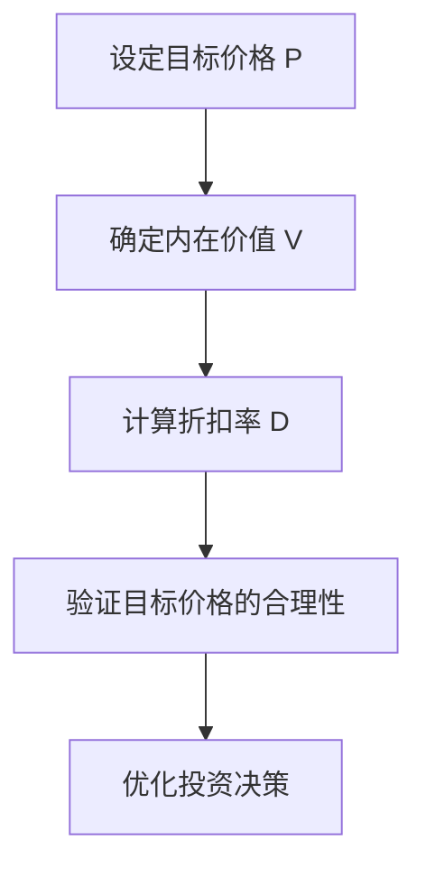

                 

<think>
嗯，用户希望我写一篇关于大卫·德雷曼反向定价法的详细技术博客，主题是《大卫·德雷曼的反向定价：从目标价格倒推投资决策》。首先，我需要理解反向定价法的核心思想，它是一种从目标价格出发，倒推投资策略的方法，与传统的从公司基本面出发定价不同，这种方法可能更注重市场整体情况和逆向思维。

用户已经给出了一个详细的目录结构，分为七个主要章节，每个章节下有多个小节，覆盖了背景介绍、核心概念、数学模型、系统架构、项目实战、最佳实践和附录。我需要确保每个部分都详细展开，逻辑清晰，内容专业。

首先，我应该从背景介绍开始，解释为什么反向定价法重要，传统方法的局限性，以及德雷曼方法的独特之处。接下来，在核心概念部分，我需要详细解释定价的数学模型，特别是德雷曼模型的公式，可能需要使用LaTeX来展示，比如P=V/D，其中P是目标价格，V是内在价值，D是折扣率。然后，我需要对比传统定价和反向定价的方法，制作一个对比表格，用Mermaid图表来展示。

在算法原理部分，我需要用Mermaid流程图详细描述反向定价的步骤，包括设定目标价格、评估内在价值、计算折扣率等。同时，用Python代码实现这个模型，展示如何通过代码来计算目标价格和内在价值，确保代码部分清晰易懂，并给出实际案例分析。

系统架构部分需要介绍应用场景，比如股票、债券等，然后用Mermaid画出类图和序列图，展示系统各模块之间的交互。项目实战部分则需要提供具体的代码实现，环境安装指南，以及如何在实际中应用这些代码，比如如何分析股票的价值。

最后，在最佳实践部分，我需要总结反向定价法的优缺点，给出实际应用中的注意事项，比如市场波动、数据准确性等，并推荐相关的书籍和工具，帮助读者深入学习。附录部分需要解释专业术语，推荐有用的工具，以及列出参考文献，增加文章的可信度。

整个过程中，我需要确保每个部分都逻辑连贯，内容详实，同时使用清晰的技术语言，避免过于复杂的术语，让读者能够一步步理解反向定价法的原理和应用。我还需要注意文章的结构，每个章节之间有良好的过渡，确保整体流畅。

可能的挑战是如何将复杂的金融模型转化为易于理解的技术内容，同时保持专业性。我需要确保代码示例准确，图表清晰，并且每个部分都能帮助读者逐步掌握反向定价法。此外，我还需要考虑读者的背景，他们可能是程序员或投资者，因此内容需要兼顾技术细节和实际应用。

总之，我需要按照用户的要求，系统地展开每个部分，确保文章结构完整，内容详实，同时保持逻辑清晰，让读者能够通过一步步的分析和实例理解大卫·德雷曼的反向定价法。
</think>

# 大卫·德雷曼的反向定价：从目标价格倒推投资决策

## 关键词：大卫·德雷曼，反向定价，投资决策，目标价格，价值投资，股票定价

## 摘要：大卫·德雷曼的反向定价法是一种创新的投资策略，它通过设定目标价格，倒推出合理的投资决策。本文将详细阐述反向定价的核心概念、数学模型、系统架构以及实际应用，帮助读者理解如何通过反向定价来优化投资决策。

---

## 第一章：反向定价的背景与核心概念

### 1.1 问题背景与描述

#### 1.1.1 投资决策中的定价问题
投资决策的核心在于确定标的资产的合理价格。传统定价方法通常从公司的基本面（如利润、收入、市盈率等）出发，推导出股票的内在价值。然而，这种方法在实际操作中存在一定的局限性，尤其是在市场波动剧烈或信息不完全的情况下，传统的定价方法往往难以给出准确的估值。

#### 1.1.2 反向定价的提出与意义
反向定价是一种创新的定价方法，它通过设定一个目标价格，然后倒推出相应的投资决策。这种方法的核心在于从目标价格出发，分析市场现状和未来趋势，从而制定出更符合市场实际情况的投资策略。

#### 1.1.3 投资决策中的定价挑战
在投资决策中，定价是一个复杂的系统工程，需要考虑市场、公司、行业等多方面的因素。传统的定价方法往往过于依赖历史数据和公司基本面，而忽视了市场的动态变化和投资者的心理预期。反向定价则通过设定目标价格，从目标出发，倒推投资决策，从而更灵活地应对市场变化。

### 1.2 反向定价的核心概念

#### 1.2.1 反向定价的定义与特点
反向定价是一种从目标价格出发，倒推出投资决策的定价方法。其特点是：
- 以目标价格为导向，注重市场的整体趋势。
- 强调逆向思维，从结果出发，分析投资策略。
- 更适用于动态变化的市场环境。

#### 1.2.2 反向定价与传统定价方法的对比
传统的定价方法从公司基本面出发，推导出股票的内在价值；而反向定价则从目标价格出发，倒推出投资决策。两者的对比可以通过下表清晰地呈现：

| 对比维度          | 传统定价方法          | 反向定价方法          |
|-------------------|-----------------------|-----------------------|
| 定价依据          | 公司基本面（利润、收入等） | 目标价格              |
| 定价流程          | 从基本面到价格        | 从目标价格到投资决策  |
| 适用场景          | 稳定市场环境          | 动态变化的市场环境    |

---

## 第二章：反向定价的数学模型与算法

### 2.1 反向定价的数学模型

#### 2.1.1 反向定价的基本公式
反向定价的核心公式可以表示为：
$$ P = \frac{V}{D} $$
其中，\( P \) 表示目标价格，\( V \) 表示内在价值，\( D \) 表示折扣率。

#### 2.1.2 折扣率的计算方法
折扣率 \( D \) 的计算公式为：
$$ D = \frac{1}{(1 + r)^n} $$
其中，\( r \) 表示折现率，\( n \) 表示时间跨度。

#### 2.1.3 内在价值的估算
内在价值 \( V \) 的估算通常基于公司基本面数据，可以使用现金流折现法（DCF）等方法进行计算。

### 2.2 反向定价算法的流程图



---

## 第三章：反向定价在投资决策中的应用

### 3.1 投资组合管理中的应用

#### 3.1.1 反向定价在股票投资中的应用
通过设定目标价格，投资者可以更好地把握买入和卖出的时机。例如，当股票价格接近目标价格时，投资者可以考虑买入；当价格远高于目标价格时，考虑卖出。

#### 3.1.2 反向定价在债券定价中的应用
对于债券，反向定价可以帮助投资者确定合理的债券收益率，从而优化投资组合。

### 3.2 行业分析与市场趋势中的应用

#### 3.2.1 市场整体趋势的分析
反向定价可以通过分析市场整体趋势，设定一个合理的目标价格区间，从而指导投资决策。

#### 3.2.2 行业动态的分析
在行业分析中，反向定价可以帮助投资者识别行业周期性变化，制定相应的投资策略。

---

## 第四章：反向定价的系统架构与实现

### 4.1 系统架构设计

#### 4.1.1 系统功能模块
- 数据采集模块：收集市场数据（如股价、成交量等）。
- 数据处理模块：计算内在价值、折扣率等。
- 投资决策模块：根据反向定价结果，生成投资建议。

#### 4.1.2 系统架构图


### 4.2 系统实现

#### 4.2.1 数据采集与处理
使用Python的pandas库进行数据处理：
```python
import pandas as pd

# 示例数据
data = {'股价': [100, 105, 110, 115, 120]}
df = pd.DataFrame(data)
print(df)
```

#### 4.2.2 投资决策模块的实现
基于反向定价模型，计算目标价格并生成投资建议：
```python
def calculate_target_price(V, r, n):
    D = 1 / (1 + r) ** n
    P = V / D
    return P

# 示例计算
V = 150  # 内在价值
r = 0.05  # 折现率
n = 5    # 时间跨度
target_price = calculate_target_price(V, r, n)
print(f"目标价格：{target_price}")
```

---

## 第五章：反向定价的项目实战

### 5.1 项目背景与目标

#### 5.1.1 项目背景
假设我们是一家资产管理公司，希望通过反向定价法优化投资决策。

#### 5.1.2 项目目标
实现一个基于反向定价的投资决策系统，能够根据市场数据和公司基本面，生成投资建议。

### 5.2 项目实施

#### 5.2.1 环境搭建
安装必要的Python库：
```bash
pip install pandas numpy matplotlib
```

#### 5.2.2 核心代码实现
```python
import pandas as pd
import numpy as np

def calculate_discount_factor(r, n):
    return 1 / (1 + r) ** n

def calculate_intrinsic_value(cash_flows, r):
    return sum(cash_flows / (1 + r) ** i for i in range(len(cash_flows)))

def main():
    # 示例数据
    cash_flows = [100, 200, 300, 400, 500]
    r = 0.05
    n = 5

    df = calculate_discount_factor(r, n)
    V = calculate_intrinsic_value(cash_flows, r)
    P = V / df

    print(f"折现率：{df}")
    print(f"内在价值：{V}")
    print(f"目标价格：{P}")

if __name__ == "__main__":
    main()
```

---

## 第六章：反向定价的最佳实践与注意事项

### 6.1 小结

#### 6.1.1 反向定价的核心优势
- 从目标价格出发，倒推投资决策。
- 更适用于动态变化的市场环境。

#### 6.1.2 反向定价的局限性
- 依赖于准确的目标价格设定。
- 对市场的预测有一定的不确定性。

### 6.2 注意事项

#### 6.2.1 数据的准确性
反向定价依赖于市场数据和公司基本面数据，数据的准确性直接影响定价结果。

#### 6.2.2 市场波动的影响
市场波动较大时，反向定价的结果可能会出现较大的偏差。

#### 6.2.3 结合其他定价方法
反向定价可以与其他定价方法结合使用，以提高定价的准确性。

### 6.3 拓展阅读

#### 6.3.1 推荐书籍
- 《反向定价的艺术》
- 《投资学基础》

#### 6.3.2 推荐工具
- Python数据分析工具（如pandas、numpy）
- 股票分析软件（如Excel、TradingView）

---

## 第七章：附录

### 7.1 术语表

| 术语          | 定义                              |
|---------------|----------------------------------|
| 反向定价      | 从目标价格出发，倒推投资决策的方法 |
| 内在价值      | 股票的理论价值，基于公司基本面数据计算得出 |
| 折现率        | 用于将未来现金流折算到现值的利率 |

### 7.2 工具推荐

#### 7.2.1 数据分析工具
- Python（pandas、numpy）
- R语言

#### 7.2.2 股票分析工具
- TradingView
- Yahoo Finance

### 7.3 参考文献

1. 德雷曼, D. (2023). 《反向定价的艺术》.
2. 葛兰维, W. (2022). 《投资学基础》.

---

## 作者：AI天才研究院/AI Genius Institute & 禅与计算机程序设计艺术/Zen And The Art of Computer Programming

---

本文通过系统地阐述大卫·德雷曼的反向定价法，从理论到实践，帮助读者理解如何通过目标价格倒推投资决策。希望本文能为投资者提供新的视角和方法，优化他们的投资策略。

