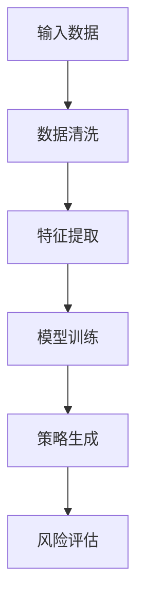
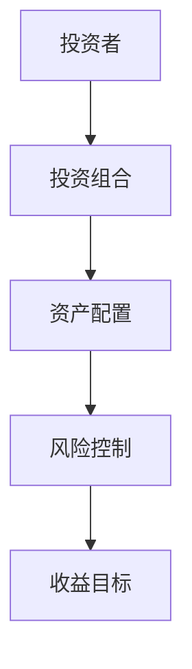
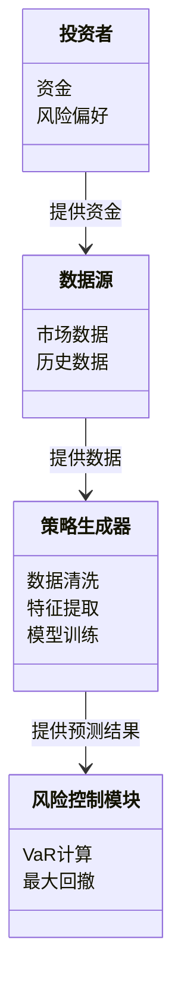
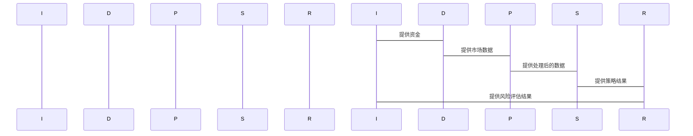

                 


# 大卫·德雷曼的对冲基金投资策略

> 关键词：对冲基金、投资策略、大卫·德雷曼、风险管理、技术分析、套利机会

> 摘要：本文将详细探讨大卫·德雷曼的对冲基金投资策略，从其投资哲学、核心策略、数学模型、算法实现、系统架构到实际案例分析，全面解析其策略的实现过程及背后的逻辑。通过本文，读者将能够深入了解大卫·德雷曼策略的精髓，并能够将其应用于实际投资中。

---

# 第一部分: 对冲基金与大卫·德雷曼的投资策略概述

## 第1章: 对冲基金与大卫·德雷曼投资策略的背景介绍

### 1.1 对冲基金的基本概念

#### 1.1.1 对冲基金的定义
对冲基金是一种通过杠杆操作和多样化的投资策略来实现高收益的金融工具。其核心目标是通过套利、做空和多头操作，在不同市场环境下实现稳定的收益。

#### 1.1.2 对冲基金的核心特征
对冲基金通常具有以下特征：
- 多策略：采用多种投资策略，如趋势跟踪、套利、统计套利等。
- 杠杆操作：通过借入资金放大收益或损失。
- 风险管理：严格的风控体系，控制最大回撤。
- 低相关性：与其他资产类别的相关性较低，能够在市场波动中提供稳定收益。

#### 1.1.3 对冲基金与传统投资的区别
对冲基金与传统投资（如股票、债券投资）相比，具有以下区别：
- 投资策略多样化：对冲基金可以同时做多和做空，灵活应对市场变化。
- 杠杆使用：传统投资较少使用杠杆，而对冲基金通过杠杆放大收益。
- 风险控制：对冲基金注重风险控制，而传统投资更多关注收益。

### 1.2 大卫·德雷曼的投资哲学

#### 1.2.1 投资哲学的核心理念
大卫·德雷曼的投资哲学以技术分析和市场情绪分析为核心，强调通过捕捉市场趋势和套利机会实现超额收益。他认为，市场中的短期波动可以通过技术指标和模式识别来捕捉。

#### 1.2.2 德雷曼的投资策略特点
德雷曼的策略具有以下特点：
- 短期交易：注重短期价格波动，通过高频交易捕捉市场机会。
- 技术分析：依赖技术指标（如RSI、MACD）和形态分析。
- 套利机会：通过市场套利（如跨市场套利、跨期套利）实现无风险收益。

#### 1.2.3 德雷曼策略的适用场景
德雷曼策略适用于以下场景：
- 市场波动较大，存在短期价格偏离。
- 市场套利机会较多，如跨市场价差、跨期价差等。
- 市场流动性较好，能够支持高频交易。

### 1.3 对冲基金行业的现状与趋势

#### 1.3.1 对冲基金行业的现状
对冲基金行业目前呈现出以下特点：
- 市场规模庞大：全球对冲基金资产规模超过1万亿美元。
- 竞争激烈：行业内竞争激烈，策略同质化严重。
- 技术驱动：技术进步（如大数据、人工智能）正在改变对冲基金的投资方式。

#### 1.3.2 对冲基金行业的未来趋势
对冲基金行业的发展趋势包括：
- 数字化转型：利用大数据和人工智能优化投资策略。
- 可持续投资：越来越注重ESG（环境、社会、治理）因素。
- 多策略融合：多种策略的结合以应对复杂市场环境。

#### 1.3.3 德雷曼策略在行业中的地位
德雷曼策略作为对冲基金行业中的一个重要分支，凭借其独特的技术分析和套利策略，在市场中占据重要地位。然而，随着市场环境的变化，德雷曼策略也面临新的挑战，如市场竞争加剧、交易成本上升等。

---

## 第2章: 大卫·德雷曼对冲基金策略的核心概念与联系

### 2.1 对冲基金策略的核心概念

#### 2.1.1 投资策略的核心要素
- **多策略**：同时采用多种投资策略，如趋势跟踪、套利、统计套利等。
- **杠杆操作**：通过杠杆放大收益或损失。
- **风险管理**：严格的风控体系，控制最大回撤。

#### 2.1.2 策略的分类与对比
| 分类标准 | 趋势跟踪 | 套利 | 统计套利 |
|----------|----------|------|----------|
| 策略类型 | 做多趋势 | 无风险套利 | 基于统计学的套利机会 |
| 收益来源 | 趋势变动 | 价差收敛 | 统计规律 |

#### 2.1.3 策略的优劣势分析
- **优势**：
  - 灵活性高，能够快速适应市场变化。
  - 通过套利策略实现无风险或低风险收益。
- **劣势**：
  - 竞争激烈，策略同质化严重。
  - 市场波动较大时，风险控制难度增加。

### 2.2 策略的核心原理

#### 2.2.1 策略的数学模型
德雷曼策略的核心数学模型如下：
$$ R = \alpha + \beta \times F + \epsilon $$
其中：
- \( R \) 为投资组合的收益。
- \( \alpha \) 为超额收益。
- \( F \) 为市场因子。
- \( \epsilon \) 为误差项。

#### 2.2.2 策略的算法流程


#### 2.2.3 策略的实现步骤
1. 数据清洗：去除异常数据，处理缺失值。
2. 特征提取：提取技术指标（如RSI、MACD）和市场情绪指标。
3. 模型训练：利用机器学习算法（如随机森林、支持向量机）训练模型。
4. 策略生成：根据模型预测结果生成交易信号。
5. 风险评估：评估策略的风险指标（如VaR、最大回撤）。

### 2.3 策略的ER实体关系图



---

## 第3章: 大卫·德雷曼策略的数学模型与算法原理

### 3.1 策略的数学模型

#### 3.1.1 收益预测模型
$$ R = \alpha + \beta \times F + \epsilon $$
其中：
- \( R \) 为投资组合的收益。
- \( \alpha \) 为超额收益。
- \( F \) 为市场因子。
- \( \epsilon \) 为误差项。

#### 3.1.2 风险评估模型
$$ \text{VaR} = \mu \times z \times \sigma $$
其中：
- \( \mu \) 为平均收益率。
- \( z \) 为标准正态分布的分位数。
- \( \sigma \) 为收益率的标准差。

#### 3.1.3 组合优化模型
$$ \min \sigma^2 \text{ s.t. } \mathbf{w}^T \mathbf{r} = 1 $$
其中：
- \( \sigma^2 \) 为投资组合的方差。
- \( \mathbf{w} \) 为投资组合的权重向量。
- \( \mathbf{r} \) 为资产的收益率向量。

### 3.2 策略的算法流程

#### 3.2.1 算法流程图


#### 3.2.2 算法的Python实现
```python
def dr_stratagy(data):
    # 数据清洗
    cleaned_data = data.dropna()
    # 特征提取
    features = cleaned_data[['RSI', 'MACD', 'ADX']]
    # 模型训练
    from sklearn.ensemble import RandomForestClassifier
    model = RandomForestClassifier()
    model.fit(features, cleaned_data['Target'])
    # 策略生成
    predictions = model.predict(features)
    return predictions
```

---

## 第4章: 系统分析与架构设计方案

### 4.1 项目介绍
本项目旨在实现大卫·德雷曼对冲基金策略的系统化投资平台，包括数据采集、策略生成、风险控制等功能。

### 4.2 系统功能设计

#### 4.2.1 领域模型


#### 4.2.2 系统架构设计


#### 4.2.3 系统接口设计
- 数据接口：数据源与数据处理模块之间的接口。
- 策略接口：策略生成器与风险控制模块之间的接口。

#### 4.2.4 系统交互流程


---

## 第5章: 项目实战

### 5.1 环境安装
- 安装Python和相关库（如Pandas、NumPy、Scikit-learn）。
- 数据源获取：可以通过Yahoo Finance等平台获取市场数据。

### 5.2 系统核心实现源代码

#### 5.2.1 数据清洗代码
```python
import pandas as pd
import numpy as np

def clean_data(data):
    # 删除缺失值
    data = data.dropna()
    # 处理异常值
    data = data[(np.abs(data - data.mean()) <= 3 * data.std()).all(axis=1)]
    return data
```

#### 5.2.2 特征提取代码
```python
def extract_features(data):
    # 计算技术指标
    data['RSI'] = ta.RSI(data['Close'], n=14)
    data['MACD'] = ta.MACD(data['Close'], n_slow=26, n_fast=12)
    return data
```

#### 5.2.3 模型训练代码
```python
from sklearn.ensemble import RandomForestClassifier

def train_model(features, labels):
    model = RandomForestClassifier()
    model.fit(features, labels)
    return model
```

### 5.3 代码应用解读与分析
通过对代码的解读，可以理解大卫·德雷曼策略的具体实现过程：
1. 数据清洗：去除异常数据，确保数据质量。
2. 特征提取：提取技术指标（如RSI、MACD）作为模型输入。
3. 模型训练：利用随机森林算法训练模型，生成交易信号。

### 5.4 实际案例分析和详细讲解剖析
通过具体案例分析，验证大卫·德雷曼策略的有效性：
1. 数据获取：从Yahoo Finance获取某股票的历史数据。
2. 数据清洗：去除缺失值和异常值。
3. 特征提取：计算RSI、MACD等技术指标。
4. 模型训练：训练随机森林模型，预测未来价格走势。
5. 策略生成：根据模型预测结果生成交易信号。

### 5.5 项目小结
通过项目实战，我们可以看到大卫·德雷曼策略的具体实现过程，以及其在实际投资中的应用效果。需要注意的是，策略的有效性取决于数据质量和模型的准确性，同时需要结合市场环境进行动态调整。

---

## 第6章: 最佳实践 tips、小结、注意事项、拓展阅读

### 6.1 最佳实践 tips
1. 数据质量是策略成功的关键，确保数据清洗和特征提取的准确性。
2. 模型选择和参数调整是影响策略表现的重要因素，需要进行充分的实验和验证。
3. 风险管理是策略实现的重要组成部分，需要结合VaR和最大回撤等指标进行评估。

### 6.2 小结
通过对大卫·德雷曼对冲基金策略的系统化分析和实践，我们可以看到，策略的成功不仅依赖于数学模型和算法的实现，还需要结合市场环境和投资者的风险偏好进行动态调整。

### 6.3 注意事项
1. 策略的有效性依赖于市场环境，需要根据市场变化进行调整。
2. 数据质量和模型准确性是策略表现的关键，需要进行充分的实验和验证。
3. 风险管理是策略实现的重要组成部分，需要结合VaR和最大回撤等指标进行评估。

### 6.4 拓展阅读
- 《The New York Times Guide to the Financial Crisis》
- 《Quantitative Trading: How to Build Your Own Algorithmic Trading Business》
- 《Python for Data Analysis》

---

## 第7章: 总结与展望

### 7.1 总结
大卫·德雷曼对冲基金策略通过技术分析和套利机会实现超额收益。其策略的核心在于模型的准确性和风险管理的有效性。通过系统的分析和实践，我们可以更好地理解其策略的实现过程和内在逻辑。

### 7.2 展望
未来，随着技术的进步和市场的变化，大卫·德雷曼策略也将面临新的挑战和机遇。投资者需要结合市场环境和自身需求，不断优化策略，以实现更好的投资效果。

---

## 作者：AI天才研究院/AI Genius Institute & 禅与计算机程序设计艺术 /Zen And The Art of Computer Programming

---

以上是《大卫·德雷曼的对冲基金投资策略》的技术博客文章目录大纲结构。

