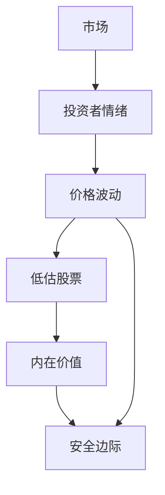
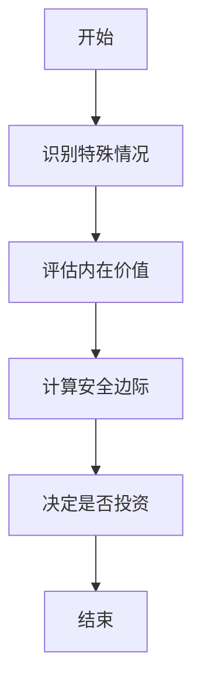
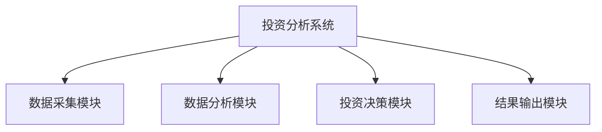

                 


# 大卫·德雷曼的特殊情况价值投资

## 关键词：价值投资，大卫·德雷曼，特殊情况，逆向投资，投资策略

## 摘要：  
大卫·德雷曼的特殊情况价值投资是一种专注于在市场恐慌或不理性时，寻找被严重低估的股票的投资策略。本文将详细分析这一策略的核心理念、算法原理、数学模型、系统架构以及实际案例，帮助读者理解如何在特殊情况下进行有效的价值投资。

---

## 第一部分：背景介绍

### 第1章：价值投资的起源与德雷曼的特殊策略

#### 1.1 价值投资的起源  
价值投资是一种长期投资策略，强调购买价格低于其内在价值的资产。这一理念起源于20世纪初，由本杰明·格雷厄姆和大卫·多德提出，强调安全边际和对公司基本面的深入分析。

#### 1.2 大卫·德雷曼的特殊策略  
大卫·德雷曼是价值投资领域的重量级人物，他专注于在市场恐慌时寻找被低估的股票。他的特殊策略包括以下几点：  
- **逆向思维**：在市场下跌时寻找机会，而非趋同于市场情绪。  
- **安全边际**：购买价格远低于内在价值的股票，以降低风险。  
- **特殊情况分析**：专注于那些因短期市场波动而被低估的企业。  

#### 1.3 特殊情况的定义与外延  
特殊情况是指那些因市场非理性行为或短期事件导致股价严重偏离其内在价值的情况。这些情况通常涉及：  
- **企业困境**：公司因财务问题或管理不善导致股价暴跌。  
- **行业衰退**：整个行业因经济周期或技术变革而受到冲击。  
- **市场恐慌**：投资者因恐慌抛售股票，导致股价低于实际价值。  

---

## 第二部分：核心概念与联系

### 第2章：德雷曼特殊策略的核心概念

#### 2.1 德雷曼特殊策略的原理  
德雷曼的策略基于以下核心原理：  
- **市场非理性**：市场参与者的行为往往是非理性的，尤其是在恐慌或狂热时。  
- **价格与价值的分离**：短期价格波动与长期价值无关，投资者应关注后者。  
- **逆向投资的优势**：在市场底部买入，能够在市场复苏时获得超额收益。  

#### 2.2 核心概念的属性对比  
以下表格对比了德雷曼策略与传统价值投资的核心属性：  

| 属性                | 德雷曼策略                  | 传统价值投资              |
|---------------------|-----------------------------|---------------------------|
| 投资时机          | 逆向投资，市场恐慌时买入    | 等待价格合理时买入        |
| 风险承受能力      | 高风险承受，愿意在恐慌中买入| 风险中性，注重安全边际     |
| 投资期限          | 长期，等待市场复苏          | 长期，逐步建仓             |
| 选股标准          | 侧重特殊情况下的低估股     | 侧重基本面稳健的股票      |

#### 2.3 实体关系图  
以下使用Mermaid绘制的实体关系图展示了德雷曼策略的核心要素：  



---

## 第三部分：算法原理讲解

### 第3章：德雷曼特殊策略的评估模型

#### 3.1 评估模型的流程  
以下使用Mermaid绘制的流程图展示了德雷曼策略的评估模型：  



#### 3.2 算法原理的数学模型  
德雷曼策略的核心是计算股票的内在价值。以下是一个简化的贴现现金流模型：  

$$V = \frac{CF}{r - g}$$  

其中，  
- \( CF \) 是未来现金流（以现值计算）。  
- \( r \) 是折现率。  
- \( g \) 是现金流增长率。  

#### 3.3 算法原理的详细讲解  
以下使用Python代码实现上述模型的简化版本：  

```python
def calculate_intrinsic_value(CF, r, g):
    return CF / (r - g)

# 示例计算
CF = 1000  # 未来现金流
r = 0.10    # 折现率
g = 0.05    # 增长率

intrinsic_value = calculate_intrinsic_value(CF, r, g)
print(f"内在价值为：{intrinsic_value:.2f}")
```

---

## 第四部分：数学模型与公式

### 第4章：德雷曼策略中的数学模型

#### 4.1 内在价值的计算公式  
$$V = \frac{CF}{r - g}$$  

例如，假设某公司未来现金流为 $1000，折现率为10%（0.10），增长率5%（0.05），则内在价值为：  

$$V = \frac{1000}{0.10 - 0.05} = 20000$$  

#### 4.2 安全边际的计算公式  
$$\text{安全边际} = \text{内在价值} - \text{市场价格}$$  

如果市场价格低于内在价值的一定比例（如50%），则认为存在足够的安全边际。  

---

## 第五部分：系统分析与架构设计

### 第5章：德雷曼策略的系统架构

#### 5.1 系统架构设计  
以下使用Mermaid绘制的架构图展示了投资分析系统的模块结构：  



#### 5.2 系统功能设计  
- **数据采集模块**：收集市场数据，包括股价、财务指标等。  
- **数据分析模块**：计算内在价值和安全边际。  
- **投资决策模块**：根据模型判断是否投资。  
- **结果输出模块**：生成投资建议报告。  

---

## 第六部分：项目实战

### 第6章：德雷曼策略的项目实战

#### 6.1 环境安装  
- 需要安装Python和相关库（如Pandas、NumPy）。  

#### 6.2 核心实现代码  
以下代码实现了一个简单的内在价值计算工具：  

```python
import pandas as pd

def calculate_intrinsic_value(fcf, wacc, growth_rate):
    return fcf / (wacc - growth_rate)

# 示例数据
data = {
    '公司': ['公司A', '公司B'],
    'FCF': [1000, 1500],
    'WACC': [0.10, 0.12],
    '增长率': [0.05, 0.03]
}

df = pd.DataFrame(data)
df['内在价值'] = df.apply(lambda x: calculate_intrinsic_value(x['FCF'], x['WACC'], x['增长率']), axis=1)

print(df)
```

#### 6.3 案例分析  
以某公司为例，计算其内在价值并判断是否存在安全边际。  

---

## 第七部分：最佳实践

### 第7章：德雷曼策略的最佳实践

#### 7.1 最佳实践总结  
- 逆向思维是关键，市场恐慌时寻找机会。  
- 严格计算内在价值，确保安全边际。  
- 长期持有，避免频繁交易。  

#### 7.2 注意事项  
- 风险承受能力有限的投资者应谨慎使用此策略。  
- 计算模型假设需合理，避免过于乐观的假设。  

#### 7.3 未来展望  
随着人工智能和大数据技术的发展，德雷曼策略将更加精准和高效。

---

## 结语  
大卫·德雷曼的特殊情况价值投资是一种需要耐心、纪律和深入分析的策略。通过本文的详细讲解，读者可以更好地理解并应用这一策略，实现长期的投资目标。

---

## 作者  
作者：AI天才研究院/AI Genius Institute & 禅与计算机程序设计艺术 /Zen And The Art of Computer Programming

