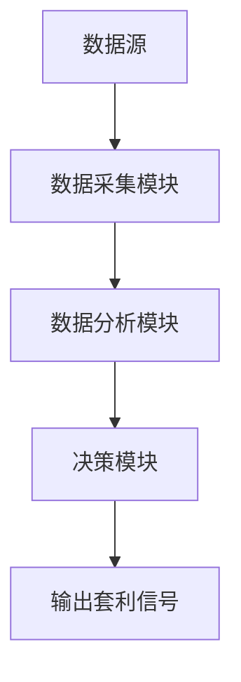
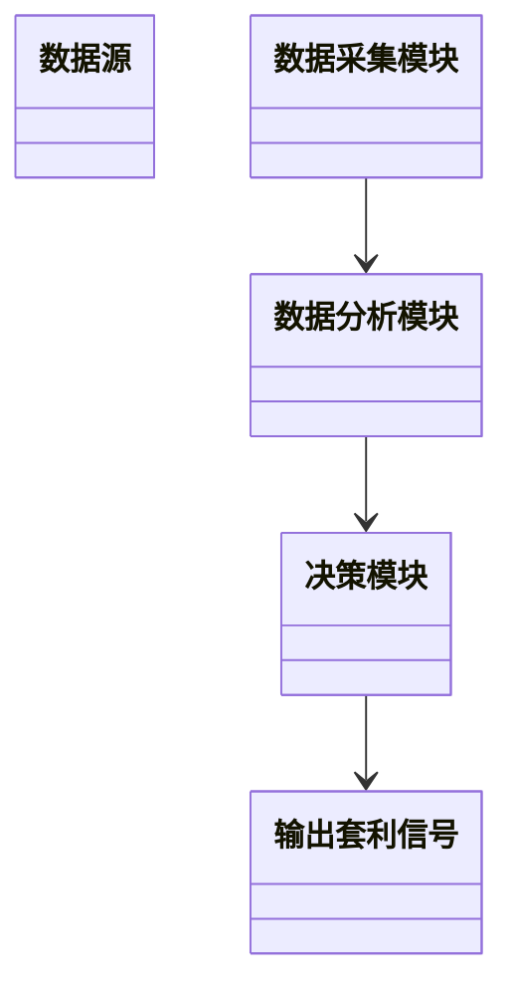

                 


# 大卫·德雷曼的资产负债表套利：利用会计差异创造价值

> 关键词：大卫·德雷曼，资产负债表套利，会计差异，价值创造，财务分析

> 摘要：大卫·德雷曼的资产负债表套利是一种通过识别和利用会计差异来创造投资价值的方法。本文详细介绍了资产负债表套利的核心概念、数学模型、系统架构及实战案例，帮助读者理解如何通过会计差异进行套利，并在实际投资中应用这一方法。

---

## 第1章：资产负债表套利的定义与背景

### 1.1 资产负债表套利的定义

资产负债表套利是一种通过分析和利用企业在资产负债表中的会计差异，寻找市场估值与实际价值之间的偏差，从而实现投资收益的方法。这种方法的核心在于识别会计政策、估计和信息披露上的差异，并利用这些差异在市场中进行套利。

### 1.2 会计差异的原理

会计差异主要来源于以下几个方面：
- **会计政策差异**：不同企业在相同交易中的会计处理可能不同，例如收入确认时点的选择。
- **会计估计差异**：管理层对资产减值、折旧等的估计可能影响财务报表。
- **信息披露差异**：企业对某些交易或事项的披露可能存在不一致或不透明的情况。

### 1.3 资产负债表套利的背景与现状

在金融市场中，会计差异是普遍存在的现象。企业为了迎合市场或监管需求，可能通过调整会计政策或估计来影响财务报表的数值。这种差异为套利者提供了机会，尤其是在市场对某些公司或行业估值不准确的情况下。

---

## 第2章：资产负债表套利的核心概念

### 2.1 会计差异的分类与特征

会计差异可以分为以下几类：
- **横向比较**：不同公司之间的会计差异。
- **纵向比较**：同一公司不同期间的会计差异。
- **行业差异**：不同行业之间的会计差异。

下表展示了会计差异的主要分类和特征：

| 类型       | 特征                           |
|------------|--------------------------------|
| 横向比较   | 不同公司之间的差异             |
| 纵向比较   | 同一公司不同期间的差异         |
| 行业差异   | 不同行业之间的差异             |

### 2.2 资产负债表套利的原理

套利的原理在于识别会计差异并利用市场对这些差异的定价偏差。通过分析资产负债表中的数据，套利者可以找到那些被市场低估或高估的公司，并通过买卖这些公司的股票或债券来获利。

**步骤分析：**
1. **识别会计差异**：通过比较不同公司的财务数据，发现会计政策或估计上的差异。
2. **量化差异**：将会计差异转化为具体的数值，例如通过计算市净率或市盈率的差异。
3. **套利机会筛选**：根据差异的大小和持续性，筛选出具有套利潜力的公司。

### 2.3 套利与价值创造的联系

套利通过利用会计差异，可以为投资者创造价值。例如，当市场对某一公司的估值低于其实际价值时，套利者可以买入该公司的股票，待市场重新定价后卖出获利。

---

## 第3章：资产负债表套利的数学模型与算法

### 3.1 套利的数学模型

#### 3.1.1 市净率模型

市净率（P/B）是衡量公司价值的重要指标之一。套利者可以通过比较不同公司的市净率，找到被市场低估的公司。

$$ P/B = \frac{\text{市场价}}{\text{每股净资产}} $$

#### 3.1.2 市盈率模型

市盈率（P/E）是另一个常用的估值指标。套利者可以通过比较市盈率与行业平均水平的差异，找到被市场低估的公司。

$$ P/E = \frac{\text{市场价}}{\text{每股收益}} $$

#### 3.1.3 企业价值模型

企业价值模型通过将公司整体价值与其账面价值进行比较，识别会计差异。

$$ \text{企业价值} = \text{股权价值} + \text{债务价值} $$

### 3.2 会计差异的量化方法

#### 3.2.1 差异分析法

差异分析法通过比较不同公司的财务数据，识别会计差异。

$$ \text{差异} = \text{公司A的数值} - \text{公司B的数值} $$

#### 3.2.2 比较分析法

比较分析法通过将公司的财务数据与行业平均水平进行比较，识别异常值。

$$ \text{行业平均值} = \frac{\sum \text{行业公司数值}}{\text{行业公司数量}} $$

### 3.3 套利算法的实现

#### 3.3.1 数据预处理

数据预处理是套利算法的关键步骤，包括数据清洗和标准化。

```python
# 数据清洗
data = data.dropna()
data = data.replace({np.nan: 0})
```

#### 3.3.2 差异识别

通过计算不同公司的财务数据差异，识别会计差异。

```python
# 计算差异
diff = data['公司A'] - data['公司B']
```

#### 3.3.3 套利机会筛选

根据差异的大小和方向，筛选出具有套利潜力的公司。

```python
# 筛选机会
opportunities = diff[diff > threshold]
```

---

## 第4章：资产负债表套利的系统分析与架构设计

### 4.1 系统分析

#### 4.1.1 问题场景介绍

套利系统需要处理大量财务数据，识别会计差异，并生成套利信号。

#### 4.1.2 项目目标与范围

- **目标**：识别会计差异，生成套利机会。
- **范围**：覆盖多个行业和公司，支持多种财务指标分析。

#### 4.1.3 系统功能设计

- 数据采集模块：从财务报表中提取数据。
- 数据分析模块：识别会计差异。
- 决策模块：生成套利信号。

### 4.2 系统架构设计

#### 4.2.1 数据流图



#### 4.2.2 模块划分



---

## 第5章：资产负债表套利的项目实战

### 5.1 环境安装与数据准备

#### 5.1.1 数据源选择

选择具有代表性的行业和公司进行分析。

#### 5.1.2 数据清洗与预处理

```python
import pandas as pd
import numpy as np

data = pd.read_csv('financial_data.csv')
data = data.dropna()
data['净利润率'] = data['净利润'] / data['收入']
```

#### 5.1.3 工具安装与配置

安装必要的Python库，如Pandas、NumPy等。

### 5.2 核心实现

#### 5.2.1 会计差异识别

```python
diff = data['公司A'] - data['公司B']
```

#### 5.2.2 套利机会筛选

```python
threshold = 0.2
opportunities = diff[diff > threshold]
```

#### 5.2.3 价值评估模型

```python
data['市净率'] = data['股价'] / data['每股净资产']
data['市盈率'] = data['股价'] / data['每股收益']
```

### 5.3 实际案例分析

以某行业为例，分析两家公司的财务数据，识别会计差异并计算套利机会。

### 5.4 项目小结

通过实际案例分析，验证套利方法的有效性，并总结经验教训。

---

## 第6章：总结与展望

### 6.1 总结

资产负债表套利是一种通过识别和利用会计差异创造价值的方法。本文详细介绍了套利的核心概念、数学模型、系统架构及实战案例，为读者提供了全面的指导。

### 6.2 注意事项

- 会计差异的识别需要结合具体行业和公司情况。
- 套利机会的筛选应考虑市场风险和流动性。

### 6.3 未来展望

随着技术的进步，套利方法将更加智能化和自动化。未来的研究可以进一步探索大数据和人工智能在套利中的应用。

---

作者：AI天才研究院/AI Genius Institute & 禅与计算机程序设计艺术 /Zen And The Art of Computer Programming

