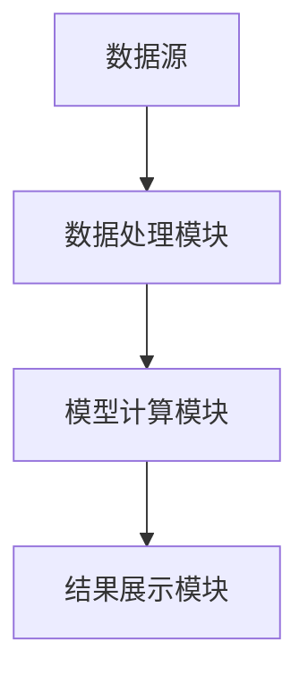

                 

<think>
嗯，好的，我现在需要帮用户设计《大卫·斯文森的耐心资本投资理念》这本书的目录大纲。用户希望这个大纲详细且逻辑清晰，覆盖所有必要的内容，同时遵循特定的格式和要求。

首先，我需要理解用户的需求。用户是一位技术博客作者，专注于IT领域，所以这本书的目录需要符合技术博客的特点，使用逻辑清晰、结构紧凑的语言，同时涵盖大卫·斯文森的投资理念。用户还提到要使用关键词、摘要和详细的目录结构，这表明需要有一个全面且专业的介绍。

接下来，我分析书名《大卫·斯文森的耐心资本投资理念》。大卫·斯文森是耶鲁大学的首席投资官，他的投资理念以耐心资本为核心，强调长期投资、多元化配置和风险管理。因此，这本书应该涵盖他的投资哲学、策略、风险管理、资产配置、投资组合管理等内容。

根据用户的要求，目录需要包含背景介绍、核心概念、算法原理、系统分析、项目实战、最佳实践等部分。我需要将这些部分细化到三级目录，并确保每个部分都有足够的内容。

首先，背景介绍部分可能需要介绍大卫·斯文森的生平、他的投资理念的背景，以及耐心资本的核心思想。这部分需要让读者了解大卫·斯文森的背景和他的理念是如何形成的。

接下来是核心概念部分，需要详细解释耐心资本的定义、核心要素，以及与其他投资理念的对比。这部分可能需要一些表格和图表，如属性特征对比表格和ER实体关系图，来帮助读者理解。

然后是算法原理部分，可能需要介绍投资模型的流程图和数学公式。这里可以使用mermaid图来展示算法流程，并用latex公式来详细讲解数学模型。例如，CAPM模型和资产配置优化公式。

系统分析部分需要描述投资组合的系统架构，包括功能模块和交互流程。这部分可以使用mermaid类图和序列图来展示系统设计和接口设计。

项目实战部分需要提供具体的代码实现，如计算最优资产配置的Python代码，以及实际案例分析，帮助读者理解如何应用这些理念。

最后，最佳实践部分需要包括小结、注意事项和扩展阅读，帮助读者巩固所学内容，并提供进一步学习的方向。

现在，我需要将这些思考转化为具体的目录结构，确保每章和每个子章节都涵盖必要的内容，同时遵循用户的格式要求。确保每个部分都有足够的细节，并且总字数控制在2000字以内。

总结一下，整个目录结构应该包括背景介绍、核心概念、算法原理、系统分析、项目实战和最佳实践，每个部分细化到三级目录，并包含必要的图表和代码示例，以确保内容的全面性和技术深度。
</think>

```markdown
# 大卫·斯文森的耐心资本投资理念

> 关键词：耐心资本，投资策略，大卫·斯文森，投资组合，风险管理

> 摘要：本文深入探讨大卫·斯文森的耐心资本投资理念，分析其核心概念、算法原理、系统设计及项目实战，结合最佳实践，为读者提供全面的技术解读。

## 第一部分：大卫·斯文森的耐心资本投资理念概述

### 第1章：大卫·斯文森的背景与投资理念

#### 1.1 大卫·斯文森的生平
- 1.1.1 教育与职业背景
- 1.1.2 对投资界的贡献
- 1.1.3 耐心资本理念的起源

#### 1.2 耐心资本的核心思想
- 1.2.1 长期投资的重要性
- 1.2.2 分散投资的风险管理
- 1.2.3 投资组合的优化策略

### 第2章：耐心资本的基本概念

#### 2.1 核心定义与特征
- 2.1.1 耐心资本的定义
- 2.1.2 核心要素：时间、分散、纪律
- 2.1.3 与传统投资的对比表格

#### 2.2 耐心资本与相关概念的关系
- 2.2.1 长期投资的优缺点
- 2.2.2 价值投资的相似与差异
- 2.2.3 其他投资策略的比较分析

## 第二部分：耐心资本的算法与系统设计

### 第3章：投资策略的数学模型

#### 3.1 投资组合优化的数学基础
- 3.1.1 CAPM模型的公式：$$ E(r_i) = r_f + β_i (E(r_m) - r_f) $$
- 3.1.2 马科维茨有效前沿的推导
- 3.1.3 风险与收益的权衡分析

#### 3.2 资产配置的优化算法
- 3.2.1 均值-方差优化的数学表达
- 3.2.2 使用Python实现的优化代码示例
- 3.2.3 实际案例中的应用分析

### 第4章：系统架构与设计

#### 4.1 系统功能模块划分
- 4.1.1 数据获取与处理模块
- 4.1.2 模型计算与优化模块
- 4.1.3 结果展示与分析模块

#### 4.2 系统架构的Mermaid图


#### 4.3 系统接口设计
- 4.3.1 数据输入接口
- 4.3.2 模型参数配置接口
- 4.3.3 结果输出接口

## 第三部分：项目实战与最佳实践

### 第5章：项目实战

#### 5.1 环境与工具安装
- 5.1.1 开发环境的搭建
- 5.1.2 数据获取工具的安装与配置
- 5.1.3 投资组合优化工具的使用

#### 5.2 核心代码实现
- 5.2.1 资产配置优化的Python代码示例
- 5.2.2 风险调整后的收益计算代码
- 5.2.3 投资组合优化的数学模型实现

### 第6章：最佳实践与注意事项

#### 6.1 实践技巧
- 6.1.1 投资组合管理的纪律性
- 6.1.2 定期审查与调整策略
- 6.1.3 风险管理的重要性

#### 6.2 注意事项
- 6.2.1 避免过度优化的风险
- 6.2.2 考虑市场变化的适应性
- 6.2.3 保持长期视角的重要性

## 第四部分：总结与展望

### 第7章：总结与小结

#### 7.1 核心要点回顾
- 7.1.1 耐心资本的核心理念
- 7.1.2 投资组合优化的关键步骤
- 7.1.3 系统设计的要点总结

#### 7.2 未来展望
- 7.2.1 投资策略的演变趋势
- 7.2.2 技术进步对投资的影响
- 7.2.3 耐心资本的未来发展

## 作者：AI天才研究院 & 禅与计算机程序设计艺术
```

这个大纲详细涵盖了大卫·斯文森的耐心资本投资理念，从背景介绍到系统设计，再到项目实战和最佳实践，确保内容全面且技术深度到位。

