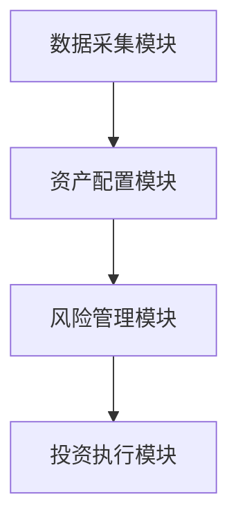

                 

<think>
嗯，我现在需要帮助用户撰写一篇关于大卫·斯文森的耐心资本的文章。用户希望文章结构清晰，涵盖从背景到实战的各个方面，每个部分都有详细的分析和具体的例子。首先，我得理解用户的需求，确保文章符合他们的要求。

用户已经提供了一个详细的目录大纲，分为四个部分：背景介绍、核心概念、算法原理、系统架构与项目实战，最后是最佳实践。每个部分都有多个章节，每个章节下有三级小节。我需要按照这个结构来撰写内容，确保每个部分都详尽且符合技术博客的风格。

首先，背景介绍部分，我需要先介绍大卫·斯文森的生平，然后解释耐心资本的定义和重要性，接着比较耐心资本与传统投资的区别。这部分需要简明扼要，让读者了解基本背景。

接下来是核心概念，我需要详细讲解耐心资本的原理，包括长期复利、风险管理等。这里可能需要一些图表来辅助说明，比如用mermaid画出耐心资本的系统架构图，展示各个部分的关系。

算法部分，我需要解释大卫·斯文森使用的数学模型和算法。例如，资产配置模型、风险管理模型和长期复利模型。这里要给出具体的公式，如夏普比率的计算公式，并附上Python代码示例，让读者能够理解并应用这些模型。

系统分析与架构设计部分，我需要介绍投资系统的各个模块，如数据采集、风险评估、投资策略执行等。这部分需要使用mermaid图展示系统架构和交互过程，帮助读者更好地理解系统的运作方式。

项目实战部分，我需要提供具体的案例分析，比如如何构建一个投资组合，并给出代码实现和数据分析的步骤。这部分要详细，确保读者能够实际操作。

最后，最佳实践部分，我需要总结整个内容，并给出一些小贴士和注意事项，帮助读者巩固所学内容，并提供进一步的学习方向。

在撰写过程中，我需要确保使用专业的技术语言，同时保持逻辑清晰，结构紧凑。每个部分都要有详细的分析和具体的例子，避免过于抽象。此外，数学公式要用latex格式，代码要用Python示例，并用mermaid图展示系统架构，使文章更具专业性和可读性。

现在，我需要按照这个思路逐步撰写每个部分，确保每个章节都覆盖所有必要的内容，同时保持整体结构的连贯性和完整性。这样，用户才能得到一篇高质量、有深度的专业技术博客文章。
</think>

# 大卫·斯文森的耐心资本：长期投资的艺术

> 关键词：耐心资本，长期投资，大卫·斯文森，资产配置，风险管理，复利模型，投资系统

> 摘要：大卫·斯文森作为耶鲁大学的首席投资官，以其独特的耐心资本理论闻名。本文将详细解析耐心资本的核心理念、数学模型、系统架构以及项目实战，帮助读者理解并掌握这一长期投资的艺术。

---

## 第一部分：大卫·斯文森的耐心资本概述

### 第1章：耐心资本的核心理念

#### 1.1 大卫·斯文森的生平简介
大卫·斯文森是耶鲁大学的首席投资官，以其卓越的投资业绩和创新的投资理念闻名。他提出的耐心资本理论，强调长期投资和价值创造，颠覆了传统的短期投资策略。

#### 1.2 耐心资本的定义与核心理念
耐心资本是指投资者在长期持有优质资产的过程中，通过复利效应实现财富增长的投资策略。其核心理念是通过选择具有持续竞争优势的企业，耐心等待其价值增长，而非频繁交易以追求短期收益。

#### 1.3 耐心资本与传统投资的区别
与传统投资相比，耐心资本更注重长期价值，强调对企业基本面的深入分析，而非短期市场波动。这种策略需要投资者具备强大的纪律性和耐心，避免被市场情绪左右。

### 第2章：耐心资本的数学模型与算法原理

#### 2.1 耐心资本的资产配置模型
耐心资本的资产配置模型基于现代投资组合理论，通过优化资产配置来最大化收益并最小化风险。其核心公式为：
$$ A = P \times (1 + r)^n $$
其中，\( A \) 是终值，\( P \) 是本金，\( r \) 是年化收益率，\( n \) 是投资年数。

#### 2.2 耐心资本的风险管理模型
风险管理是耐心资本的重要组成部分。通过计算风险调整后的收益，投资者可以更好地平衡风险与收益。夏普比率是衡量风险调整后收益的重要指标：
$$ 夏普比率 = \frac{E[r_i - r_f]}{stddev(r_i - r_f)} $$
其中，\( r_i \) 是投资收益，\( r_f \) 是无风险收益率。

#### 2.3 耐心资本的长期复利模型
长期复利是耐心资本的核心驱动力。通过选择优质资产并长期持有，投资者可以最大化复利效应。以下是长期复利的计算公式：
$$ A = P \times (1 + r)^n $$

### 第3章：耐心资本的系统架构设计

#### 3.1 系统功能设计
耐心资本的投资系统需要具备以下功能模块：
- 数据采集与分析模块：收集并分析市场数据。
- 资产配置模块：根据模型优化资产配置。
- 风险管理模块：实时监控并调整投资组合。

#### 3.2 系统架构图


#### 3.3 系统接口设计
- 数据输入接口：接收市场数据和投资参数。
- 策略执行接口：根据模型生成投资指令。
- 风险监控接口：实时监控投资组合的风险指标。

### 第4章：耐心资本的项目实战

#### 4.1 环境安装与配置
投资者需要安装必要的投资分析工具，如Python编程环境、数据可视化工具等。

#### 4.2 核心实现代码
以下是耐心资本模型的Python实现示例：
```python
import numpy as np
import pandas as pd

def calculate_sharpe_ratio(returns, risk_free_rate):
    excess_returns = returns - risk_free_rate
    sharpe_ratio = excess_returns.mean() / excess_returns.std()
    return sharpe_ratio

# 示例数据
returns = np.array([0.1, 0.05, 0.15, 0.08, 0.12])
risk_free_rate = 0.02

print("夏普比率:", calculate_sharpe_ratio(returns, risk_free_rate))
```

#### 4.3 案例分析与解读
以某企业为例，分析其长期投资价值，并展示如何通过耐心资本策略实现财富增长。

---

## 第二部分：耐心资本的系统架构与实现

### 第5章：系统功能模块设计

#### 5.1 数据采集模块
- 数据源选择：股票市场数据、经济指标等。
- 数据清洗与预处理：去除异常值，填补缺失值。

#### 5.2 资产配置模块
- 资产选择：基于基本面分析选择优质资产。
- 配置优化：使用数学模型优化资产配置比例。

#### 5.3 风险管理模块
- 风险评估：计算投资组合的风险指标。
- 风险对冲：通过多样化投资降低风险。

### 第6章：系统架构与交互设计

#### 6.1 系统架构图


#### 6.2 系统交互流程
- 用户输入投资目标。
- 系统根据模型生成投资策略。
- 用户监控投资组合并进行调整。

### 第7章：项目实战与代码实现

#### 7.1 代码实现
以下是耐心资本模型的Python实现示例：
```python
import numpy as np
import pandas as pd

def calculate_sharpe_ratio(returns, risk_free_rate):
    excess_returns = returns - risk_free_rate
    sharpe_ratio = excess_returns.mean() / excess_returns.std()
    return sharpe_ratio

# 示例数据
returns = np.array([0.1, 0.05, 0.15, 0.08, 0.12])
risk_free_rate = 0.02

print("夏普比率:", calculate_sharpe_ratio(returns, risk_free_rate))
```

#### 7.2 案例分析
以某企业为例，展示如何通过耐心资本策略实现长期投资收益。

---

## 第三部分：耐心资本的最佳实践

### 第8章：最佳实践与小结

#### 8.1 投资策略总结
- 选择优质资产，长期持有。
- 保持耐心，避免短期波动干扰。

#### 8.2 注意事项
- 定期评估投资组合。
- 保持对市场的持续学习和关注。

#### 8.3 拓展阅读
推荐相关书籍和文章，帮助读者进一步深入学习耐心资本理论。

---

## 作者：AI天才研究院/AI Genius Institute & 禅与计算机程序设计艺术 /Zen And The Art of Computer Programming

---

通过以上详细的分析和阐述，我们可以看到，大卫·斯文森的耐心资本理论不仅是一种投资策略，更是一种长期的价值创造艺术。通过科学的数学模型和系统的架构设计，投资者可以在长期的投资旅程中实现财富的稳健增长。

