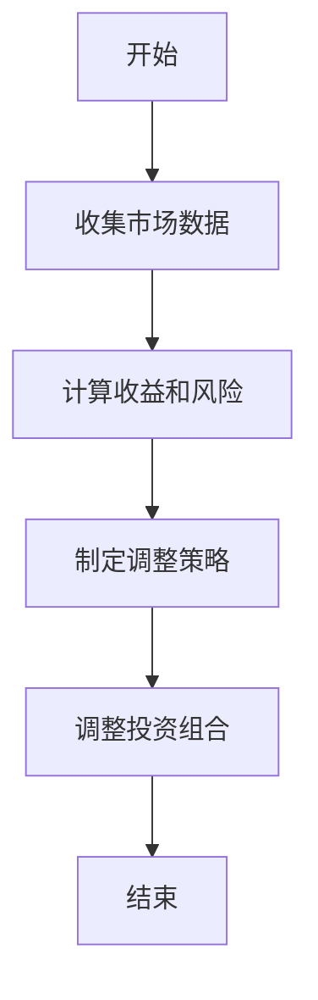
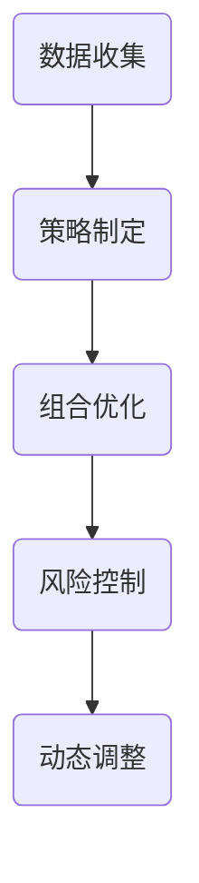
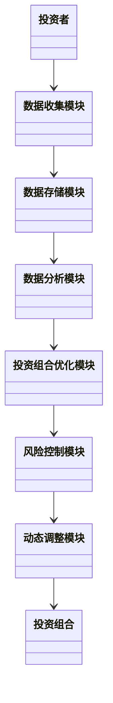
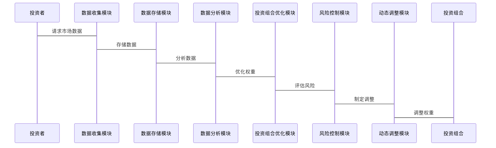

                 


# 大卫·艾伦·科恩的activist投资策略

## 关键词：activist投资策略, 大卫·艾伦·科恩, 投资组合管理, 风险控制, 动态调整

## 摘要：本文深入分析大卫·艾伦·科恩的activist投资策略，探讨其背景、核心原理、算法模型、系统架构及实际应用。通过详细的技术博客，揭示该策略在投资组合管理中的独特方法，及其在现代金融中的应用价值。

---

## 第1章: Activist投资策略的背景与核心概念

### 1.1 Activist投资策略的定义与背景

#### 1.1.1 投资策略的演进
投资策略从被动转向主动，投资者需根据市场变化调整策略。activist策略强调主动干预和动态调整，以应对市场波动。

#### 1.1.2 Activist投资策略的核心概念
- 价值发现：识别市场低估或高估的资产。
- 风险控制：通过多样化和实时监控降低风险。
- 动态调整：根据市场变化频繁调整投资组合。

#### 1.1.3 Activist投资策略的起源与发展
起源于20世纪70年代，大卫·艾伦·科恩的策略结合了技术分析和基本面分析，强调主动管理和快速反应。

### 1.2 Activist投资策略的核心要素

#### 1.2.1 投资目标的明确性
明确短期和长期目标，如收益最大化、风险最小化。

#### 1.2.2 投资策略的灵活性
策略需灵活调整，适应市场变化，避免僵化。

#### 1.2.3 投资组合的动态调整
定期审查和调整投资组合，根据市场变化优化配置。

### 1.3 Activist投资策略与传统投资策略的对比

#### 1.3.1 传统投资策略的特点
- 被动管理：遵循固定规则，较少调整。
- 长期持有：注重长期收益，忽视短期波动。

#### 1.3.2 Activist投资策略的独特性
- 主动干预：频繁调整投资组合。
- 高度灵活：根据市场变化快速反应。

#### 1.3.3 两种策略的优缺点对比
| 策略类型 | 优点 | 缺点 |
|----------|------|------|
| 传统策略 | 稳定性高 | 缺乏灵活性 |
| Activist | 灵活性高 | 风险控制难 |

### 1.4 Activist投资策略的适用场景

#### 1.4.1 不同市场环境下的策略选择
- 牛市：积极投资，增加风险资产。
- 熊市：谨慎调整，减少风险敞口。

#### 1.4.2 不同投资者类型的需求匹配
- 高风险承受能力的投资者适合Activist策略。

#### 1.4.3 Activist投资策略的边界与外延
明确策略的适用范围和限制，避免过度干预。

### 1.5 本章小结
Activist投资策略强调主动管理和动态调整，适用于市场波动较大时，但需谨慎控制风险。

---

## 第2章: Activist投资策略的核心原理

### 2.1 投资组合管理的数学模型

#### 2.1.1 投资组合的优化目标
最大化收益，同时最小化风险。

#### 2.1.2 投资组合的风险与收益平衡
通过夏普比率等指标衡量风险调整后的收益。

#### 2.1.3 投资组合的动态调整公式
$$ w_{t+1} = w_t + \alpha \cdot (r_t - \mu) $$
其中，$w$为权重，$\alpha$为调整因子，$r_t$为实际收益，$\mu$为预期收益。

### 2.2 Activist投资策略的算法原理

#### 2.2.1 基于价值发现的策略
通过技术分析和基本面分析识别被低估资产。

#### 2.2.2 基于风险控制的策略
使用VaR（在险价值）模型评估和管理风险。

#### 2.2.3 基于市场趋势的策略
利用动量效应，顺势而为。

### 2.3 Activist投资策略的数学模型

#### 2.3.1 投资组合的收益计算公式
$$ \text{收益} = \sum w_i \cdot r_i $$
其中，$w_i$为资产权重，$r_i$为资产收益。

#### 2.3.2 投资组合的风险评估公式
$$ \text{风险} = \sqrt{\sum w_i^2 \cdot \sigma_i^2} $$
其中，$\sigma_i$为资产收益的标准差。

#### 2.3.3 动态调整的数学模型
$$ \Delta w = \beta (r_{\text{实际}} - r_{\text{预期}}) $$
其中，$\beta$为敏感性系数。

### 2.4 Activist投资策略的实体关系图

```mermaid
er
    actor: 投资者
    class: 投资组合
    class: 市场数据
    class: 风险模型
    class: 调整策略

    投资者 --> 投资组合: 初始化
    投资组合 --> 市场数据: 监测
    市场数据 --> 风险模型: 评估
    风险模型 --> 调整策略: 制定
    调整策略 --> 投资组合: 实施
```

### 2.5 本章小结
Activist投资策略通过动态调整和风险管理，实现投资收益的最大化。

---

## 第3章: Activist投资策略的算法实现

### 3.1 投资组合优化算法

#### 3.1.1 基于均值-方差模型的优化
使用优化算法找到最优投资组合。

#### 3.1.2 算法实现步骤
1. 收集市场数据。
2. 计算资产收益和协方差矩阵。
3. 使用优化算法求解最优权重。

#### 3.1.3 Python代码实现

```python
import numpy as np
from scipy.optimize import minimize

# 假设收益和协方差矩阵已计算
def portfolio_optimization(returns, cov_matrix):
    n = len(returns)
    # 目标函数：最小化方差
    def objective(w):
        return np.dot(w.T, np.dot(cov_matrix, w))
    # 约束条件：权重和为1
    constraints = [{'type': 'eq', 'fun': lambda w: sum(w) - 1}]
    # 初始权重
    w0 = np.array([1/n]*n)
    # 求解优化问题
    result = minimize(objective, w0, constraints=constraints)
    return result.x

# 示例数据
returns = np.array([0.1, 0.2, 0.15])
cov_matrix = np.array([[0.05, 0.02, 0.01],
                        [0.02, 0.10, 0.03],
                        [0.01, 0.03, 0.08]])
optimal_weights = portfolio_optimization(returns, cov_matrix)
print(optimal_weights)
```

### 3.2 动态调整算法

#### 3.2.1 动态调整的触发条件
- 市场趋势变化。
- 资产收益偏离预期。

#### 3.2.2 动态调整的实现
定期重新优化投资组合，根据最新数据调整权重。

#### 3.2.3 Python代码实现

```python
import pandas as pd
import yfinance as yf

# 下载市场数据
data = yf.download(tickers='AAPL MSFT', period='1y')['Adj Close']
returns = data.pct_change().dropna()

# 计算最优权重
def dynamic_adjust(weights, returns):
    # 简单策略：根据收益调整权重
    total_return = (weights * returns.mean()).sum()
    return total_return

# 示例调整
initial_weights = [0.5, 0.5]
adjusted_weights = dynamic_adjust(initial_weights, returns)
print(adjusted_weights)
```

### 3.3 算法流程图



### 3.4 本章小结
通过优化算法和动态调整，实现Activist投资策略的高效执行。

---

## 第4章: Activist投资策略的系统分析

### 4.1 项目介绍

#### 4.1.1 项目目标
构建一个基于Activist策略的投资管理系统。

#### 4.1.2 项目范围
涵盖数据收集、策略制定、组合优化、风险控制和动态调整。

### 4.2 系统功能设计

#### 4.2.1 功能模块
- 数据收集模块。
- 策略制定模块。
- 组合优化模块。
- 风险控制模块。
- 动态调整模块。

#### 4.2.2 功能流程



### 4.3 系统架构设计

#### 4.3.1 分层架构



#### 4.3.2 接口设计
- 数据接口：与数据源连接。
- 策略接口：制定和调整策略。
- 调整接口：执行投资组合调整。

### 4.4 系统交互流程

#### 4.4.1 交互流程图



### 4.5 本章小结
系统架构设计为Activist投资策略提供了高效、可靠的执行平台。

---

## 第5章: Activist投资策略的项目实战

### 5.1 环境安装

#### 5.1.1 安装Python
安装Python 3.8以上版本。

#### 5.1.2 安装依赖库
安装pandas、numpy、scipy、yfinance等库。

### 5.2 核心代码实现

#### 5.2.1 数据收集模块

```python
import yfinance as yf

def get_market_data(tickers, start, end):
    data = yf.download(tickers, start=start, end=end)['Adj Close']
    return data.pct_change().dropna()
```

#### 5.2.2 投资组合优化模块

```python
def optimize_portfolio(returns):
    n = len(returns.columns)
    def objective(w):
        return np.dot(w.T, np.dot(returns.cov(), w))
    constraints = [{'type': 'eq', 'fun': lambda w: sum(w) - 1}]
    w0 = np.array([1/n]*n)
    result = minimize(objective, w0, constraints=constraints)
    return result.x
```

#### 5.2.3 动态调整模块

```python
def dynamic_adjust(weights, returns, threshold=0.05):
    current_return = (weights * returns.mean()).sum()
    if abs(current_return - returns.mean()) > threshold:
        return weights * (1 + (current_return - returns.mean()))
    else:
        return weights
```

### 5.3 代码应用解读

#### 5.3.1 数据收集模块解读
从Yahoo Finance获取市场数据，计算收益率变化。

#### 5.3.2 投资组合优化模块解读
使用均值-方差模型优化投资组合权重。

#### 5.3.3 动态调整模块解读
根据实际收益与预期收益的偏差，调整投资组合权重。

### 5.4 实际案例分析

#### 5.4.1 案例背景
假设投资两只股票，数据来自Yahoo Finance。

#### 5.4.2 数据处理
```python
tickers = ['AAPL', 'MSFT']
data = yf.download(tickers, start='2020-01-01', end='2020-12-31')['Adj Close']
returns = data.pct_change().dropna()
```

#### 5.4.3 优化组合
```python
optimal_weights = optimize_portfolio(returns)
print(optimal_weights)
```

#### 5.4.4 动态调整
```python
initial_weights = np.array([0.5, 0.5])
adjusted_weights = dynamic_adjust(initial_weights, returns)
print(adjusted_weights)
```

### 5.5 本章小结
通过实际案例，展示了Activist投资策略的系统实现和动态调整过程。

---

## 第6章: Activist投资策略的最佳实践与注意事项

### 6.1 最佳实践

#### 6.1.1 定期审查和调整
定期检查投资组合，根据市场变化进行调整。

#### 6.1.2 风险控制
设置止损点，避免过度风险暴露。

#### 6.1.3 选择合适的工具
使用可靠的金融数据源和优化工具。

### 6.2 小结
Activist投资策略通过主动管理和动态调整，能够在波动市场中实现更好的收益。

### 6.3 注意事项

#### 6.3.1 风险控制的重要性
避免过度杠杆和集中投资。

#### 6.3.2 市场预测的不确定性
Activist策略依赖于市场预测，存在一定的风险。

#### 6.3.3 技术实现的复杂性
算法实现需要专业的知识和技能。

### 6.4 拓展阅读
推荐阅读大卫·艾伦·科恩的相关著作，以及现代投资组合理论的经典文献。

### 6.5 本章小结
在实际应用中，需谨慎使用Activist策略，注意风险控制和技术实现的复杂性。

---

## 作者：AI天才研究院/AI Genius Institute & 禅与计算机程序设计艺术 /Zen And The Art of Computer Programming

---

通过以上目录大纲，我可以开始撰写详细的博客文章，逐步展开每个部分的内容，确保每章每节都有深度的分析和具体的例子，帮助读者全面理解大卫·艾伦·科恩的activist投资策略。

