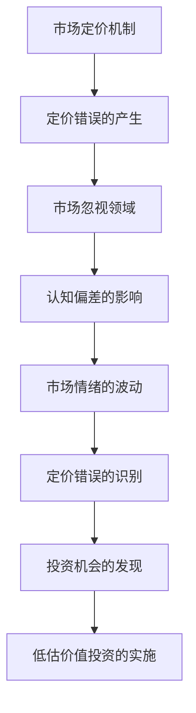

                 

# 大卫·艾伯特的极度低估价值投资：寻找市场的定价错误

---

## 关键词：
价值投资、定价错误、低估投资、市场定价机制、安全边际、大卫·艾伯特、认知偏差

---

## 摘要：
本文深入探讨了大卫·艾伯特的极度低估价值投资策略，分析了市场定价错误的形成机制、识别方法以及投资策略。通过理论与实践相结合，揭示了如何利用市场的定价错误，实现超额收益。文章结合经典案例，总结了低估价值投资的核心原则和实战技巧，为投资者提供了清晰的指导。

---

## 第1章：价值投资的背景与核心概念

### 1.1 价值投资的起源与发展

#### 1.1.1 价值投资的起源
价值投资是一种基于公司内在价值的投资策略，起源于20世纪初。本杰明·格雷厄姆和大卫·艾伯特是这一投资理念的代表人物。价值投资的核心在于寻找市场价格低于内在价值的公司。

#### 1.1.2 大卫·艾伯特的贡献
大卫·艾伯特是价值投资领域的先驱，他提出了“极度低估价值投资”的概念，强调在市场极度低估某些资产时进行投资，以实现超额收益。他的投资哲学强调长期持有和安全边际。

#### 1.1.3 价值投资的发展与演变
随着金融市场的变化，价值投资不断演变，但其核心理念——寻找市场定价错误——始终不变。现代价值投资结合了定量分析和定性分析，更加注重对公司基本面的深入研究。

---

### 1.2 市场定价机制与定价错误

#### 1.2.1 市场定价的基本原理
市场价格由供需关系决定，但市场并非总是理性定价。由于投资者情绪、信息不对称和认知偏差，市场价格经常偏离公司的真实价值。

#### 1.2.2 定价错误的产生原因
定价错误的产生主要源于市场忽视、认知偏差和短期情绪波动。例如，某些行业或公司可能因为市场恐慌而被低估。

#### 1.2.3 定价错误的类型与特征
定价错误可以分为暂时性错误和结构性错误。暂时性错误通常由市场情绪波动引起，而结构性错误则源于市场对某些行业的长期忽视。

---

## 第2章：定价错误的识别与分析

### 2.1 市场忽视的领域

#### 2.1.1 市场忽视的行业分析
某些行业可能因为市场关注度低而被忽视，例如某些小众行业或新兴行业。这些行业的公司可能因为缺乏关注而被低估。

#### 2.1.2 市场忽视的公司特征
被忽视的公司通常具有较高的ROE（净资产收益率）、较低的估值倍数和较强的财务稳定性。这些公司可能因为市场情绪或行业周期而被低估。

#### 2.1.3 市场忽视的原因分析
市场忽视的原因包括信息不对称、投资者情绪和认知偏差。投资者往往倾向于关注热门行业，而忽视那些不显眼但具有投资价值的公司。

---

### 2.2 认知偏差与定价错误

#### 2.2.1 认知偏差的定义与类型
认知偏差是指人们在处理信息时，由于心理因素的影响，导致判断和决策偏离事实的现象。常见的认知偏差包括确认偏差、从众偏差和损失厌恶。

#### 2.2.2 认知偏差对定价的影响
认知偏差会导致投资者过度关注某些信息，而忽视其他重要信息，从而引发市场定价错误。例如，投资者可能因为某行业近期表现不佳而忽视其长期价值。

#### 2.2.3 典型认知偏差案例分析
案例：某科技公司因近期亏损而被市场严重低估。投资者因亏损而忽视其技术创新和长期增长潜力。

---

### 2.3 市场情绪与定价错误

#### 2.3.1 市场情绪的波动性
市场情绪具有周期性波动，通常在市场高点时过度乐观，在市场低点时过度悲观。

#### 2.3.2 市场情绪对定价的影响
市场情绪会影响投资者的决策，从而导致市场价格偏离公司的真实价值。例如，市场恐慌可能导致某些优质资产被低估。

#### 2.3.3 市场情绪的周期性分析
市场情绪通常与市场周期密切相关。在市场低谷时，投资者情绪低落，容易忽视某些优质资产的投资价值。

---

## 第3章：低估价值投资的策略与方法

### 3.1 低估价值投资的核心策略

#### 3.1.1 安全边际的概念与应用
安全边际是指市场价格与公司内在价值之间的差距。投资者应选择具有较大安全边际的公司进行投资，以降低投资风险。

#### 3.1.2 逆向投资的策略与风险
逆向投资是指在市场恐慌时买入，在市场狂热时卖出。这种策略需要投资者具备强大的心理素质和纪律性。

#### 3.1.3 长期投资的纪律性要求
长期投资要求投资者坚持价值投资理念，避免被短期市场波动干扰。投资者应专注于公司长期价值，而不是短期价格波动。

---

### 3.2 低估价值投资的实施步骤

#### 3.2.1 确定低估领域的标准
投资者应根据公司基本面、估值指标和市场情绪等因素，确定市场低估的领域。

#### 3.2.2 选择投资标的的流程
投资者应选择具有较高内在价值、较低市场价格和较大安全边际的公司进行投资。

#### 3.2.3 投资组合的构建与优化
投资者应根据市场变化和个人风险承受能力，动态调整投资组合，优化资产配置。

---

## 第4章：投资组合管理与风险管理

### 4.1 投资组合的构建与优化

#### 4.1.1 投资组合的基本原则
投资组合应多元化，分散风险，同时注重资产配置的合理性。

#### 4.1.2 低估价值投资的资产配置
低估价值投资者应注重资产配置的长期性，选择具有稳定增长潜力的公司。

#### 4.1.3 投资组合的动态调整
投资者应定期评估投资组合的表现，根据市场变化和个人投资目标，进行动态调整。

---

### 4.2 风险管理与心理控制

#### 4.2.1 风险管理的定义与重要性
风险管理是指通过控制投资组合的风险，降低投资损失的可能。

#### 4.2.2 心理控制的技巧与策略
投资者应学会控制情绪，避免因市场波动而做出错误决策。心理控制的关键在于纪律性。

#### 4.2.3 风险与收益的平衡艺术
投资者应在风险可控的前提下，追求最大化的收益。风险与收益的平衡需要投资者具备丰富的投资经验和良好的心理素质。

---

## 第5章：经典案例分析与实战经验

### 5.1 大卫·艾伯特的经典投资案例

#### 5.1.1 某公司案例：低估价值的发现与投资
大卫·艾伯特通过深入研究某公司的基本面，发现其市场价格远低于内在价值，从而进行投资。

#### 5.1.2 某行业案例：市场忽视领域的投资机会
大卫·艾伯特发现某行业被市场忽视，许多公司具有较高的内在价值，从而在该领域进行投资。

#### 5.1.3 某市场周期案例：逆向投资的成功经验
在市场恐慌时，大卫·艾伯特选择逆向投资，买入被低估的资产，最终实现超额收益。

---

### 5.2 实战经验分享

#### 5.2.1 低估价值投资的实战技巧
投资者应注重对公司基本面的深入研究，选择具有较高内在价值的公司进行投资。

#### 5.2.2 投资决策中的关键点
投资者应关注市场情绪、公司基本面和估值指标，综合分析后做出投资决策。

#### 5.2.3 投资过程中的常见问题与解决方案
投资者可能面临的问题包括市场波动、信息不对称和心理压力。解决方案包括制定投资计划、加强学习和提高心理素质。

---

## 第6章：低估价值投资的未来展望与最佳实践

### 6.1 价值投资的未来发展趋势

#### 6.1.1 数字化与智能化对价值投资的影响
随着技术的进步，投资者可以通过大数据和人工智能技术，更精准地发现市场定价错误。

#### 6.1.2 新兴市场的投资机会
新兴市场中可能存在许多被市场忽视的公司，为低估价值投资者提供了广阔的投资机会。

#### 6.1.3 价值投资与社会责任的结合
越来越多的投资者开始关注公司的社会责任，这为价值投资提供了新的维度。

---

### 6.2 最佳实践与注意事项

#### 6.2.1 投资者的自我要求
投资者应具备扎实的金融知识和丰富的投资经验，同时具备较强的心理素质。

#### 6.2.2 长期投资的纪律性
投资者应坚持长期投资，避免因短期市场波动而做出错误决策。

#### 6.2.3 风险管理的持续优化
投资者应根据市场变化和个人风险承受能力，持续优化风险管理策略。

---

## 第7章：总结与展望

### 7.1 本书的核心观点回顾
本文系统地介绍了大卫·艾伯特的极度低估价值投资策略，分析了市场定价错误的形成机制和识别方法，总结了投资策略和风险管理的核心原则。

### 7.2 低估价值投资的未来展望
随着市场的不断发展，低估价值投资将继续发展和演变。投资者应结合市场变化和个人经验，不断优化投资策略。

### 7.3 投资者的自我反思与成长
投资者应不断反思自己的投资决策，总结经验教训，提升自己的投资能力。

---

## 附录：大卫·艾伯特的投资哲学与语录

---

## 参考文献与拓展阅读
1. 大卫·艾伯特，《价值投资的艺术》
2. 本杰明·格雷厄姆，《投资学原理》
3. 查理·芒格，《巴菲特的思考方式》

---

## 图表与流程图

#### 图表1: 定价错误的识别流程图

---

## 作者：AI天才研究院/AI Genius Institute & 禅与计算机程序设计艺术 /Zen And The Art of Computer Programming

---

### 总结
本文系统地介绍了大卫·艾伯特的极度低估价值投资策略，分析了市场定价错误的形成机制和识别方法，总结了投资策略和风险管理的核心原则。通过经典案例分析和实战经验分享，为投资者提供了清晰的指导。未来，随着市场的不断发展，低估价值投资将继续发展和演变，投资者应结合市场变化和个人经验，不断优化投资策略。

