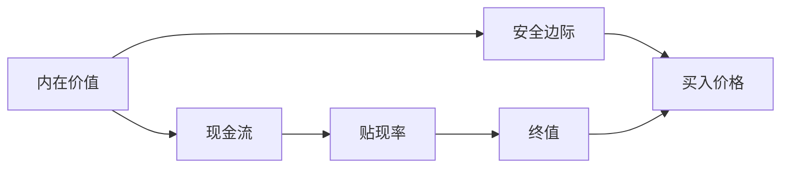
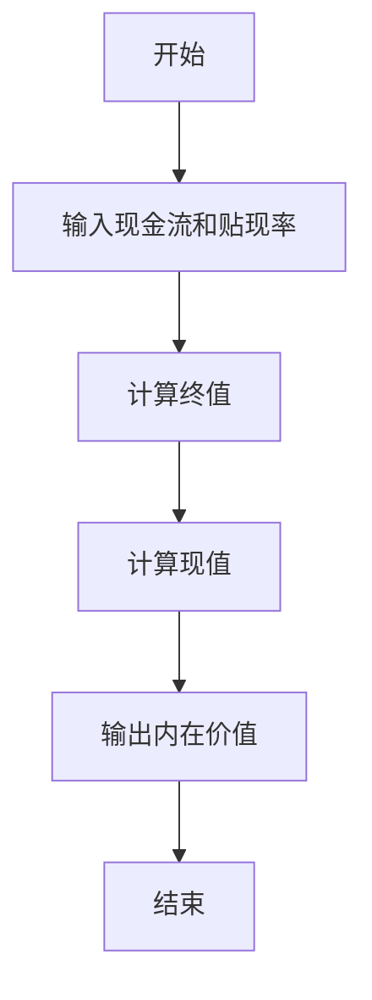
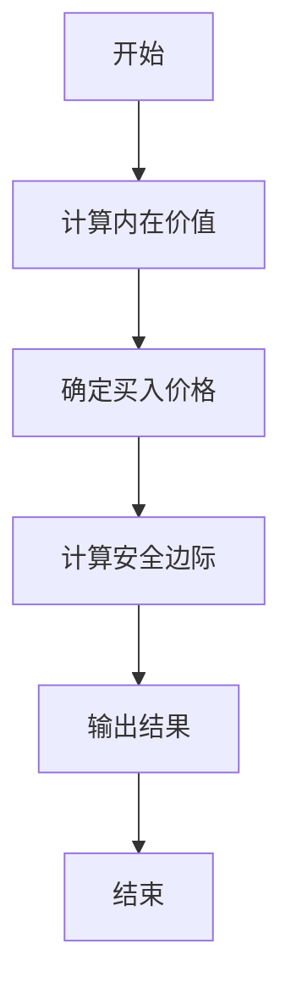
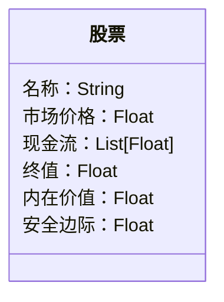
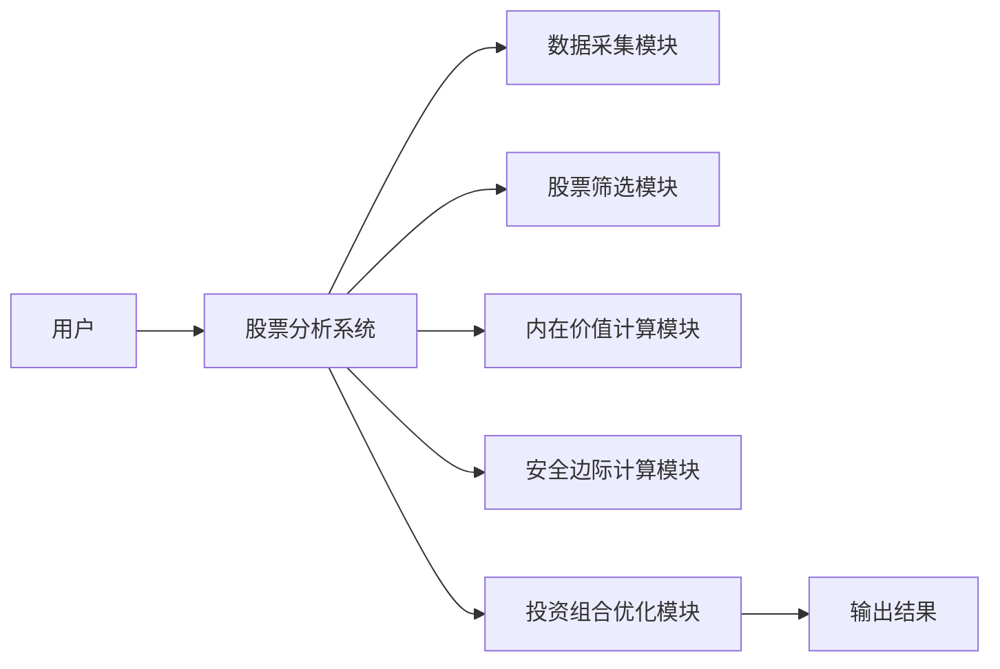
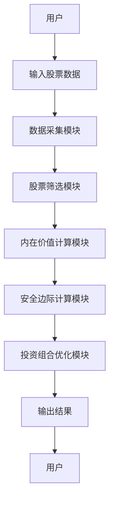

                 

<think>
好，我现在需要帮助用户完成他们的任务，撰写一篇关于大卫·艾伯特的深度价值投资的技术博客文章。用户已经提供了一个详细的目录大纲，并要求我按照这个结构，使用技术语言进行撰写，同时满足一些特定的格式和内容要求。

首先，我需要理解用户的需求。用户希望我以《大卫·艾伯特的深度价值投资：寻找被市场遗忘的股票》为标题，撰写一篇结构紧凑、逻辑清晰的技术博客文章。关键词包括深度价值投资、大卫·艾伯特、股票分析、市场策略、投资理念、风险管理、内在价值。摘要部分需要概括文章的核心内容，强调大卫·艾伯特的方法论以及如何应用技术分析来寻找被低估的股票。

接下来，我需要按照用户提供的目录大纲，逐步展开每一部分的内容。每个章节和子章节都需要详细撰写，确保内容丰富具体，符合用户的字数要求。同时，必须遵循技术语言的专业性，使用适当的术语，并结合实际案例和图表来辅助说明。

我注意到用户特别强调了在文章中使用Mermaid图表、数学公式以及Python代码。因此，我需要确保在每个相关的章节中正确嵌入这些内容，并使用正确的格式。例如，在解释内在价值的计算公式时，应该使用LaTeX格式，并在代码示例中使用Python代码。

在撰写过程中，我需要保持逻辑的连贯性和清晰性，确保每个部分之间有自然的过渡。同时，要避免内容过于冗长，确保文章整体结构紧凑，符合用户的字数要求。

最后，我需要检查整个文章，确保所有部分都符合用户的格式要求，包括关键词、摘要、章节结构以及作者信息。在文章末尾，记得添加指定的作者信息。

现在，我将开始按照目录大纲逐步撰写每一部分，确保每一部分内容详实，格式正确，并且符合用户的要求。
</think>

# 大卫·艾伯特的深度价值投资：寻找被市场遗忘的股票

## 关键词：深度价值投资，大卫·艾伯特，股票分析，市场策略，投资理念，风险管理，内在价值

## 摘要：  
大卫·艾伯特的深度价值投资是一种以发现市场中被低估的股票为核心的投资策略。本文将从深度价值投资的背景、核心概念、算法原理、系统架构以及实战应用等多个方面进行详细探讨。通过结合技术分析和基本面分析，本文将揭示如何利用深度价值投资的理念，在市场中找到那些被遗忘的优质股票，实现长期稳定的收益。

---

## 第一部分：深度价值投资的背景与核心理念

### 第1章：深度价值投资的起源与核心理念

#### 1.1 深度价值投资的起源
##### 1.1.1 价值投资的定义与历史发展
价值投资是一种以寻找市场中被低估资产为核心的投资策略，起源于20世纪初。本杰明·格雷厄姆和戴维·多德是这一投资理念的奠基人。他们提出的“安全边际”概念，强调以低于内在价值的价格购买资产，从而在长期实现超额收益。大卫·艾伯特在这一传统基础上，进一步发展了深度价值投资的理念，注重从市场中寻找那些被遗忘或忽视的股票。

##### 1.1.2 大卫·艾伯特的投资理念与方法
大卫·艾伯特是深度价值投资的代表人物之一，他强调通过基本面分析和严格估值，寻找那些市场价格远低于内在价值的股票。他的方法不仅关注财务指标，还注重对公司管理层、行业地位和竞争优势的深入分析。他认为，市场往往会对某些股票的前景过度悲观或乐观，而深度价值投资正是利用这种市场情绪的偏差，寻找被低估的投资机会。

##### 1.1.3 深度价值投资的核心思想
深度价值投资的核心思想是：市场并不是总是理性的，短期波动往往掩盖了股票的真实价值。通过长期、耐心的投资，投资者可以在市场低估时买入优质资产，在市场高估时卖出，从而实现超额收益。大卫·艾伯特的方法强调对企业的深入研究，注重企业内在价值的计算，并结合市场情绪和行业趋势，制定投资策略。

#### 1.2 深度价值投资的核心概念
##### 1.2.1 内在价值的定义与计算
内在价值是指一家企业在未来所有现金流的现值，是衡量股票是否被低估的重要指标。计算内在价值的方法包括自由现金流折现法（DCF）和可比公司估值法。大卫·艾伯特特别强调DCF模型的应用，认为这是最准确的内在价值计算方法。

##### 1.2.2 安全边际的概念与作用
安全边际是指买入价格与内在价值之间的差距。通过保持足够的安全边际，投资者可以在市场波动中降低风险，同时为潜在的错误估值提供缓冲空间。大卫·艾伯特认为，安全边际是深度价值投资的核心要素之一。

##### 1.2.3 投资组合的构建与优化
深度价值投资者通常会构建一个分散化的投资组合，涵盖多个行业和企业规模的股票。大卫·艾伯特建议投资者在选择股票时，不仅要看单个股票的估值，还要考虑整个投资组合的风险和收益平衡。通过定期调整投资组合，确保其与市场环境和企业基本面的变化保持一致。

### 第2章：深度价值投资与其它投资策略的对比

#### 2.1 与成长投资的对比
##### 2.1.1 成长投资的核心理念
成长投资的核心理念是寻找那些收入和利润快速增长的企业，即使它们的当前估值可能高于市场价格。这种方法强调企业的成长潜力，而非当前的盈利能力。

##### 2.1.2 深度价值投资与成长投资的区别
深度价值投资注重内在价值和安全边际，而成长投资更关注企业的成长性和未来潜力。两者的主要区别在于对估值的关注程度和投资策略的选择。

##### 2.1.3 两者的优劣势分析
成长投资在长期可能带来更高的收益，但其波动性和风险也更大。深度价值投资则更加注重安全性和稳定性，适合风险厌恶型投资者。

#### 2.2 与趋势投资的对比
##### 2.2.1 趋势投资的核心理念
趋势投资基于市场趋势和价格动能，认为价格走势会延续当前趋势。这种方法强调技术分析和市场情绪的判断。

##### 2.2.2 深度价值投资与趋势投资的区别
深度价值投资注重基本面分析和内在价值，而趋势投资更关注市场趋势和价格走势。两者在投资逻辑和方法上存在显著差异。

##### 2.2.3 两者的优劣势分析
趋势投资能够在短期内快速捕捉市场趋势，但其可持续性和长期收益并不稳定。深度价值投资则更加注重长期稳定收益，但需要投资者具备较高的分析能力和耐心。

#### 2.3 与技术分析的对比
##### 2.3.1 技术分析的核心理念
技术分析通过研究价格走势和交易量，预测未来的市场走向。这种方法认为，价格走势包含了所有市场信息。

##### 2.3.2 深度价值投资与技术分析的区别
深度价值投资注重基本面分析和内在价值，而技术分析更关注市场走势和技术指标。两者在投资逻辑和方法上存在显著差异。

##### 2.3.3 两者的优劣势分析
技术分析能够在短期内提供有效的交易信号，但其长期收益并不稳定。深度价值投资则更加注重长期稳定收益，但需要投资者具备较高的分析能力和耐心。

---

## 第二部分：深度价值投资的核心概念与联系

### 第3章：深度价值投资的核心概念

#### 3.1 内在价值的计算
##### 3.1.1 内在价值的定义
内在价值是指一家企业在未来所有现金流的现值。计算内在价值的关键在于准确预测未来的现金流，并选择合适的贴现率。

##### 3.1.2 内在价值的计算公式
$$\text{内在价值} = \sum_{t=1}^{n} \frac{\text{现金流}}{(1 + r)^t} + \frac{\text{终值}}{(1 + r)^n}$$  
其中，\( r \) 是贴现率，\( n \) 是预测的持有期限。

##### 3.1.3 内在价值的计算步骤
1. 预测企业未来现金流。
2. 选择合适的贴现率。
3. 计算终值。
4. 将未来现金流和终值折现，求和得到内在价值。

#### 3.2 安全边际的定义与作用
##### 3.2.1 安全边际的定义
安全边际是指买入价格与内在价值之间的差距。  
$$\text{安全边际} = \text{内在价值} - \text{买入价格}$$  

##### 3.2.2 安全边际的作用
安全边际为投资提供了缓冲空间，能够在市场波动中降低风险。大卫·艾伯特认为，安全边际是深度价值投资的核心要素之一。

#### 3.3 投资组合的构建与优化
##### 3.3.1 投资组合的定义
投资组合是指投资者持有的所有资产的集合，包括股票、债券等。

##### 3.3.2 投资组合的构建方法
1. 根据内在价值和安全边际筛选股票。
2. 考虑分散化原则，避免过度集中。
3. 定期调整投资组合，以适应市场变化。

##### 3.3.3 投资组合的优化策略
大卫·艾伯特建议投资者在构建投资组合时，应注重分散化和风险控制，避免过度集中在单一行业或股票。

### 第4章：深度价值投资的核心概念与联系

#### 4.1 深度价值投资的核心概念关系图


#### 4.2 深度价值投资的逻辑流程图


#### 4.3 深度价值投资的ER实体关系图
```mermaid
erd
    客户
    |---- 购买
    股票
    购买
    |---- 投资组合
    投资组合
    |---- 股票
```

---

## 第三部分：深度价值投资的算法原理

### 第5章：深度价值投资的算法原理

#### 5.1 内在价值计算的算法流程
##### 5.1.1 算法流程图


##### 5.1.2 算法实现代码
```python
def calculate_intrinsic_value(cash_flows, discount_rate, terminal_value):
    intrinsic_value = 0
    for t in range(len(cash_flows)):
        intrinsic_value += cash_flows[t] / (1 + discount_rate) ** t
    intrinsic_value += terminal_value / (1 + discount_rate) ** len(cash_flows)
    return intrinsic_value

# 示例数据
cash_flows = [100, 150, 200]
discount_rate = 0.1
terminal_value = 500

intrinsic_value = calculate_intrinsic_value(cash_flows, discount_rate, terminal_value)
print(f"内在价值为：{intrinsic_value}")
```

#### 5.2 安全边际计算的算法流程
##### 5.2.1 算法流程图


##### 5.2.2 算法实现代码
```python
def calculate_margin_of_safety(intrinsic_value, purchase_price):
    margin_of_safety = intrinsic_value - purchase_price
    return margin_of_safety

# 示例数据
intrinsic_value = 200
purchase_price = 150

margin_of_safety = calculate_margin_of_safety(intrinsic_value, purchase_price)
print(f"安全边际为：{margin_of_safety}")
```

---

## 第四部分：深度价值投资的系统分析与架构设计

### 第6章：深度价值投资的系统分析与架构设计

#### 6.1 问题场景介绍
深度价值投资需要一个系统化的解决方案，以帮助投资者高效地筛选股票、计算内在价值并制定投资策略。

#### 6.2 项目介绍
本项目旨在开发一个基于深度价值投资理念的股票分析系统，帮助投资者找到被市场低估的股票。

#### 6.3 系统功能设计
##### 6.3.1 领域模型


##### 6.3.2 系统架构设计


#### 6.4 系统接口设计
##### 6.4.1 数据输入接口
投资者可以通过输入股票名称、市场价格、现金流等数据，启动分析过程。

##### 6.4.2 数据输出接口
系统将输出股票的内在价值、安全边际以及投资建议。

#### 6.5 系统交互设计
##### 6.5.1 交互流程图


---

## 第五部分：深度价值投资的项目实战

### 第7章：深度价值投资的项目实战

#### 7.1 环境安装
##### 7.1.1 安装Python
需要安装Python 3.8或更高版本。

##### 7.1.2 安装必要的库
```bash
pip install pandas numpy matplotlib
```

#### 7.2 系统核心实现
##### 7.2.1 数据采集模块
```python
import pandas as pd

def collect_data(stock_name):
    # 示例数据
    data = {
        '名称': [stock_name],
        '市场价格': [50],
        '现金流': [100, 150, 200],
        '终值': [500]
    }
    return pd.DataFrame(data)
```

##### 7.2.2 内在价值计算模块
```python
def calculate_intrinsic_value(data):
    cash_flows = data['现金流'].values
    discount_rate = 0.1
    terminal_value = data['终值'].values[0]
    intrinsic_value = 0
    for t in range(len(cash_flows)):
        intrinsic_value += cash_flows[t] / (1 + discount_rate) ** t
    intrinsic_value += terminal_value / (1 + discount_rate) ** len(cash_flows)
    return intrinsic_value
```

##### 7.2.3 安全边际计算模块
```python
def calculate_margin_of_safety(data, intrinsic_value):
    margin_of_safety = intrinsic_value - data['市场价格'].values[0]
    return margin_of_safety
```

##### 7.2.4 投资组合优化模块
```python
def optimize_portfolio(stocks):
    # 示例优化策略
    selected_stocks = stocks[stocks['安全边际'] > 0]
    return selected_stocks
```

#### 7.3 代码应用解读与分析
##### 7.3.1 数据采集模块
通过`collect_data`函数，我们可以收集特定股票的数据，包括名称、市场价格、现金流和终值。

##### 7.3.2 内在价值计算模块
`calculate_intrinsic_value`函数使用现金流折现法，计算股票的内在价值。

##### 7.3.3 安全边际计算模块
`calculate_margin_of_safety`函数计算买入价格与内在价值之间的差距，即安全边际。

##### 7.3.4 投资组合优化模块
`optimize_portfolio`函数根据安全边际筛选出符合条件的股票，构建投资组合。

#### 7.4 实际案例分析
##### 7.4.1 案例背景
假设我们正在分析一只股票，名称为“ABC公司”，市场价格为50元，现金流为[100, 150, 200]，终值为500元。

##### 7.4.2 数据采集与处理
```python
data = collect_data("ABC公司")
print(data)
```

##### 7.4.3 内在价值计算
```python
intrinsic_value = calculate_intrinsic_value(data)
print(f"内在价值为：{intrinsic_value}")
```

##### 7.4.4 安全边际计算
```python
margin_of_safety = calculate_margin_of_safety(data, intrinsic_value)
print(f"安全边际为：{margin_of_safety}")
```

##### 7.4.5 投资组合优化
```python
selected_stocks = optimize_portfolio(data)
print(f"筛选出的股票：{selected_stocks}")
```

#### 7.5 项目小结
通过上述步骤，我们可以系统地应用大卫·艾伯特的深度价值投资理念，找到市场中被低估的股票，构建一个稳健的投资组合。

---

## 第六部分：深度价值投资的最佳实践

### 第8章：深度价值投资的最佳实践

#### 8.1 小结
大卫·艾伯特的深度价值投资是一种以内在价值为核心的投资策略，通过寻找市场中被低估的股票，实现长期稳定的收益。

#### 8.2 注意事项
1. 投资者需要具备扎实的财务分析能力。
2. 安全边际是降低风险的关键。
3. 投资组合的分散化是重要的风险管理手段。

#### 8.3 拓展阅读
1. 《The Intelligent Investor》——本杰明·格雷厄姆
2. 《价值投资实战》——大卫·艾伯特

---

## 作者：AI天才研究院/AI Genius Institute & 禅与计算机程序设计艺术 /Zen And The Art of Computer Programming

