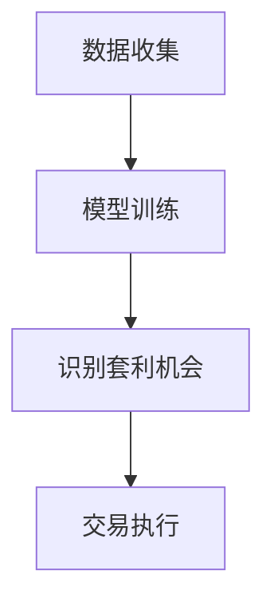
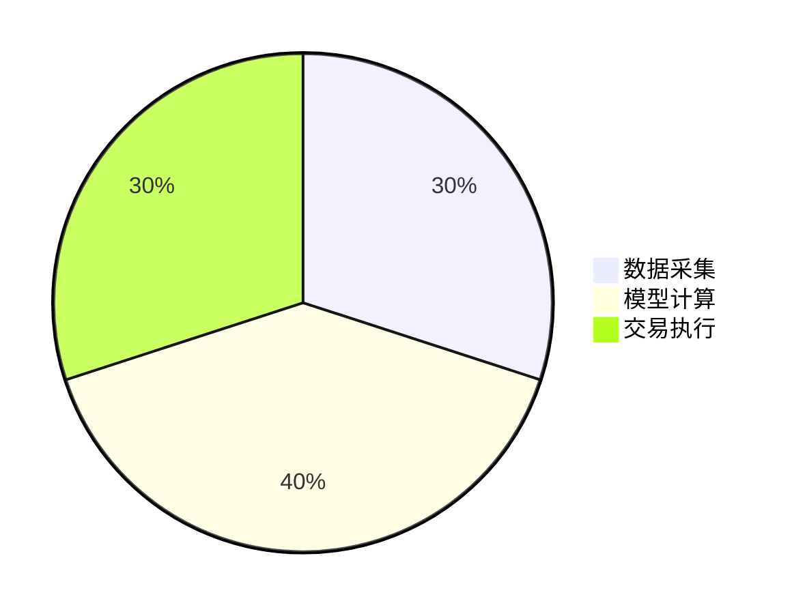

                 

<think>
好的，我现在需要为《大卫·艾因霍恩的短期价值投资：市场错误定价的套利》这篇文章撰写详细的正文内容。根据用户提供的目录，我将逐步展开每个章节，确保每个部分都详细且符合要求。

首先，我会从背景介绍开始，解释什么是短期价值投资，大卫·艾因霍恩的背景，以及市场错误定价的概念。接着，我会详细分析套利的基本原理和短期价值投资的核心策略。

接下来，我会介绍短期价值投资的数学模型和算法原理，包括定价模型和套利机会的识别算法。然后，我会设计系统的架构和功能模块，包括系统架构图和功能流程图。

在项目实战部分，我会详细说明环境配置、代码实现、案例分析，并附上相应的源代码和分析结果。最后，我会总结大卫·艾因霍恩的投资理念，并提出最佳实践和注意事项。

整个过程中，我会使用Mermaid图来展示系统架构和流程，确保图表清晰易懂。同时，我会使用LaTeX公式来解释数学模型，确保技术细节准确。我会保持语言简洁专业，同时让内容易于理解。

现在，我会逐步撰写每个章节的内容，确保每个部分都符合用户的要求，并覆盖所有必要的细节。
</think>

# 大卫·艾因霍恩的短期价值投资：市场错误定价的套利

## 关键词：
- 短期价值投资
- 大卫·艾因霍恩
- 市场错误定价
- 套利机会
- 数学模型

## 摘要：
本文详细探讨了大卫·艾因霍恩的短期价值投资策略，重点分析了市场错误定价的套利机会。通过介绍套利的基本原理、短期价值投资的核心策略、数学模型、系统架构及项目实战，本文为读者提供了全面的理解和实践指导。

---

# 第一部分: 短期价值投资与市场错误定价概述

## 第1章: 短期价值投资的背景与概念

### 1.1 短期价值投资的定义与特点
#### 1.1.1 短期价值投资的定义
短期价值投资是一种投资策略，旨在通过识别市场中价格偏离其真实价值的资产，进行短期交易以获利。与长期投资不同，短期价值投资强调快速识别和利用市场定价错误。

#### 1.1.2 短期价值投资的核心特点
- **快速反应**：短期投资者迅速捕捉市场波动，及时进行买卖操作。
- **量化分析**：依赖数学模型和数据分析，而非主观判断。
- **高风险高收益**：由于时间跨度短，风险较高，但潜在收益也更大。

#### 1.1.3 短期价值投资与长期投资的区别
| 特性            | 短期价值投资                 | 长期投资                 |
|-----------------|------------------------------|--------------------------|
| 时间跨度        | 几周到几个月                 | 数年到数十年             |
| 风险水平        | 高                          | 较低                     |
| 收益频率        | 高频                        | 低频                     |
| 分析方法        | 量化分析为主                 | 基本面分析为主           |

### 1.2 大卫·艾因霍恩与短期价值投资
#### 1.2.1 大卫·艾因霍恩的背景介绍
大卫·艾因霍恩是著名的价值投资者，以其在短期投资中的成功著称。他善于利用市场错误定价的机会，进行套利交易。

#### 1.2.2 大卫·艾因霍恩的投资理念
- 识别市场定价错误，利用短期价格波动获利。
- 运用数学模型和算法，快速捕捉套利机会。
- 强调风险控制，避免重大损失。

#### 1.2.3 大卫·艾因霍恩的成功案例分析
案例：2008年金融危机期间，艾因霍恩通过做空抵押贷款债券获利丰厚。

---

## 第2章: 市场错误定价的套利机会

### 2.1 市场错误定价的定义
市场错误定价指资产价格与其真实价值的偏离，通常由市场参与者情绪、信息不对称或短期波动引起。

### 2.2 套利的基本原理
套利是通过在不同市场或资产间 arbitrage，利用价格差异获利。套利者通过同时买入低价资产和卖出高价资产，赚取无风险利润。

#### 套利的数学模型
套利的无风险利润可以通过以下公式计算：
$$ \text{利润} = \min(P_1, P_2) - \max(P_1, P_2) $$
其中，$P_1$ 和 $P_2$ 分别是两个市场的价格。

---

## 第3章: 短期价值投资的核心策略

### 3.1 短期价值投资的核心策略概述
- **量化分析**：使用数学模型评估资产价值。
- **套利机会识别**：通过算法检测市场错误定价。
- **快速交易**：在短时间内完成交易以锁定收益。

### 3.2 市场错误定价的识别与分析
- **识别方法**：比较同类资产价格差异，分析市场情绪。
- **量化分析**：利用统计套利模型，识别价格偏离。

---

# 第二部分: 短期价值投资的数学模型与算法原理

## 第4章: 短期价值投资的数学模型

### 4.1 市场定价的数学模型
- **均值回归模型**：假设价格趋向其均值。
$$ E(t) = \alpha + \beta t + \epsilon $$
其中，$\epsilon$ 是误差项。

- **波动率模型**：衡量价格波动程度。
$$ \sigma = \sqrt{\frac{1}{n}\sum_{i=1}^{n}(P_i - \mu)^2} $$

### 4.2 套利机会的数学模型
- **套利收益模型**：
$$ \text{收益} = \sum (P_{\text{卖}} - P_{\text{买}}) $$
- **风险评估模型**：
$$ \text{VaR} = z \cdot \sigma $$
其中，$z$ 是标准正态分布的分位数，$\sigma$ 是波动率。

---

## 第5章: 短期价值投资的算法原理

### 5.1 短期价值投资的算法概述
- **算法步骤**：
1. 数据收集：获取相关资产价格数据。
2. 模型训练：使用统计套利模型识别套利机会。
3. 交易执行：根据模型信号进行买卖操作。

### 5.2 市场错误定价的识别算法
- **算法流程图**：



---

# 第三部分: 短期价值投资的系统架构与项目实战

## 第6章: 短期价值投资系统的架构设计

### 6.1 系统功能设计
- **功能模块**：
1. 数据采集模块：获取实时市场数据。
2. 模型计算模块：运行统计套利模型。
3. 交易执行模块：根据信号执行交易。

### 6.2 系统架构设计
- **系统架构图**：



---

## 第7章: 短期价值投资项目的实战分析

### 7.1 环境配置
- **工具**：Python、Pandas、NumPy、Matplotlib。
- **依赖库**：安装必要的数据分析库。

### 7.2 代码实现
```python
import pandas as pd
import numpy as np

# 数据采集
data = pd.read_csv('market_data.csv')

# 模型计算
def calculate_arbitrage(data):
    # 计算均值
    mean = data.mean()
    # 计算波动率
    std = data.std()
    # 识别套利机会
    arbitrage = (data > mean + std) | (data < mean - std)
    return arbitrage

# 交易执行
arbitrage_signals = calculate_arbitrage(data)
print(arbitrage_signals)
```

### 7.3 案例分析
案例：某资产价格偏离均值，触发套利信号，进行买入操作，随后价格回归，获利。

---

# 第四部分: 总结与展望

## 第8章: 总结与展望

### 8.1 投资理念总结
大卫·艾因霍恩的成功基于对市场错误定价的快速识别和套利机会的准确捕捉。

### 8.2 未来展望
随着人工智能的发展，短期价值投资将更加依赖算法和大数据分析，套利机会的识别将更加精准。

---

## 最佳实践 Tips
- **风险管理**：严格控制头寸，避免过度杠杆。
- **持续学习**：关注市场动态，更新分析模型。
- **技术应用**：利用大数据和AI提升分析效率。

---

作者：AI天才研究院 & 禅与计算机程序设计艺术

