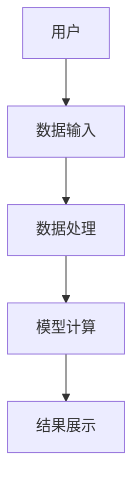

                 


# 大卫德雷曼的财务报表解读

> 关键词：财务报表分析，大卫德雷曼，投资决策，财务困境预测，财务比率分析

> 摘要：本文将详细介绍大卫德雷曼的财务报表解读方法，包括财务报表的核心概念、分析框架、财务困境预测模型以及实际应用案例。通过系统化的分析和实战演练，帮助读者掌握如何通过财务报表识别企业财务健康状况，做出明智的投资决策。

---

## 目录

### 第一部分: 财务报表解读的背景与核心概念

#### 第1章: 财务报表解读的背景与重要性

##### 1.1 财务报表的基本概念

###### 1.1.1 财务报表的定义与作用

- 财务报表的定义
- 财务报表的作用：反映企业财务状况、评估企业价值、辅助决策
- 财务报表的使用者：投资者、债权人、管理层等

###### 1.1.2 财务报表的分类与结构

- 资产负债表、利润表、现金流量表的定义与区别
- 财务报表的编制原则与时间要求

##### 1.2 大卫德雷曼的财务分析方法

###### 1.2.1 大卫德雷曼的分析框架

- 德雷曼分析法的核心思想
- 德雷曼分析法在投资决策中的应用
- 德雷曼分析法与传统财务分析的对比

##### 1.2.2 财务困境预测模型的核心思想

- 财务困境的定义与特征
- 德雷曼模型在预测财务困境中的作用
- 德雷曼模型与企业价值评估的关系

##### 1.2.3 财务报表分析的实践意义

- 财务报表分析在投资决策中的重要性
- 如何通过财务报表分析识别投资机会
- 如何通过财务报表分析规避投资风险

#### 第2章: 财务报表的核心要素与分析维度

##### 2.1 资产负债表分析

###### 2.1.1 资产、负债、所有者权益的定义与分类

- 资产的分类：流动资产、非流动资产
- 负债的分类：流动负债、非流动负债
- 所有者权益的构成与意义

###### 2.1.2 资产负债表的结构与解读方法

- 资产负债表的三部分构成：资产、负债、所有者权益
- 资产负债表的解读方法：资产总额、负债总额、资产负债率等指标
- 资产负债表的健康指标与预警信号

##### 2.2 利润表分析

###### 2.2.1 收入、成本与利润的关系

- 收入的定义与分类：营业收入、其他收入
- 成本的定义与分类：营业成本、管理费用、销售费用等
- 利润的计算公式：净利润 = 营业收入 - 营业成本 - 费用

###### 2.2.2 利润表的结构与解读方法

- 利润表的三部分构成：营业收入、费用、利润
- 利润表的解读方法：毛利率、净利率等指标
- 利润表的健康指标与预警信号

##### 2.3 现金流量表分析

###### 2.3.1 现金流入与流出的分类

- 现金流入：经营活动、投资活动、筹资活动
- 现金流出：经营活动、投资活动、筹资活动
- 现金净流量的计算公式

###### 2.3.2 现金流量表的结构与解读方法

- 现金流量表的三部分构成：经营活动现金流、投资活动现金流、筹资活动现金流
- 现金流量表的解读方法：现金净流量、现金净流入/流出等指标
- 现金流量表的健康指标与预警信号

#### 第3章: 财务报表的综合分析方法

##### 3.1 财务报表的横向与纵向比较

###### 3.1.1 同行业公司间的横向比较

- 同行业公司间的横向比较：资产规模、收入规模、利润率等
- 行业平均值的计算与应用
- 同行业公司间的横向比较案例分析

###### 3.1.2 同一公司不同期间的纵向比较

- 同一公司不同期间的纵向比较：收入增长率、利润增长率、资产增长率等
- 时间序列分析在财务报表分析中的应用
- 纵向比较案例分析

##### 3.2 财务报表的比率分析

###### 3.2.1 常见财务比率的分类与计算公式

- 资产负债率、流动比率、速动比率、应收账款周转率、存货周转率、净利率等
- 财务比率的计算公式与应用
- 财务比率的优缺点与注意事项

###### 3.2.2 财务比率分析的局限性与注意事项

- 财务比率分析的局限性：行业差异、公司规模差异等
- 财务比率分析的注意事项：结合实际情况、综合运用多个指标等
- 财务比率分析的实际应用案例

##### 3.3 财务报表的综合评价模型

###### 3.3.1 综合评价模型的构建方法

- 综合评价模型的构建步骤：数据收集、指标选择、权重分配、计算与评价
- 综合评价模型的优缺点与适用场景
- 综合评价模型的实际应用案例

---

### 第二部分: 大卫德雷曼的财务困境预测模型

#### 第4章: 财务困境预测模型的原理与方法

##### 4.1 财务困境预测模型的概述

###### 4.1.1 财务困境的定义与特征

- 财务困境的定义：企业无法偿还债务、面临破产或重组
- 财务困境的特征：低利润率、高负债率、现金流不足等
- 财务困境的预警信号：持续亏损、应收账款增加、存货积压等

###### 4.1.2 财务困境预测模型的核心思想

- 德雷曼模型的核心思想：通过财务比率分析预测企业财务困境的可能性
- 德雷曼模型的数学公式：Z-score模型
- 德雷曼模型的应用场景：识别潜在的财务困境企业

##### 4.2 财务困境预测模型的数学公式

###### 4.2.1 Z-score模型的公式与解释

$$ Z = 1.2A + 1.4B + 3.3C + 0.6D + 1.0E $$

- 公式中各变量的定义：
  - A：净收益与资产总额的比率
  - B：净收益与利息支出的比率
  - C：息税前利润与资产总额的比率
  - D：资产与负债总额的比率
  - E：销售额与资产总额的比率

###### 4.2.2 Z-score模型的计算步骤

- 数据收集：收集企业的财务数据（如资产负债表、利润表）
- 计算各变量：A、B、C、D、E
- 计算Z-score值
- 判断企业财务状况：Z > 2.675为正常，Z < 1.81为潜在困境，介于两者之间为灰色区域

##### 4.3 财务困境预测模型的实际应用案例

- 案例分析：某制造企业的财务困境预测
- 数据收集与计算过程
- 结果分析与结论

#### 第5章: 财务困境预测模型的系统架构与实现

##### 5.1 系统架构设计

###### 5.1.1 系统功能设计

- 数据输入：用户输入企业的财务数据
- 模型计算：系统自动计算Z-score值
- 结果展示：系统显示企业财务状况的评价结果

###### 5.1.2 系统架构图



##### 5.2 系统实现代码

###### 5.2.1 Python代码实现

```python
def calculate_z_score(net_profit, interest_expense, ebit, assets, liabilities, sales):
    A = net_profit / assets
    B = net_profit / interest_expense
    C = ebit / assets
    D = assets / liabilities
    E = sales / assets
    Z = 1.2 * A + 1.4 * B + 3.3 * C + 0.6 * D + 1.0 * E
    return Z

# 示例数据
net_profit = 100
interest_expense = 20
ebit = 150
assets = 500
liabilities = 300
sales = 400

Z_score = calculate_z_score(net_profit, interest_expense, ebit, assets, liabilities, sales)
print(f"Z-score = {Z_score}")
```

##### 5.3 系统实现的注意事项

- 数据输入的格式与范围
- 模型计算的误差范围
- 结果展示的清晰与直观

---

### 第三部分: 财务报表分析的实战与优化

#### 第6章: 财务报表分析的实战案例

##### 6.1 实战环境搭建

###### 6.1.1 数据收集工具的选择

- 数据收集工具：Excel、Python（pandas库）、数据库查询工具
- 数据来源：企业公开财务报表、行业报告等

##### 6.1.2 数据处理与清洗

- 数据清洗：处理缺失值、异常值、重复值
- 数据转换：标准化、归一化
- 数据存储：数据库存储或本地文件存储

##### 6.2 财务报表分析方法的实现

###### 6.2.1 数据分析与可视化

- 数据分析：使用Python的pandas库进行数据处理
- 数据可视化：使用matplotlib或seaborn库绘制财务比率变化趋势图

###### 6.2.2 财务困境预测模型的实现

- 模型训练：使用历史数据训练Z-score模型
- 模型验证：使用测试数据验证模型的准确性
- 模型优化：调整权重、增加更多指标

##### 6.3 财务报表分析的实际案例

- 案例分析：某行业龙头企业的财务报表分析
- 分析过程：数据收集、数据处理、模型计算、结果分析
- 结论与启示：财务报表分析在投资决策中的应用

#### 第7章: 财务报表分析的系统优化与扩展

##### 7.1 系统优化方案

###### 7.1.1 数据处理的优化

- 数据预处理的自动化：使用Python脚本自动下载财务报表
- 数据清洗的并行化：使用多线程或分布式计算加速数据处理

##### 7.1.2 模型计算的优化

- 模型计算的并行化：使用多核CPU或GPU加速计算
- 模型优化：使用机器学习算法（如随机森林、神经网络）改进预测准确性

##### 7.2 系统扩展方案

###### 7.2.1 系统功能扩展

- 功能扩展：增加财务比率分析、现金流分析、行业对标等功能
- 界面优化：设计用户友好的界面，方便用户操作

##### 7.2.2 系统架构扩展

- 架构优化：使用微服务架构提高系统的可扩展性
- 数据存储优化：使用分布式数据库提高数据存储效率

---

### 第四部分: 财务报表分析的最佳实践与小结

#### 第8章: 财务报表分析的最佳实践

##### 8.1 最佳实践 Tips

- 数据分析：注重数据的准确性和完整性
- 模型应用：结合实际情况选择合适的模型
- 投资决策：综合考虑财务指标与市场环境

##### 8.2 小结

- 财务报表分析的核心在于识别企业财务健康状况
- 大卫德雷曼的分析方法提供了独特的视角和工具
- 实战应用中需要注重数据处理与模型优化

#### 第9章: 财务报表分析的注意事项与拓展阅读

##### 9.1 注意事项

- 数据分析的局限性：财务报表反映的是过去的情况，不能完全预测未来
- 模型的应用范围：Z-score模型适用于制造业，其他行业可能需要调整
- 投资决策的综合性：财务报表分析是投资决策的重要组成部分，但需要结合其他因素（如行业趋势、政策环境）

##### 9.2 拓展阅读

- 推荐书籍：《财务报表分析与投资决策》、《投资学》
- 推荐网站：SEC（美国证券交易委员会）官网、Morningstar（晨星网）
- 推荐课程：Coursera上的“财务报表分析”课程

---

### 作者

作者：AI天才研究院/AI Genius Institute  
联系方式：https://www.linkedin.com/in/ai-genius-institute/  
GitHub：https://github.com/ai-genius-institute

