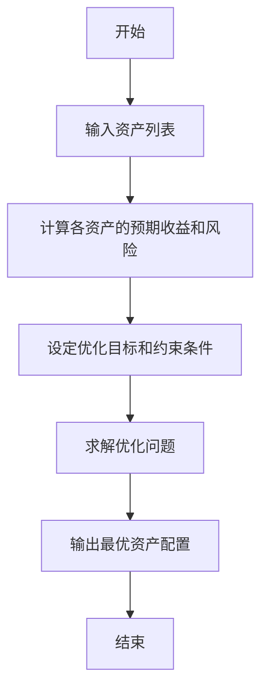
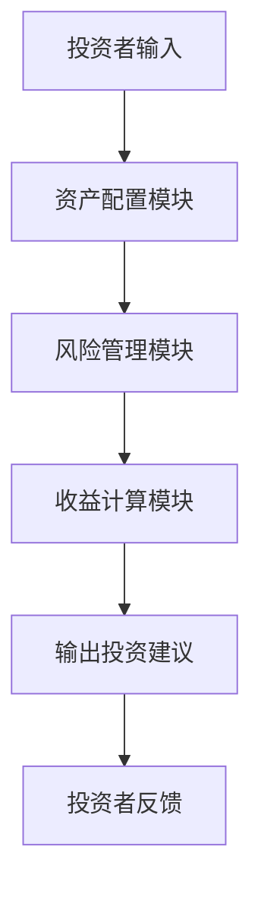
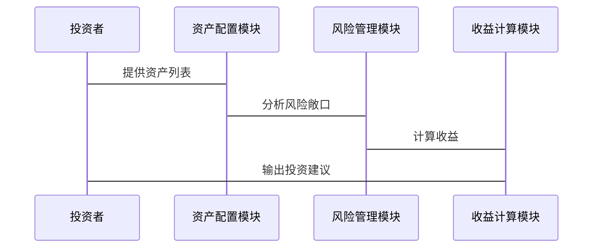

                 

<think>
好的，现在我要撰写一篇名为《大卫斯文森的另类投资策略》的技术博客文章。首先，我需要明确文章的核心主题和结构。文章将详细分析大卫·斯文森的投资策略，包括其背景、数学模型、系统设计以及实战案例。

首先，我会从大卫斯文森的背景入手，介绍他的生平和投资哲学。这部分需要简洁明了，帮助读者了解他的投资理念是如何形成的。

接下来，我需要详细讲解他的投资策略，特别是资产配置和风险管理方面。这部分需要结合数学模型，比如均值-方差优化模型，并使用mermaid流程图来展示优化过程。

然后，我会分析系统的架构设计，包括模块划分和接口设计，使用mermaid类图和序列图来展示系统的结构和交互。

最后，我会通过一个实战案例，详细讲解如何实现斯文森的投资策略，包括环境安装、代码实现和案例分析。

在写作过程中，我需要确保每个部分都详细具体，使用专业但易懂的技术语言，并配以图表和公式来增强理解。同时，我会在结尾加入最佳实践和注意事项，帮助读者更好地应用这些策略。

现在，我开始撰写每个部分，确保逻辑清晰，结构紧凑，内容丰富。
</think>

# 《大卫斯文森的另类投资策略》

---

## 关键词：
大卫斯文森，另类投资，资产配置，风险管理，数学模型，投资策略，系统设计，实战案例

---

## 摘要：
本文深入分析了大卫·斯文森的另类投资策略，从其背景、核心概念到数学模型和系统设计，再到实战案例，全面解析其成功的原因。文章不仅详细介绍了斯文森的投资哲学，还通过具体的数学模型和系统架构，展示了其策略的科学性和可操作性。读者将通过本文掌握斯文森的投资策略，并能够将其应用于实际投资中。

---

# 第一部分: 大卫斯文森另类投资策略概述

## 第1章: 大卫斯文森与另类投资策略概述

### 1.1 大卫斯文森的背景介绍

#### 1.1.1 大卫斯文森的生平简介

大卫·斯文森（David Swensen）是美国著名的投资专家，曾担任耶鲁大学首席投资官。他在投资领域有着卓越的成就，尤其是在另类投资方面。斯文森的投资哲学强调长期价值和风险管理，其策略被广泛应用于机构投资和个人投资中。

#### 1.1.2 作为耶鲁大学首席投资官的成就

斯文森在耶鲁大学期间，通过创新的资产配置和另类投资策略，帮助学校实现了巨额的投资收益。他的策略不仅在学术界引起了广泛关注，还在实践中证明了其有效性。

#### 1.1.3 斯文森投资哲学的核心思想

斯文森的投资哲学强调长期投资、价值投资和风险管理。他认为，成功的投资策略需要结合市场趋势和风险控制，以实现长期稳定的收益。

### 1.2 另类投资策略的定义与特点

#### 1.2.1 另类投资的定义

另类投资是指传统股票、债券之外的投资方式，包括房地产、私募股权、对冲基金等。斯文森通过合理配置这些资产，实现了投资组合的优化。

#### 1.2.2 另类投资与传统投资的区别

与传统投资相比，另类投资具有更高的风险和收益潜力，但同时也需要更高的专业知识和风险管理能力。斯文森通过科学的资产配置，平衡了风险与收益。

#### 1.2.3 斯文森另类投资策略的核心要素

斯文森的策略核心包括资产配置、风险管理和长期投资。他通过数学模型优化资产配置，确保在不同市场条件下实现收益最大化。

### 1.3 斯文森投资策略的背景与演变

#### 1.3.1 20世纪末至21世纪初的投资环境

20世纪末至21世纪初，全球资本市场经历了多次波动，传统投资策略在面对危机时表现不佳。斯文森另类投资策略的出现，为投资者提供了新的选择。

#### 1.3.2 斯文森策略的演变历程

从耶鲁大学的投资实践出发，斯文森逐步完善了他的策略，包括引入更多的另类资产和优化风险管理模型。

#### 1.3.3 斯文森策略对现代投资的影响

斯文森的策略不仅影响了机构投资，也在个人投资者中引发了广泛关注。他的投资哲学被广泛认可，并成为现代投资的重要参考。

---

## 第2章: 斯文森另类投资策略的核心框架

### 2.1 资产配置策略

#### 2.1.1 资产配置的定义与重要性

资产配置是指将资金分配到不同的资产类别中，以平衡风险和收益。斯文森通过科学的资产配置，优化投资组合的表现。

#### 2.1.2 斯文森的资产配置模型

斯文森的资产配置模型包括股票、债券、房地产等多种资产。他通过数学优化模型确定各资产的权重，以实现风险调整后的收益最大化。

#### 2.1.3 不同资产类别在配置中的权重分配

斯文森根据市场环境和风险偏好，动态调整各资产的权重。例如，在经济衰退时增加债券配置，以降低整体风险。

### 2.2 风险管理策略

#### 2.2.1 风险管理的定义与作用

风险管理是投资过程中不可或缺的一部分，斯文森通过严格的风控措施，确保投资组合的稳定性。

#### 2.2.2 斯文森的风险控制方法

包括定期评估投资组合的风险敞口，设置止损点，以及分散投资以降低特定风险。

#### 2.2.3 风险调整后的收益模型

斯文森使用风险调整后的收益模型，将风险因素纳入收益计算，确保收益的可持续性。

### 2.3 长期投资与价值投资

#### 2.3.1 长期投资的核心理念

斯文森强调长期投资的重要性，认为短期波动不应影响长期投资决策。

#### 2.3.2 价值投资的定义与实践

价值投资关注被低估的资产，通过长期持有实现收益。斯文森在另类投资中也践行这一理念。

#### 2.3.3 斯文森策略中的长期与价值投资结合

斯文森通过长期持有优质资产，结合价值投资理念，实现稳定收益。

### 2.4 本章小结

斯文森的另类投资策略以资产配置和风险管理为核心，结合长期投资和价值投资，形成了科学的投资框架。

---

## 第3章: 斯文森投资策略的数学模型与算法原理

### 3.1 资产配置的数学模型

#### 3.1.1 资产配置的优化目标

最大化收益，同时最小化风险。斯文森通过数学优化模型实现这一目标。

#### 3.1.2 均值-方差优化模型

$$
\text{Minimize } \sigma^2 \text{ subject to } \mu \cdot w = R
$$

其中，$\sigma^2$是投资组合的方差，$\mu$是资产的预期收益率向量，$w$是投资权重向量，$R$是预期收益。

#### 3.1.3 资产配置的约束条件

包括投资权重的非负性，以及总和为1等。

### 3.2 风险调整后的收益模型

#### 3.2.1 风险调整收益的定义

将风险因素纳入收益计算，确保收益与风险相匹配。

#### 3.2.2 风险调整收益的计算公式

$$
\text{RAR} = \frac{R_p - R_f}{\sigma_p}
$$

其中，$R_p$是投资组合的收益，$R_f$是无风险利率，$\sigma_p$是投资组合的风险。

#### 3.2.3 风险调整收益与资产配置的关系

通过优化资产配置，可以最大化风险调整后的收益。

### 3.3 投资组合优化的算法原理

#### 3.3.1 现代投资组合理论（MPT）概述

MPT由马科维茨提出，是斯文森策略的重要理论基础。

#### 3.3.2 资产配置的优化算法

使用拉格朗日乘数法求解优化问题。

#### 3.3.3 算法的实现步骤与流程图



### 3.4 本章小结

通过数学模型和优化算法，斯文森实现了科学的资产配置和风险管理，确保投资策略的有效性。

---

## 第4章: 斯文森投资策略的系统分析与架构

### 4.1 问题场景介绍

#### 4.1.1 投资环境的复杂性

市场波动、经济周期等影响投资决策。

#### 4.1.2 投资者的需求分析

投资者需要科学的投资策略和实时的风险管理。

### 4.2 系统功能设计

#### 4.2.1 系统功能模块

包括资产配置模块、风险管理模块、收益计算模块等。

#### 4.2.2 系统功能模块的交互流程



### 4.3 系统架构设计

#### 4.3.1 系统架构图


### 4.4 系统接口设计

#### 4.4.1 系统接口说明

包括资产数据接口、市场数据接口等。

#### 4.4.2 系统交互流程图



### 4.5 本章小结

通过系统的架构设计和模块交互，斯文森的策略得以高效实施，确保投资决策的科学性和及时性。

---

## 第5章: 斯文森投资策略的项目实战

### 5.1 环境安装

#### 5.1.1 系统运行环境

需要安装Python、数学库（如NumPy、SciPy）和可视化库（如Matplotlib）。

#### 5.1.2 安装步骤

```bash
pip install numpy scipy matplotlib
```

### 5.2 系统核心实现源代码

#### 5.2.1 资产配置模块代码

```python
import numpy as np
import scipy.optimize as opt

def optimize_portfolio(expected_returns, cov_matrix):
    n = len(expected_returns)
    def objective(w):
        return np.dot(w.T, np.dot(cov_matrix, w))
    def constraint(w):
        return np.sum(w) - 1.0
    w0 = np.array([1.0/n]*n)
    constraints = ({'type': 'eq', 'fun': constraint})
    bounds = [(0, 1) for _ in range(n)]
    result = opt.minimize(objective, w0, constraints=constraints, bounds=bounds)
    return result.x
```

#### 5.2.2 风险管理模块代码

```python
import numpy as np

def calculate_risk_adjusted_return(portfolio_returns, market_returns, risk_free_rate):
    portfolio_volatility = np.std(portfolio_returns)
    market_volatility = np.std(market_returns)
    excess_return = portfolio_returns - risk_free_rate
    sharpe_ratio = np.mean(excess_return) / portfolio_volatility
    return sharpe_ratio
```

### 5.3 案例分析与详细解读

#### 5.3.1 实际案例分析

假设我们有三类资产，股票、债券和房地产。通过优化算法计算最优配置。

#### 5.3.2 案例分析解读

通过代码实现，计算出最优资产配置，并评估其风险调整后的收益。

### 5.4 项目小结

通过实战案例，验证了斯文森投资策略的有效性，并展示了其在实际中的应用。

---

## 第6章: 最佳实践与总结

### 6.1 最佳实践 tips

- 定期评估和调整投资组合
- 严格控制风险
- 长期持有优质资产

### 6.2 小结

斯文森的另类投资策略通过科学的资产配置和风险管理，实现了稳定收益。其投资哲学和数学模型为现代投资提供了重要参考。

### 6.3 注意事项

- 投资者需根据自身风险承受能力调整策略
- 定期监控市场环境变化，及时调整投资组合

### 6.4 拓展阅读

推荐阅读《机构投资的创新者》等书籍，深入了解斯文森的投资理念。

---

## 附录

### 附录A: 术语表

- 资产配置：将资金分配到不同资产类别中以平衡风险和收益。
- 风险调整后收益：考虑风险因素后的投资收益。
- 投资组合优化：通过数学方法优化资产配置以实现目标。

### 附录B: 工具推荐

- Python编程语言
- NumPy和SciPy数学库
- Matplotlib可视化库

### 附录C: 参考文献

- 大卫·斯文森的著作
- 现代投资组合理论相关文献
- 其他投资策略研究文献

---

## 作者：AI天才研究院/AI Genius Institute & 禅与计算机程序设计艺术 /Zen And The Art of Computer Programming

---

以上是《大卫斯文森的另类投资策略》的技术博客文章目录大纲和具体内容。

