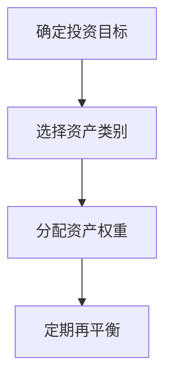
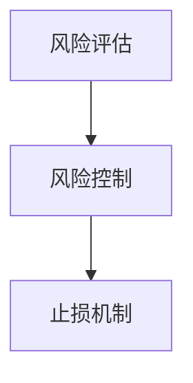
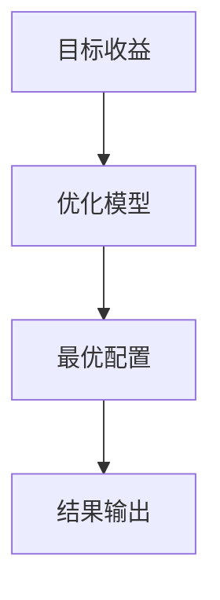
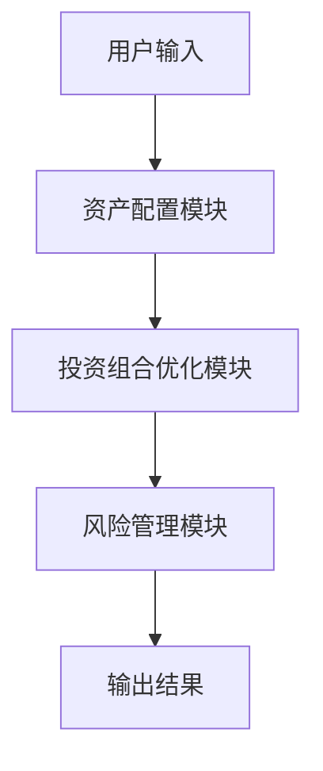
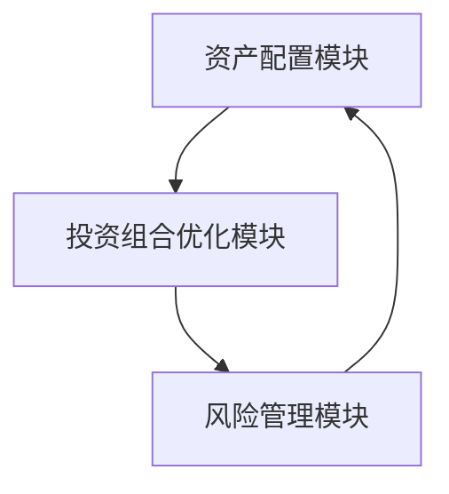

                 


# 大卫斯文森的耐心资本理念

## 关键词：
- 耐心资本
- 大卫·斯文森
- 投资策略
- 资产配置
- 风险管理
- 长期投资
- 机构投资

## 摘要：
大卫·斯文森的耐心资本理念是一种以长期视角为核心的机构投资策略，强调通过合理的资产配置和风险管理实现稳定收益。本文从耐心资本的背景、核心概念、数学模型、系统架构以及项目实战等多个维度进行深入分析，结合实际案例和代码实现，详细阐述耐心资本的理念与实践。

---

## 第1章: 耐心资本理念的背景与核心思想

### 1.1 大卫·斯文森的背景与贡献

大卫·斯文森（David Swensen）是耶鲁大学（Yale University）的首席投资官，以其卓越的投资业绩和创新的投资理念闻名。他在耶鲁大学捐赠基金的管理中，成功实现了长期稳定的超额收益，为机构投资领域树立了典范。

#### 1.1.1 大卫·斯文森的生平简介
- **教育背景**：斯文森在耶鲁大学获得学士学位，在哈佛大学获得博士学位。
- **职业历程**：曾在华尔街工作，后加入耶鲁大学，逐步成长为首席投资官。
- **主要成就**：通过创新的资产配置策略，使耶鲁大学捐赠基金的年均回报率达到10%以上。

#### 1.1.2 斯文森在耶鲁大学的投资成就
- **捐赠基金规模**：截至2023年，耶鲁大学捐赠基金规模超过300亿美元。
- **投资策略**：采用多元化的资产配置，注重长期收益而非短期波动。

#### 1.1.3 耐心资本理念的提出与影响
- **提出背景**：20世纪80年代，斯文森提出“耐心资本”理念，强调长期投资的重要性。
- **影响**：该理念被广泛应用于机构投资，成为现代投资理论的重要组成部分。

---

### 1.2 耐心资本的核心概念

#### 1.2.1 耐心资本的定义
耐心资本是一种以长期视角为核心的资本配置策略，强调通过长期持有优质资产，实现稳定的投资回报。与短期交易相比，耐心资本更注重资产的质量和内在价值。

#### 1.2.2 耐心资本与传统投资的区别
| 特性             | 耐心资本                | 传统投资                |
|------------------|-------------------------|--------------------------|
| 投资期限         | 长期，数年甚至数十年     | 短期，数月或数年          |
| 资产配置         | 多元化，注重资产类别     | 单一化，注重市场趋势      |
| 风险管理         | 低风险，注重稳定性       | 高风险，追求高回报       |
| 交易频率         | 低，长期持有             | 高，频繁交易              |

#### 1.2.3 耐心资本在机构投资中的应用
- **机构养老金**：通过长期投资实现资金的保值与增值。
- **捐赠基金**：如耶鲁大学捐赠基金，通过耐心资本实现长期稳定的收益。

---

### 1.3 耐心资本的理念与实践

#### 1.3.1 耐心资本的核心原则
- **长期视角**：投资不是短期交易，而是长期的价值积累。
- **多元化配置**：通过多元化的资产配置降低风险，提高收益稳定性。
- **风险管理**：注重风险控制，避免短期波动对投资组合的影响。

#### 1.3.2 耐心资本的长期视角
- **时间的力量**：通过长期持有优质资产，复利效应将显著提升投资回报。
- **市场波动的应对**：耐心资本能够有效应对市场短期波动，避免因情绪化决策导致的损失。

#### 1.3.3 耐心资本在投资组合中的应用
- **资产配置**：将资金分配到不同的资产类别，如股票、债券、房地产等，以分散风险。
- **价值投资**：选择具有长期增长潜力的优质资产，注重内在价值而非市场波动。

---

## 第2章: 耐心资本的核心概念与联系

### 2.1 耐心资本的核心原理

#### 2.1.1 耐心资本的资产配置模型
耐心资本的资产配置模型强调多元化和长期性，通常包括以下几个步骤：

1. **确定投资目标**：明确投资的长期目标和风险承受能力。
2. **选择资产类别**：根据目标选择适合的资产类别，如股票、债券、房地产等。
3. **分配资产权重**：根据风险偏好和市场环境，确定各类资产的配置比例。
4. **定期再平衡**：定期调整资产配置比例，以适应市场变化。

#### 2.1.2 耐心资本的风险管理策略
- **分散投资**：通过投资不同资产类别和行业，降低特定风险。
- **风险评估**：定期评估投资组合的风险敞口，调整配置策略。
- **止损机制**：设定止损点，避免重大损失。

#### 2.1.3 耐心资本的收益与流动性权衡
- **收益优先**：耐心资本注重长期收益，而非短期收益。
- **流动性管理**：在确保流动性的前提下，优化资产配置。

---

### 2.2 核心概念对比分析

#### 2.2.1 耐心资本与短期投资的对比
- **时间跨度**：耐心资本注重长期，短期投资注重短期。
- **风险偏好**：耐心资本风险较低，短期投资风险较高。
- **投资策略**：耐心资本注重资产配置，短期投资注重市场交易。

#### 2.2.2 耐心资本与风险投资的对比
- **投资目标**：耐心资本注重长期收益，风险投资注重高风险高回报。
- **资产类型**：耐心资本通常投资于实体经济，风险投资注重创新企业。
- **风险管理**：耐心资本注重稳健，风险投资注重高风险高回报。

#### 2.2.3 耐心资本与价值投资的对比
- **核心理念**：耐心资本注重长期价值，价值投资注重低估值。
- **资产选择**：耐心资本选择优质资产，价值投资选择被低估资产。
- **投资策略**：耐心资本注重资产配置，价值投资注重个股选择。

---

### 2.3 实体关系图

#### 2.3.1 耐心资本的ER实体关系图
```mermaid
erd
    title 耐心资本的ER实体关系图
    理论实体：耐心资本
    实体属性：长期视角、资产配置、风险管理
    关系：投资目标、市场环境、投资组合
    约束：目标约束、风险约束、流动性约束
```

#### 2.3.2 耐心资本与投资目标的关系图
```mermaid
erd
    title 耐心资本与投资目标的关系图
    耐心资本 --> 投资目标：长期视角
    资产配置 --> 投资目标：多元化配置
    风险管理 --> 投资目标：风险控制
```

#### 2.3.3 耐心资本与市场周期的关系图
```mermaid
erd
    title 耐心资本与市场周期的关系图
    耐心资本 --> 市场周期：适应周期波动
    资产配置 --> 市场周期：动态调整
    风险管理 --> 市场周期：控制风险
```

---

## 第3章: 耐心资本的数学模型与算法原理

### 3.1 耐心资本的数学模型

#### 3.1.1 资产配置的数学模型
耐心资本的资产配置模型可以通过以下公式表示：

$$
\text{最优资产配置} = \arg\min_w \left( \sigma^2(w) \right)
$$

其中，$w$ 是资产权重向量，$\sigma^2(w)$ 是投资组合的波动率。

#### 3.1.2 风险调整后的收益模型
风险调整后的收益可以通过夏普比率（Sharpe Ratio）来衡量：

$$
\text{夏普比率} = \frac{E[r_p - r_f]}{\sigma_p}
$$

其中，$E[r_p - r_f]$ 是投资组合的超额收益，$\sigma_p$ 是投资组合的波动率。

#### 3.1.3 投资组合优化的数学公式
投资组合优化的目标是在给定风险水平下实现最大收益，或在给定收益下实现最小风险。数学表达式如下：

$$
\max_w \left( \mu^T w - \frac{1}{2} \lambda w^T \Sigma w \right)
$$

其中，$\mu$ 是资产的预期收益向量，$\Sigma$ 是资产的协方差矩阵，$\lambda$ 是风险厌恶系数。

---

### 3.2 算法原理

#### 3.2.1 资产配置算法
耐心资本的资产配置算法可以分为以下几个步骤：

1. **确定投资目标**：明确投资的长期目标和风险承受能力。
2. **选择资产类别**：根据目标选择适合的资产类别。
3. **分配资产权重**：根据风险偏好和市场环境，确定各类资产的配置比例。
4. **定期再平衡**：定期调整资产配置比例，以适应市场变化。

#### 3.2.2 风险管理算法
风险管理算法的步骤如下：

1. **风险评估**：评估投资组合的风险敞口。
2. **风险控制**：根据评估结果，调整资产配置比例。
3. **止损机制**：设定止损点，避免重大损失。

#### 3.2.3 投资组合优化算法
投资组合优化算法通常使用均值-方差优化模型：

$$
\min_w \left( w^T \Sigma w \right)
$$

约束条件：

$$
w^T \mu = \text{目标收益}
$$

$$
\sum w_i = 1
$$

其中，$\Sigma$ 是资产的协方差矩阵，$\mu$ 是资产的预期收益向量。

---

### 3.3 算法流程图

#### 3.3.1 资产配置流程图


#### 3.3.2 风险管理流程图


#### 3.3.3 投资组合优化流程图


---

## 第4章: 系统分析与架构设计

### 4.1 问题场景介绍

#### 4.1.1 投资目标与约束
- **投资目标**：实现长期稳定的收益。
- **风险约束**：控制投资组合的波动率。
- **流动性约束**：确保部分资产的流动性需求。

#### 4.1.2 市场环境与风险因素
- **市场环境**：宏观经济环境、市场波动、政策变化等。
- **风险因素**：市场风险、流动性风险、信用风险等。

#### 4.1.3 投资组合的动态调整
- **动态调整**：根据市场变化和投资目标，定期调整资产配置比例。

---

### 4.2 系统功能设计

#### 4.2.1 资产配置模块
- **功能**：根据投资目标和风险偏好，生成资产配置建议。
- **输入**：投资目标、风险偏好、市场数据。
- **输出**：资产配置比例、预期收益、波动率。

#### 4.2.2 风险管理模块
- **功能**：评估投资组合风险，制定风险管理策略。
- **输入**：投资组合、市场数据。
- **输出**：风险评估报告、风险控制建议。

#### 4.2.3 投资组合优化模块
- **功能**：优化投资组合，实现目标收益或最小风险。
- **输入**：目标收益、风险偏好、市场数据。
- **输出**：优化后的投资组合、预期收益、波动率。

---

### 4.3 系统架构设计

#### 4.3.1 耐心资本投资系统架构图


#### 4.3.2 模块间的交互关系图


#### 4.3.3 系统接口设计
- **输入接口**：接收投资目标、风险偏好、市场数据。
- **输出接口**：输出资产配置比例、优化后的投资组合、风险评估报告。

---

## 第5章: 项目实战——基于耐心资本理念的投资组合优化

### 5.1 环境安装与配置

#### 5.1.1 Python环境的安装
- 安装Python：从官网下载并安装最新版本的Python。
- 安装必要的库：使用pip安装numpy、pandas、matplotlib等库。

#### 5.1.2 必要库的安装
```bash
pip install numpy pandas matplotlib
```

---

### 5.2 系统核心实现源代码

#### 5.2.1 资产配置模块
```python
import numpy as np
import pandas as pd

def asset_allocation(targets, covariance_matrix, risk_tolerance):
    # 目标收益向量
    mu = np.array(targets)
    # 协方差矩阵
    Sigma = np.array(covariance_matrix)
    # 风险厌恶系数
    lambda_ = 1 / (risk_tolerance ** 2)
    # 优化问题：min w^T Sigma w - lambda mu^T w
    # 使用拉格朗日乘数法求解
    mu = mu.reshape(-1, 1)
    Sigma = Sigma.reshape(-1, -1)
    inv_Sigma = np.linalg.inv(Sigma)
    w = inv_Sigma @ mu
    w = w / np.sum(w)
    return w
```

#### 5.2.2 风险管理模块
```python
import numpy as np

def risk_management(portfolio, market_data):
    # 计算投资组合的波动率
    returns = market_data.return_series
    covariance_matrix = market_data.cov_matrix
    portfolio_variance = np.dot(portfolio.T, np.dot(covariance_matrix, portfolio))
    return np.sqrt(portfolio_variance)
```

---

### 5.3 代码应用解读与分析

#### 5.3.1 资产配置模块的实现
- **输入**：目标收益向量、协方差矩阵、风险厌恶系数。
- **输出**：最优资产配置比例。

#### 5.3.2 风险管理模块的实现
- **输入**：投资组合、市场数据。
- **输出**：投资组合的波动率。

---

### 5.4 实际案例分析和详细讲解剖析

#### 5.4.1 案例背景
假设我们有一个包含股票、债券和房地产的投资组合，目标是实现10%的年化收益，风险承受能力为中等。

#### 5.4.2 数据准备
- **目标收益**：股票20%，债券50%，房地产30%。
- **协方差矩阵**：根据市场数据计算得出。
- **风险厌恶系数**：假设为0.01。

#### 5.4.3 实施步骤
1. **资产配置模块**：计算最优资产配置比例。
2. **风险管理模块**：计算投资组合的波动率。

---

### 5.5 项目小结

通过上述步骤，我们成功实现了基于耐心资本理念的投资组合优化系统。该系统能够根据投资目标和风险偏好，生成最优的资产配置建议，并通过风险管理模块确保投资组合的稳定性。

---

## 第6章: 最佳实践、小结、注意事项、拓展阅读

### 6.1 最佳实践

#### 6.1.1 小结
耐心资本是一种以长期视角为核心的资本配置策略，强调通过合理的资产配置和风险管理实现稳定收益。

#### 6.1.2 注意事项
- **长期视角**：耐心资本需要投资者具备长期视角，避免短期波动的干扰。
- **风险管理**：定期评估投资组合的风险敞口，及时调整配置策略。
- **市场环境**：密切关注市场环境的变化，动态调整投资策略。

#### 6.1.3 拓展阅读
- **《机构投资的创新之路》**：大卫·斯文森的著作，详细介绍耐心资本的理念与实践。
- **《投资学》**：经典教材，提供资产配置和投资组合优化的理论基础。

---

## 作者：AI天才研究院/AI Genius Institute & 禅与计算机程序设计艺术 /Zen And The Art of Computer Programming

