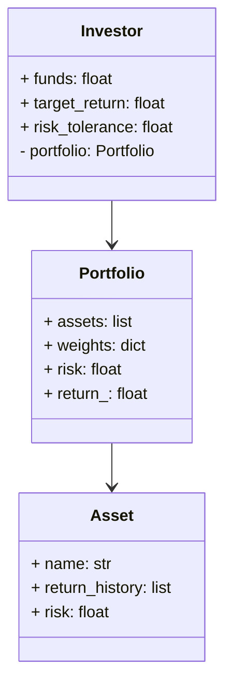

                 


# 大卫斯文森的长期资本配置

> 关键词：长期资本配置，大卫·斯文森，资产配置，投资组合，风险管理

> 摘要：大卫·斯文森是耶鲁大学的首席投资官，以其长期资本配置策略闻名。本文详细分析了长期资本配置的核心概念、算法原理、系统架构及实战案例，帮助读者理解如何在实际投资中应用这些策略。

---

## 第一部分: 长期资本配置的背景与核心概念

### 第1章: 长期资本配置的背景与问题背景

#### 1.1 什么是长期资本配置

- **长期资本配置**是指在较长的时间跨度内，将资金分配到不同的资产类别或资产组合中，以实现特定的财务目标。  
- 它的核心在于通过科学的资产分配和风险管理，最大化收益并降低风险。

#### 1.2 问题背景与问题描述

- 当前资本市场面临波动性高、风险多样化等挑战。  
- 长期资本配置能够帮助投资者在不确定性中保持稳健的投资回报。  
- 通过长期视角，投资者可以避免短期波动的干扰，实现资产的可持续增长。

#### 1.3 大卫·斯文森的长期资本配置理念

- **大卫·斯文森**是耶鲁大学捐赠基金的首席投资官，他提出了基于长期视角的资产配置策略。  
- **核心目标**是通过多元化的资产配置和严格的风控，实现长期稳定的收益。  
- **实现路径**包括：  
  1. 分散投资：将资金分配到不同的资产类别，降低风险。  
  2. 长期持有：避免频繁交易，减少成本。  
  3. 动态调整：根据市场变化定期优化配置。

---

### 第2章: 长期资本配置的核心概念与联系

#### 2.1 核心概念原理

- **资产配置模型**：确定各类资产的权重，构建最优投资组合。  
- **风险管理策略**：通过量化风险，制定应对措施。  
- **分散投资原则**：通过多元化的资产配置降低风险。

#### 2.2 ER实体关系图架构

```mermaid
erDiagram
    investor --> investment_account
    investment_account --> asset_allocation_model
    asset_allocation_model --> risk_management_strategy
    risk_management_strategy --> diversification_portfolios
```

---

## 第二部分: 长期资本配置的算法原理

### 第3章: 现代投资组合理论与算法原理

#### 3.1 现代投资组合理论的数学模型

- **均值-方差优化模型**：  
  $$\text{Minimize } \sigma^2 \text{ subject to } \mu^T w = T$$  
  其中，$\sigma^2$是投资组合的方差，$\mu$是资产的期望收益向量，$w$是投资权重，$T$是目标收益。

- **马科维茨有效前沿理论**：通过优化风险和收益的关系，找到最优投资组合。

#### 3.2 算法实现与代码分析

- Python代码实现均值-方差优化：

```python
import numpy as np
import pandas as pd
from scipy.optimize import minimize

def optimize_portfolio(returns):
    # 定义目标函数
    def objective(weights):
        return np.dot(weights.T, np.dot(returns.cov(), weights))
    
    # 约束条件：权重之和为1
    def constraint(weights):
        return np.sum(weights) - 1
    
    # 初始猜测：等权分配
    n = len(returns.columns)
    initial_guess = np.array([1.0/n]*n)
    
    # 优化
    result = minimize(objective, initial_guess, method='SLSQP', 
                      constraints={'type': 'eq', 'fun': constraint})
    
    return result.x

# 示例数据
returns = pd.DataFrame({'A': [0.1, 0.2, 0.15], 
                         'B': [0.05, 0.1, 0.08], 
                         'C': [0.12, 0.08, 0.1]})
weights = optimize_portfolio(returns)
print(weights)
```

---

### 第4章: 系统架构与投资实战

#### 4.1 系统功能设计

- **系统功能模块**：
  - 数据收集与处理：获取各类资产的历史收益和风险数据。  
  - 模型构建：根据历史数据构建资产配置模型。  
  - 风险评估：计算投资组合的风险指标。  
  - 投资决策：根据模型输出制定投资策略。

- **领域模型类图**：



#### 4.2 投资实战案例

- **环境配置与代码实现**：

```python
import numpy as np
import pandas as pd

def calculate_efficient_frontier(returns, num_portfolios=1000):
    # 计算所有可能的组合
    n = len(returns.columns)
    returns = pd.DataFrame(returns.values.T, columns=returns.columns)
    all_weights = []
    all_returns = []
    all_vols = []
    
    for _ in range(num_portfolios):
        weights = np.random.dirichlet([1]*n)
        portfolio_return = np.dot(weights, returns.mean())
        portfolio_volatility = np.sqrt(np.dot(weights.T, 
                                              np.dot(returns.cov(), weights)))
        all_weights.append(weights)
        all_returns.append(portfolio_return)
        all_vols.append(portfolio_volatility)
    
    # 找到有效前沿
    ef = pd.DataFrame({'Return': all_returns, 'Volatility': all_vols})
    ef = ef.sort_values('Volatility')
    ef['Efficient'] = ef['Volatility'] == ef['Volatility'].min()
    
    return ef

# 示例数据
returns = pd.DataFrame({'A': [0.1, 0.2, 0.15], 
                         'B': [0.05, 0.1, 0.08], 
                         'C': [0.12, 0.08, 0.1]})
frontier = calculate_efficient_frontier(returns)
print(frontier.head())
```

---

## 总结

大卫·斯文森的长期资本配置策略为投资者提供了科学的资产管理和风险控制方法。通过本文的分析，读者可以深入了解长期资本配置的核心概念、算法原理和实战应用。未来，随着市场的变化和技术的发展，长期资本配置策略将继续优化，为投资者创造更多价值。

---

**作者：AI天才研究院/AI Genius Institute & 禅与计算机程序设计艺术 /Zen And The Art of Computer Programming**

