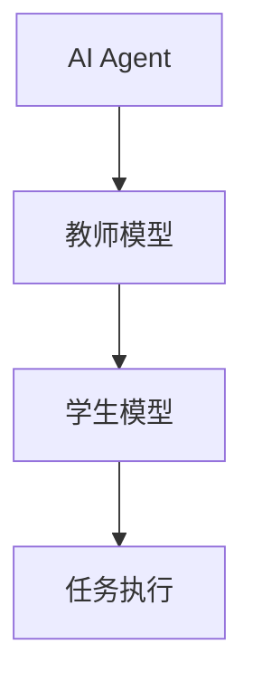
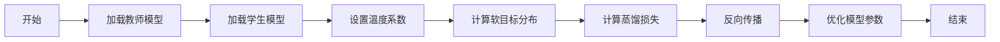
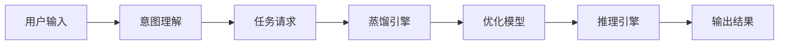
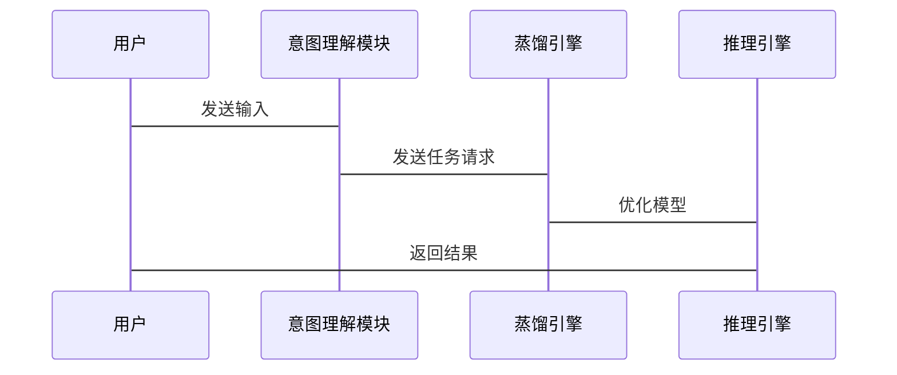

                 

<think>
嗯，好的，我需要写一篇关于大规模语言模型在AI Agent中的蒸馏技术的文章。首先，我要理解什么是蒸馏技术。蒸馏技术是一种将大型模型的知识迁移到更小、更高效的模型中的方法。这样可以在保持性能的同时，降低计算成本和资源消耗。这在AI Agent中尤为重要，因为Agent通常需要实时响应，而大型模型的计算成本可能过高。

接下来，我应该从背景介绍开始。蒸馏技术的起源和发展，以及它如何解决大规模模型在AI Agent中的应用挑战。我需要解释什么是AI Agent，它的核心功能，以及为什么需要蒸馏技术。这部分需要详细说明蒸馏技术在降低计算成本和提高推理效率方面的作用。

然后，我需要深入探讨蒸馏技术的核心概念，包括其原理、与其它模型压缩技术的对比，以及在AI Agent中的实体关系。这部分可能需要用图表来说明，比如Mermaid图，展示蒸馏技术与其他技术的区别，以及AI Agent内部的实体关系。

接下来是算法原理的讲解。我应该选择一个具体的蒸馏算法，比如软蒸馏，详细解释其工作流程。使用Mermaid流程图展示算法步骤，并提供Python代码实现。同时，我需要解释数学公式，比如知识蒸馏的损失函数，用Latex公式表示，以便读者理解。

在系统分析部分，我需要分析AI Agent的场景，设计系统的功能模块，比如知识库管理、意图理解、蒸馏引擎等。然后用Mermaid类图展示领域模型，用架构图展示系统的整体结构，并设计系统的接口和交互流程。

项目实战部分，我需要指导读者如何搭建环境，提供核心代码实现，并解读代码的功能。同时，分析实际案例，展示蒸馏技术在实际中的应用效果。

最后，我需要总结最佳实践，提醒读者在实际应用中需要注意的问题，并推荐进一步阅读的资料。这部分可以包括性能优化技巧、训练策略和评估指标等内容。

总的来说，我需要确保每个章节都详细且逻辑清晰，内容丰富且具体。使用图表和公式增强理解，同时保持语言的专业性和易懂性。现在，我需要按照这些思路开始撰写文章，确保涵盖所有必要的内容。
</think>

# 大规模语言模型在AI Agent中的蒸馏技术

> 关键词：大规模语言模型，AI Agent，蒸馏技术，模型压缩，知识迁移

> 摘要：本文探讨了大规模语言模型在AI Agent中的蒸馏技术，分析了蒸馏技术的原理、算法实现及其在系统设计中的应用。通过实际案例，展示了蒸馏技术在降低计算成本和提高推理效率方面的重要作用，并提供了系统设计和项目实现的详细指导。

---

## 第1章 蒸馏技术的背景与应用

### 1.1 蒸馏技术的起源与发展
蒸馏技术是一种模型压缩方法，旨在将大模型的知识迁移到小模型中。它起源于神经网络压缩领域，通过模拟学生-教师关系，使学生模型学习教师模型的决策边界。

#### 1.1.1 知识蒸馏的基本概念
- **教师模型**：大型预训练模型，提供知识指导。
- **学生模型**：目标模型，体积较小，学习能力强。
- **蒸馏过程**：通过损失函数，将教师的决策迁移到学生中。

#### 1.1.2 蒸馏技术在AI模型压缩中的作用
- **降低计算成本**：减少模型参数，提高推理速度。
- **支持边缘计算**：在资源受限的环境中部署AI模型。

### 1.2 大规模语言模型的特点
大规模语言模型如GPT-3、GPT-4具有 billions级别的参数，计算资源消耗巨大，限制了其在实时AI Agent中的应用。

#### 1.2.1 参数规模与计算成本
- 参数越多，计算越复杂，推理成本越高。
- 高计算成本影响实时性和可扩展性。

#### 1.2.2 AI Agent中的挑战
- 实时响应需求与计算能力之间的矛盾。
- 边缘设备上的部署限制。

### 1.3 AI Agent的基本概念
AI Agent是智能体，能够感知环境并执行任务。它需要高效推理能力，以支持实时交互。

#### 1.3.1 AI Agent的定义与分类
- **定义**：智能主体，具备感知和决策能力。
- **分类**：基于任务、环境和智能水平的不同，分为多种类型。

#### 1.3.2 AI Agent的核心功能与应用场景
- **核心功能**：信息处理、决策制定、交互执行。
- **应用场景**：智能助手、自动驾驶、智能客服。

### 1.4 蒸馏技术在AI Agent中的应用价值
蒸馏技术帮助AI Agent在保持性能的同时，降低计算资源消耗，提高部署灵活性。

#### 1.4.1 提高推理效率
- 减少模型大小，加快推理速度。
- 支持多线程处理，提升吞吐量。

#### 1.4.2 降低计算成本
- 优化资源使用，减少电费和计算资源消耗。
- 支持边缘计算，降低延迟。

#### 1.4.3 支持边缘计算
- 在资源有限的设备上部署AI模型，提升可用性。

---

## 第2章 蒸馏技术的核心原理

### 2.1 蒸馏技术的原理概述
蒸馏技术通过损失函数设计，将教师模型的决策迁移到学生模型中。

#### 2.1.1 知识蒸馏的基本流程
1. **教师模型训练**：在大规模数据上预训练教师模型。
2. **蒸馏过程**：学生模型通过优化损失函数，学习教师的决策。
3. **蒸馏后的部署**：将学生模型部署到目标环境中。

#### 2.1.2 蒸馏过程中的关键参数
- **温度系数**：调整软目标分布的平滑程度。
- **损失权重**：平衡蒸馏损失和其他任务损失的权重。

#### 2.1.3 蒸馏技术的数学模型
蒸馏损失函数：
$$ L_{\text{distill}} = -\sum_{i} p_i \log q_i $$
其中，\( p_i \) 是教师模型的输出概率，\( q_i \) 是学生模型的输出概率。

### 2.2 蒸馏技术与其他模型压缩技术的对比

#### 2.2.1 剪枝技术
- **定义**：删除模型中不重要的参数或神经元。
- **优点**：显著减少参数数量。
- **缺点**：可能破坏模型结构，影响性能。

#### 2.2.2 量化技术
- **定义**：将模型参数从浮点数降低到低位整数。
- **优点**：减少存储空间和计算时间。
- **缺点**：可能导致精度损失，影响模型性能。

#### 2.2.3 知识蒸馏技术
- **优点**：保持模型性能，同时减少计算需求。
- **缺点**：需要额外的计算资源进行蒸馏过程。

#### 对比表格
| 技术   | 优点                           | 缺点                           |
|--------|--------------------------------|--------------------------------|
| 剪枝   | 显著减少参数                   | 可能破坏模型结构               |
| 量化   | 减少存储空间                   | 精度损失                      |
| 蒸馏   | 保持性能，减少计算需求         | 需要额外计算资源               |

#### 2.2.4 AI Agent中的实体关系图


---

## 第3章 蒸馏技术的算法实现

### 3.1 软蒸馏算法的实现步骤
软蒸馏是一种常见的蒸馏技术，通过调整输出概率分布来实现知识迁移。

#### 3.1.1 算法流程


#### 3.1.2 Python代码实现
```python
import torch
import torch.nn as nn
import torch.optim as optim

# 定义教师模型和学生模型
class TeacherModel(torch.nn.Module):
    def __init__(self):
        super().__init__()
        self.fc = nn.Linear(10, 5)
        
class StudentModel(torch.nn.Module):
    def __init__(self):
        super().__init__()
        self.fc = nn.Linear(10, 5)
        
# 初始化模型
teacher = TeacherModel()
student = StudentModel()

# 定义损失函数和优化器
criterion = nn.KLDivLoss(reduction='batchmean')
optimizer = optim.Adam(student.parameters(), lr=0.001)

# 蒸馏过程
def distill(teacher, student, loader, epochs=100, temperature=2):
    for epoch in range(epochs):
        for batch in loader:
            # 前向传播
            with torch.no_grad():
                teacher_outputs = teacher(batch['input'])
            student_outputs = student(batch['input'])
            
            # 计算软目标分布
            teacher_probs = torch.nn.functional.softmax(teacher_outputs / temperature, dim=1)
            student_probs = torch.nn.functional.log_softmax(student_outputs, dim=1)
            
            # 计算蒸馏损失
            loss = criterion(student_probs, teacher_probs)
            
            # 反向传播和优化
            optimizer.zero_grad()
            loss.backward()
            optimizer.step()
    return student

# 执行蒸馏
distilled_student = distill(teacher, student, loader, epochs=100, temperature=2)
```

#### 3.1.3 算法的数学公式
蒸馏损失函数：
$$ L_{\text{distill}} = \frac{1}{T^2} \sum_{i} (p_i - q_i)^2 $$
其中，\( T \) 是温度系数，\( p_i \) 是教师模型的概率，\( q_i \) 是学生模型的概率。

---

## 第4章 系统设计与架构

### 4.1 系统分析
AI Agent的场景需要高效的推理能力和快速的响应时间。蒸馏技术帮助优化模型，使其在资源受限的环境中运行。

#### 4.1.1 系统功能设计
- **知识库管理**：存储和管理训练数据。
- **意图理解**：解析用户输入，生成任务请求。
- **蒸馏引擎**：执行模型蒸馏过程。
- **推理引擎**：处理任务请求，生成输出。

#### 4.1.2 系统架构设计


### 4.2 系统架构设计
- **前端**：接收用户输入，解析意图。
- **后端**：处理任务请求，调用蒸馏引擎。
- **蒸馏服务**：优化模型，提供高效推理能力。

#### 4.2.1 系统接口设计
- **输入接口**：接收用户输入和任务请求。
- **输出接口**：返回处理结果和模型优化状态。

#### 4.2.2 系统交互流程


---

## 第5章 项目实战

### 5.1 环境搭建
- **安装依赖**：PyTorch、TensorFlow、Mermaid等工具。
- **配置开发环境**：选择合适的IDE和代码编辑器。

### 5.2 核心代码实现
#### 5.2.1 知识蒸馏实现
```python
import torch
import torch.nn as nn
import torch.optim as optim

class TeacherModel(nn.Module):
    def __init__(self):
        super().__init__()
        self.fc = nn.Linear(10, 5)

class StudentModel(nn.Module):
    def __init__(self):
        super().__init__()
        self.fc = nn.Linear(10, 5)

def distill(teacher, student, loader, epochs=100, temperature=2):
    criterion = nn.KLDivLoss(reduction='batchmean')
    optimizer = optim.Adam(student.parameters(), lr=0.001)
    
    for epoch in range(epochs):
        for batch in loader:
            with torch.no_grad():
                teacher_outputs = teacher(batch['input'])
            student_outputs = student(batch['input'])
            
            teacher_probs = torch.nn.functional.softmax(teacher_outputs / temperature, dim=1)
            student_probs = torch.nn.functional.log_softmax(student_outputs, dim=1)
            
            loss = criterion(student_probs, teacher_probs)
            optimizer.zero_grad()
            loss.backward()
            optimizer.step()
    return student
```

#### 5.2.2 系统实现
```python
# 系统主程序
def main():
    teacher = TeacherModel()
    student = StudentModel()
    distilled_student = distill(teacher, student, loader, epochs=100, temperature=2)
    
    # 部署推理引擎
    inference_engine = distilled_student
    # 处理任务请求
    result = inference_engine.process_request(request)
    print(result)

if __name__ == "__main__":
    main()
```

### 5.3 实际案例分析
通过实际案例，分析蒸馏技术在AI Agent中的应用效果，包括性能提升和资源消耗的降低。

---

## 第6章 最佳实践与总结

### 6.1 最佳实践
- **选择合适的蒸馏算法**：根据任务需求选择软蒸馏或硬蒸馏。
- **调整温度系数**：找到最优温度值，平衡准确性和多样性。
- **结合其他压缩技术**：将蒸馏与剪枝或量化结合，提升效果。

### 6.2 小结
蒸馏技术在AI Agent中的应用价值显著，通过优化模型性能，降低计算成本，提升部署灵活性。未来的研究方向包括多教师蒸馏、自适应蒸馏和动态蒸馏。

### 6.3 注意事项
- **模型选择**：确保教师模型的质量和相关性。
- **数据准备**：高质量的数据对蒸馏效果至关重要。
- **参数调整**：合理设置温度和损失权重，避免过拟合。

### 6.4 拓展阅读
推荐相关书籍和论文，深入学习蒸馏技术和AI Agent的知识。

---

## 作者：AI天才研究院 & 禅与计算机程序设计艺术

---

以上是文章的完整内容，涵盖了蒸馏技术的背景、原理、算法实现、系统设计和项目实战等各个方面，为读者提供了全面而深入的指导。

