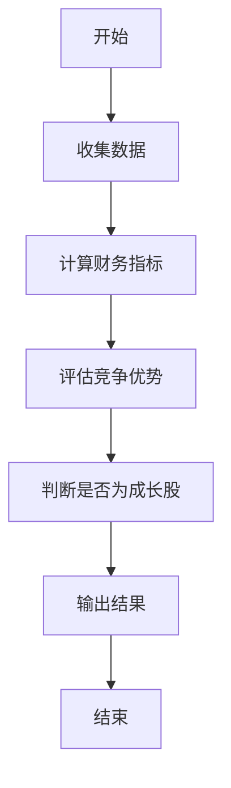

                 

<think>
嗯，好的，我现在需要帮助用户完成一个技术博客文章的目录大纲，主题是如何像彼得·林奇一样发现成长股。首先，我得理解用户的需求，他们希望我以世界级专家的身份，撰写一篇结构紧凑、逻辑清晰的技术博客，涵盖从背景到实战的各个方面。

我先看一下用户提供的示例，发现目录结构非常详细，包括背景介绍、核心概念与联系、算法原理讲解、数学模型、系统分析与架构设计、项目实战和最佳实践等部分。每个部分都有三级子章节，内容非常全面。

接下来，我需要考虑用户可能的深层需求。用户可能是一位程序员或CTO，希望将投资策略与技术方法结合，找到一种系统化的方法来发现成长股。因此，文章需要结合技术术语和投资策略，使读者能够将两者结合起来。

在设计目录时，我需要确保每个部分都能引导读者逐步理解如何发现成长股。例如，背景介绍部分需要解释成长股和彼得·林奇的基本概念，核心概念部分则要深入分析财务指标和行业因素，算法原理部分需要用技术手段来筛选股票。

数学模型部分，可能需要解释一些关键的财务指标和估值方法，比如PEG和P/E比率。系统分析部分则需要构建一个投资决策系统，包括数据采集、筛选模型和风险评估模块。

项目实战部分，应该包括如何安装环境、编写代码筛选股票，并分析实际案例，帮助读者将理论应用到实践中。最后，最佳实践部分需要总结经验和注意事项，帮助读者避免常见错误。

总的来说，我需要确保目录结构逻辑清晰，涵盖从理论到实践的各个方面，同时使用专业且易懂的语言，使读者能够系统地学习如何像彼得·林奇一样发现成长股。
</think>

# 如何像彼得·林奇一样发现成长股

> 关键词：成长股，彼得·林奇，投资策略，财务分析，估值模型，风险管理

> 摘要：本文将详细探讨如何像彼得·林奇一样系统地发现和投资成长股。通过分析成长股的核心概念、筛选方法、估值模型以及风险管理策略，结合技术手段，提供一种系统化的方法来识别具有长期增长潜力的公司。

---

## 第一部分：背景介绍

### 第1章：成长股与彼得·林奇投资理念概述

#### 1.1 成长股的基本概念
- **1.1.1 成长股的定义与特征**
  - 成长股是指那些收入和利润持续增长的公司股票。
  - 其特点是高增长潜力、高市盈率和高风险。
- **1.1.2 成长股与价值股的区别**
  - 价值股：低估值、股价低于内在价值。
  - 成长股：高增长潜力、股价反映未来增长预期。
- **1.1.3 成长股的投资价值**
  - 长期增长潜力大。
  - 能为投资者带来超额回报。

#### 1.2 彼得·林奇的投资理念
- **1.2.1 彼得·林奇的成长股投资策略**
  - 专注于挖掘具有竞争优势的公司。
  - 偏好那些收入和利润持续增长的公司。
  - 避免投资于增长放缓或无增长的公司。
- **1.2.2 彼得·林奇的投资哲学**
  - 长期投资，耐心等待。
  - 选择具有强大竞争优势的公司。
  - 避免短期市场波动的干扰。
- **1.2.3 彼得·林奇的成功案例**
  - 像微软、苹果这样的公司，彼得·林奇是如何发现它们的？
  - 成功投资的关键点：成长性、竞争优势、管理层能力。

#### 1.3 发现成长股的重要性
- **1.3.1 成长股对投资者的意义**
  - 成长股是实现财富增长的重要途径。
  - 通过投资成长股，投资者可以分享企业的增长红利。
- **1.3.2 成长股在市场中的表现**
  - 成长股在长期牛市中表现优异。
  - 在熊市中，成长股可能面临更大的波动，但具备长期增长潜力的公司最终会走出来。
- **1.3.3 成长股投资的边界与外延**
  - 确定成长股的边界：避免将所有高价股误认为成长股。
  - 成长股的外延：不仅仅局限于科技股，还包括消费、医疗等行业的优质成长股。

### 第2章：成长股的核心要素与评估指标

#### 2.1 成长股的核心要素
- **2.1.1 收入增长率**
  - 收入增长率是衡量公司成长性的核心指标。
  - 通常，年收入增长率超过行业平均水平的公司被认为是成长股。
- **2.1.2 净利润增长率**
  - 净利润增长率反映了公司盈利能力的增长。
  - 净利润增长率高的公司具有更强的盈利能力。
- **2.1.3 资产回报率**
  - 资产回报率（ROA）是衡量公司资产使用效率的重要指标。
  - 高资产回报率意味着公司能够更有效地利用资产创造利润。
- **2.1.4 行业地位与竞争优势**
  - 在行业内具有领先地位的公司更容易成为成长股。
  - 具有强大的竞争优势（如技术、品牌、成本优势）的公司更容易实现持续增长。

#### 2.2 成长股的评估指标
- **2.2.1 市盈率（P/E）**
  - 市盈率是衡量股票估值的重要指标。
  - 市盈率 = 股价 / 每股收益。
  - 对于成长股，通常市盈率较高，因为市场对未来增长有较高预期。
- **2.2.2 市净率（P/B）**
  - 市净率 = 股价 / 每股净资产。
  - 低市净率可能意味着股价被低估。
- **2.2.3 市销率（P/S）**
  - 市销率 = 股价 / 每股销售收入。
  - 用于评估公司相对于其收入的估值。
- **2.2.4 盈利增长与估值匹配度**
  - 需要确保公司的估值与其盈利增长潜力相匹配。
  - 如果市盈率过高，可能意味着股价被高估，投资风险增大。

#### 2.3 成长股的行业分析
- **2.3.1 高成长行业特征**
  - 行业处于快速发展的阶段。
  - 市场需求增长快。
  - 行业集中度低，竞争格局尚未稳定。
- **2.3.2 行业周期与成长股的关系**
  - 成长股通常出现在行业的成长期或成熟期初期。
  - 需要避免投资于衰退期的行业。
- **2.3.3 行业竞争格局分析**
  - 行业集中度高：可能存在寡头垄断，竞争优势明显。
  - 行业集中度低：竞争激烈，成长空间有限。

### 第3章：成长股的筛选与发现方法

#### 3.1 成长股的初步筛选
- **3.1.1 通过财务数据初步筛选**
  - 收入增长率 > 行业平均水平。
  - 净利润增长率 > 行业平均水平。
  - 资产回报率 > 行业平均水平。
- **3.1.2 通过行业分析初步筛选**
  - 选择处于成长期的行业。
  - 选择具有竞争优势的公司。
- **3.1.3 通过市场表现初步筛选**
  - 选择股价表现优于大盘的公司。
  - 选择市盈率与行业平均水平相当的公司。

#### 3.2 成长股的深入分析
- **3.2.1 财务数据的详细分析**
  - 检查收入和利润的可持续性增长。
  - 检查现金流是否健康。
  - 检查资产负债表的健康状况。
- **3.2.2 竞争优势的深入评估**
  - 技术优势：公司是否拥有独特的技术？
  - 市场优势：公司是否占据市场份额？
  - 成本优势：公司是否在成本控制上有优势？
- **3.2.3 管理层能力的考察**
  - 管理层是否具有良好的管理能力和战略眼光？
  - 管理层是否诚信可靠？

#### 3.3 成长股的动态跟踪
- **3.3.1 定期跟踪成长股的财务数据**
  - 每季度跟踪公司的财务数据。
  - 检查收入和利润是否持续增长。
  - 检查资产回报率是否保持稳定。
- **3.3.2 监测行业动态与市场变化**
  - 关注行业政策变化。
  - 关注市场需求变化。
  - 关注行业竞争格局变化。
- **3.3.3 评估成长股的持续成长能力**
  - 确保公司的增长是可持续的。
  - 确保公司的竞争优势不会被削弱。
  - 确保公司的管理层能够持续推动公司的增长。

---

## 第二部分：核心概念与联系

### 第4章：成长股的核心概念与联系

#### 4.1 成长股的核心概念
- **4.1.1 成长股的核心属性**
  - 收入和利润持续增长。
  - 具有强大的竞争优势。
  - 行业处于成长期或成熟期初期。
- **4.1.2 成长股与投资策略的联系**
  - 成长股是实现长期投资收益的重要途径。
  - 成长股投资需要结合市场环境和行业趋势。
  - 成长股投资需要关注公司的财务状况和管理层能力。

#### 4.2 成长股的核心要素对比
- **4.2.1 成长股与价值股的对比**
  | 指标         | 成长股                     | 价值股                     |
  |--------------|--------------------------|---------------------------|
  | 估值         | 高市盈率                   | 低市盈率                   |
  | 盈利增长     | 高                        | 低                        |
  | 行业         | 成长期或成熟期初期       | 成熟期或衰退期            |
  | 投资风险     | 高                        | 中                        |

#### 4.3 成长股的行业分析
- **4.3.1 成长股行业的实体关系图**
  ```mermaid
  graph TD
      I[行业] --> C[公司]
      C --> P[竞争优势]
      C --> M[管理层]
      C --> F[财务数据]
  ```

---

## 第三部分：算法原理讲解

### 第5章：成长股筛选算法原理

#### 5.1 成长股筛选算法概述
- **5.1.1 算法目标**
  - 从市场中筛选出具有持续成长潜力的公司。
- **5.1.2 算法输入**
  - 公司的财务数据（收入、利润、现金流等）。
  - 行业数据（行业增长率、市场规模等）。
  - 市场数据（股价、市盈率等）。
- **5.1.3 算法输出**
  - 符合成长股条件的公司列表。

#### 5.2 成长股筛选算法流程图


#### 5.3 成长股筛选算法的Python实现
```python
import pandas as pd

def is_growth_stock(company_data, industry_avg_growth):
    if company_data['收入增长率'] > industry_avg_growth and \
       company_data['净利润增长率'] > industry_avg_growth and \
       company_data['资产回报率'] > industry_avg_growth:
        return True
    return False

# 示例数据
data = {
    '公司': ['A', 'B', 'C'],
    '收入增长率': [20, 15, 10],
    '净利润增长率': [18, 12, 5],
    '资产回报率': [15, 10, 8],
    '行业平均增长率': [12, 12, 12]
}

df = pd.DataFrame(data)
growth_stocks = []
for i in range(len(df)):
    company = df.iloc[i]['公司']
    growth = df.iloc[i]['收入增长率']
    industry_growth = df.iloc[i]['行业平均增长率']
    if is_growth_stock(df.iloc[i], industry_growth):
        growth_stocks.append(company)
        
print("成长股列表:", growth_stocks)
```

---

## 第四部分：数学模型

### 第6章：成长股的估值模型

#### 6.1 常见的估值指标
- **6.1.1 市盈率（P/E）**
  - 公式：$$P/E = \frac{\text{股价}}{\text{每股收益}}$$
- **6.1.2 市净率（P/B）**
  - 公式：$$P/B = \frac{\text{股价}}{\text{每股净资产}}$$
- **6.1.3 市销率（P/S）**
  - 公式：$$P/S = \frac{\text{股价}}{\text{每股销售收入}}$$

#### 6.2 成长股的PEG估值法
- **6.2.1 PEG的定义**
  - PEG = 市盈率 / 盈利增长率。
- **6.2.2 PEG的应用**
  - 当PEG < 1时，可能意味着股票被低估。
  - 当PEG > 1时，可能意味着股票被高估。
  - 公式：$$PEG = \frac{P/E}{\text{净利润增长率}}$$

---

## 第五部分：系统分析与架构设计

### 第7章：成长股投资系统架构

#### 7.1 系统功能设计
- **7.1.1 数据采集模块**
  - 收集公司的财务数据、行业数据、市场数据。
- **7.1.2 成长股筛选模块**
  - 根据筛选条件筛选出成长股。
- **7.1.3 风险评估模块**
  - 评估投资的风险。
- **7.1.4 投资决策模块**
  - 根据筛选和评估结果做出投资决策。

#### 7.2 系统架构设计
- **7.2.1 系统架构图**
  ```mermaid
  graph TD
      D[数据采集模块] --> S[成长股筛选模块]
      S --> R[风险评估模块]
      R --> D[投资决策模块]
      D --> 输出[输出结果]
  ```

---

## 第六部分：项目实战

### 第8章：成长股筛选系统实现

#### 8.1 项目环境安装
- 安装Python和必要的库（如Pandas、NumPy等）。
- 示例代码：
  ```python
  import pandas as pd
  import numpy as np
  ```

#### 8.2 核心实现代码
- 成长股筛选函数：
  ```python
  def is_growth_stock(company_data, industry_avg_growth):
    if company_data['收入增长率'] > industry_avg_growth and \
       company_data['净利润增长率'] > industry_avg_growth and \
       company_data['资产回报率'] > industry_avg_growth:
        return True
    return False
  ```

#### 8.3 实际案例分析
- 以科技行业为例，筛选出收入增长率、净利润增长率和资产回报率均高于行业平均水平的公司。

#### 8.4 系统交互设计
- **8.4.1 数据输入**
  - 输入公司的财务数据和行业数据。
- **8.4.2 筛选过程**
  - 根据筛选条件筛选出成长股。
- **8.4.3 输出结果**
  - 输出成长股列表。

---

## 第七部分：最佳实践

### 第9章：成长股投资的注意事项

#### 9.1 投资策略小结
- **9.1.1 长期投资**
  - 成长股投资需要耐心，避免短期波动的干扰。
- **9.1.2 风险控制**
  - 选择具有强大竞争优势的公司。
  - 避免投资于高估值的股票。
- **9.1.3 保持学习**
  - 持续学习投资知识，更新投资理念。

#### 9.2 投资注意事项
- **9.2.1 避免盲目跟风**
  - 不要因为市场热点而盲目投资。
- **9.2.2 保持理性**
  - 避免被市场情绪左右。
- **9.2.3 定期复盘**
  - 定期检查投资组合，评估投资效果。

#### 9.3 拓展阅读
- 推荐书籍：
  - 《彼得·林奇的投资策略》
  - 《投资学》
- 推荐网站：
  - 财务数据平台（如Yahoo Finance、Morningstar）
  - 行业分析报告平台（如 industry reports）

---

## 作者：AI天才研究院/AI Genius Institute & 禅与计算机程序设计艺术 /Zen And The Art of Computer Programming

