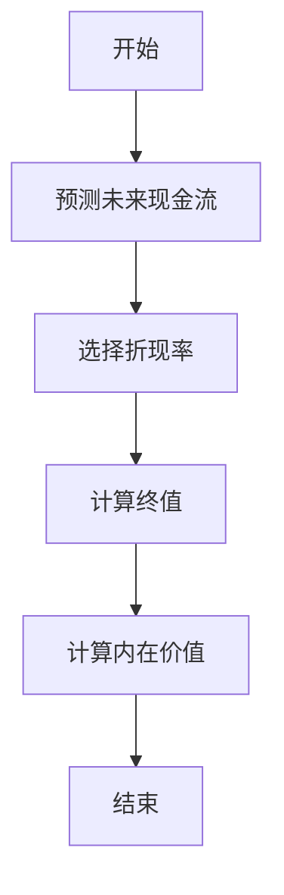
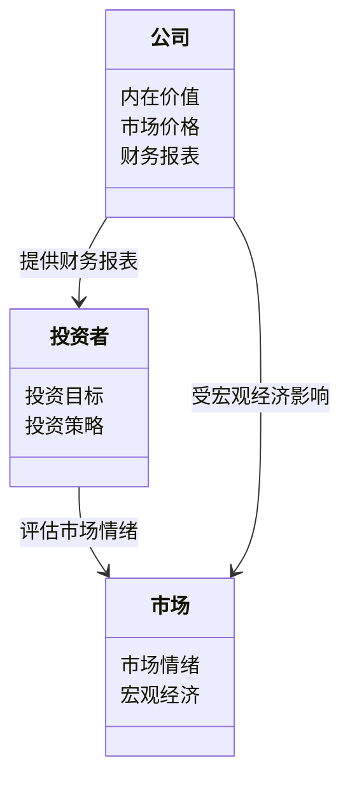
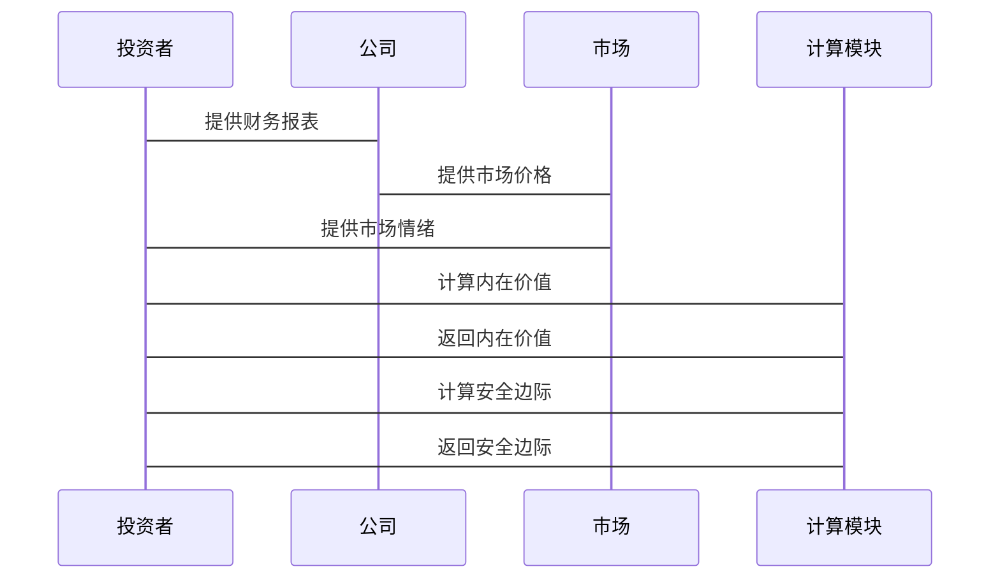

                 


```markdown
# 如何判断股价是否具有吸引力：巴菲特的视角

> 关键词：股价吸引力，巴菲特，价值投资，安全边际，内在价值，DCF模型，投资策略

> 摘要：本文从巴菲特的视角出发，详细分析如何判断股价是否具有吸引力。通过介绍巴菲特的投资理念、核心概念、算法原理、系统架构和实际案例，帮助投资者掌握价值投资的本质，从而做出明智的投资决策。

---

# 第一部分: 股价吸引力判断的背景与巴菲特视角

# 第1章: 股价吸引力判断的基本概念

## 1.1 股价吸引力判断的背景与重要性

### 1.1.1 投资者为何需要判断股价吸引力
判断股价是否具有吸引力是每位投资者都必须掌握的核心技能。通过分析公司基本面和市场估值，投资者可以识别出被低估的投资机会，从而实现长期稳定的收益。  
**关键词：投资决策，价值发现，风险管理**

### 1.1.2 股市投资的基本概念与术语
在判断股价吸引力之前，我们需要理解一些基本概念，如市盈率（P/E）、市净率（P/B）、股息率等。这些指标可以帮助我们评估公司的估值水平。  
**关键词：市盈率，市净率，股息率**

### 1.1.3 股价吸引力判断的核心意义
股价吸引力判断的核心在于识别出那些内在价值高于当前市场价格的公司。这种差异为投资者提供了安全边际，从而降低了投资风险。  
**关键词：内在价值，安全边际，投资风险**

## 1.2 巴菲特投资理念的概述

### 1.2.1 巴菲特的投资哲学
巴菲特的投资哲学以“价值投资”为核心，强调购买那些具有持续竞争优势和良好管理的公司。他主张以合理的价格买入优秀的企业，而非盲目追随市场趋势。  
**关键词：价值投资，竞争优势，良好管理**

### 1.2.2 巴菲特的价值投资原则
价值投资的核心在于寻找那些市场价格低于内在价值的公司。巴菲特认为，这种差异是长期收益的来源。  
**关键词：内在价值，市场价格，长期收益**

### 1.2.3 巴菲特的安全边际概念
安全边际是指市场价格与内在价值之间的差距。通过保持安全边际，投资者可以降低因市场价格波动带来的风险。  
**关键词：安全边际，市场价格波动，风险管理**

## 1.3 股价吸引力判断的边界与外延

### 1.3.1 股价吸引力判断的适用范围
股价吸引力判断适用于所有类型的投资者，尤其是那些追求长期稳定收益的投资者。它可以帮助投资者在市场波动中做出更明智的投资决策。  
**关键词：长期收益，市场波动，投资决策**

### 1.3.2 股价吸引力判断的局限性
尽管股价吸引力判断是一种有效的投资工具，但它也有一定的局限性。例如，市场价格受市场情绪和宏观经济因素的影响，可能会偏离内在价值。  
**关键词：市场情绪，宏观经济因素，内在价值**

### 1.3.3 股价吸引力判断与其他投资策略的关系
股价吸引力判断可以与其他投资策略结合使用。例如，结合技术分析和基本面分析，投资者可以更全面地评估股价的吸引力。  
**关键词：技术分析，基本面分析，综合评估**

## 1.4 核心概念与联系

### 1.4.1 核心概念原理
股价吸引力判断的核心在于识别出市场价格低于内在价值的公司。这种差异为投资者提供了安全边际，从而降低了投资风险。  
**关键词：内在价值，市场价格，安全边际**

### 1.4.2 核心概念属性特征对比表格

| 概念       | 特征                          |
|------------|-------------------------------|
| 内在价值   | 公司未来现金流的现值          |
| 市场价格   | 当前股票的市场价格              |
| 安全边际   | 市场价格与内在价值的差额          |

### 1.4.3 ER实体关系图架构的Mermaid流程图

```mermaid
erDiagram
    actor 投资者 {
        <属性>
        投资目标
        投资策略
    }
    class 公司 {
        <属性>
        内在价值
        市场价格
    }
    class 市场 {
        <属性>
        市场情绪
        宏观经济
    }
    投资者 -> 公司 : 评估内在价值
    投资者 -> 市场 : 评估市场情绪
    公司 -> 市场 : 受宏观经济影响
```

---

# 第2章: 巴菲特投资策略的核心要素

## 2.1 价值投资的核心要素

### 2.1.1 公司基本面分析
公司基本面分析是价值投资的核心。通过分析公司的财务报表、行业地位和竞争优势，投资者可以评估公司的内在价值。  
**关键词：财务报表，行业地位，竞争优势**

### 2.1.2 财务报表分析
财务报表分析包括对收入、利润、资产负债表和现金流的分析。这些数据可以帮助投资者评估公司的财务健康状况。  
**关键词：收入，利润，资产负债表，现金流**

### 2.1.3 行业地位与竞争优势
公司行业地位和竞争优势是判断其未来盈利能力的关键因素。巴菲特倾向于投资那些具有强大竞争优势的公司。  
**关键词：行业地位，竞争优势，盈利能力**

## 2.2 安全边际的计算与应用

### 2.2.1 安全边际的定义与计算公式
安全边际是市场价格与内在价值之间的差额。计算公式为：  
$$ 安全边际 = 内在价值 - 市场价格 $$  
**关键词：内在价值，市场价格，安全边际**

### 2.2.2 安全边际在股价判断中的应用
安全边际为投资者提供了风险缓冲。当市场价格低于内在价值时，安全边际越大，投资风险越小。  
**关键词：风险缓冲，投资风险，安全边际**

### 2.2.3 安全边际与风险控制的关系
安全边际是风险控制的重要工具。通过保持安全边际，投资者可以在市场波动中保护自己的投资本金。  
**关键词：风险控制，投资本金，市场波动**

## 2.3 内在价值的评估与股价比较

### 2.3.1 内在价值的定义与计算方法
内在价值是公司未来现金流的现值。计算方法通常使用现金流折现法（DCF）。  
**关键词：内在价值，现金流折现法（DCF），未来现金流**

### 2.3.2 内在价值与市场价的比较
通过比较内在价值与市场价，投资者可以判断股价是否具有吸引力。当市场价格低于内在价值时，股价具有吸引力。  
**关键词：市场价格，内在价值，股价吸引力**

### 2.3.3 内在价值评估的注意事项
内在价值评估需要考虑多种因素，如公司未来现金流的预测和折现率的选择。投资者应保持谨慎，避免过度乐观的假设。  
**关键词：现金流预测，折现率，投资者谨慎**

---

# 第3章: 股价吸引力判断的算法原理

## 3.1 内在价值计算的算法原理

### 3.1.1 内在价值计算的数学模型
内在价值计算通常使用现金流折现法（DCF）。公式为：  
$$ 内在价值 = \sum_{t=1}^{n} \frac{CF_t}{(1 + r)^t} + \frac{TV}{(1 + r)^n} $$  
其中，CF_t是第t年的现金流，r是折现率，TV是终值。  
**关键词：现金流折现法（DCF），内在价值，折现率**

### 3.1.2 现金流折现法（DCF）的原理
现金流折现法通过将公司未来现金流折现为现值，计算其内在价值。这种方法需要预测公司未来现金流和选择合适的折现率。  
**关键词：现金流折现法（DCF），未来现金流，折现率**

### 3.1.3 DCF模型的实现步骤

1. **预测未来现金流**：根据公司历史财务数据和行业趋势，预测未来5-10年的现金流。
2. **选择合适的折现率**：通常使用公司的加权平均资本成本（WACC）作为折现率。
3. **计算终值**：假设公司在第10年之后保持稳定的现金流增长率，计算终值。
4. **计算内在价值**：将未来现金流和终值折现，求和得到内在价值。

**关键词：现金流预测，折现率，内在价值，WACC**

### 3.1.4 代码实现

```python
def calculate_intrinsic_value(cash_flows, discount_rate, terminal_value):
    intrinsic_value = 0
    for t in range(len(cash_flows)):
        intrinsic_value += cash_flows[t] / (1 + discount_rate) ** t
    intrinsic_value += terminal_value / (1 + discount_rate) ** len(cash_flows)
    return intrinsic_value

# 示例数据
cash_flows = [100, 120, 130, 140, 150]
discount_rate = 0.1
terminal_value = 200

iv = calculate_intrinsic_value(cash_flows, discount_rate, terminal_value)
print(f"内在价值为：{iv}")
```

### 3.1.5 流程图



## 3.2 安全边际计算的算法

### 3.2.1 安全边际计算的数学模型
安全边际计算公式为：  
$$ 安全边际 = 内在价值 - 市场价格 $$  
**关键词：内在价值，市场价格，安全边际**

### 3.2.2 安全边际计算的注意事项
投资者应根据市场情况调整安全边际的计算。例如，在市场波动较大的情况下，应增加安全边际。  
**关键词：市场波动，安全边际，投资风险**

---

# 第4章: 系统分析与架构设计

## 4.1 系统功能设计

### 4.1.1 领域模型Mermaid类图



### 4.1.2 系统架构设计Mermaid架构图


### 4.1.3 系统接口设计
系统接口设计包括数据输入、计算模块和结果输出。  
**关键词：数据输入，计算模块，结果输出**

### 4.1.4 系统交互Mermaid序列图



---

# 第5章: 项目实战

## 5.1 环境安装

### 5.1.1 安装Python环境
安装Python和必要的库，如numpy和pandas。  
**关键词：Python，numpy，pandas**

### 5.1.2 安装Jupyter Notebook
安装Jupyter Notebook用于数据可视化和分析。  
**关键词：Jupyter Notebook，数据可视化**

## 5.2 系统核心实现源代码

### 5.2.1 内在价值计算代码

```python
import numpy as np
import pandas as pd

def calculate_intrinsic_value(cash_flows, discount_rate, terminal_value):
    iv = 0
    for t in range(len(cash_flows)):
        iv += cash_flows[t] / (1 + discount_rate) ** t
    iv += terminal_value / (1 + discount_rate) ** len(cash_flows)
    return iv

# 示例数据
cash_flows = [100, 120, 130, 140, 150]
discount_rate = 0.1
terminal_value = 200

iv = calculate_intrinsic_value(cash_flows, discount_rate, terminal_value)
print(f"内在价值为：{iv}")
```

### 5.2.2 安全边际计算代码

```python
market_price = 100
iv = 150
safety_margin = iv - market_price
print(f"安全边际为：{safety_margin}")
```

## 5.3 代码应用解读与分析

### 5.3.1 内在价值计算结果解读
通过计算内在价值，我们可以判断股价是否具有吸引力。例如，如果计算出的内在价值为150，而市场价格为100，则股价具有吸引力。  
**关键词：内在价值，市场价格，股价吸引力**

### 5.3.2 安全边际计算结果解读
安全边际为50，表示市场价格低于内在价值50单位，为投资者提供了50单位的安全边际。  
**关键词：安全边际，内在价值，市场价格**

## 5.4 实际案例分析与详细讲解

### 5.4.1 案例介绍
以某公司为例，假设其未来5年的现金流分别为100、120、130、140、150，终值为200，折现率为10%。计算其内在价值。  
**关键词：现金流，折现率，终值**

### 5.4.2 计算过程
使用现金流折现法（DCF）计算内在价值：  
$$ 内在价值 = \sum_{t=1}^{5} \frac{CF_t}{(1 + 0.1)^t} + \frac{200}{(1 + 0.1)^5} $$  
计算结果为150。  
**关键词：DCF，内在价值，现金流**

### 5.4.3 结果分析
市场价格为100，内在价值为150，安全边际为50。因此，该股价具有吸引力。  
**关键词：市场价格，内在价值，安全边际**

## 5.5 项目小结

### 5.5.1 项目总结
通过项目实战，我们掌握了如何使用现金流折现法计算内在价值，并判断股价是否具有吸引力。  
**关键词：现金流折现法，内在价值，股价吸引力**

### 5.5.2 经验与教训
在实际操作中，需要注意现金流预测的准确性，选择合适的折现率，并考虑宏观经济因素对市场价格的影响。  
**关键词：现金流预测，折现率，宏观经济因素**

---

# 第6章: 最佳实践、小结、注意事项与拓展阅读

## 6.1 最佳实践

### 6.1.1 巴菲特的投资原则
1. **投资具有持续竞争优势的公司**  
2. **保持安全边际**  
3. **长期投资，避免短期波动**  
**关键词：持续竞争优势，安全边际，长期投资**

### 6.1.2 持续学习与自我提升
投资者需要不断学习，更新自己的知识，以适应市场的变化。  
**关键词：持续学习，自我提升，市场变化**

### 6.1.3 保持耐心与纪律
投资需要耐心和纪律，避免被市场情绪左右。  
**关键词：耐心，纪律，市场情绪**

## 6.2 小结

通过本文的分析，我们了解了如何从巴菲特的视角判断股价是否具有吸引力。通过价值投资、安全边际和内在价值等概念，我们掌握了判断股价吸引力的核心方法。  
**关键词：价值投资，安全边际，内在价值，股价吸引力**

## 6.3 注意事项

### 6.3.1 风险提示
股价吸引力判断只是一种工具，市场波动和宏观经济因素可能会导致市场价格偏离内在价值。  
**关键词：市场波动，宏观经济因素，内在价值**

### 6.3.2 投资者应具备的基本素质
投资者需要具备财务分析能力、市场敏感性和风险控制能力。  
**关键词：财务分析能力，市场敏感性，风险控制能力**

## 6.4 拓展阅读

### 6.4.1 推荐书籍
1. 《巴菲特致股东的信》  
2. 《投资之道》  
**关键词：巴菲特致股东的信，投资之道**

### 6.4.2 推荐博客与网站
1. 巴菲特的官方网站  
2. 投资类博客和论坛  
**关键词：巴菲特官方网站，投资博客，投资论坛**

---

# 结语

通过本文的系统分析和实战案例，我们掌握了如何从巴菲特的视角判断股价是否具有吸引力。希望本文能为投资者提供有价值的参考，帮助他们在股市中做出明智的投资决策。  

作者：AI天才研究院/AI Genius Institute & 禅与计算机程序设计艺术/Zen And The Art of Computer Programming
```

