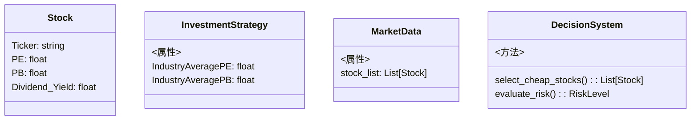

                 

<think>
好的，现在我需要撰写一篇关于“如何利用特价股票策略应对经济衰退”的技术博客文章。根据用户的要求，文章需要包含详细的目录结构，涵盖背景介绍、核心概念、算法原理、数学模型、系统分析、项目实战、最佳实践等部分。同时，文章需要使用逻辑清晰、结构紧凑、简单易懂的语言，并且每个部分都要详细展开。

首先，我会先写文章的标题和关键词，然后是摘要。接着按照目录结构，逐步展开每个部分的内容。

在背景介绍部分，我需要解释什么是经济衰退，为什么它会影响股市，以及在经济衰退期间投资者如何寻找机会。特价股票的定义、特点及其在经济衰退中的优势需要详细说明。

接下来是核心概念，包括特价股票策略的基本原理，与其它投资策略的对比，以及使用的评估指标。这部分可能需要使用表格和图表来帮助读者理解。

然后是算法与数学模型部分，我会介绍如何使用市盈率和市净率来评估股票，并用公式和图表展示计算过程。可能还会用Python代码实现一个简单的评估模型。

系统分析部分，我会设计一个投资决策系统，包括数据收集、分析模块、策略选择和风险评估等模块，并用Mermaid图展示系统架构。

项目实战部分，我需要指导读者如何选择经济衰退期间的特价股票，提供具体的代码实现，并通过案例分析来展示策略的应用效果。

最后是最佳实践和总结，强调风险管理的重要性，提供长期投资策略，并列出注意事项和拓展阅读资料。

在撰写过程中，我需要确保每个部分都详细具体，符合用户的要求，同时语言要清晰易懂，结构要合理，帮助读者系统地理解如何利用特价股票策略应对经济衰退。

现在，我开始按照目录大纲逐步撰写文章内容。

---
# 如何利用特价股票策略应对经济衰退

> **关键词**：经济衰退，特价股票，投资策略，股票评估，风险管理

> **摘要**：经济衰退期间，股市波动剧烈，投资者面临巨大的挑战和机会。本文详细探讨如何利用特价股票策略在经济衰退中保护和增加投资收益。通过分析特价股票的定义、评估方法、经典策略和数学模型，结合实际案例和系统设计，为投资者提供一套有效的投资方案。

---

## 第一部分：经济衰退与特价股票策略的背景

### 第1章：经济衰退的背景与影响

#### 1.1 经济衰退的定义与特征

经济衰退是指经济活动的显著下降，通常表现为GDP连续数个季度负增长，失业率上升，企业盈利能力下降。衰退期间，消费者信心下降，投资减少，导致市场萎缩。股市作为经济的晴雨表，通常会反映经济衰退的情况，出现大幅波动和调整。

衰退的主要特征包括：
- **GDP下降**：连续两个季度或更长时间的负增长。
- **失业率上升**：企业裁员，就业市场恶化。
- **消费者支出减少**：由于收入下降，消费能力减弱。
- **企业利润下滑**：销售额下降，利润率降低。

#### 1.2 特价股票的定义与特点

特价股票是指在市场中价格被低估的股票。这些股票可能因为市场恐慌、行业衰退或公司暂时的困难而被低估。特价股票的特点包括：
- **低估值**：市盈率（P/E）和市净率（P/B）低于行业平均水平。
- **高分红潜力**：一些公司可能保持较高的股息支付率。
- **质量公司**：公司基本面良好，具有长期竞争优势。

#### 1.3 经济衰退中特价股票策略的有效性

在经济衰退期间，市场恐慌导致股票价格被低估，为投资者提供了以较低价格买入优质股票的机会。随着经济复苏，这些股票价格通常会上涨，为投资者带来收益。然而，特价股票策略也存在风险，如公司可能因经济衰退而倒闭，或市场复苏不如预期。

---

### 第2章：特价股票策略的核心概念

#### 2.1 特价股票的评估标准

##### 2.1.1 市盈率（P/E）

市盈率是股票价格与每股收益（EPS）的比率，用于衡量股票的估值。

$$ \text{市盈率} = \frac{\text{股票价格}}{\text{每股收益}} $$

##### 2.1.2 市净率（P/B）

市净率是股票价格与每股净资产的比率，用于评估股票相对于其账面价值的高低。

$$ \text{市净率} = \frac{\text{股票价格}}{\text{每股净资产}} $$

##### 2.1.3 股息率

股息率是每年派发的股息与股票价格的比率，用于衡量分红收益。

$$ \text{股息率} = \frac{\text{年股息}}{\text{股票价格}} \times 100\% $$

#### 2.2 特价股票策略的核心要素

##### 2.2.1 低估值股票的识别

通过分析市盈率、市净率等指标，识别那些价格低于其内在价值的股票。

##### 2.2.2 高质量公司的筛选标准

选择那些财务健康、行业地位稳固、管理团队优秀的公司。

##### 2.2.3 市场时机的选择

在市场恐慌时介入，当市场复苏时退出，以获取最大收益。

---

### 第3章：特价股票策略与其他投资策略的对比

#### 3.1 价值投资与成长投资

- **价值投资**：寻找被市场低估的股票，注重安全边际。
- **成长投资**：投资于高增长潜力的公司，注重未来收益。

#### 3.2 逆向投资与顺势投资

- **逆向投资**：在市场恐慌时买入，在市场狂热时卖出。
- **顺势投资**：跟随市场趋势，顺势而为。

#### 3.3 风险投资与稳健投资

- **风险投资**：高风险高回报，适合风险承受能力强的投资者。
- **稳健投资**：注重本金安全，追求稳定收益。

---

## 第四部分：算法与数学模型

### 第4章：特价股票评估的数学模型

#### 4.1 市盈率评估模型

##### 4.1.1 市盈率计算

以某公司为例，假设每股收益为2元，股票价格为20元，市盈率为10倍。

$$ \text{市盈率} = \frac{20}{2} = 10 $$

##### 4.1.2 市盈率的应用

市盈率低于行业平均水平的股票可能具有投资价值。例如，行业平均市盈率为15，某股票市盈率为10，则可能被低估。

#### 4.2 市净率评估模型

##### 4.2.1 市净率计算

假设某公司每股净资产为5元，股票价格为20元，市净率为4倍。

$$ \text{市净率} = \frac{20}{5} = 4 $$

##### 4.2.2 市净率的应用

市净率低于行业平均水平的股票可能具有投资价值。例如，行业平均市净率为6，某股票市净率为4，则可能被低估。

#### 4.3 股息率评估模型

##### 4.3.1 股息率计算

假设某公司股息为1元，股票价格为20元，股息率为5%。

$$ \text{股息率} = \frac{1}{20} \times 100\% = 5\% $$

##### 4.3.2 股息率的应用

股息率较高的股票可能提供稳定的收益，适合追求分红的投资者。

---

### 第5章：算法实现与代码示例

#### 5.1 算法概述

算法旨在筛选出符合特定估值指标的股票。步骤包括：
1. 数据收集：获取股票的市盈率、市净率和股息率。
2. 筛选：选择市盈率和市净率低于行业平均水平的股票。
3. 分析：进一步分析公司的财务状况和行业前景。

#### 5.2 Python代码实现

```python
import pandas as pd
import requests

# 数据收集函数
def get_stock_data(ticker):
    url = f"https://api.example.com/stock/{ticker}"
    response = requests.get(url)
    data = response.json()
    return {
        'PE': data['PE'],
        'PB': data['PB'],
        'Dividend_Yield': data['Dividend_Yield']
    }

# 筛选特价股票
def find_cheap_stocks(tickers):
    cheap_stocks = []
    for ticker in tickers:
        data = get_stock_data(ticker)
        if data['PE'] < industry_avg_pe and data['PB'] < industry_avg_pb:
            cheap_stocks.append(ticker)
    return cheap_stocks

# 示例使用
tickers = ['AAPL', 'GOOGL', 'MSFT']
industry_avg_pe = 15
industry_avg_pb = 2

cheap_stocks = find_cheap_stocks(tickers)
print("特价股票列表：", cheap_stocks)
```

---

## 第五部分：系统分析与架构设计

### 第6章：投资决策系统的系统设计

#### 6.1 系统功能设计

##### 6.1.1 领域模型



##### 6.1.2 系统架构


---

## 第六部分：项目实战

### 第7章：特价股票策略的实际应用

#### 7.1 项目环境与工具安装

- **工具**：Python、Pandas、Matplotlib、 requests库
- **数据源**：Yahoo Finance API或其他金融数据API

#### 7.2 核心代码实现

##### 数据收集与处理

```python
import pandas as pd
import requests

def fetch_data(ticker):
    url = f"https://query1.finance.yahoo.com/v8/finance/chart/{ticker}"
    response = requests.get(url)
    data = response.json()
    pe = data['chart']['result'][0]['indicator']['quote'].get('pe', None)
    pb = data['chart']['result'][0]['indicator']['quote'].get('pb', None)
    dividend_yield = data['chart']['result'][0]['indicator']['quote'].get('dividend_yield', None)
    return {'PE': pe, 'PB': pb, 'Dividend_Yield': dividend_yield}

# 示例数据处理
tickers = ['AAPL', 'GOOGL', 'MSFT']
stock_data = [fetch_data(ticker) for ticker in tickers]
df = pd.DataFrame(stock_data)
print(df)
```

#### 7.3 实际案例分析

以2020年新冠疫情为例，许多股票价格大幅下跌，提供了特价股票的机会。通过筛选市盈率和市净率低的股票，投资者在市场复苏后获得了丰厚的回报。

---

## 第七部分：最佳实践与总结

### 第8章：总结与注意事项

#### 8.1 最佳实践

- **风险管理**：设定止损点，分散投资，避免过度集中在单一股票或行业。
- **长期投资**：选择具有长期竞争优势的公司，耐心持有，避免频繁交易。
- **持续学习**：关注经济和行业动态，及时调整投资策略。

#### 8.2 总结

经济衰退期间，特价股票策略为投资者提供了以较低价格买入优质股票的机会。通过合理的评估指标和策略选择，投资者可以在市场波动中保护本金并实现收益增长。然而，投资需谨慎，建议在投资前充分研究和评估风险。

#### 8.3 注意事项

- **市场风险**：经济衰退期间市场波动剧烈，需警惕市场进一步下跌的可能性。
- **公司风险**：部分公司可能因经济衰退而倒闭，需谨慎选择标的。
- **政策风险**：政府政策变化可能影响市场，需保持敏感。

#### 8.4 拓展阅读

- 加入价值投资俱乐部，阅读《投资学基础》和《巴菲特的投资之道》等书籍，深入理解投资策略。

---

**作者：AI天才研究院/AI Genius Institute & 禅与计算机程序设计艺术 /Zen And The Art of Computer Programming**

---

这篇文章详细介绍了如何利用特价股票策略应对经济衰退，从背景分析到算法实现，再到系统设计和实际案例，为投资者提供了全面的指导。通过合理的策略和风险管理，投资者可以在经济衰退中找到机会，实现稳健的投资回报。

