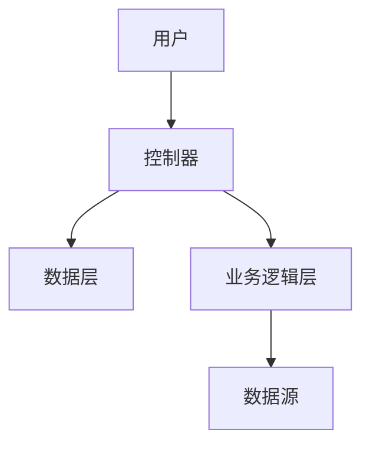

                 


# 如何利用特价股票策略应对通货膨胀风险

> 关键词：特价股票，通货膨胀，投资策略，风险管理，股票市场

> 摘要：本文探讨如何通过特价股票策略有效应对通货膨胀风险。文章从通货膨胀对股票市场的基本影响入手，分析特价股票的特点及其在抗通胀投资中的独特作用，结合数学模型和实际案例，提供可操作的投资策略和系统设计方案。

---

## 第一部分: 背景介绍

### 第1章: 通货膨胀与股票投资概述

#### 1.1 通货膨胀的定义与影响
- 通货膨胀的基本概念：通货膨胀是指物价总水平在一段时间内持续上涨，货币购买力下降的经济现象。
- 通货膨胀对经济的影响：包括降低储蓄的实际价值、增加企业成本、可能导致经济不稳定等。
- 通货膨胀对股票市场的影响：短期内可能引发市场波动，但长期来看，企业盈利增长可能支撑股价。

#### 1.2 股票投资的基本原理
- 股票市场的基本运作：股票代表公司所有权，投资者通过购买股票成为公司股东。
- 股票投资的主要方式：包括价值投资、成长投资、指数投资等。
- 通货膨胀与股票投资的关系：通货膨胀可能导致利率上升，影响股票估值。

### 第2章: 特价股票的定义与特点
#### 2.1 特价股票的定义
- 特价股票是指市场价格低于其内在价值的股票，通常在市场低迷或经济周期低谷时出现。
- 特价股票的范围包括低市盈率（P/E）、低市净率（P/B）的股票，这些股票往往被市场低估。

#### 2.2 特价股票的特点
- 价格被低估：特价股票的市场价格低于其内在价值，具有较大的上涨空间。
- 高股息率：许多特价股票来自成熟企业，能够提供稳定的股息收入。
- 低估值公司：这些公司可能暂时遇到困难，但具备长期恢复的潜力。

### 第3章: 通货膨胀风险与投资策略
#### 3.1 通货膨胀对投资组合的影响
- 资产贬值风险：通货膨胀可能导致货币购买力下降，投资组合的实际价值缩水。
- 收益率下降：通胀上升可能推高债券收益率，导致股票相对吸引力下降。
- 股票市场的波动性：通胀可能导致市场波动加剧，影响股票价格稳定性。

#### 3.2 应对通货膨胀的投资策略
- 大类资产配置：通过配置不同类型的资产（股票、债券、黄金等）分散风险。
- 股票在抗通胀中的作用：股票作为实物资产，其价值可能随通胀上升而调整。
- 通过股票投资对冲通胀风险：选择具备较强盈利能力和增长潜力的股票，抵御通胀侵蚀。

### 第4章: 特价股票策略的核心概念
#### 4.1 特价股票策略的原理
- 市场周期与机会：在经济低迷或市场恐慌时，许多优质股票会被低估，形成特价股票。
- 价值投资与成长投资结合：价值投资者寻找被市场低估的股票，成长投资者则关注具备长期增长潜力的企业。
- 长期投资价值：特价股票通常具备较高的安全边际，长期持有可能带来超额收益。

#### 4.2 特价股票与通货膨胀的关联
- 通货膨胀周期中的表现：在高通胀环境下，特价股票可能因企业盈利提升而表现优于大盘。
- 对冲机制：通过持有特价股票，投资者可以在通胀上升期间获得更高的实际回报。
- 经济周期中的策略选择：根据经济周期的不同阶段，调整特价股票的投资策略。

---

## 第二部分: 特价股票策略的数学模型与算法

### 第5章: 通货膨胀对股票价值的影响模型
#### 5.1 通货膨胀率的计算公式
- 通货膨胀率计算公式：
  $$通货膨胀率 = \frac{CPI_{\text{当前}} - CPI_{\text{基期}}}{CPI_{\text{基期}}} \times 100\%$$
- 其中，CPI表示消费者价格指数。

#### 5.2 股票价值的评估公式
- 现金流量折现模型（DCF）：
  $$股票价值 = \sum_{t=1}^{n} \frac{CF_t}{(1 + r)^t}$$
  其中，CF_t为第t年的现金流，r为折现率。

#### 5.3 通货膨胀对股票内在价值的影响
- 通胀上升可能导致企业成本增加，但若企业能够通过提价转移成本，净利润可能保持稳定甚至增长。
- 通胀还可能推高债券收益率，影响股票的相对估值。

### 第6章: 特价股票选择的数学模型
#### 6.1 市盈率（P/E）的计算与应用
- 市盈率公式：
  $$P/E = \frac{\text{股价}}{\text{每股收益}}$$
- 低市盈率可能意味着股票被低估。

#### 6.2 市净率（P/B）的计算与应用
- 市净率公式：
  $$P/B = \frac{\text{股价}}{\text{每股净资产}}$$
- 低市净率可能表明股票价格低于其账面价值。

#### 6.3 市销率（P/S）的计算与应用
- 市销率公式：
  $$P/S = \frac{\text{股价}}{\text{每股收入}}$$
- 适用于亏损企业的估值。

### 第7章: 基于数学模型的策略优化
#### 7.1 通货膨胀与股票估值的关系
- 在高通胀环境下，企业的实际利润可能被低估，因此股票的内在价值可能被市场忽视。
- 通过调整折现率，考虑通胀对股票估值的影响。

#### 7.2 多因子模型在特价股票选择中的应用
- 使用多因子模型（如Fama-French三因子模型）评估股票的内在价值。
- 因子包括市值、书值、收益动量等，结合通胀因素进行优化。

#### 7.3 算法实现
- 使用Python编写多因子模型，计算各因子得分，并结合通胀预期筛选特价股票。

---

## 第三部分: 系统分析与架构设计

### 第8章: 项目介绍与系统功能设计
#### 8.1 项目背景
- 高通胀环境下，投资者需要有效的工具来管理股票投资风险。
- 构建一个基于特价股票策略的投资系统，帮助投资者优化投资组合。

#### 8.2 系统功能设计
- 数据采集：获取股票价格、财务数据、通胀指标等。
- 特价股票筛选：基于多因子模型筛选被低估的股票。
- 投资组合优化：根据通胀预期调整资产配置。

#### 8.3 系统架构设计
- 使用分层架构：数据层、业务逻辑层、用户界面层。
- 数据层：存储股票数据和模型参数。
- 业务逻辑层：实现数据分析和策略执行。
- 用户界面层：提供直观的用户交互界面。

### 第9章: 系统架构与接口设计
#### 9.1 系统架构图


#### 9.2 系统接口设计
- 数据接口：从API获取实时数据。
- 用户接口：提供数据可视化和策略执行的控制面板。

#### 9.3 系统交互设计
- 用户输入通胀预期，系统根据模型筛选特价股票。
- 系统提供投资组合建议，并实时更新股票数据。

---

## 第四部分: 项目实战

### 第10章: 环境安装与核心代码实现
#### 10.1 环境安装
- 安装Python和相关库（如Pandas、NumPy、Scikit-learn）。
- 安装数据可视化工具（如Matplotlib、Seaborn）。

#### 10.2 核心代码实现
```python
import pandas as pd
import numpy as np

# 数据获取
df = pd.read_csv('stocks.csv')

# 计算市盈率和市净率
df['PE'] = df['Price'] / df['EPS']
df['PB'] = df['Price'] / df['BVPS']

# 筛选特价股票
cheap_stocks = df[(df['PE'] < df['PE'].median()) & (df['PB'] < df['PB'].median())]

print(cheap_stocks)
```

### 第11章: 代码解读与实际案例分析
#### 11.1 代码解读
- 数据读取：从CSV文件读取股票数据。
- 计算市盈率和市净率：评估股票估值。
- 筛选特价股票：基于分位数判断低估股票。

#### 11.2 实际案例分析
- 以2023年某次市场波动为例，展示如何筛选和投资特价股票。
- 分析投资结果，比较实际收益与预期收益。

### 第12章: 项目小结
- 成功实现了基于数学模型的特价股票筛选系统。
- 通过实际案例验证了策略的有效性。
- 为投资者提供了应对通货膨胀风险的工具。

---

## 第五部分: 总结

### 第13章: 最佳实践与注意事项
#### 13.1 最佳实践
- 定期评估投资组合，根据经济环境调整策略。
- 结合技术分析和基本面分析，提高决策的准确性。

#### 13.2 小结
- 特价股票策略是应对通货膨胀风险的有效工具。
- 通过数学模型和系统设计，投资者可以更科学地进行股票投资。

#### 13.3 注意事项
- 风险提示：投资有风险，需谨慎决策。
- 系统维护：定期更新数据和模型，确保系统运行良好。

### 第14章: 拓展阅读与未来展望
#### 14.1 拓展阅读
- 推荐阅读《投资学基础》、《价值投资策略》等书籍。
- 参考文献包括学术论文和行业报告。

#### 14.2 未来展望
- 研究更多因素对特价股票的影响，优化投资模型。
- 开发更多智能化的投资工具，帮助投资者做出决策。

---

作者：AI天才研究院 & 禅与计算机程序设计艺术
```

