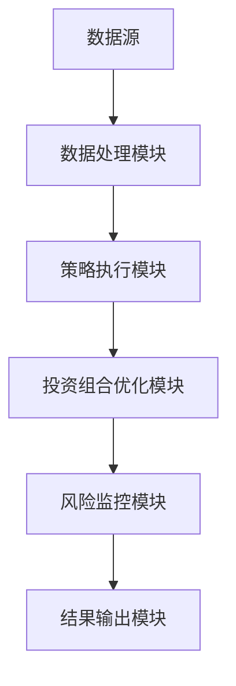

                 

<think>
好的，我现在需要帮用户设计一本关于如何将特价股票策略融入指数增强型投资的书籍目录大纲。首先，我需要理解用户的需求。用户希望这本书详细且逻辑清晰，覆盖主题内容全面。我得确保目录包含背景介绍、核心概念、算法原理、系统分析、项目实战以及最佳实践等部分。

首先，背景介绍部分，我应该涵盖特价股票策略和指数增强型投资的基本概念。可能需要解释什么是特价股票，以及指数增强型投资的定义和目标。接着，问题背景部分要分析当前市场中指数增强策略面临的挑战，比如市场竞争加剧和收益压力，然后引出特价股票策略的优势，比如高收益和低门槛。

接下来是核心概念与联系部分，我需要详细解释指数增强型投资和特价股票策略的定义、特点和优缺点。可能还需要一个对比表格，列出两者的异同点，以及它们之间的关系和协同效应。这部分可能需要使用表格和图表来辅助说明。

然后是算法原理讲解。这里需要介绍指数增强型投资的量化策略，比如因子模型和多因子策略，以及特价股票策略的套利模型。可能需要使用Mermaid流程图来展示策略的执行流程，比如因子筛选、权重计算和投资组合优化。同时，还要提供Python代码示例，解释如何实现这些算法，包括因子计算、组合优化和风险控制。

数学模型部分，我需要详细推导指数增强型投资的收益模型和风险模型，可能涉及CAPM模型和风险调整后的收益计算。同时，特价股票策略中的套利模型也需要数学公式来描述，比如无风险套利和风险调整后的套利收益计算。

系统分析与架构设计方案部分，我需要设计一个系统来实现这些策略。首先描述问题场景，比如实时数据获取、策略执行和风险监控。然后进行系统功能设计，包括数据采集模块、策略执行模块和风险监控模块。可能需要使用Mermaid类图来展示系统架构，以及接口设计和交互流程。

项目实战部分，我需要详细指导读者如何安装环境，比如安装Python和相关库。然后提供核心代码实现，比如因子筛选、组合优化和套利策略的代码示例。接着，解读代码并分析实际案例，说明如何应用这些策略，并在项目小结中总结关键点。

最后，最佳实践部分需要给出一些实用的建议，比如风险控制、策略优化和持续学习的重要性。同时，总结全书内容，并提供进一步阅读的资源，帮助读者深入理解。

在编写过程中，我需要确保每个部分都细化到三级目录，内容完整且符合用户的要求。同时，注意不要超过2000字的限制，保持简洁明了。可能还需要检查是否有遗漏的重要部分，比如数学公式的正确性，流程图的清晰度，以及代码的可读性和实用性。

总的来说，我需要系统地分解用户的需求，逐步构建目录大纲，确保每个章节和子章节都覆盖必要的内容，并且逻辑连贯。这样，用户才能有一本结构清晰、内容全面的书籍大纲，帮助他们撰写相关的书籍。
</think>

```markdown
# 如何将特价股票策略融入指数增强型投资

> 关键词：指数增强型投资，特价股票策略，量化投资，算法交易，投资组合优化

> 摘要：本文详细探讨了如何将特价股票策略融入指数增强型投资中，通过分析两者的核心概念、算法原理和实际应用，提供了一套系统化的解决方案。文章从背景介绍、核心概念、算法原理、系统分析、项目实战到最佳实践，全面阐述了如何实现这一投资策略，帮助投资者在复杂多变的市场中获取超额收益。

---

# 第一部分: 背景介绍

# 第1章: 特价股票策略与指数增强型投资概述

## 1.1 特价股票策略的基本概念
### 1.1.1 特价股票的定义与特点
特价股票是指价格低于其内在价值，具有较大上涨潜力的股票。其特点包括低估值、高成长性和较高的安全边际。

### 1.1.2 特价股票策略的核心目标
通过筛选低估股票，捕捉市场反弹或上涨的机会，实现超额收益。

### 1.1.3 特价股票策略的市场定位
适用于中长期投资，适合风险偏好较低的投资者。

## 1.2 指数增强型投资的基本概念
### 1.2.1 指数增强型投资的定义
一种通过跟踪指数并进行增强型主动管理的投资策略，旨在超越指数收益。

### 1.2.2 指数增强型投资的核心目标
通过精选个股或行业，优化权重分配，实现超越指数的超额收益。

### 1.2.3 指数增强型投资的市场定位
适用于机构投资者和个人投资者，适合中长期投资。

## 1.3 特价股票策略与指数增强型投资的关系
### 1.3.1 两者的协同效应
特价股票策略为指数增强型投资提供了获取超额收益的潜在机会。

### 1.3.2 两者的区别与联系
特价股票策略注重个股选择，而指数增强型投资注重组合优化和风险控制。

### 1.3.3 两者的应用场景
特价股票策略适用于市场低估时期，指数增强型投资适用于长期稳定收益。

## 1.4 本章小结
本章介绍了特价股票策略和指数增强型投资的基本概念、目标和市场定位，并分析了两者的关系和应用场景。

---

# 第二部分: 核心概念与联系

# 第2章: 特价股票策略的核心原理

## 2.1 特价股票策略的原理
### 2.1.1 特价股票策略的基本原理
通过量化模型筛选出被市场低估的股票，结合技术分析和基本面分析进行投资。

### 2.1.2 特价股票策略的关键因素
- 低PE、低PB等估值指标
- 高ROE、高净利润等财务指标
- 市场情绪和流动性

### 2.1.3 特价股票策略的优缺点对比
- 优点：收益潜力大，风险相对较低
- 缺点：市场波动大，需要较强的研究能力

## 2.2 指数增强型投资的核心原理
### 2.2.1 指数增强型投资的基本原理
通过跟踪指数成分股，并根据市场情况调整权重，优化组合以实现超额收益。

### 2.2.2 指数增强型投资的关键因素
- 指数成分股的选择
- 权重优化策略
- 风险控制措施

### 2.2.3 指数增强型投资的优缺点对比
- 优点：分散风险，稳定性高
- 缺点：收益潜力有限，需要较强的研究能力

## 2.3 特价股票策略与指数增强型投资的对比分析
### 2.3.1 两者的原理对比
- 特价股票策略注重个股选择，指数增强型投资注重组合优化。

### 2.3.2 两者的优缺点对比
- 特价股票策略：高收益潜力，但风险较高
- 指数增强型投资：稳定性高，但收益潜力有限

### 2.3.3 两者的应用场景对比
- 特价股票策略适用于市场低估时期
- 指数增强型投资适用于长期稳定收益

## 2.4 本章小结
本章详细分析了特价股票策略和指数增强型投资的核心原理、优缺点，并对比了两者在原理和应用上的差异。

---

# 第三部分: 算法原理

# 第3章: 特价股票策略的算法原理

## 3.1 特价股票策略的算法实现
### 3.1.1 数据获取与预处理
- 数据来源：股票价格、财务数据、市场情绪等
- 数据清洗：处理缺失值、异常值等

### 3.1.2 特价股票筛选算法
- 量化筛选：通过估值指标（PE、PB、ROE等）筛选出低估股票
- 技术分析：结合K线图、均线等技术指标筛选潜在上涨股票

### 3.1.3 投资组合优化算法
- 风险调整后的收益最大化
- 基于现代投资组合理论（MPT）的优化

## 3.2 指数增强型投资的算法实现
### 3.2.1 指数成分股筛选
- 根据指数规则筛选成分股
- 根据市场情况动态调整成分股权重

### 3.2.2 权重优化算法
- 基于因子模型的权重优化
- 基于风险控制的权重调整

## 3.3 特价股票策略与指数增强型投资的算法结合
### 3.3.1 策略融合思路
- 在指数增强型投资中融入特价股票策略，通过筛选低估股票优化组合

### 3.3.2 算法实现步骤
1. 筛选低估股票
2. 构建投资组合
3. 动态调整权重
4. 风险控制

## 3.4 本章小结
本章详细介绍了特价股票策略和指数增强型投资的算法实现，并探讨了两者结合的实现思路和步骤。

---

# 第四部分: 系统分析与架构设计

# 第4章: 系统分析与架构设计方案

## 4.1 问题场景介绍
### 4.1.1 问题描述
如何在指数增强型投资中融入特价股票策略，实现超额收益。

### 4.1.2 问题边界
- 数据范围：股票价格、财务数据、市场情绪等
- 时间范围：中长期投资
- 风险控制：最大回撤不超过一定比例

## 4.2 系统功能设计
### 4.2.1 功能模块划分
- 数据采集模块
- 策略执行模块
- 风险监控模块

### 4.2.2 功能流程设计
1. 数据采集：获取股票数据
2. 策略执行：筛选低估股票，构建投资组合
3. 风险监控：实时监控风险指标，动态调整组合

## 4.3 系统架构设计
### 4.3.1 架构图


### 4.3.2 接口设计
- 数据接口：提供数据获取和处理的API
- 策略接口：提供策略执行的API
- 监控接口：提供风险监控的API

## 4.4 本章小结
本章通过系统分析和架构设计，明确了如何在指数增强型投资中融入特价股票策略的实现思路。

---

# 第五部分: 项目实战

# 第5章: 项目实战

## 5.1 环境安装与配置
### 5.1.1 安装Python
```bash
python --version
pip install numpy pandas matplotlib
```

### 5.1.2 安装量化交易库
```bash
pip install backtrader pandas_datareader
```

## 5.2 核心代码实现
### 5.2.1 特价股票筛选算法
```python
import pandas as pd

def screen_cheap_stocks(data, threshold=0.5):
    # 计算PE、PB等指标
    data['PE'] = data['price'] / data['eps']
    data['PB'] = data['price'] / data['book_value']
    # 筛选PE < threshold且PB < threshold的股票
    cheap Stocks = data[(data['PE'] < threshold) & (data['PB'] < threshold)]
    return cheap_stocks
```

### 5.2.2 投资组合优化算法
```python
import numpy as np

def optimize_portfolio(stocks, returns, risk_free_rate=0.02):
    # 计算协方差矩阵
    cov_matrix = np.cov(returns)
    # 计算最优权重
    weights = np.linalg.inv(cov_matrix) * np.ones(len(stocks))
    weights = weights / np.sum(weights)
    return weights
```

## 5.3 代码应用与解读
### 5.3.1 数据获取与预处理
```python
import pandas_datareader as pdr

data = pdr.get_data_yahoo(tickers, start_date, end_date)
data = data.dropna()
```

### 5.3.2 策略执行与结果分析
```python
cheap_stocks = screen_cheap_stocks(data)
weights = optimize_portfolio(cheap_stocks, returns)
```

## 5.4 项目小结
本章通过实际案例展示了如何在指数增强型投资中融入特价股票策略，从环境配置到代码实现，详细解读了每个步骤的操作和结果。

---

# 第六部分: 最佳实践与总结

# 第6章: 最佳实践

## 6.1 风险控制建议
### 6.1.1 风险控制策略
- 设置最大回撤限制
- 定期调整投资组合

### 6.1.2 仓位管理技巧
- 根据市场情况动态调整仓位
- 设置止损和止盈点

## 6.2 策略优化建议
### 6.2.1 持续优化算法
- 定期更新因子模型
- 引入新的市场数据

### 6.2.2 优化投资组合
- 根据市场变化调整权重
- 引入机器学习算法优化策略

## 6.3 学习与提升
### 6.3.1 持续学习资源
- 关注市场动态和研究报告
- 学习新的量化投资策略

## 6.4 本章小结
本章提供了风险控制、策略优化和持续学习的建议，帮助读者在实际操作中更好地应用特价股票策略融入指数增强型投资。

---

# 作者信息

作者：AI天才研究院/AI Genius Institute & 禅与计算机程序设计艺术 /Zen And The Art of Computer Programming

---

通过以上目录，您可以逐步实现将特价股票策略融入指数增强型投资的完整方案，从理论到实践，从算法到系统设计，全面掌握这一投资策略的核心和应用。
```

