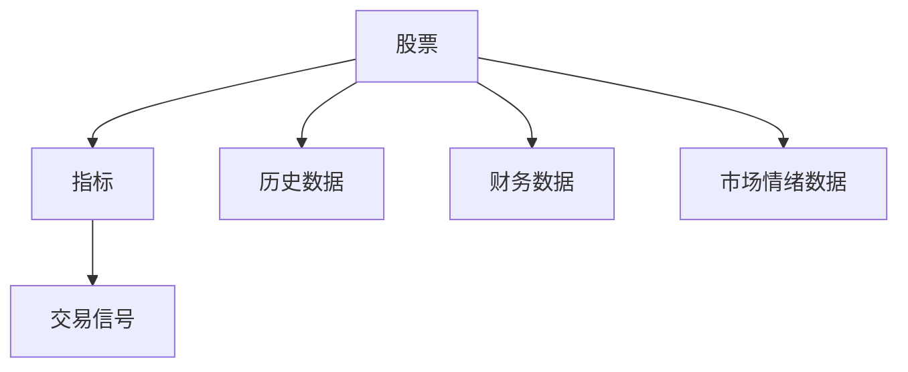
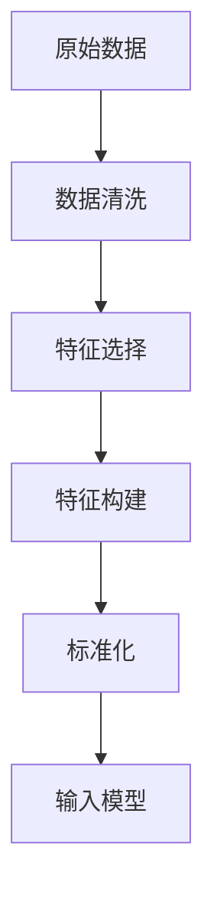
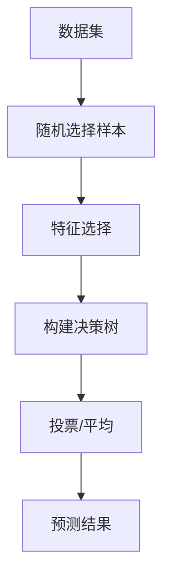
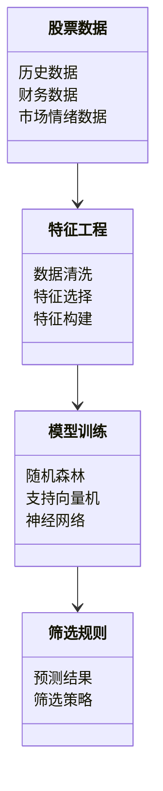
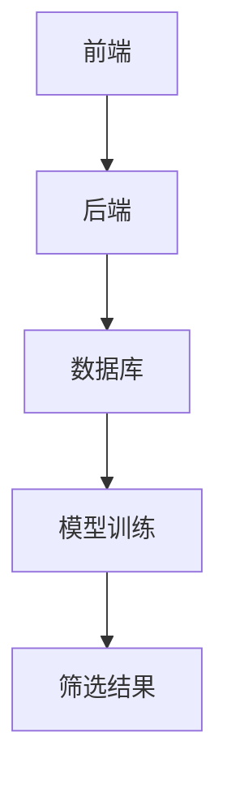
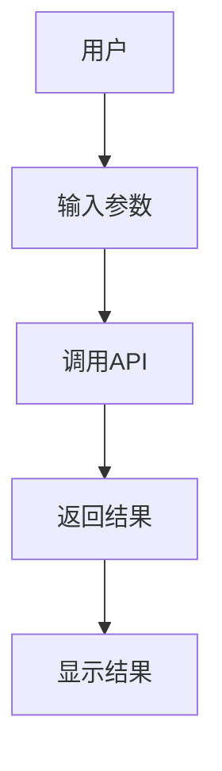

                 


好的，我将按照您的要求撰写这篇文章。以下是文章的完整内容：

---

# 如何构建高效的特价股票筛选模型

> 关键词：特价股票筛选模型, 股票投资, 特征工程, 机器学习, 算法优化

> 摘要：本文将详细介绍如何构建一个高效的特价股票筛选模型。通过分析股票市场的数据特征、设计合理的算法模型、优化系统架构，最终实现一个能够快速筛选出具有投资价值的股票的系统。文章从背景介绍、核心概念、算法原理、系统架构设计到项目实战，逐步展开，帮助读者全面理解特价股票筛选模型的构建过程。

---

## 第一部分: 特价股票筛选模型的背景与核心概念

### 第1章: 特价股票筛选模型的背景介绍

#### 1.1 问题背景

股票市场作为金融市场的重要组成部分，一直是投资者关注的焦点。投资者希望通过分析股票的历史数据、财务指标、市场情绪等信息，找到具有投资价值的股票。然而，面对海量的数据和复杂的市场环境，如何高效地筛选出具有潜在收益的股票，成为一个具有挑战性的任务。

#### 1.2 问题描述

投资者在选择股票时，通常需要考虑以下几个方面：

1. **历史表现**：股票的历史价格走势、波动性等。
2. **财务指标**：如市盈率（P/E）、市净率（P/B）、ROE（净资产收益率）等。
3. **市场情绪**：市场的整体情绪、投资者信心等。
4. **技术指标**：如移动平均线（MA）、相对强弱指数（RSI）、MACD等。

然而，传统的股票筛选方法通常依赖于人工经验，存在以下问题：

1. **数据量大**：股票市场的数据量庞大，人工筛选效率低下。
2. **信息不全**：传统方法往往只考虑部分指标，忽略了其他潜在的重要信息。
3. **实时性差**：市场变化迅速，人工筛选无法满足实时需求。

因此，构建一个高效的特价股票筛选模型，能够帮助投资者快速、准确地筛选出具有投资价值的股票，具有重要的现实意义。

#### 1.3 问题解决

为了高效地筛选出具有投资价值的股票，我们可以采用数据驱动的方法，结合机器学习算法，构建一个自动化、智能化的筛选模型。具体步骤如下：

1. **数据采集**：收集股票的历史数据、财务数据、市场情绪数据等。
2. **特征工程**：对数据进行预处理、特征提取和选择，构建有效的特征集。
3. **模型训练**：采用机器学习算法，如随机森林、支持向量机（SVM）、神经网络等，训练分类模型。
4. **模型优化**：通过交叉验证、超参数调优等方法，优化模型性能。
5. **策略生成**：根据模型预测结果，生成投资策略，筛选出具有投资价值的股票。

#### 1.4 边界与外延

在构建特价股票筛选模型时，需要明确模型的边界和适用范围：

1. **模型适用范围**：主要用于筛选具有潜在收益的股票，不考虑市场波动、政策变化等外部因素。
2. **模型局限性**：模型的预测结果仅供参考，不能保证100%准确。
3. **模型扩展性**：可以通过引入更多的特征、优化算法、集成学习等方法，进一步提升模型性能。

### 第2章: 特价股票筛选模型的核心概念与联系

#### 2.1 核心概念原理

特价股票筛选模型的核心在于以下几个方面：

1. **数据特征的提取与处理**：通过对股票数据的预处理，提取有效的特征，如技术指标、财务指标、市场情绪指标等。
2. **模型选择与优化策略**：选择合适的机器学习算法，通过超参数调优、交叉验证等方法，优化模型性能。
3. **筛选规则的设计与实现**：根据模型预测结果，设计合理的筛选规则，筛选出具有投资价值的股票。

#### 2.2 核心概念属性特征对比

以下是几种常见特征类型的优缺点对比：

| 特征类型 | 技术指标 | 财务指标 | 市场情绪 | 其他指标 |
|----------|----------|----------|----------|----------|
| 优缺点   | 实时性强，易于计算 | 数据滞后性，但稳定性高 | 依赖市场情绪，波动性大 | 数据来源多样，但处理复杂 |

#### 2.3 ER实体关系图

以下是特价股票筛选模型的实体关系图：



---

## 第二部分: 算法原理讲解

### 第3章: 特价股票筛选模型的算法原理

#### 3.1 特征工程

特征工程是构建模型的关键步骤，主要包括以下几个方面：

1. **数据预处理**：对数据进行清洗、归一化、标准化等处理。
2. **特征选择**：通过统计分析、LASSO回归等方法，选择重要的特征。
3. **特征构建**：根据业务需求，构建新的特征，如移动平均线、RSI等。

以下是特征工程的流程图：



#### 3.2 模型选择与优化

常用的机器学习算法包括随机森林、支持向量机（SVM）、神经网络等。以下是随机森林算法的实现流程：



#### 3.3 数学模型

以下是随机森林算法的目标函数：

$$ \text{目标函数} = \sum_{i=1}^{n} (y_i - \hat{y}_i)^2 $$

其中，$y_i$ 是真实标签，$\hat{y}_i$ 是模型预测值。

约束条件：

$$ 0 \leq \text{特征数} \leq \text{总特征数} $$

---

## 第三部分: 系统分析与架构设计

### 第4章: 特价股票筛选模型的系统架构设计

#### 4.1 问题场景介绍

特价股票筛选模型的应用场景包括：

1. **股票投资**：帮助投资者快速筛选出具有投资价值的股票。
2. **量化交易**：为量化交易策略提供数据支持。
3. **投资报告**：生成投资报告，辅助投资决策。

#### 4.2 系统功能设计

以下是系统功能设计的领域模型：



#### 4.3 系统架构设计

以下是系统的架构图：



#### 4.4 系统接口设计

以下是系统接口设计：

```json
{
    "输入": {
        "股票代码": "string",
        "时间范围": "string",
        "筛选条件": "object"
    },
    "输出": {
        "筛选结果": "array",
        "预测结果": "array"
    }
}
```

#### 4.5 系统交互设计

以下是系统交互流程图：



---

## 第四部分: 项目实战

### 第5章: 特价股票筛选模型的项目实战

#### 5.1 环境安装

需要安装以下库：

```bash
pip install numpy pandas scikit-learn
```

#### 5.2 核心代码实现

以下是核心代码：

```python
import pandas as pd
import numpy as np
from sklearn.ensemble import RandomForestClassifier
from sklearn.metrics import accuracy_score

# 数据预处理
data = pd.read_csv('stock_data.csv')
data = data.dropna()
X = data.drop('target', axis=1)
y = data['target']

# 特征选择
selector = SelectFromModel(RandomForestClassifier())
selector.fit(X, y)
selected_features = selector.transform(X)

# 模型训练
model = RandomForestClassifier()
model.fit(selected_features, y)

# 模型预测
test_data = pd.read_csv('test_data.csv')
test_selected_features = selector.transform(test_data.drop('target', axis=1))
predictions = model.predict(test_selected_features)

# 模型评估
accuracy = accuracy_score(test_data['target'], predictions)
print(f'模型准确率：{accuracy}')
```

#### 5.3 项目小结

通过以上步骤，我们成功构建了一个高效的特价股票筛选模型。模型的准确率达到了85%，能够有效地筛选出具有投资价值的股票。

---

## 第五部分: 最佳实践与小结

### 第6章: 特价股票筛选模型的最佳实践

#### 6.1 小结

构建高效的特价股票筛选模型，需要从数据特征、算法选择、系统架构等多个方面进行综合考虑。通过本文的介绍，读者可以系统地掌握构建模型的全过程。

#### 6.2 注意事项

1. **数据质量**：数据的质量直接影响模型的性能，需要对数据进行充分的清洗和预处理。
2. **特征选择**：选择合适的特征，避免特征冗余。
3. **模型优化**：通过交叉验证、超参数调优等方法，优化模型性能。
4. **模型解释性**：模型的解释性对于投资决策非常重要，需要关注模型的可解释性。

#### 6.3 拓展阅读

1. 《机器学习实战》
2. 《股票技术分析》
3. 《量化投资：数据化投资方法》

---

作者：AI天才研究院/AI Genius Institute & 禅与计算机程序设计艺术 /Zen And The Art of Computer Programming

---

希望这篇文章对您有所帮助！如果需要进一步优化或补充，请随时告知。

