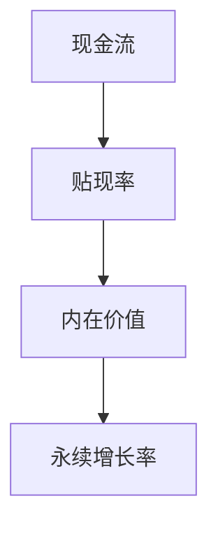
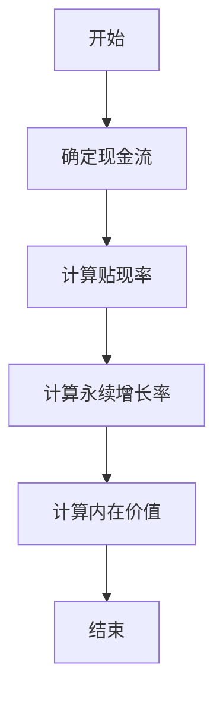
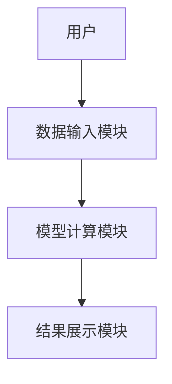

                 


# 如何计算一家公司的内在价值

> 关键词：公司估值，内在价值，贴现现金流模型，自由现金流，永续增长率，财务分析，投资评估

> 摘要：本文将详细讲解如何计算一家公司的内在价值。从基本概念到复杂模型，从理论分析到实际操作，本文将带领读者一步步掌握公司内在价值的计算方法。通过贴现现金流模型（DCF）的详细推导和实际案例分析，帮助读者理解如何通过财务数据和市场假设来评估一家公司的真正价值。

---

# 第一部分: 公司内在价值计算的背景与核心概念

## 第1章: 内在价值计算的基本概念

### 1.1 内在价值的定义与背景

#### 1.1.1 什么是公司内在价值

公司内在价值是指一家公司基于其未来现金流的贴现值，即假设市场是理性的，公司股票的真正价值。内在价值与市场价值不同，后者是市场交易中股票的实际价格，而前者是公司未来现金流的现值。

#### 1.1.2 内在价值计算的必要性

在投资决策中，内在价值是判断一家公司是否被低估或高估的重要依据。通过计算内在价值，投资者可以判断股票是否值得买入或卖出。此外，内在价值也是公司战略决策（如并购、资本预算）的重要参考。

#### 1.1.3 内在价值与市场价值的区别

- **内在价值**：基于公司基本面的未来现金流折现值。
- **市场价值**：市场交易中股票的实际价格，受市场情绪和市场参与者的心理影响。

### 1.2 内在价值计算的核心要素

#### 1.2.1 自由现金流的定义与计算

**自由现金流（FCF）**是公司在偿还所有债务和再投资必要的资本支出之后，剩余的可用于分配给股东的现金流量。其计算公式为：

$$\text{自由现金流} = \text{净利润} + \text{折旧} + \text{摊销} - \text{资本支出}$$

#### 1.2.2 贴现率的确定方法

贴现率反映了投资者要求的必要回报率，通常由无风险利率和风险溢价组成：

$$\text{贴现率} = \text{无风险利率} + \text{风险溢价}$$

#### 1.2.3 永续增长率的假设与验证

永续增长率假设公司在未来稳定增长的速率，通常基于行业的平均增长率或公司自身的竞争优势。

### 1.3 内在价值计算的基本公式

贴现现金流模型（DCF）是计算公司内在价值的核心公式：

$$\text{内在价值} = \sum_{t=1}^{n} \frac{\text{现金流}_t}{(1 + r)^t} + \frac{\text{终值}}{(1 + r)^n}$$

其中：
- $\text{现金流}_t$ 是第 $t$ 年的自由现金流。
- $r$ 是贴现率。
- $n$ 是预测的年数。
- 终值是第 $n$ 年后稳定的现金流按永续增长率贴现的现值。

---

## 第2章: 内在价值计算的核心概念与联系

### 2.1 内在价值计算的核心要素对比

| 要素 | 定义 | 计算公式 | 示例 |
|------|------|----------|------|
| 自由现金流 | 公司可用于分配给股东的现金 | $\text{FCF} = \text{净利润} + \text{折旧} + \text{摊销} - \text{资本支出}$ | $\text{FCF}_1 = \$100 + \$20 + \$30 - \$50 = \$100$ |
| 贴现率 | 投资者要求的回报率 | $\text{贴现率} = \text{无风险利率} + \text{风险溢价}$ | $\text{贴现率} = 2\% + 5\% = 7\%$ |
| 永续增长率 | 未来现金流的稳定增长率 | 通常假设为行业平均增长率 | 永续增长率 = 3\% |

### 2.2 内在价值计算的ER实体关系图



### 2.3 内在价值计算的流程图



---

# 第二部分: 内在价值计算的算法原理

## 第3章: 贴现现金流模型（DCF）的原理与实现

### 3.1 DCF模型的算法原理

贴现现金流模型（DCF）是计算公司内在价值的核心方法。其基本思想是将公司未来的自由现金流折现，加终值（永续增长部分）的现值。

#### 3.1.1 自由现金流的计算公式

$$\text{自由现金流} = \text{净利润} + \text{折旧} + \text{摊销} - \text{资本支出}$$

#### 3.1.2 贴现率的计算公式

$$\text{贴现率} = \text{无风险利率} + \text{风险溢价}$$

#### 3.1.3 内在价值的计算公式

$$\text{内在价值} = \sum_{t=1}^{n} \frac{\text{现金流}_t}{(1 + r)^t} + \frac{\text{终值}}{(1 + r)^n}$$

### 3.2 DCF模型的Python实现

```python
def calculate_intrinsic_value(free_cash_flows, discount_rate, terminal_value, horizon):
    intrinsic_value = 0
    for t in range(1, horizon + 1):
        intrinsic_value += free_cash_flows[t] / (1 + discount_rate) ** t
    if horizon > 0:
        intrinsic_value += terminal_value / (1 + discount_rate) ** horizon
    return intrinsic_value

# 示例数据
free_cash_flows = [100, 120, 130]
discount_rate = 0.07
terminal_value = 200
horizon = 3

iv = calculate_intrinsic_value(free_cash_flows, discount_rate, terminal_value, horizon)
print(f"内在价值为: {iv:.2f}")
```

---

## 第4章: 内在价值计算的系统分析与架构设计

### 4.1 系统分析

#### 4.1.1 问题场景介绍

在实际投资中，投资者需要快速、准确地计算公司的内在价值。为此，我们可以设计一个基于DCF模型的系统，帮助用户输入财务数据和市场假设，输出公司内在价值。

#### 4.1.2 系统功能设计

- 数据输入模块：用户输入财务数据（如净利润、折旧、摊销、资本支出）和市场假设（如无风险利率、风险溢价、永续增长率）。
- 模型计算模块：基于DCF模型计算内在价值。
- 结果展示模块：以图形化界面展示计算结果。

### 4.2 系统架构设计



---

## 第5章: 内在价值计算的项目实战

### 5.1 项目环境安装

安装必要的Python库，如`numpy`和`pandas`。

### 5.2 核心代码实现

```python
import numpy as np

def calculate_intrinsic_value(fcf, discount_rate, terminal_growth_rate, horizon):
    present_value = 0
    for t in range(horizon):
        cash_flow = fcf * (1 + terminal_growth_rate) ** t
        present_value += cash_flow / (1 + discount_rate) ** (t + 1)
    terminal_value = fcf * (1 + terminal_growth_rate) ** horizon / (discount_rate - terminal_growth_rate)
    present_value += terminal_value / (1 + discount_rate) ** horizon
    return present_value

# 示例数据
fcf = 100
discount_rate = 0.07
terminal_growth_rate = 0.03
horizon = 5

iv = calculate_intrinsic_value(fcf, discount_rate, terminal_growth_rate, horizon)
print(f"内在价值为: {iv:.2f}")
```

### 5.3 实际案例分析

以亚马逊为例，假设其自由现金流为 $100 million，贴现率为7%，永续增长率为3%，计算其内在价值。

---

# 第三部分: 内在价值计算的最佳实践

## 第6章: 小结与注意事项

- **小结**：本文详细讲解了如何计算公司内在价值，从基本概念到实际操作，帮助读者掌握DCF模型的原理和应用。
- **注意事项**：
  1. 内在价值计算依赖于假设，如永续增长率和贴现率的选择会影响最终结果。
  2. 数据的准确性至关重要，建议使用最新的财务报表。
  3. 投资者应结合市场环境和行业趋势进行综合分析。

## 第7章: 拓展阅读

- 推荐书籍：《The Intelligent Investor》
- 推荐工具：Excel、Python（Pandas、NumPy）
- 推荐网站：Morningstar、S&P Global Market Intelligence

---

# 作者：AI天才研究院 & 禅与计算机程序设计艺术

通过本文的详细讲解，您应该能够掌握如何计算一家公司的内在价值，并将其应用于实际投资分析中。如果需要进一步学习，可以参考推荐的书籍和工具。

