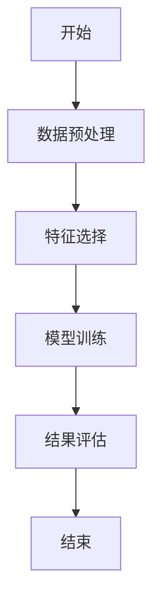
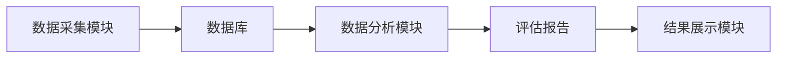
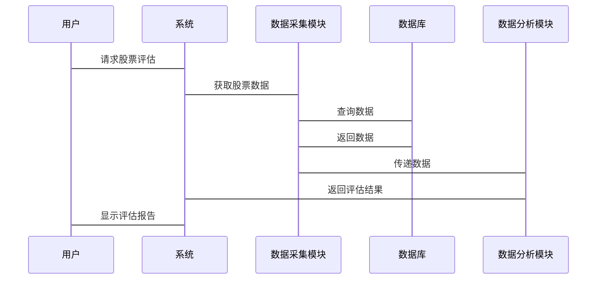

                 

<think>
好的，我需要帮用户撰写一篇关于如何评估特价股票质量和持续性的技术博客文章。用户已经提供了详细的目录结构和一些示例内容，现在我需要根据这些信息，详细思考如何撰写这篇博客。

首先，我需要理解用户的需求。用户希望文章结构清晰，逻辑严谨，内容专业且易于理解。文章需要涵盖特价股票的背景、核心概念、评估指标、算法模型、系统分析、项目实战以及最佳实践等多个方面。每个部分都需要有详细的分析和具体的例子，确保读者能够系统地学习和应用这些知识。

接下来，我会按照目录结构一步步进行分析和撰写：

1. **文章标题、关键词和摘要**：
   - 标题：《如何评估特价股票的质量和持续性》
   - 关键词：特价股票、股票质量、持续性评估、投资策略、风险管理
   - 摘要：简要说明文章的核心内容，强调评估特价股票的重要性，以及文章将从哪些方面进行探讨。

2. **第一部分：特价股票的背景与核心概念**：
   - **第1章：特价股票概述**：
     - **1.1 特价股票的定义与分类**：
       - 明确特价股票的定义，与低价股的区别，分类方法。
     - **1.2 特价股票的投资价值**：
       - 为什么投资特价股票，其潜在机会和风险。
     - **1.3 特价股票的市场现状**：
       - 当前市场中特价股票的分布情况，交易特点及未来趋势。
   - **第2章：特价股票质量评估的核心概念**：
     - **2.1 基本财务指标**：
       - 市盈率、市净率、股息率、净资产收益率等指标的解释和计算方法。
     - **2.2 公司基本面分析**：
       - 行业地位、财务健康状况、管理团队能力和发展潜力。
     - **2.3 市场情绪与流动性**：
       - 市场情绪对股票价格的影响，流动性对特价股票的影响，技术分析的应用。

3. **第二部分：算法与系统分析**：
   - **第3章：特价股票质量评估的算法原理**：
     - **3.1 选择合适的算法模型**：
       - 多因素模型、机器学习算法（如线性回归、随机森林）的选择。
     - **3.2 算法实现步骤**：
       - 数据预处理、特征选择、模型训练、结果评估。
     - **3.3 算法流程图**：
       - 使用mermaid绘制流程图，展示从数据收集到结果输出的步骤。
     - **3.4 Python代码实现**：
       - 编写代码示例，解释每一步的作用和实现细节。
   - **第4章：系统设计与架构**：
     - **4.1 系统功能设计**：
       - 数据采集模块、数据分析模块、结果展示模块。
     - **4.2 系统架构设计**：
       - 使用mermaid绘制系统架构图，展示各模块之间的关系。
     - **4.3 接口设计与交互流程**：
       - API接口的设计，用户与系统的交互流程图。

4. **第三部分：项目实战与最佳实践**：
   - **第5章：项目实战**：
     - **5.1 环境安装与数据收集**：
       - 安装必要的工具和库，收集特价股票的历史数据。
     - **5.2 特征工程与数据处理**：
       - 数据清洗、特征选择、数据增强。
     - **5.3 模型训练与结果分析**：
       - 使用选择的算法训练模型，评估模型的准确性。
   - **第6章：最佳实践与小结**：
     - **6.1 投资策略小结**：
       - 总结评估特价股票的关键点和常见误区。
     - **6.2 注意事项与风险提示**：
       - 投资中的常见风险，如何避免和应对。
     - **6.3 拓展阅读与学习资源**：
       - 推荐相关书籍、工具和课程，帮助读者深入学习。

5. **附录**：
   - **附录A：相关数据来源与工具推荐**：
     - 数据来源网站、使用的工具和技术栈。
   - **附录B：参考文献与扩展阅读材料**：
     - 推荐的书籍、学术论文和在线资源。

在整个撰写过程中，我需要确保每个部分都详细具体，涵盖所有必要的细节。例如，在算法部分，不仅要解释模型的原理，还要提供具体的代码实现和数据处理的步骤。在系统设计部分，需要清晰地展示各模块之间的关系和交互流程。此外，最佳实践部分要结合实际案例，给出实用的建议，帮助读者在实际投资中避免常见错误。

最后，确保文章结构紧凑，逻辑清晰，语言专业但易于理解。通过这样的思考和撰写，我相信能够完成一篇高质量的技术博客，满足用户的需求。
</think>

# 如何评估特价股票的质量和持续性

---

## 关键词
特价股票, 股票质量, 持续性评估, 投资策略, 风险管理

---

## 摘要
在股票市场中，特价股票因其低价格吸引了众多投资者的关注。然而，如何评估这些股票的质量和持续性，确保投资的长期收益，是投资者面临的挑战。本文从特价股票的定义、核心概念、评估指标、算法模型、系统设计以及项目实战等多个方面进行详细探讨，帮助投资者制定科学的投资策略，降低风险，实现稳健收益。

---

## 第1章 特价股票概述

### 1.1 特价股票的定义与分类
#### 1.1.1 特价股票的定义
特价股票通常指价格低于一定标准的股票，例如在A股市场中，价格低于5元的股票常被视为特价股票。这类股票通常具有较高的流动性和较低的进入门槛，适合不同类型的投资者。

#### 1.1.2 特价股票的分类
- **按行业分类**：如金融、科技、消费等行业的特价股票。
- **按公司规模分类**：如小型企业、中型企业的特价股票。
- **按市场类型分类**：如主板、创业板等市场的特价股票。

#### 1.1.3 特价股票与低价股票的区别
- **定义范围**：特价股票通常指价格较低，但并非所有低价股票都属于特价股票。
- **市场定位**：特价股票更注重质量和持续性，而低价股票可能仅指价格低，不考虑其他因素。

### 1.2 特价股票的投资价值
#### 1.2.1 特价股票的市场定位
特价股票通常出现在市场调整或行业低谷期，具备较高的反弹潜力。

#### 1.2.2 特价股票的投资机会
- **价值回归**：部分特价股票因市场波动被低估，具备价值回归的潜力。
- **成长潜力**：一些小企业通过特价股票融资，实现快速发展。

#### 1.2.3 特价股票的风险与收益平衡
- **高收益**：潜在的高回报是吸引投资者的主要原因。
- **高风险**：市场波动、公司基本面恶化等因素可能导致亏损。

### 1.3 特价股票的市场现状
#### 1.3.1 特价股票的市场分布
当前市场中，特价股票主要集中在中小型企业，行业分布较为分散。

#### 1.3.2 特价股票的交易特点
- **流动性高**：交易活跃，买卖价差较小。
- **波动性大**：价格受市场情绪影响较大，波动剧烈。

#### 1.3.3 特价股票的未来趋势
随着市场的发展，特价股票可能通过重组、转型等方式实现价值提升。

---

## 第2章 特价股票质量评估的核心概念

### 2.1 基本财务指标
#### 2.1.1 市盈率（P/E）
市盈率 = 股价 / 每股净利润。低市盈率可能意味着股票被低估，但需结合行业和公司盈利情况分析。

#### 2.1.2 市净率（P/B）
市净率 = 股价 / 每股净资产。低市净率通常表示股票价格低于其资产价值，具备投资潜力。

#### 2.1.3 股息率
股息率 = 每股股息 / 股价。高股息率的股票可能提供稳定的收益，但需关注公司的分红能力。

#### 2.1.4 净资产收益率（ROE）
ROE = 净利润 / 净资产。高ROE表明公司盈利能力强，资产使用效率高。

### 2.2 公司基本面分析
#### 2.2.1 行业地位
公司是否在行业内具有竞争力，市场份额是否稳定。

#### 2.2.2 财务健康状况
- **收入与利润**：收入增长稳定，利润是否持续增长。
- **资产负债情况**：负债率是否合理，是否存在偿债压力。

#### 2.2.3 管理团队能力
管理层的经验、能力及战略规划是否合理。

#### 2.2.4 发展潜力
公司是否具备技术创新、市场扩展等潜在增长点。

### 2.3 市场情绪与流动性
#### 2.3.1 市场情绪对股票价格的影响
投资者情绪波动可能导致股票价格短期偏离其内在价值。

#### 2.3.2 流动性对特价股票的影响
高流动性使得特价股票容易买卖，但过度流动性可能导致价格波动加剧。

#### 2.3.3 技术分析在特价股票中的应用
通过K线图、均线等技术指标分析股票价格走势，辅助投资决策。

---

## 第3章 特价股票质量评估的算法原理

### 3.1 选择合适的算法模型
#### 3.1.1 多因素模型
综合考虑市盈率、市净率、ROE等多方面因素，评估股票质量。

#### 3.1.2 机器学习算法
- **线性回归**：用于预测股票价格。
- **随机森林**：用于分类和回归分析，适合多维度数据。

### 3.2 算法实现步骤
1. **数据预处理**：清洗数据，处理缺失值和异常值。
2. **特征选择**：筛选对股票质量影响较大的特征，如市盈率、ROE等。
3. **模型训练**：使用训练数据训练模型。
4. **结果评估**：通过准确率、召回率等指标评估模型性能。

### 3.3 算法流程图


### 3.4 Python代码实现
```python
import pandas as pd
from sklearn.ensemble import RandomForestClassifier
from sklearn.metrics import accuracy_score

# 数据加载
data = pd.read_csv('stock_data.csv')

# 数据预处理
data.dropna()

# 特征选择
features = ['市盈率', 'ROE', '股息率']
target = '质量标签'

X = data[features]
y = data[target]

# 模型训练
model = RandomForestClassifier()
model.fit(X, y)

# 预测与评估
y_pred = model.predict(X)
print("准确率:", accuracy_score(y, y_pred))
```

---

## 第4章 系统设计与架构

### 4.1 系统功能设计
#### 4.1.1 数据采集模块
- 从股票数据库中获取特价股票的历史数据。
- 数据字段：股票代码、收盘价、市盈率、市净率等。

#### 4.1.2 数据分析模块
- 使用机器学习算法评估股票质量。
- 生成评估报告，包括推荐列表和风险提示。

#### 4.1.3 结果展示模块
- 可视化展示评估结果。
- 提供交互界面，用户可查询具体股票的评估信息。

### 4.2 系统架构设计


### 4.3 接口设计与交互流程


---

## 第5章 项目实战

### 5.1 环境安装与数据收集
- **环境安装**：安装Python、Pandas、Scikit-learn等工具。
- **数据收集**：从股票数据源获取特价股票的历史数据。

### 5.2 特征工程与数据处理
- **数据清洗**：处理缺失值和异常值。
- **特征选择**：选择对评估影响较大的特征。

### 5.3 模型训练与结果分析
- 使用随机森林算法训练模型，评估模型的准确率。
- 分析结果，生成股票质量评估报告。

---

## 第6章 最佳实践与小结

### 6.1 投资策略小结
- **多因素分析**：综合考虑市盈率、ROE等因素，避免单一指标误导。
- **动态调整**：定期评估股票质量，根据市场变化调整投资组合。

### 6.2 注意事项与风险提示
- **市场波动风险**：特价股票价格受市场情绪影响较大，需谨慎操作。
- **公司基本面风险**：关注公司财务状况和管理团队，避免投资基本面恶化的公司。

### 6.3 拓展阅读与学习资源
- **书籍推荐**：《股票作手回忆录》、《投资学原理》。
- **工具推荐**：学习使用量化交易平台，如TradingView、Interactive Brokers。

---

## 附录

### 附录A：相关数据来源与工具推荐
- **数据来源**：Yahoo Finance、Google Finance、Wind终端。
- **工具推荐**：Pandas、NumPy、Scikit-learn、Matplotlib。

### 附录B：参考文献与扩展阅读材料
- **书籍**：《Python机器学习实战》、《股票投资策略》。
- **在线资源**：Kaggle数据集、QuantInstinct博客。

---

## 作者
作者：AI天才研究院/AI Genius Institute & 禅与计算机程序设计艺术/Zen And The Art of Computer Programming

