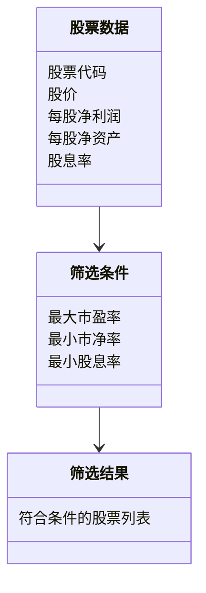

                 


# 如何识别被低估的股票：格雷厄姆的筛选方法

## 关键词：
- 股票筛选
- 低估股票
- 格雷厄姆价值投资
- 市盈率
- 市净率

## 摘要：
本文详细介绍了如何识别被低估的股票，重点讲解了格雷厄姆的价值投资理论及其筛选方法。通过分析核心概念、数学模型和实际案例，帮助读者掌握识别低估股票的技巧，构建稳健的投资组合。

---

## 第一部分: 价值投资与低估股票概述

### 第1章: 价值投资的起源与理论基础

#### 1.1 价值投资的定义与核心理念
价值投资是一种以基本面分析为基础的投资策略，强调购买价格低于其内在价值的股票。其核心理念是寻找市场先生的错误定价。

#### 1.2 格雷厄姆的价值投资理论
本杰明·格雷厄姆是价值投资的鼻祖，他提出防御性投资策略，强调安全边际和低风险投资。格雷厄姆认为，市场波动反映了短期情绪，而内在价值则是长期稳定的基础。

#### 1.3 价值投资与基本面分析的关系
价值投资依赖于基本面分析，通过研究公司的财务状况、盈利能力、成长性和行业地位来评估其内在价值。

---

### 第2章: 识别低估股票的重要性

#### 2.1 什么是低估股票
低估股票是指市场价格低于其内在价值的股票。这类股票通常被市场忽视或低估，具有较大的上涨潜力。

#### 2.2 为什么识别低估股票重要
识别低估股票有助于投资者获得超额收益，同时降低投资风险。通过筛选低估股票，投资者可以找到具有长期增长潜力的企业。

#### 2.3 低估股票的特点
低估股票通常具有低市盈率、低市净率和高股息率，且公司财务状况稳健，具备竞争优势。

---

## 第二部分: 格雷厄姆的筛选方法

### 第3章: 格雷厄姆的防御性投资者策略

#### 3.1 格雷厄姆的防御性投资理念
格雷厄姆强调防御性投资，避免高风险和高波动性。他建议投资者选择那些具有安全边际的股票，即市场价格远低于其内在价值。

#### 3.2 格雷厄姆的选股标准
格雷厄姆提出了具体的选股标准，包括低市盈率、低市净率、高股息率和稳健的财务状况。

---

### 第4章: 格雷厄姆筛选方法的具体指标

#### 4.1 市盈率（P/E）的计算与应用
市盈率是衡量股票价值的重要指标，计算公式为：

$$\text{市盈率} = \frac{\text{股价}}{\text{每股净利润}}$$

#### 4.2 市净率（P/B）的计算与应用
市净率是另一个重要的筛选指标，计算公式为：

$$\text{市净率} = \frac{\text{股价}}{\text{每股净资产}}$$

#### 4.3 其他筛选指标
格雷厄姆还关注股息率、净利润增长率和负债率等指标。

---

### 第5章: 格雷厄姆筛选方法的数学模型与公式

#### 5.1 市盈率计算公式
$$\text{市盈率} = \frac{\text{股价}}{\text{每股净利润}}$$

#### 5.2 市净率计算公式
$$\text{市净率} = \frac{\text{股价}}{\text{每股净资产}}$$

---

## 第三部分: 系统分析与架构设计

### 第6章: 问题场景介绍
识别低估股票需要系统化的分析方法，结合数据挖掘和算法筛选。

### 第7章: 系统功能设计
#### 7.1 领域模型Mermaid类图


### 第8章: 系统架构设计


---

## 第四部分: 项目实战

### 第9章: 环境安装
需要安装Python、Pandas、NumPy等库。

### 第10章: 核心实现源代码
```python
import pandas as pd

def calculate_pe_ratio(df):
    df['PE Ratio'] = df['股价'] / df['每股净利润']
    return df

def calculate_pb_ratio(df):
    df['PB Ratio'] = df['股价'] / df['每股净资产']
    return df

def screen_undervalued_stocks(df, max_pe=15, min_pb=1):
    df = calculate_pe_ratio(df)
    df = calculate_pb_ratio(df)
    df = df[df['PE Ratio'] <= max_pe]
    df = df[df['PB Ratio'] >= min_pb]
    return df

# 示例数据
data = {
    '股票代码': ['AAPL', 'MSFT', 'GOOGL', 'AMZN'],
    '股价': [150, 300, 120, 100],
    '每股净利润': [10, 15, 20, 5],
    '每股净资产': [50, 60, 70, 30]
}

df = pd.DataFrame(data)
result = screen_undervalued_stocks(df)
print(result)
```

---

## 第五部分: 最佳实践

### 第11章: 注意事项
- 数据来源的可靠性
- 指标的动态调整
- 综合分析的重要性

### 第12章: 小结
格雷厄姆的筛选方法提供了有效的工具，但需要结合市场环境和公司基本面进行综合判断。

### 第13章: 拓展阅读
推荐阅读格雷厄姆的《 Intelligent Investor》和彼得·林奇的《Beating the Street》。

---

## 作者：AI天才研究院 & 禅与计算机程序设计艺术

---

以上是《如何识别被低估的股票：格雷厄姆的筛选方法》的完整文章结构，涵盖了从理论到实践的各个方面，帮助读者系统地理解和应用格雷厄姆的筛选方法。

