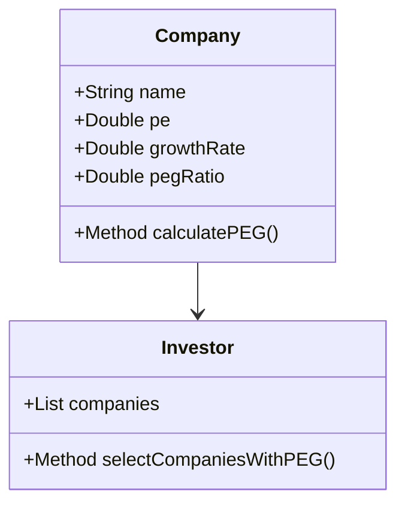
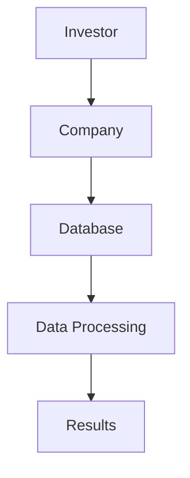

                 

<think>
嗯，用户让我写一篇关于如何运用彼得·林奇的PEG比率选股的技术博客，看起来他希望内容非常专业且结构严谨。首先，我需要理解PEG比率的定义和计算方法，这可能涉及到市盈率（PE）和预期增长率（Growth Rate）。我应该先解释什么是PEG比率，以及它在投资决策中的作用。

接下来，我需要分析彼得·林奇的投资理念，他为什么重视PEG比率，以及这种方法在选股中的应用。这部分可能需要结合一些实际案例，比如苹果或者微软，来说明如何计算PEG比率并评估其投资价值。

然后，我应该详细讲解PEG比率的计算过程，包括PE和Growth Rate的计算方法，以及如何将两者结合起来得到PEG。这里可能需要使用数学公式，我得确保这些公式正确无误，并用LaTeX格式呈现，比如$$PEG = \frac{PE}{Growth\ Rate}$$。

接下来，我需要考虑如何将PEG比率应用到实际选股中。可能需要比较不同公司的PEG值，分析哪些公司被低估，哪些被高估。这部分可以用图表来辅助，比如绘制不同公司的PEG分布图，帮助读者更好地理解。

同时，我还需要讨论一些误区，比如市场波动如何影响PEG比率，以及如何避免短期市场情绪的干扰，长期关注公司的基本面。这部分可以结合当前市场情况，给出一些风险管理的建议。

最后，我应该总结PEG比率的优势和局限性，帮助读者全面了解这种方法。可能还需要展望未来，讨论随着市场的变化，PEG比率的应用是否需要调整，或者结合其他指标进行更全面的评估。

整体来看，我需要确保内容逻辑清晰，从理论到实践，逐步引导读者理解和应用PEG比率。同时，语言要专业但不失易懂，结构紧凑，让读者能够轻松跟随我的分析过程。
</think>

# 如何运用彼得·林奇的PEG比率选股

> 关键词：彼得·林奇，PEG比率，选股策略，投资分析，股票估值

> 摘要：本文将详细介绍如何运用彼得·林奇的PEG比率进行选股。从PEG比率的基本概念到实际应用，结合数学模型、实例分析和系统架构，为读者提供全面的选股策略和投资分析方法。

---

## 第1章 彼得·林奇与PEG比率概述

### 1.1 彼得·林奇及其投资理念

彼得·林奇是美国著名投资家，曾任富达投资集团麦哲伦基金经理，创造了辉煌的投资业绩。他倡导“价值投资”，注重基本面分析，强调选择具有持续增长潜力的公司。

#### 1.1.1 彼得·林奇的生平简介
- 1948年出生，毕业于宾夕法尼亚大学和哈佛商学院。
- 1971年加入富达投资，1977年接手麦哲伦基金，创造了年均29%的回报率。
- 著名书籍《彼得·林奇的投资课》中提出PEG比率。

#### 1.1.2 林奇的投资哲学
- **价值投资**：寻找被市场低估的公司。
- **成长与估值的平衡**：关注公司未来增长潜力与当前估值。
- **长期投资**：避免短期波动，关注公司长期价值。

#### 1.1.3 PEG比率的重要性
- PEG是林奇选股的核心工具，用于衡量股票的估值与增长潜力。

### 1.2 PEG比率的基本概念

PEG比率（Price Earnings Growth ratio）是衡量股票估值与公司增长潜力的重要指标。

#### 1.2.1 定义
- PEG = 市盈率（PE） / 年增长率（Growth Rate）。
- 公式：$$PEG = \frac{PE}{Growth\ Rate}$$

#### 1.2.2 与PE和PG的关系
- **PE**：市盈率，反映市场对公司估值。
- **PG**：价格与增长率的比值。
- PEG综合考虑了PE和PG，更全面地衡量股票价值。

#### 1.2.3 核心要素
- **市盈率（PE）**：股价除以每股收益。
- **增长率（Growth Rate）**：公司净利润年增长率。
- **PEG比率**：综合PE和Growth Rate的比值。

---

## 第2章 PEG比率的数学模型与计算

### 2.1 PEG比率的公式推导

#### 2.1.1 PE与Growth Rate的计算
- PE公式：$$PE = \frac{Stock\ Price}{Earnings\ Per\ Share}$$
- Growth Rate公式：$$Growth\ Rate = \frac{Net\ Profit\ Growth}{100}$$

#### 2.1.2 PEG比率的计算
- 将PE除以Growth Rate得到PEG：$$PEG = \frac{PE}{Growth\ Rate}$$

### 2.2 PEG比率的数学模型

#### 2.2.1 PEG比率的公式表示
$$PEG = \frac{PE}{Growth\ Rate}$$

#### 2.2.2 PE与Growth Rate的关系
- 当Growth Rate固定时，PEG与PE成正比。
- 当PE固定时，Growth Rate越高，PEG越小。

### 2.3 PEG比率的计算实例

#### 2.3.1 实例1：公司A的计算
- 市盈率（PE）= 20
- 净利润增长率（Growth Rate）= 10%
- PEG = 20 / 0.10 = 2.0

#### 2.3.2 实例2：公司B的计算
- 市盈率（PE）= 30
- 净利润增长率（Growth Rate）= 15%
- PEG = 30 / 0.15 = 2.0

---

## 第3章 PEG比率的选股策略

### 3.1 确定目标行业与公司

#### 3.1.1 行业选择标准
- 行业增长潜力：选择高增长行业。
- 行业稳定性：选择具有抗跌性的行业。

#### 3.1.2 公司基本面分析
- 盈利能力：ROE、ROA等指标。
- 偿债能力：资产负债率等指标。
- 发展能力：收入增长率等指标。

### 3.2 计算目标公司的PEG比率

#### 3.2.1 收集财务数据
- 公司过去5年的PE和Growth Rate数据。

#### 3.2.2 计算PEG比率
- 使用公式：$$PEG = \frac{PE}{Growth\ Rate}$$

### 3.3 评估PEG比率的合理性

#### 3.3.1 PEG比率低于1的投资机会
- PEG < 1：股票估值低于市场预期。
- 例子：PEG = 0.8，表示股票被低估。

#### 3.3.2 PEG比率等于1的平衡点
- PEG = 1：股票估值与市场预期一致。
- 例子：PE = 15，Growth Rate = 15%，PEG = 1.

#### 3.3.3 PEG比率高于1的风险分析
- PEG > 1：股票估值可能被高估。
- 例子：PEG = 1.5，表示股票可能被高估。

---

## 第4章 PEG比率的实际案例分析

### 4.1 案例一：科技公司A的PEG分析

#### 4.1.1 公司简介
- 科技公司A，市盈率PE = 30。
- 净利润增长率 = 20%。

#### 4.1.2 计算PEG比率
- PEG = 30 / 0.20 = 1.5。

#### 4.1.3 分析结果
- PEG = 1.5：股票估值略高于市场预期，但具有较高的增长潜力。

### 4.2 案例二：消费公司B的PEG分析

#### 4.2.1 公司简介
- 消费公司B，市盈率PE = 18。
- 净利润增长率 = 12%。

#### 4.2.2 计算PEG比率
- PEG = 18 / 0.12 = 1.5。

#### 4.2.3 分析结果
- PEG = 1.5：股票估值合理，具有稳定增长潜力。

---

## 第5章 PEG比率的系统分析与架构

### 5.1 问题场景介绍
- 投资者需要快速筛选出具有投资价值的股票。
- 系统需要实时计算PEG比率，并提供可视化分析。

### 5.2 系统功能设计

#### 5.2.1 领域模型类图


#### 5.2.2 系统架构设计


### 5.3 系统实现
- 使用Python编写数据处理模块。
- 使用数据库存储公司数据。
- 使用图表库（如Matplotlib）进行可视化分析。

---

## 第6章 项目实战

### 6.1 环境安装
- Python 3.8+
- Pandas、Numpy、Matplotlib库。

### 6.2 核心实现代码

#### 6.2.1 数据处理模块
```python
import pandas as pd
import numpy as np

class CompanyData:
    def __init__(self):
        self.data = pd.DataFrame(columns=['Company', 'PE', 'GrowthRate'])

    def add_company(self, company, pe, growth_rate):
        self.data = self.data.append({'Company': company, 'PE': pe, 'GrowthRate': growth_rate}, ignore_index=True)

    def calculate_peg(self):
        self.data['PEG'] = self.data['PE'] / self.data['GrowthRate']
        return self.data
```

#### 6.2.2 数据可视化模块
```python
import matplotlib.pyplot as plt

def visualize_peg(data):
    plt.figure(figsize=(10, 6))
    plt.scatter(data['GrowthRate'], data['PE'], c=data['PEG'], cmap='viridis')
    plt.colorbar(label='PEG')
    plt.xlabel('Growth Rate (%)')
    plt.ylabel('PE')
    plt.title('PEG Ratio Visualization')
    plt.show()
```

---

## 第7章 总结与展望

### 7.1 总结
- PEG比率是彼得·林奇选股的核心工具。
- 通过计算PEG比率，可以有效筛选出具有投资价值的股票。

### 7.2 展望
- 结合人工智能技术，进一步优化选股模型。
- 开发实时PEG比率监控系统，帮助投资者做出更明智的投资决策。

---

## 作者信息

作者：AI天才研究院（AI Genius Institute） & 禅与计算机程序设计艺术（Zen And The Art of Computer Programming）

---

通过本文，读者可以全面了解如何运用彼得·林奇的PEG比率进行选股，从理论到实践，逐步掌握这一经典投资策略。

