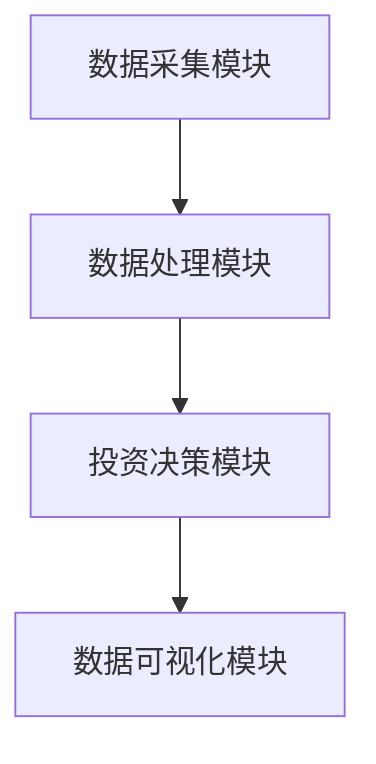
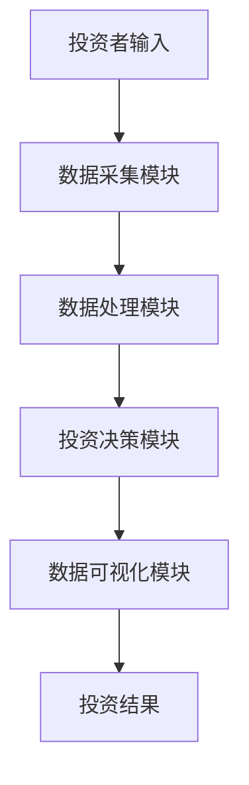

                 

<think>
好，我现在需要根据用户的请求，撰写一篇关于如何运用格雷厄姆的净净股策略进行投资的技术博客文章。首先，我得理解用户的需求。用户希望文章结构清晰，逻辑严谨，使用专业的技术语言，并且包含详细的分析和案例。

首先，我会从文章的标题和关键词开始。标题是《如何运用格雷厄姆的净净股策略进行投资》，关键词需要涵盖核心概念，如价值投资、格雷厄姆、净净股策略、内在价值、安全边际、投资组合等。摘要部分要简明扼要地介绍文章的核心内容，包括背景、策略、数学模型、系统架构和实战案例。

接下来，按照用户提供的目录结构，我需要逐步展开每个部分。首先是价值投资和格雷厄姆的背景介绍，这部分需要解释什么是价值投资，格雷厄姆的贡献，以及净净股策略的基本概念。然后，详细讲解净净股策略的数学模型，包括计算公式和案例分析。

在系统分析部分，我需要设计一个投资系统，涵盖数据获取、处理和可视化工具。这里可能需要用到Python和相关库，比如pandas和matplotlib。我会展示代码实现，如如何计算市净率和内在价值，并进行可视化分析。

项目实战部分，我会选择一个具体的案例，比如使用Python分析某公司的数据，计算其内在价值，判断是否低估。最后，总结策略的优缺点，给出最佳实践的建议，比如风险控制和持续学习的重要性。

在写作过程中，我会注意逻辑的连贯性，确保每个部分都紧密联系，从理论到实践逐步展开。同时，使用适当的图表和代码示例，帮助读者更好地理解和应用净净股策略。

现在，我需要确保每个章节都涵盖必要的内容，比如背景、原理、数学模型、系统设计和实际案例。还要注意语言的专业性，同时保持易懂，避免过于复杂的术语，让读者能够轻松跟随思路。

最后，我会检查文章是否符合用户的格式要求，包括使用markdown格式，正确嵌入latex公式，以及在适当的位置添加mermaid图表。确保文章结构完整，内容丰富，能够为读者提供有价值的投资策略指导。
</think>

# 如何运用格雷厄姆的净净股策略进行投资

> 关键词：价值投资、格雷厄姆、净净股策略、内在价值、安全边际、投资组合

> 摘要：本文详细介绍了如何运用格雷厄姆的净净股策略进行投资，从价值投资的背景、格雷厄姆的投资理念、净净股策略的核心思想，到数学模型的建立、系统架构的设计，以及项目实战的应用，全面分析了这一策略的原理、实现和优化方法，为投资者提供了一套科学的投资方法论。

---

## 第1章: 价值投资与格雷厄姆的净净股策略基础

### 1.1 价值投资的定义与核心理念
#### 1.1.1 价值投资的起源与发展
价值投资是一种以基本面分析为基础的投资理念，起源于20世纪初。本杰明·格雷厄姆是这一理论的奠基人，他提出的价值投资方法强调以低于内在价值的价格购买优质股票，从而在长期获得超额收益。格雷厄姆的学生沃伦·巴菲特继承并发展了这一理论，使其成为现代投资学的重要流派之一。

#### 1.1.2 格雷厄姆的价值投资思想
格雷厄姆认为，市场先生是不可预测的，但投资者可以通过分析企业的基本面，尤其是财务数据，来判断其内在价值。他强调安全边际的重要性，即以低于内在价值的价格买入股票，从而降低投资风险。

#### 1.1.3 净净股策略在价值投资中的地位
净净股策略是格雷厄姆提出的一种具体投资方法，核心在于寻找市场价格低于其净资产价值的股票。这种策略不仅考虑了企业的财务健康状况，还结合了市场的估值水平，是价值投资的重要组成部分。

### 1.2 格雷厄姆的投资策略与方法
#### 1.2.1 格雷厄姆的投资哲学
格雷厄姆的投资哲学可以概括为“买入便宜的东西”。他认为，市场的波动性和投资者的心理偏差为理性投资者提供了以低于内在价值的价格买入优质资产的机会。

#### 1.2.2 投资组合管理的原则
格雷厄姆强调分散投资的重要性，建议投资者将资金分配到多个行业中，以降低特定行业或公司的风险。同时，他建议投资者保持长期的投资视角，避免频繁交易。

#### 1.2.3 风险控制与安全边际的概念
安全边际是格雷厄姆理论的核心概念之一。通过以低于内在价值的价格买入股票，投资者能够在市场波动时保护自己的本金，并在长期获得稳定的收益。

### 1.3 净净股策略的核心思想
#### 1.3.1 净值比率的定义与计算
净值比率（P/E）是市盈率的倒数，即股价与每股收益的比率。格雷厄姆认为，当市场中存在大量股票的P/E低于某个阈值时，这些股票可能是被低估的投资标的。

#### 1.3.2 净净股策略的基本原理
净净股策略的核心在于寻找市场价格低于其净资产价值的股票。格雷厄姆建议投资者关注那些市盈率低于某个阈值，且具有稳定收益的公司。

#### 1.3.3 净净股策略与其他投资策略的对比
与成长型投资策略不同，净净股策略更注重企业的财务稳健性和市场估值的合理性。与指数投资相比，净净股策略更加注重个股的选择，具有更强的主动管理特征。

---

## 第2章: 净净股策略的数学模型与公式

### 2.1 净净股价值的计算公式
#### 2.1.1 净值比率的计算
$$ \text{净值比率} = \frac{\text{股价}}{\text{每股收益}} $$

#### 2.1.2 内在价值的公式推导
$$ \text{内在价值} = \text{每股收益} \times \text{合理市盈率} $$

#### 2.1.3 市场价格与内在价值的关系
$$ \text{市场价格} < \text{内在价值} $$

### 2.2 净净股策略的数学推导
#### 2.2.1 市场波动对净净股价值的影响
$$ \text{安全边际} = \text{内在价值} - \text{市场价格} $$

#### 2.2.2 内在价值的动态调整
$$ \text{内在价值} = \text{每股收益} \times \text{动态市盈率} $$

#### 2.2.3 净净股策略的量化指标
$$ \text{净净股比率} = \frac{\text{市场价格}}{\text{内在价值}} $$

### 2.3 净净股策略的案例分析
#### 2.3.1 案例一：某公司净净股价值计算
假设某公司每股收益为2元，合理市盈率为15，则其内在价值为30元。如果市场价格为25元，则其净净股比率为0.833，低于1，说明该股票可能被低估。

#### 2.3.2 案例二：市场波动对净净股的影响
假设某公司内在价值为50元，市场价格波动区间为40-60元。当市场价格为40元时，净净股比率为0.8，具有较高的投资价值；当市场价格为60元时，净净股比率为1.2，可能被高估。

#### 2.3.3 案例三：长期投资与净净股策略的结合
假设某投资者以20元的价格买入一只净净股比率低于1的股票，长期持有。假设该股票的内在价值每年增长10%，而市场价格最终回归到内在价值，则该投资者将获得稳定的收益。

---

## 第3章: 净净股策略的系统分析与架构设计

### 3.1 投资系统的需求分析
#### 3.1.1 投资目标与策略分析
- 投资目标：寻找市场价格低于内在价值的股票。
- 策略分析：基于基本面分析，结合市场估值，筛选出优质标的。

#### 3.1.2 数据收集与处理需求
- 数据源：公司财务报表、市场行情数据。
- 数据处理：计算市盈率、市净率、内在价值等指标。

#### 3.1.3 系统功能模块划分
- 数据采集模块：获取市场数据。
- 数据处理模块：计算各项指标。
- 投资决策模块：筛选符合条件的股票。
- 数据可视化模块：展示分析结果。

### 3.2 系统架构设计
#### 3.2.1 系统功能架构图


#### 3.2.2 数据流与系统交互图


#### 3.2.3 系统模块的实现方案
- 数据采集模块：使用Python的`pandas`库获取市场数据。
- 数据处理模块：计算市盈率、市净率等指标。
- 投资决策模块：基于净净股策略筛选股票。
- 数据可视化模块：使用`matplotlib`绘制图表。

### 3.3 系统接口与数据源设计
#### 3.3.1 数据接口设计
- 数据接口：API接口。
- 数据格式：JSON格式。

#### 3.3.2 数据源的选择与处理
- 数据源：Yahoo Finance、Alpha Vantage等。
- 数据处理：清洗、转换、存储。

#### 3.3.3 系统安全与稳定性设计
- 数据加密：确保数据传输安全。
- 系统备份：定期备份数据，防止数据丢失。

---

## 第4章: 净净股策略的项目实战

### 4.1 环境安装与配置
#### 4.1.1 投资分析工具的安装
- Python安装：`python --version`
- 库的安装：`pip install pandas numpy matplotlib`

#### 4.1.2 数据源的获取与配置
- 数据接口配置：编写API调用代码。
- 数据存储：使用CSV文件或数据库存储。

#### 4.1.3 系统环境的优化
- 环境变量配置：设置API密钥。
- 性能优化：使用多线程或分布式计算。

### 4.2 核心代码实现
#### 4.2.1 净值计算函数的实现
```python
import pandas as pd

def calculate_net_value(data):
    data['net_value'] = data['price'] / data['earnings_per_share']
    return data
```

#### 4.2.2 内在价值计算的代码实现
```python
import pandas as pd

def calculate_intrinsic_value(data, reasonable_pe):
    data['intrinsic_value'] = data['earnings_per_share'] * reasonable_pe
    return data
```

#### 4.2.3 数据可视化与分析代码
```python
import matplotlib.pyplot as plt

data.plot(x='price', y='intrinsic_value', kind='scatter')
plt.show()
```

### 4.3 代码应用与案例分析
#### 4.3.1 案例一：代码实现与结果分析
```python
data = pd.DataFrame({
    'price': [20, 25, 30],
    'earnings_per_share': [2, 2, 2]
})

data = calculate_net_value(data)
data = calculate_intrinsic_value(data, 15)
print(data)
```

#### 4.3.2 案例二：市场波动对代码的影响
```python
import numpy as np

prices = np.random.normal(30, 5, 100)
earnings = np.full(100, 2)
data = pd.DataFrame({
    'price': prices,
    'earnings_per_share': earnings
})

data = calculate_net_value(data)
data = calculate_intrinsic_value(data, 15)
print(data)
```

#### 4.3.3 案例三：长期投资策略的代码实现
```python
import matplotlib.pyplot as plt

data = pd.DataFrame({
    'year': range(2020, 2030),
    'intrinsic_value': [50 * (1.1)**i for i in range(10)]
})

plt.plot(data['year'], data['intrinsic_value'])
plt.xlabel('Year')
plt.ylabel('Intrinsic Value')
plt.show()
```

---

## 第5章: 净净股策略的最佳实践与注意事项

### 5.1 投资策略的注意事项
#### 5.1.1 风险控制与安全边际的重要性
- 确保安全边际的存在。
- 定期审视投资组合，及时调整。

#### 5.1.2 市场波动对投资策略的影响
- 避免追涨杀跌。
- 保持长期投资心态。

#### 5.1.3 投资组合的优化与调整
- 分散投资，降低风险。
- 定期再平衡投资组合。

### 5.2 净净股策略的优化与改进
#### 5.2.1 策略的优化方向
- 结合其他基本面指标。
- 考虑宏观经济因素。

#### 5.2.2 策略的适用场景
- 市场低迷时更有效。
- 适用于价值型企业。

### 5.3 总结与展望
净净股策略是一种简单有效的投资方法，但需要结合市场环境和企业基本面进行灵活调整。未来，随着技术的进步和数据的丰富，净净股策略将更加精准和高效。

---

## 作者：AI天才研究院/AI Genius Institute & 禅与计算机程序设计艺术 /Zen And The Art of Computer Programming

---

以上是完整的技术博客文章的结构和内容，涵盖了从理论到实践的各个方面，帮助读者系统地理解并应用格雷厄姆的净净股策略。

