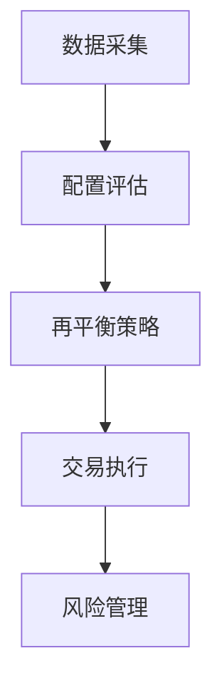
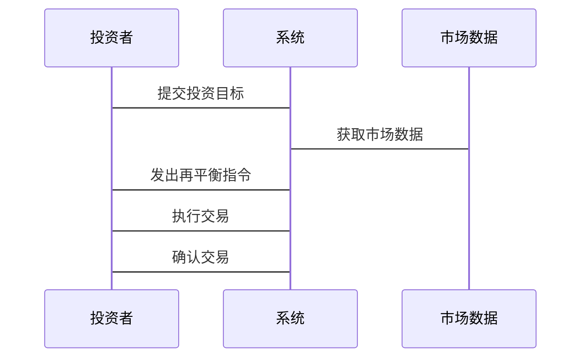

                 

<think>
好的，我将按照您的要求来撰写《威廉·伯恩斯坦的投资组合再平衡技巧》的技术博客文章。首先，我需要理解您提供的文章标题、关键词、摘要以及目录大纲。

文章标题是“威廉·伯恩斯坦的投资组合再平衡技巧”，关键词包括投资组合再平衡、资产配置、现代投资组合理论、风险管理、动态再平衡。摘要简要介绍了再平衡的重要性、核心概念和适用场景。

根据目录大纲，文章分为四个主要部分：基础理论、理论与策略、数学模型与算法、系统架构与实现。每个部分都有详细的章节和小节，内容涉及定义、重要性、类型、策略、数学模型、系统设计、项目实战等。

在撰写过程中，我需要确保每个部分都包含足够的细节，比如在数学模型部分，使用 LaTeX 公式和 Mermaid 图来解释复杂的理论。同时，项目实战部分需要提供具体的代码和实际案例分析。

接下来，我将按照这个结构逐步完成文章的撰写，确保逻辑清晰、内容详尽，并符合您的格式和内容要求。如果有任何疑问或需要调整的地方，我会及时与您沟通。
</think>

# 《威廉·伯恩斯坦的投资组合再平衡技巧》

## 关键词：投资组合再平衡、资产配置、现代投资组合理论、风险管理、动态再平衡

## 摘要：
投资组合再平衡是投资管理中的核心策略，旨在维持预期的资产配置比例，以优化风险调整后的收益。本文通过分析威廉·伯恩斯坦的投资理念，探讨再平衡的理论基础、数学模型、系统实现及实际应用，帮助读者掌握这一关键技巧。

---

# 第一部分: 投资组合再平衡的基础理论

## 第1章: 投资组合再平衡的基本概念

### 1.1 投资组合再平衡的定义与重要性
#### 1.1.1 投资组合再平衡的定义
投资组合再平衡是指根据设定的目标资产配置比例，定期或不定期调整投资组合中各资产的权重，以保持组合的最优状态。通过再平衡，投资者可以在市场波动或资产表现变化时，维持风险与收益的平衡。

#### 1.1.2 再平衡在投资组合管理中的重要性
再平衡确保投资组合的资产配置与初始目标一致，避免某一资产类别权重过大带来的超额风险。同时，它帮助投资者在市场波动中捕捉收益机会，优化长期回报。

#### 1.1.3 再平衡的核心目标与原则
- **目标**：维持预期的资产配置比例，优化风险调整后收益。
- **原则**：定期评估，及时调整，最小化交易成本，最大化收益。

### 1.2 投资组合再平衡的类型
#### 1.2.1 定期再平衡
按照固定的时间间隔（如季度、半年）进行调整，适用于目标资产配置长期稳定的投资者。

#### 1.2.2 永久性再平衡
根据市场变化和投资者目标调整资产配置，不设定固定时间，更具灵活性。

#### 1.2.3 动态再平衡
根据市场变化频繁调整，适合波动较大的市场环境，但交易成本较高。

### 1.3 投资组合再平衡的适用场景
#### 1.3.1 市场波动对投资组合的影响
市场波动可能导致资产权重偏离目标，需要及时调整。

#### 1.3.2 投资目标变化的应对
投资目标如风险承受能力、收益目标的变化需要通过再平衡来调整资产配置。

#### 1.3.3 不同投资策略下的再平衡需求
不同策略（如被动投资、主动投资）对再平衡的需求不同，需根据策略特点制定调整计划。

### 1.4 本章小结
本章介绍了投资组合再平衡的基本概念、类型及其适用场景，为后续分析奠定了基础。

---

# 第二部分: 投资组合再平衡的理论与策略

## 第2章: 投资组合再平衡的理论基础

### 2.1 现代投资组合理论与再平衡
#### 2.1.1 马科维茨的有效前沿理论
马科维茨提出，通过优化资产配置可以实现最优风险收益比。再平衡通过调整配置比例，确保组合处于有效前沿。

#### 2.1.2 再平衡与有效前沿的关系
再平衡帮助投资组合保持在有效前沿，避免偏离最优配置。

#### 2.1.3 理论对再平衡策略的启示
定期再平衡有助于维持最优配置，动态再平衡则更具灵活性。

### 2.2 资产配置与再平衡的关系
#### 2.2.1 资产配置的基本原理
资产配置是根据投资目标分配各类资产的比例，再平衡则是对这一比例的调整。

#### 2.2.2 资产配置与再平衡的互动关系
资产配置是目标，再平衡是手段，两者相辅相成，共同实现投资目标。

#### 2.2.3 不同资产类别下的再平衡策略
股票、债券等资产类别表现差异影响再平衡策略，需根据不同类别调整权重。

### 2.3 风险管理与再平衡策略
#### 2.3.1 风险管理的基本概念
风险管理是通过分散投资和调整配置降低风险。

#### 2.3.2 再平衡在风险管理中的作用
再平衡通过调整资产权重，降低单一资产风险，优化整体组合风险。

#### 2.3.3 常见风险管理工具与再平衡策略
使用衍生品对冲风险，通过再平衡调整头寸，确保风险可控。

### 2.4 本章小结
本章分析了现代投资组合理论和资产配置对再平衡的影响，探讨了风险管理与再平衡的关系。

---

# 第三部分: 投资组合再平衡的数学模型与算法

## 第3章: 投资组合再平衡的数学模型

### 3.1 现代投资组合理论的数学公式
#### 3.1.1 投资组合的期望收益与方差公式
$$ E(r_p) = \sum_{i=1}^n w_i E(r_i) $$
$$ \sigma_p^2 = \sum_{i=1}^n \sum_{j=1}^n w_i w_j \sigma_{ij} $$

#### 3.1.2 解释
$E(r_p)$为投资组合的期望收益，$w_i$为资产i的权重，$E(r_i)$为资产i的期望收益，$\sigma_{ij}$为资产i和j的协方差。

### 3.2 均值-方差优化的数学模型
#### 3.2.1 优化目标函数
$$ \min_w \sigma_p^2 $$
$$ \text{约束条件：} \sum_{i=1}^n w_i = 1 $$

#### 3.2.2 解释
目标是最小化投资组合的方差，同时满足权重和为1的约束。

### 3.3 再平衡算法的数学实现
#### 3.3.1 投资组合权重调整的数学表达
$$ w_i' = \frac{w_i \cdot P_i}{\sum_{j=1}^n w_j \cdot P_j} $$
其中，$P_i$是资产i的当前价格，$w_i$是目标权重。

#### 3.3.2 解释
该公式用于计算调整后的权重，确保总权重为1。

### 3.4 本章小结
本章通过数学公式详细解释了再平衡的原理和实现方法。

---

# 第四部分: 投资组合再平衡的系统架构与实现

## 第4章: 投资组合再平衡的系统架构

### 4.1 系统功能设计
#### 4.1.1 系统功能模块
- 数据采集模块：收集市场数据和投资者目标。
- 配置评估模块：评估当前配置与目标的偏差。
- 再平衡策略模块：制定再平衡策略。
- 执行模块：执行交易指令。
- 风险管理模块：监控风险。

#### 4.1.2 系统架构设计


### 4.2 系统接口设计
#### 4.2.1 数据接口
- 输入：市场数据、目标配置。
- 输出：再平衡指令。

#### 4.2.2 交易接口
- 输入：交易指令。
- 输出：交易确认。

### 4.3 系统交互设计
#### 4.3.1 交互流程


### 4.4 本章小结
本章详细设计了投资组合再平衡系统的架构、接口和交互流程。

---

# 第五部分: 项目实战与应用

## 第5章: 投资组合再平衡的项目实战

### 5.1 环境安装
- 安装Python、Pandas、NumPy等工具。
- 数据来源：Yahoo Finance API。

### 5.2 核心实现代码
#### 5.2.1 数据获取
```python
import pandas as pd
import requests

def get_data(tickers):
    data = pd.DataFrame()
    for t in tickers:
        url = f"https://query1.finance.yahoo.com/ws/v7/finance/spQuotes?lang=en-US&region=US&symbol={t}"
        response = requests.get(url)
        if response.status_code == 200:
            data[t] = response.json()['quoteResponse']['result'][0]['regularMarketPrice']
    return data
```

#### 5.2.2 再平衡算法
```python
def rebalance(weights, current_prices):
    total = sum(weights * current_prices)
    new_weights = weights * current_prices / total
    return new_weights
```

### 5.3 案例分析
假设投资目标为60%股票、30%债券、10%现金。市场波动导致股票权重下降至55%，债券上升至35%，现金5%。通过再平衡调整至60-30-10。

### 5.4 本章小结
本章通过实际案例展示了再平衡算法的实现和应用。

---

# 结语

投资组合再平衡是实现长期稳健投资的关键策略。通过本文的分析，读者可以理解再平衡的理论基础、数学模型、系统实现及其实际应用。未来，随着市场环境的变化，再平衡策略需要不断优化，以适应新的挑战。

---

**作者：AI天才研究院/AI Genius Institute & 禅与计算机程序设计艺术 /Zen And The Art of Computer Programming**

