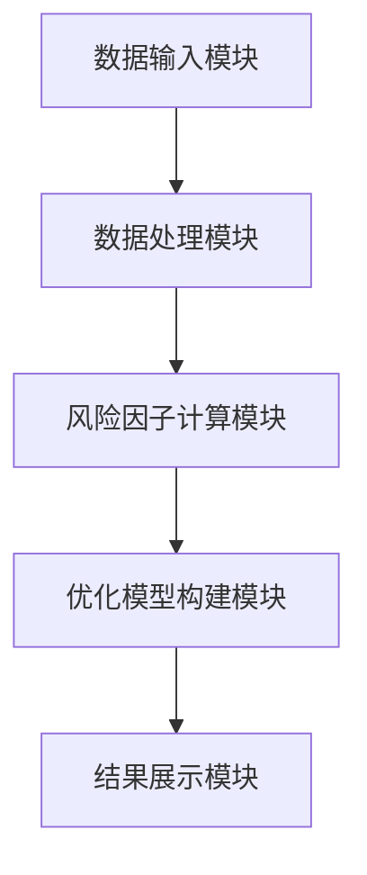
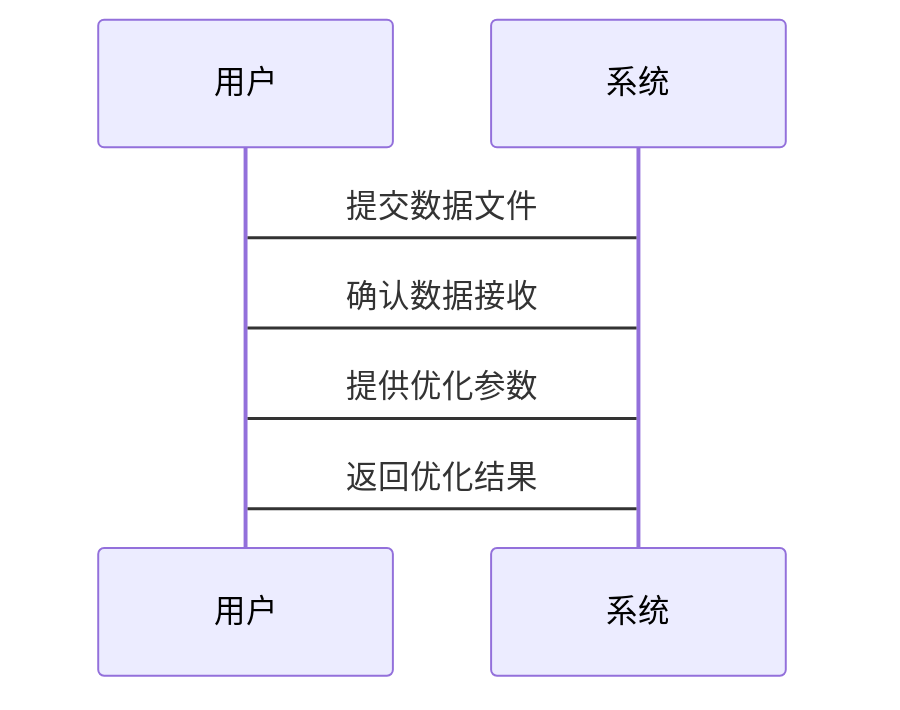

                 


# 威廉·伯恩斯坦的风险平价策略

> 关键词：风险平价，威廉·伯恩斯坦，资产配置，投资策略，风险管理

> 摘要：威廉·伯恩斯坦的风险平价策略是一种基于现代投资组合理论的资产配置方法，通过优化风险因子权重来实现风险和收益的平衡。本文将详细介绍风险平价策略的背景、核心概念、算法实现、系统架构以及项目实战，帮助读者全面理解和应用这一策略。

---

## 第一部分: 风险平价策略的背景与基础

### 第1章: 风险平价策略的起源与发展

#### 1.1 风险平价的起源
风险平价（Risk Parity）是一种资产配置方法，旨在通过调整资产权重来优化投资组合的风险和收益。它起源于20世纪80年代，由威廉·伯恩斯坦在其著作中首次提出。风险平价的核心理念是通过平衡不同资产类别的风险贡献，避免单一资产对组合风险的过度影响。

#### 1.2 风险平价与传统资产配置的区别
传统的资产配置方法通常基于资产的预期回报率和波动率进行权重分配，而风险平价则更关注于控制组合的整体风险。具体来说，风险平价通过优化各资产的风险贡献，使得组合中每种资产的风险暴露相等。

#### 1.3 风险平价策略的发展历程
风险平价策略在学术界和金融实践中得到了广泛的研究和应用。近年来，随着金融市场的波动加剧，风险平价策略因其在风险控制方面的优势，逐渐成为机构投资者和专业投资者的首选策略之一。

### 第2章: 风险平价策略的核心概念

#### 2.1 风险平价的基本原理
风险平价策略通过优化各资产的风险权重，使得组合中每种资产的风险贡献相等。具体来说，风险平价会根据资产的风险特征（如波动率、相关性等）调整其权重，以实现风险的均衡分配。

#### 2.2 风险平价策略的优势与劣势
- **优势**：
  - 风险分散能力强，能够有效降低组合的整体风险。
  - 能够适应不同市场环境下的资产表现。
  - 适合长期投资策略。
  
- **劣势**：
  - 在极端市场环境下，风险平价策略可能会表现出较高的波动性。
  - 实施过程中需要较高的计算和数据处理能力。

---

## 第二部分: 风险平价策略的核心算法与实现

### 第3章: 风险平价策略的算法原理

#### 3.1 风险平价的优化模型
风险平价的核心在于构建一个优化模型，使得各资产的风险贡献相等。具体来说，优化模型需要考虑以下因素：
- 各资产的波动率和相关性矩阵。
- 各资产的目标风险贡献权重。

优化目标：  
$$ \text{最小化} \sum_{i=1}^{n} w_i^2 \sigma_i^2 $$  

约束条件：  
$$ \sum_{i=1}^{n} w_i = 1 $$  
其中，$w_i$ 表示第 $i$ 个资产的权重，$\sigma_i$ 表示第 $i$ 个资产的波动率。

#### 3.2 风险平价的实现步骤
1. **数据准备**：收集各资产的历史价格数据。
2. **计算波动率和相关性矩阵**：基于历史数据计算各资产的波动率和相关性。
3. **构建优化模型**：根据上述公式构建优化模型。
4. **求解优化问题**：使用优化算法（如二次规划）求解权重。
5. **验证和调整**：对结果进行验证，并根据实际情况进行调整。

### 第4章: 风险平价策略的数学模型与公式

#### 4.1 风险平价的核心公式
风险平价的权重计算公式：  
$$ w_i = \frac{1}{\sigma_i} $$  

其中，$w_i$ 表示第 $i$ 个资产的权重，$\sigma_i$ 表示第 $i$ 个资产的波动率。

#### 4.2 风险平价的数学推导
通过优化模型，我们可以推导出各资产的最优权重：  
$$ w_i = \frac{1}{\sigma_i} \cdot \frac{1}{\sum_{j=1}^{n} \frac{1}{\sigma_j^2}} $$  

---

## 第三部分: 风险平价策略的系统架构与实现

### 第5章: 风险平价策略的系统架构设计

#### 5.1 系统功能模块设计
- **数据输入与处理模块**：负责接收和处理各资产的历史价格数据。
- **风险因子计算模块**：计算各资产的波动率和相关性矩阵。
- **优化模型构建模块**：基于优化模型计算各资产的权重。
- **结果展示与报告生成模块**：输出优化后的权重和风险报告。

#### 5.2 系统架构设计图


### 第6章: 风险平价策略的系统接口与交互设计

#### 6.1 系统接口设计
- **数据接口**：支持多种数据格式（如CSV、Excel）的输入。
- **模型接口**：提供优化模型的参数配置接口。
- **结果输出接口**：支持多种格式的结果输出（如PDF、Excel）。

#### 6.2 系统交互流程图


---

## 第四部分: 风险平价策略的项目实战

### 第7章: 风险平价策略的项目实现

#### 7.1 项目环境配置
- **开发工具**：Python 3.8+
- **数据源**：历史价格数据（如Yahoo Finance API）
- **依赖库**：pandas、numpy、scipy、matplotlib

#### 7.2 核心代码实现

##### 7.2.1 数据处理代码
```python
import pandas as pd
import numpy as np

# 读取数据
data = pd.read_csv('assets.csv', parse_dates=True, index_col='date')

# 计算每日收益率
returns = data.pct_change().dropna()

# 计算波动率
volatility = returns.std(ddof=0).sort_values(ascending=False)
```

##### 7.2.2 风险因子计算代码
```python
# 计算相关性矩阵
correlation_matrix = returns.corr()

# 计算波动率
volatility = returns.std(ddof=0)
```

##### 7.2.3 优化模型实现代码
```python
from scipy.optimize import minimize

def risk_parity_weight(correlation_matrix, volatility):
    n = len(correlation_matrix)
    # 初始化权重
    w = np.ones(n) / n
    # 定义目标函数
    def objective(w):
        return np.dot(w.T, np.dot(correlation_matrix, w))
    # 定义约束条件
    constraints = [
        {'type': 'eq', 'fun': lambda w: sum(w) - 1}
    ]
    # 求解优化问题
    result = minimize(objective, w, constraints=constraints)
    return result.x

weights = risk_parity_weight(correlation_matrix, volatility)
```

#### 7.3 项目小结
通过以上代码实现，我们可以清晰地看到风险平价策略的核心算法。在实际应用中，还需要考虑数据的实时更新、模型的鲁棒性以及回测分析等因素。

---

## 第五部分: 最佳实践与总结

### 8.1 最佳实践 tips
- 定期更新数据和模型参数，确保策略的有效性。
- 在极端市场环境下，注意风险平价策略的潜在波动性。
- 结合其他资产配置方法，优化整体投资组合。

### 8.2 小结
威廉·伯恩斯坦的风险平价策略是一种有效的资产配置方法，通过优化各资产的风险贡献，实现风险和收益的平衡。本文详细介绍了风险平价策略的背景、算法实现、系统架构以及项目实战，为读者提供了全面的理论和实践指导。

### 8.3 注意事项
- 数据质量是风险平价策略的核心，确保数据的准确性和完整性。
- 在实际应用中，需要考虑市场环境和投资者的偏好。
- 风险平价策略并非完美，需结合其他策略进行优化。

### 8.4 拓展阅读
- 《投资学》——威廉·伯恩斯坦
- 风险平价在机构投资中的应用
- 基于机器学习的风险平价优化方法

---

作者：AI天才研究院/AI Genius Institute & 禅与计算机程序设计艺术 /Zen And The Art of Computer Programming

