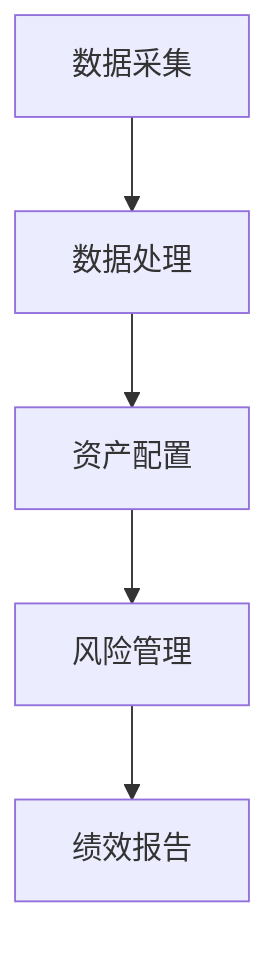
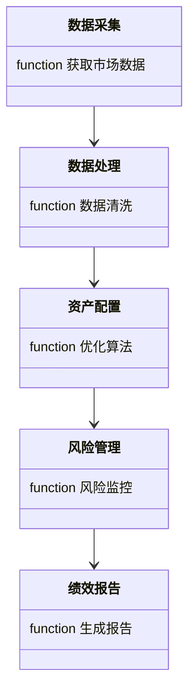

                 

<think>
好的，我现在需要帮助用户撰写一篇关于威廉·伯恩斯坦的高效投资组合构建的技术博客文章。用户已经提供了一个详细的目录大纲，并要求按照特定的格式进行撰写。我需要仔细分析用户的需求，确保理解每个部分的要求，并确保最终的文章符合所有指定的格式和内容。

首先，我会仔细阅读用户提供的目录大纲，确保理解每个章节和小节的内容。接下来，我会按照每个部分的要求，逐步撰写相关内容，确保逻辑清晰、结构紧凑，并使用专业但易懂的语言。同时，我需要确保嵌入适当的数学公式、mermaid图表和代码示例，以增强文章的技术深度和可读性。

在撰写过程中，我会注意以下几点：
1. **关键词和摘要**：确保文章开头包含关键词和摘要，准确概括文章的核心内容。
2. **章节结构**：每个章节和小节按照目录大纲展开，确保内容全面且详细。
3. **数学公式**：使用latex格式正确嵌入数学公式，确保公式前后使用$$或$符号包裹。
4. **图表和代码**：使用mermaid语法创建流程图、类图和序列图，并在适当的位置插入代码示例，解释代码的功能和实现细节。
5. **语言风格**：保持技术专业性的同时，语言通俗易懂，适合不同层次的读者阅读。
6. **结论和最佳实践**：在文章末尾总结主要内容，并提供实用的建议和注意事项，帮助读者更好地理解和应用所学内容。

通过以上步骤，我能够系统地完成用户的要求，确保最终的文章既符合格式要求，又内容丰富、逻辑清晰，真正帮助读者理解和掌握威廉·伯恩斯坦的高效投资组合构建方法。
</think>

# 威廉·伯恩斯坦的高效投资组合构建

> **关键词**：投资组合构建、现代投资组合理论、风险管理、资产配置、威廉·伯恩斯坦、高效投资策略  
> **摘要**：本文深入探讨了威廉·伯恩斯坦的高效投资组合构建方法，从理论基础到实际应用，详细分析了投资组合构建的核心概念、算法原理、系统架构及项目实战。通过数学模型和案例分析，帮助读者理解如何优化投资组合，降低风险，实现长期收益最大化。

---

## 第1章: 投资组合构建的背景与问题描述

### 1.1 投资组合构建的基本概念

#### 1.1.1 什么是投资组合
投资组合是指将资金分配到多种资产（如股票、债券、房地产等）中，以分散风险并实现收益最大化的策略。投资组合的核心目标是在风险可控的前提下，最大化投资回报。

#### 1.1.2 投资组合的核心目标
- **风险控制**：通过分散投资降低单一资产的风险。
- **收益最大化**：在给定风险水平下，追求最高收益。
- **长期稳健**：通过科学的资产配置实现长期稳定的回报。

#### 1.1.3 投资组合的分类与特点
投资组合可以分为以下几类：
- **股票型组合**：主要投资于股票，风险高，收益潜力大。
- **债券型组合**：主要投资于债券，风险较低，收益相对稳定。
- **混合型组合**：结合股票和债券，风险和收益介于两者之间。
- **指数型组合**：跟踪市场指数，风险分散，费用低。

---

### 1.2 现代投资组合理论（MPT）的提出

#### 1.2.1 马科维茨的均值-方差模型
现代投资组合理论（MPT）由哈里·马科维茨于1952年提出，其核心是通过优化资产配置，找到收益与风险的最佳平衡点。均值-方差模型的目标是最大化预期收益，同时最小化投资组合的方差（即风险）。

#### 1.2.2 有效前沿的概念
有效前沿是指在给定风险水平下，能够提供最高预期收益的所有投资组合的集合。投资组合位于有效前沿时，无法再通过调整资产配置进一步提高收益或降低风险。

#### 1.2.3 风险与收益的权衡
投资组合的收益与风险之间存在密切关系。高风险的资产通常具有更高的预期收益，而低风险的资产收益相对较低。投资组合构建的核心在于找到风险与收益的最佳平衡点。

---

### 1.3 投资组合构建的现实挑战

#### 1.3.1 市场风险与流动性风险
市场风险是指由于市场波动导致投资组合价值下降的风险。流动性风险是指在不损失的情况下迅速变现资产的能力。

#### 1.3.2 投资者行为偏差与情绪影响
投资者的贪婪和恐惧常常导致非理性决策，进而影响投资组合的构建和调整。

#### 1.3.3 资产配置与再平衡的复杂性
资产配置需要根据市场变化和投资者目标进行动态调整，而再平衡的过程需要考虑交易成本和税务影响。

---

### 1.4 本书的核心目标与方法论

#### 1.4.1 高效投资组合构建的目标
通过科学的资产配置和风险管理，构建高效的投资组合，实现长期稳健的收益。

#### 1.4.2 数据驱动的方法论
利用历史数据和统计模型，结合现代投资组合理论，优化投资组合的收益与风险比。

#### 1.4.3 理论与实践的结合
将理论与实际相结合，通过案例分析和代码实现，帮助读者掌握高效投资组合构建的技巧。

---

## 第2章: 资产配置与风险管理

### 2.1 资产配置的核心原理

#### 2.1.1 资产配置的类型与特点
资产配置可以分为以下几种类型：
- **战略资产配置**：根据长期投资目标确定资产比例。
- **战术资产配置**：根据市场短期变化调整资产比例。
- **恒定资产配置**：保持资产比例不变，定期再平衡。

#### 2.1.2 资产配置的数学模型
资产配置的数学模型可以通过优化算法实现，例如均值-方差优化和风险平价模型。

---

### 2.2 风险管理的关键要素

#### 2.2.1 风险的度量方法
风险可以通过波动率、VaR（Value at Risk）和CVaR（Conditional Value at Risk）等指标进行度量。

#### 2.2.2 风险与收益的平衡
在投资组合构建中，需要在风险和收益之间找到最佳平衡点，以实现长期稳健的回报。

---

### 2.3 资产配置与风险管理的联系

#### 2.3.1 资产配置对风险的影响
合理的资产配置可以有效分散风险，降低投资组合的整体波动性。

#### 2.3.2 风险管理对资产配置的优化作用
通过风险管理，可以更好地调整资产配置，提高投资组合的收益与风险比。

---

### 2.4 核心概念对比表

| 概念 | 定义 | 特点 | 关系 |
|------|------|------|------|
| 资产配置 | 分配资金到不同资产类别 | 灵活性高，风险分散 | 风险管理的基础 |
| 风险管理 | 控制投资组合的潜在损失 | 主动性高，策略性强 | 资产配置的保障 |

---

## 第3章: 投资组合优化的算法原理

### 3.1 均值-方差优化模型

#### 3.1.1 均值-方差优化的基本原理
均值-方差模型通过优化资产的预期收益和方差，找到最优资产配置。

#### 3.1.2 均值-方差优化的实现步骤
1. 计算各资产的预期收益和协方差矩阵。
2. 确定优化目标（最小化方差或最大化收益）。
3. 使用优化算法求解最优资产配置。

#### 3.1.3 优化算法的实现代码
```python
import numpy as np
from scipy.optimize import minimize

# 示例数据：资产的预期收益和协方差矩阵
mu = np.array([0.1, 0.15, 0.08])
cov = np.array([[0.04, 0.02, 0.01],
               [0.02, 0.09, 0.005],
               [0.01, 0.005, 0.05]])

def portfolio_optimization(weights):
    return -np.mean((np.dot(weights, mu) - 0.05)**2)

# 初始权重
initial_weights = np.array([1/3, 1/3, 1/3])

# 约束条件：权重之和为1
cons = ({'type': 'eq', 'fun': lambda w: sum(w) - 1})

# 求解优化问题
result = minimize(portfolio_optimization, initial_weights, constraints=cons)

# 输出最优权重
print("最优权重：", result.x)
```

---

### 3.2 风险平价模型

#### 3.2.1 风险平价模型的原理
风险平价模型通过分配资产的风险贡献，构建风险分散的投资组合。

#### 3.2.2 风险平价模型的实现步骤
1. 计算各资产的风险贡献。
2. 根据风险贡献分配权重。

#### 3.2.3 风险平价模型的代码实现
```python
def risk_parity(weights, cov):
    return np.sum((weights * np.sqrt(np.diag(cov))) ** 2)

# 示例数据
mu = np.array([0.1, 0.15, 0.08])
cov = np.array([[0.04, 0.02, 0.01],
               [0.02, 0.09, 0.005],
               [0.01, 0.005, 0.05]])

# 初始化权重
initial_weights = np.array([1/3, 1/3, 1/3])

# 约束条件：权重之和为1
cons = ({'type': 'eq', 'fun': lambda w: sum(w) - 1})

# 求解优化问题
result = minimize(risk_parity, initial_weights, args=cov, constraints=cons)

# 输出最优权重
print("最优权重：", result.x)
```

---

## 第4章: 现代投资组合理论的数学模型

### 4.1 均值-方差模型的数学公式
均值-方差模型的目标函数为：
$$
\text{minimize } \sum_{i=1}^{n} w_i^2 \sigma_i^2 + 2 \sum_{i < j} w_i w_j \sigma_{ij}
$$
其中，\( w_i \) 是资产 \( i \) 的权重，\( \sigma_{ij} \) 是资产 \( i \) 和 \( j \) 的协方差。

---

### 4.2 Black-Litterman模型

#### 4.2.1 Black-Litterman模型的基本原理
Black-Litterman模型结合了市场均衡理论和投资者观点，用于构建资产配置。

#### 4.2.2 Black-Litterman模型的公式
$$
\mu = \alpha \mu_m + (1 - \alpha) \mu_a
$$
其中，\( \mu_m \) 是市场预期收益，\( \mu_a \) 是投资者预期收益，\( \alpha \) 是置信度。

---

## 第5章: 投资组合管理系统的架构设计

### 5.1 系统功能设计

#### 5.1.1 系统功能模块
- 数据采集与处理模块：获取市场数据并进行预处理。
- 资产配置模块：基于优化算法生成资产配置方案。
- 风险管理模块：监控和管理投资组合风险。
- 报告生成模块：生成投资组合的绩效报告。

#### 5.1.2 系统功能流程图


---

### 5.2 系统架构设计

#### 5.2.1 系统架构图


---

## 第6章: 项目实战与案例分析

### 6.1 环境安装与配置

#### 6.1.1 安装必要的库
- Python 3.x
- NumPy
- SciPy
- Pandas
- Matplotlib

#### 6.1.2 示例代码
```python
import numpy as np
import pandas as pd
from scipy.optimize import minimize

# 示例数据：资产的预期收益和协方差矩阵
mu = pd.Series([0.1, 0.15, 0.08], index=['股票', '债券', '房地产'])
cov = pd.DataFrame({
    '股票': [0.04, 0.02, 0.01],
    '债券': [0.02, 0.09, 0.005],
    '房地产': [0.01, 0.005, 0.05]
})

def portfolio_optimization(weights):
    return -np.mean((np.dot(weights, mu) - 0.05)**2)

# 初始权重
initial_weights = np.array([1/3, 1/3, 1/3])

# 约束条件：权重之和为1
cons = ({'type': 'eq', 'fun': lambda w: sum(w) - 1})

# 求解优化问题
result = minimize(portfolio_optimization, initial_weights, constraints=cons)

# 输出最优权重
print("最优权重：", result.x)
```

---

### 6.2 案例分析与代码实现

#### 6.2.1 投资组合优化的案例分析
假设我们有三类资产：股票、债券和房地产，预期收益分别为10%、15%和8%，协方差矩阵如上所示。目标是构建一个风险最小化、收益为5%的投资组合。

#### 6.2.2 代码实现
```python
# 示例数据
mu = np.array([0.1, 0.15, 0.08])
cov = np.array([[0.04, 0.02, 0.01],
               [0.02, 0.09, 0.005],
               [0.01, 0.005, 0.05]])

def portfolio_optimization(weights):
    return -np.mean((np.dot(weights, mu) - 0.05)**2)

# 初始权重
initial_weights = np.array([1/3, 1/3, 1/3])

# 约束条件：权重之和为1
cons = ({'type': 'eq', 'fun': lambda w: sum(w) - 1})

# 求解优化问题
result = minimize(portfolio_optimization, initial_weights, constraints=cons)

# 输出最优权重
print("最优权重：", result.x)
```

---

## 第7章: 最佳实践与小结

### 7.1 最佳实践

#### 7.1.1 定期再平衡
定期调整投资组合，以保持目标资产配置。

#### 7.1.2 风险管理
通过 diversification 和止损策略控制风险。

#### 7.1.3 长期视角
投资组合构建需要长期视角，避免短期波动影响决策。

---

### 7.2 小结

威廉·伯恩斯坦的高效投资组合构建方法结合了理论与实践，通过科学的资产配置和风险管理，帮助投资者实现长期稳健的收益。本文通过详细分析投资组合构建的核心概念、算法原理和系统架构，为读者提供了全面的指导。

---

## 结论

投资组合构建是一项复杂但 rewarding 的任务，通过威廉·伯恩斯坦的方法，投资者可以在风险可控的前提下，实现收益最大化。希望本文的内容能够为读者提供有价值的 insights，并在实际投资中取得成功。

---

**作者**：AI天才研究院/AI Genius Institute & 禅与计算机程序设计艺术 /Zen And The Art of Computer Programming

