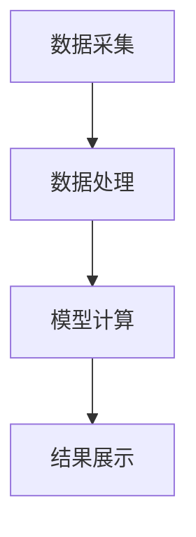

                 


# 《威廉·伯恩斯坦的高效投资组合理论》

> 关键词：投资组合理论、风险收益平衡、伯恩斯坦理论、投资组合优化、数学模型

> 摘要：本文系统地介绍威廉·伯恩斯坦的高效投资组合理论，涵盖其背景、核心原理、算法实现、数学模型及系统架构，通过实际案例分析和Python代码实现，帮助读者深入理解并应用该理论。

---

# 第一部分: 投资组合理论的背景与基础

## 第1章: 投资组合理论概述

### 1.1 投资组合理论的起源与发展

- **1.1.1 投资组合理论的历史背景**
  - 20世纪50年代，马科维茨提出现代投资组合理论（MPT），奠定了投资组合理论的基础。
  - 伯恩斯坦在MPT基础上，结合实际市场情况，提出了更高效的优化方法。

- **1.1.2 马科维茨现代投资组合理论的提出**
  - 引入均值-方差模型，考虑资产之间的协方差。
  - 提出有效前沿概念，帮助投资者在收益与风险之间找到最佳平衡点。

- **1.1.3 伯恩斯坦理论的演变与创新**
  - 引入风险平价方法，优化投资组合的风险分配。
  - 提出动态资产配置策略，适应市场变化。

### 1.2 投资组合理论的核心概念

- **1.2.1 投资组合的定义与特征**
  - 投资组合：将资金分配到多种资产中，以分散风险。
  - 特征：分散性、风险与收益的权衡、动态调整。

- **1.2.2 风险与收益的平衡**
  - 风险调整后的收益：考虑风险后的实际收益。
  - 投资者在不同风险承受能力下，选择最优收益。

- **1.2.3 投资组合的有效前沿**
  - 有效前沿：所有可能投资组合中收益与风险的最佳组合。
  - 图形化展示，帮助投资者找到最优配置。

### 1.3 投资组合理论的应用场景

- **1.3.1 机构投资者的资产配置**
  - 优化投资组合，降低风险，提高收益。
  - 通过有效前沿找到最优配置。

- **1.3.2 个人投资者的风险管理**
  - 根据风险承受能力，选择合适的投资组合。
  - 动态调整，应对市场变化。

- **1.3.3 全球化背景下的投资组合优化**
  - 全球化资产配置，分散地域风险。
  - 利用伯恩斯坦理论优化跨国投资组合。

---

## 第2章: 伯恩斯坦理论的核心原理

### 2.1 投资组合优化的数学模型

- **2.1.1 均值-方差优化模型**
  - 投资组合的期望收益：\( E(r_p) = \sum w_i E(r_i) \)
  - 投资组合的风险：\( \sigma_p^2 = \sum \sum w_i w_j \sigma_{ij} \)
  - 优化目标：在给定风险下最大化收益，或在给定收益下最小化风险。

- **2.1.2 风险平价模型**
  - 风险平价：每种资产的风险贡献相等。
  - 通过调整权重，使每种资产的风险贡献相同。
  - 优化后的权重：\( w_i = \frac{1}{\sum \sigma_i^2} \sigma_i^2 \)

- **2.1.3 投资组合优化的约束条件**
  - 投资权重之和为1：\( \sum w_i = 1 \)
  - 非负权重：\( w_i \geq 0 \)
  - 行业或资产类别限制：如最多不超过30%的股票投资。

### 2.2 伯恩斯坦理论的创新点

- **2.2.1 风险调整后的收益最大化**
  - 伯恩斯坦提出，在考虑风险的情况下，最大化收益。
  - 使用夏普比率衡量风险调整后的收益：\( Sharpe = \frac{E(r_p) - r_f}{\sigma_p} \)

- **2.2.2 多因素模型的应用**
  - 引入多个风险因子，如市值、价值、动量等。
  - 使用多因素模型优化投资组合。

- **2.2.3 动态资产配置策略**
  - 根据市场变化，动态调整资产配置。
  - 定期再平衡，维持最优配置。

### 2.3 伯恩斯坦理论的数学推导

- **2.3.1 投资组合方差的计算公式**
  - 投资组合方差：\( \sigma_p^2 = \sum_{i=1}^n \sum_{j=1}^n w_i w_j \sigma_{ij} \)
  - 协方差矩阵 \( \Sigma \) 的计算：\( \Sigma_{ij} = \text{Cov}(r_i, r_j) \)

- **2.3.2 风险平价的实现步骤**
  - 计算各资产的风险贡献：\( \sigma_i^2 \)
  - 计算总风险：\( \sum \sigma_i^2 \)
  - 计算权重：\( w_i = \frac{\sigma_i^2}{\sum \sigma_i^2} \)

- **2.3.3 多因素模型的构建与应用**
  - 因子回归：\( r_i = \alpha + \beta_1 F_1 + \beta_2 F_2 + \dots + \beta_k F_k + \epsilon \)
  - 使用因子模型优化投资组合。

---

## 第3章: 投资组合优化的算法实现

### 3.1 均值-方差优化的算法流程

- **3.1.1 输入参数的定义**
  - 资产收益均值：\( E(r_i) \)
  - 协方差矩阵：\( \Sigma \)
  - 风险承受能力：\( \sigma_{max} \)

- **3.1.2 方差-协方差矩阵的计算**
  - 计算每对资产的协方差。
  - 使用历史数据或预测模型。

- **3.1.3 最优化问题的求解**
  - 使用二次规划算法求解。
  - 例如，使用Python的`scipy.optimize`库。

### 3.2 风险平价模型的实现步骤

- **3.2.1 资产回报率的估计**
  - 使用历史数据计算每种资产的预期回报率。
  - 例如，股票、债券、商品等。

- **3.2.2 风险平价权重的计算**
  - 计算每种资产的风险贡献。
  - 调整权重使其风险贡献相等。

- **3.2.3 投资组合权重的调整**
  - 确保总权重为1。
  - 处理极端权重，避免过度集中。

### 3.3 算法的Python实现代码

- **3.3.1 均值-方差优化的代码示例**

```python
import numpy as np
from scipy.optimize import minimize

def portfolio_optimization(returns):
    n = len(returns.columns)
    mu = returns.mean().values
    cov = returns.cov().values
    
    def objective(w):
        return np.dot(w.T, np.dot(cov, w))
    
    constraints = [{'type': 'eq', 'fun': lambda w: np.sum(w) - 1}]
    bounds = [(0, 1) for _ in range(n)]
    
    result = minimize(objective, np.ones(n)/n, method='SLSQP', bounds=bounds, constraints=constraints)
    return result.x

# 示例数据
import pandas as pd
data = pd.read_csv('returns.csv')
weights = portfolio_optimization(data)
print(weights)
```

- **3.3.2 风险平价模型的代码实现**

```python
def risk_parity(weights, returns):
    port_var = weights.T.dot(returns.cov()).dot(weights)
    risk_contributions = weights.values * (returns.cov().values.dot(weights.values))
    risk_contributions = risk_contributions / port_var
    return risk_contributions

def equal_risk(weights, returns):
    def objective(w):
        rc = risk_contribution(w, returns)
        return np.sum((rc - 1/n)**2)
    
    n = len(weights)
    result = minimize(objective, np.ones(n)/n, method='SLSQP', bounds=[(0,1) for _ in range(n)])
    return result.x
```

---

## 第4章: 投资组合优化的数学模型与公式

### 4.1 投资组合优化的基本公式

- **4.1.1 投资组合的期望收益公式**
  - \( E(r_p) = \sum_{i=1}^n w_i E(r_i) \)

- **4.1.2 投资组合的风险度量公式**
  - \( \sigma_p^2 = \sum_{i=1}^n \sum_{j=1}^n w_i w_j \sigma_{ij} \)

- **4.1.3 有效前沿的数学表达式**
  - 给定风险下，最大化收益：\( \max E(r_p) \) 在 \( \sigma_p^2 \) 固定时。
  - 给定收益下，最小化风险：\( \min \sigma_p^2 \) 在 \( E(r_p) \) 固定时。

### 4.2 伯恩斯坦理论的数学推导

- **4.2.1 风险调整后的收益最大化公式**
  - 夏普比率：\( Sharpe = \frac{E(r_p) - r_f}{\sigma_p} \)
  - 最大化夏普比率即为最优投资组合。

- **4.2.2 多因素模型的构建与应用**
  - 因子回归模型：\( r_i = \alpha + \beta_1 F_1 + \beta_2 F_2 + \dots + \beta_k F_k + \epsilon \)
  - 使用因子模型优化投资组合权重。

- **4.2.3 动态资产配置的数学模型**
  - 动态调整权重：\( w_t = \text{优化函数}(t) \)
  - 再平衡策略：定期调整以维持最优配置。

### 4.3 实际案例分析

- **4.3.1 简单投资组合的优化案例**
  - 两只资产，计算最优权重。
  - 示例：股票和债券的优化配置。

- **4.3.2 多资产类别配置的优化案例**
  - 包括股票、债券、商品等多种资产。
  - 计算风险平价权重，优化投资组合。

- **4.3.3 动态资产配置的实际应用**
  - 根据市场变化，动态调整权重。
  - 示例：市场波动增加时，增加债券配置。

---

## 第5章: 投资组合优化的系统架构设计

### 5.1 系统功能模块设计

- **5.1.1 数据采集模块**
  - 数据来源：历史价格、收益率、宏观经济指标。
  - 数据清洗：处理缺失值、异常值。

- **5.1.2 数据处理模块**
  - 计算收益、协方差矩阵。
  - 风险因子提取。

- **5.1.3 模型计算模块**
  - 应用伯恩斯坦理论优化投资组合。
  - 实现均值-方差优化和风险平价模型。

- **5.1.4 结果展示模块**
  - 可视化投资组合权重。
  - 展示优化后的收益与风险。

### 5.2 系统架构设计图



### 5.3 系统接口设计

- **5.3.1 数据接口**
  - 输入：资产收益率数据。
  - 输出：处理后的数据。

- **5.3.2 计算接口**
  - 输入：优化参数。
  - 输出：投资组合权重。

- **5.3.3 展示接口**
  - 输入：优化结果。
  - 输出：可视化图表。

---

## 第6章: 项目实战与案例分析

### 6.1 项目环境的安装与配置

- **6.1.1 Python环境的搭建**
  - 安装Python 3.8或更高版本。
  - 安装必要的库：numpy、pandas、scipy、matplotlib。

- **6.1.2 数据处理库的安装**
  - 安装`pandas`和`numpy`用于数据处理。
  - 安装`scipy`用于优化计算。

### 6.2 项目核心实现源代码

- **6.2.1 均值-方差优化代码**

```python
import numpy as np
from scipy.optimize import minimize

def portfolio_optimization(returns):
    n = len(returns.columns)
    mu = returns.mean().values
    cov = returns.cov().values
    
    def objective(w):
        return np.dot(w.T, np.dot(cov, w))
    
    constraints = [{'type': 'eq', 'fun': lambda w: np.sum(w) - 1}]
    bounds = [(0, 1) for _ in range(n)]
    
    result = minimize(objective, np.ones(n)/n, method='SLSQP', bounds=bounds, constraints=constraints)
    return result.x

# 示例数据
import pandas as pd
data = pd.read_csv('returns.csv')
weights = portfolio_optimization(data)
print(weights)
```

---

## 第7章: 结论与展望

### 7.1 伯恩斯坦理论的核心要点总结

- 伯恩斯坦理论通过优化投资组合，实现收益与风险的最佳平衡。
- 风险平价模型和动态资产配置策略是其两大核心创新。

### 7.2 投资组合优化的未来研究方向

- 结合机器学习优化投资组合。
- 研究行为金融学对投资组合的影响。
- 探索更复杂的多因素模型。

### 7.3 最佳实践 Tips

- 定期再平衡投资组合，保持最优配置。
- 根据市场变化，灵活调整资产配置。
- 使用伯恩斯坦理论优化投资组合，降低风险，提高收益。

---

## 作者

作者：AI天才研究院/AI Genius Institute & 禅与计算机程序设计艺术 /Zen And The Art of Computer Programming

---

这篇文章全面阐述了威廉·伯恩斯坦的高效投资组合理论，通过背景介绍、核心原理、算法实现、数学模型、系统架构和项目实战，帮助读者深入理解和应用该理论。

