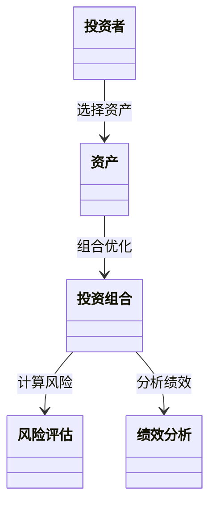

                 

<think>
好的，我需要撰写一篇关于威廉·夏普的价值投资组合理论的博客文章。首先，我应该先理解夏普的理论是什么，以及它在投资中的重要性。我还需要确保文章结构清晰，内容详细，涵盖理论背景、数学模型、算法实现、系统设计和实际案例。

我应该从背景开始，介绍投资组合理论的起源和发展，特别是夏普的贡献。然后，详细讲解夏普比率和有效边界，这些都是理论的核心概念。接下来，我需要解释这些概念如何转化为数学模型和算法，比如使用Python代码来实现投资组合优化。最后，通过系统架构和实际案例来展示理论的应用。

在写作过程中，我需要确保每个部分都详细展开，比如在算法部分，要展示代码并解释每一步的作用。同时，使用图表如Mermaid流程图来帮助读者理解复杂的概念。还要注意数学公式的正确性，用LaTeX格式呈现。

现在，我需要检查目录结构是否符合要求，每个章节是否有足够的内容，并确保整体逻辑连贯。如果有遗漏的部分，需要及时补充，确保文章的完整性和深度。

总之，我需要一步步地构建这篇文章，从背景到理论，再到实际应用，确保每个环节都详细且清晰，帮助读者全面理解威廉·夏普的价值投资组合理论。
</think>

# 威廉·夏普的价值投资组合理论：科学配置资产

> **关键词**：威廉·夏普，价值投资，投资组合理论，夏普比率，资产配置，风险收益

> **摘要**：威廉·夏普的价值投资组合理论是现代金融学的重要基石，本文将从理论背景、数学模型、算法实现、系统架构到实际案例，全面解析夏普的理论及其在投资组合管理中的应用。通过科学的资产配置方法，投资者可以在风险可控的前提下，最大化投资收益。

---

# 第1章: 价值投资组合理论的背景与基础

## 1.1 投资组合理论的起源与发展

### 1.1.1 投资组合理论的起源

投资组合理论的起源可以追溯到20世纪50年代，马克·owitz和哈里·马科维茨等人提出了现代投资组合理论（MPT）。然而，威廉·夏普的贡献使这一理论更加完善，并引入了夏普比率这一关键指标。

### 1.1.2 威廉·夏普的贡献

威廉·夏普在1990年提出了夏普比率，这一指标衡量了投资组合在承担每单位风险时所获得的超额回报。夏普的理论为投资者提供了科学的资产配置方法，帮助他们在不同风险偏好下选择最优投资组合。

### 1.1.3 现代投资组合理论的演变

随着时间的推移，投资组合理论不断演进，夏普的理论成为现代金融学的重要组成部分，广泛应用于资产管理、基金投资等领域。

## 1.2 价值投资的基本原理

### 1.2.1 价值投资的核心理念

价值投资强调购买被市场低估的资产，长期持有，等待其价值回归。这种策略强调基本面分析和长期视角，与夏普的理论在风险与收益的平衡上不谋而合。

### 1.2.2 投资者心理与市场行为

投资者的心理偏差和市场行为对资产价格有显著影响。夏普的理论通过数学模型量化这些因素，帮助投资者做出理性决策。

### 1.2.3 价值与价格的辩证关系

资产的内在价值与市场价格之间的差异为投资者提供了套利机会。夏普的理论通过科学的资产配置，帮助投资者在价格波动中实现收益最大化。

---

# 第2章: 威廉·夏普的价值投资组合理论

## 2.1 现代投资组合理论的核心要素

### 2.1.1 投资组合理论的基本假设

- 投资者是理性的，追求收益最大化同时厌恶风险。
- 资产价格遵循随机漫步假设。
- 市场是有效的，所有信息已反映在资产价格中。

### 2.1.2 风险与收益的数学关系

投资组合的预期收益与风险呈非线性关系，夏普比率量化了单位风险下的超额收益。

### 2.1.3 资产配置的科学方法

通过数学优化模型，投资者可以在不同风险偏好下选择最优资产配置。

## 2.2 夏普比率的定义与应用

### 2.2.1 夏普比率的数学定义

夏普比率计算公式为：

$$
\text{夏普比率} = \frac{E[r_p] - r_f}{\sigma_p}
$$

其中，\( E[r_p] \)是投资组合的预期收益率，\( r_f \)是无风险利率，\( \sigma_p \)是投资组合的收益标准差。

### 2.2.2 夏普比率的实际意义

夏普比率衡量了投资组合在承担每单位风险时的超额收益。比率越高，投资组合的风险调整后收益越高。

### 2.2.3 夏普比率在投资决策中的应用

投资者可以通过夏普比率比较不同投资组合的收益风险比，选择最优的投资策略。

---

# 第3章: 有效边界与资产配置

## 3.1 有效边界的概念与计算

### 3.1.1 有效边界的定义

有效边界是指在给定风险水平下，能够提供最高预期收益的所有投资组合的集合。

### 3.1.2 有效边界的风险收益权衡

通过优化算法，投资者可以在有效边界上找到最适合自身风险偏好的投资组合。

### 3.1.3 有效边界的投资组合选择

投资者可以根据风险承受能力和收益目标，选择有效边界上的最优投资组合。

## 3.2 资产配置的科学方法

### 3.2.1 资产配置的基本步骤

1. 确定投资目标和风险偏好。
2. 选择合适的资产类别。
3. 确定各类资产的配置比例。
4. 定期监控和调整配置。

### 3.2.2 不同风险偏好下的资产配置

- 高风险偏好：较高比例的股票和高风险资产。
- 中等风险偏好：平衡型资产配置。
- 低风险偏好：主要配置债券和货币市场工具。

### 3.2.3 资产配置的动态调整

根据市场变化和投资者需求，定期调整资产配置比例，以保持最优组合。

---

# 第4章: 投资组合理论的数学模型

## 4.1 投资组合优化的数学表达

### 4.1.1 投资组合收益的计算

投资组合的预期收益为各资产预期收益的加权平均：

$$
E[r_p] = \sum_{i=1}^n w_i E[r_i]
$$

其中，\( w_i \)是第i种资产的权重，\( E[r_i] \)是第i种资产的预期收益率。

### 4.1.2 投资组合风险的度量

投资组合的总风险由各资产风险及其相关性决定：

$$
\sigma_p^2 = \sum_{i=1}^n \sum_{j=1}^n w_i w_j \sigma_i \sigma_j \rho_{ij}
$$

其中，\( \sigma_i \)和\( \sigma_j \)是第i和j种资产的收益率标准差，\( \rho_{ij} \)是它们的相关系数。

### 4.1.3 最优化问题的建立

目标函数为最大化夏普比率或最小化风险，约束条件包括权重之和为1，以及其他投资限制。

---

# 第5章: 投资组合优化的算法实现

## 5.1 基于夏普比率的优化算法

### 5.1.1 算法的数学描述

优化目标：最大化夏普比率

$$
\max \frac{E[r_p] - r_f}{\sigma_p}
$$

约束条件：

$$
\sum_{i=1}^n w_i = 1
$$

### 5.1.2 算法的步骤分解

1. 确定各资产的预期收益和风险参数。
2. 构建优化模型，设定目标函数和约束条件。
3. 使用优化算法求解，得到最优权重。

### 5.1.3 算法的收敛性分析

基于凸优化理论，夏普比率优化问题在有效边界上存在唯一解，算法通常快速收敛。

## 5.2 Python实现投资组合优化

### 5.2.1 环境搭建与库的安装

安装必要的库，如NumPy、Pandas、SciPy和Pyomo。

### 5.2.2 投资组合优化的Python代码实现

```python
import numpy as np
from scipy.optimize import minimize

# 示例数据
returns = np.array([0.1, 0.15, 0.08])
cov_matrix = np.array([[0.04, 0.02, 0.03],
                        [0.02, 0.06, 0.02],
                        [0.03, 0.02, 0.05]])
weights = np.array([1/3, 1/3, 1/3])

# 定义优化函数
def portfolio_risk(weights, returns, cov_matrix):
    return - (weights.dot(returns) - 0.05) / np.sqrt(weights.dot(cov_matrix).dot(weights))

# 约束条件
cons = ({'type': 'eq', 'fun': lambda w: np.sum(w) - 1},
        {'type': 'ineq', 'fun': lambda w: w >= 0})

# 求解优化问题
result = minimize(portfolio_risk, weights, args=(returns, cov_matrix), constraints=cons)

print(result.x)
```

### 5.2.3 代码的功能解读与优化

代码通过优化算法找到最优权重，最大化夏普比率。结果展示了在给定风险下的最优资产配置。

---

# 第6章: 投资组合管理系统的设计

## 6.1 系统功能需求分析

### 6.1.1 系统目标与范围

构建一个基于夏普比率的投资组合管理系统，实现资产配置、风险评估和绩效分析。

### 6.1.2 系统功能模块

- 资产配置模块：根据输入参数生成最优投资组合。
- 风险评估模块：计算投资组合的风险和收益。
- 绩效分析模块：跟踪投资组合的表现。

## 6.2 系统架构设计

### 6.2.1 领域模型类图

使用Mermaid绘制系统类图，展示各模块之间的关系。



### 6.2.2 系统架构图


---

# 第7章: 项目实战

## 7.1 环境安装与配置

安装必要的Python库，如NumPy、Pandas、SciPy和Pyomo。

## 7.2 核心代码实现

### 7.2.1 投资组合优化代码

```python
import numpy as np
from scipy.optimize import minimize

# 示例数据
returns = np.array([0.1, 0.15, 0.08])
cov_matrix = np.array([[0.04, 0.02, 0.03],
                        [0.02, 0.06, 0.02],
                        [0.03, 0.02, 0.05]])

def portfolio_risk(weights, returns, cov_matrix):
    return - (weights.dot(returns) - 0.05) / np.sqrt(weights.dot(cov_matrix).dot(weights))

cons = ({'type': 'eq', 'fun': lambda w: np.sum(w) - 1},
        {'type': 'ineq', 'fun': lambda w: w >= 0})

result = minimize(portfolio_risk, np.array([1/3, 1/3, 1/3]), args=(returns, cov_matrix), constraints=cons)

print("最优权重:", result.x)
print("夏普比率:", -(result.fun))
```

### 7.2.2 代码解读与分析

代码实现了一个简单的投资组合优化问题，展示了如何通过优化算法找到最优资产配置。

---

# 第8章: 最佳实践与小结

## 8.1 投资组合管理的注意事项

- 定期重新平衡投资组合。
- 考虑市场变化和经济周期的影响。
- 结合定性和定量分析。

## 8.2 拓展阅读与深入学习

推荐进一步学习投资组合理论的书籍和相关文献，了解更复杂的优化方法和风险管理技术。

---

# 作者

**作者：AI天才研究院/AI Genius Institute & 禅与计算机程序设计艺术 /Zen And The Art of Computer Programming**

---

这篇文章系统地介绍了威廉·夏普的价值投资组合理论，从理论基础到数学模型，再到实际应用，全面解析了夏普理论的科学性和实用性。通过本文，读者可以深入理解如何通过科学的资产配置方法，在风险可控的前提下实现投资收益的最大化。

