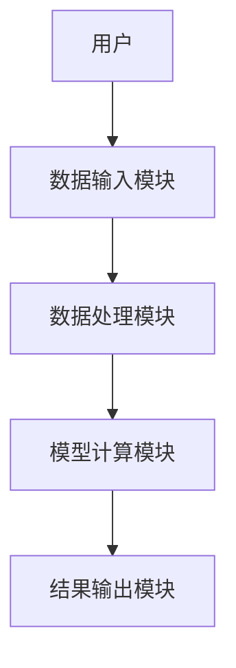
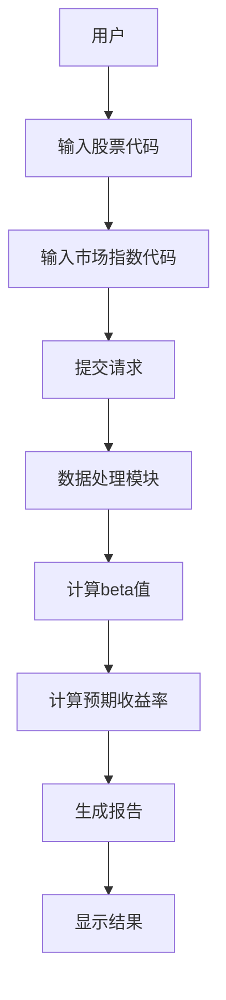

                 


# 威廉·夏普的资本资产定价模型(CAPM)在价值投资中的应用

## 关键词：威廉·夏普, 资本资产定价模型, 价值投资, 投资组合优化, 股票估值, 现代投资组合理论

## 摘要：本文深入探讨威廉·夏普的资本资产定价模型(CAPM)在价值投资中的应用。首先介绍CAPM的基本概念和理论基础，然后分析其在股票估值和投资组合优化中的具体应用。通过实例分析，展示如何使用CAPM进行股票估值，并结合系统设计与项目实战，详细阐述CAPM的实际应用过程。最后，总结CAPM在投资中的优缺点，并提出改进建议。

---

# 第一部分: 资本资产定价模型(CAPM)概述

## 第1章: 资本资产定价模型(CAPM)的背景与核心概念

### 1.1 资本资产定价模型(CAPM)的背景

#### 1.1.1 价值投资的基本概念

价值投资是一种投资策略，旨在通过分析公司的基本面（如财务状况、行业地位、盈利能力等）来寻找被市场低估的股票。其核心理念是购买价格低于内在价值的股票，长期持有，等待其价值回归。这一策略强调深入分析和长期视角，避免短期市场波动的干扰。

#### 1.1.2 CAPM的起源与发展

威廉·夏普在20世纪60年代提出了资本资产定价模型（CAPM），这是现代金融理论中的一个里程碑。CAPM基于现代投资组合理论（MPT）的发展，通过引入系统性风险和非系统性风险的概念，为资产定价提供了一种科学的方法。CAPM最初应用于学术研究，但很快在实践中得到了广泛应用。

#### 1.1.3 CAPM在现代投资理论中的地位

CAPM被认为是现代金融学的基石之一，它不仅帮助投资者评估资产的预期收益，还为投资组合优化提供了理论依据。CAPM的核心在于将资产的预期收益与其承担的系统性风险（beta值）相关联，从而帮助投资者做出更理性的投资决策。

### 1.2 CAPM的核心概念与原理

#### 1.2.1 资产的系统性风险与非系统性风险

系统性风险是指影响整个市场的风险，如经济衰退、通货膨胀、战争等，这种风险无法通过分散投资来消除。而非系统性风险是特定于某个资产或行业的风险，如公司管理不善、产品召回等，这种风险可以通过分散投资来降低。

#### 1.2.2 投资者风险偏好与市场预期收益

投资者的风险偏好影响他们对风险资产的需求。风险厌恶的投资者通常要求更高的预期收益来补偿承担的额外风险。市场预期收益是投资者对市场整体回报的预期，通常基于无风险利率和对风险的补偿。

#### 1.2.3 资产定价的均衡理论

CAPM基于市场均衡理论，假设市场参与者理性且能够有效分散风险。在均衡状态下，资产的预期收益应等于其要求的必要回报，即CAPM公式中的计算值。这种均衡状态确保了市场价格反映了所有相关信息。

### 1.3 CAPM的数学模型与公式

#### 1.3.1 CAPM的基本公式推导

CAPM的核心公式为：

$$
E(r_i) = r_f + \beta_i (E(r_m) - r_f)
$$

其中，\( E(r_i) \) 是资产i的预期回报率，\( r_f \) 是无风险利率，\( \beta_i \) 是资产i的beta值，\( E(r_m) \) 是市场预期回报率。

#### 1.3.2 CAPM的变量定义与假设条件

- \( E(r_i) \): 资产i的预期回报率
- \( r_f \): 无风险利率，通常用国债收益率表示
- \( \beta_i \): 资产i的beta值，衡量其系统性风险
- \( E(r_m) \): 市场预期回报率，通常用市场指数的预期收益表示

假设条件包括：市场是完全竞争的，参与者都是理性的，能够有效分散非系统性风险等。

#### 1.3.3 CAPM的局限性与改进方向

CAPM的局限性在于其假设过于严格，例如忽略了交易成本和税收，且beta值的计算可能存在偏差。此外，CAPM仅考虑系统性风险，忽略了非系统性风险的影响。未来改进方向可能包括引入更多因素（如公司规模、价值因子）来提高模型的准确性。

---

## 第2章: CAPM的理论基础与数学推导

### 2.1 马科维茨的现代投资组合理论(MPT)

#### 2.1.1 MPT的基本假设与目标函数

MPT由哈里·马科维茨提出，其基本假设包括：投资者是理性的，市场是有效的，资产回报符合正态分布等。目标函数是最大化预期收益，同时最小化投资组合的方差（即风险）。

#### 2.1.2 有效前沿的概念与计算方法

有效前沿是指在给定风险水平下，能够提供最高预期收益的投资组合。计算有效前沿需要确定所有可能的投资组合，并选择那些在风险-收益坐标系中处于前沿的组合。

#### 2.1.3 MPT与CAPM的关系

CAPM是MPT的扩展，它利用MPT中的beta系数来衡量系统性风险，并将资产的预期收益与其系统性风险相关联。CAPM可以看作是MPT在市场均衡状态下的特例。

### 2.2 CAPM的理论推导

#### 2.2.1 市场中立组合的概念

市场中立组合是指其beta值为零的组合，即不受市场波动影响。这种组合的预期收益仅由无风险利率决定。

#### 2.2.2 CAPM的数学推导

通过引入市场中立组合的概念，CAPM推导出资产的预期收益应等于其系统性风险的补偿加上无风险利率。这一推导过程展示了市场均衡状态下资产定价的内在逻辑。

#### 2.2.3 CAPM与市场均衡的关系

CAPM假设市场处于均衡状态，即所有资产的预期收益与其系统性风险相匹配。这种均衡确保了市场价格反映了所有相关信息，使得套利机会不存在。

### 2.3 CAPM的数学模型与公式

#### 2.3.1 CAPM的公式表示

$$
E(r_i) = r_f + \beta_i (E(r_m) - r_f)
$$

#### 2.3.2 各变量的经济意义与实际应用

- \( r_f \): 无风险利率，通常使用国债收益率作为近似
- \( \beta_i \): 资产i的beta值，衡量其系统性风险
- \( E(r_m) \): 市场预期回报率，通常基于历史回报率的平均值或市场参与者的预期

#### 2.3.3 CAPM的假设条件与限制

CAPM的假设包括市场是完全竞争的，参与者都是理性的，能够有效分散非系统性风险等。这些假设在实际中可能并不完全成立，导致CAPM的应用存在局限性。

---

## 第3章: CAPM在价值投资中的应用

### 3.1 价值投资的基本原理

#### 3.1.1 价值投资的定义与核心理念

价值投资是一种长期投资策略，强调寻找市场价格低于内在价值的资产。其核心理念是通过深入分析公司基本面，识别被市场低估的投资机会。

#### 3.1.2 价值投资与基本面分析的关系

价值投资依赖于基本面分析，包括对公司财务状况、行业地位、盈利能力等的深入研究。CAPM作为基本面分析的一种工具，帮助投资者评估资产的内在价值。

#### 3.1.3 价值投资的哲学基础

价值投资的哲学基础是市场并非总是有效的，价格波动可能与内在价值脱节。通过长期持有优质资产，投资者能够在价格回归内在价值时获得收益。

### 3.2 CAPM在价值投资中的应用

#### 3.2.1 股票估值的基本方法

股票估值的基本方法包括相对估值法（如市盈率、市净率）和绝对估值法（如DCF模型）。CAPM作为一种绝对估值法，通过评估资产的系统性风险，提供了一种科学的估值方法。

#### 3.2.2 CAPM在股票估值中的应用

通过计算股票的beta值和市场预期回报率，CAPM可以帮助投资者确定股票的预期回报率。这一预期回报率可以与股票的内在价值进行比较，从而判断其是否被低估或高估。

#### 3.2.3 CAPM与DCF模型的结合

CAPM可以作为DCF模型的贴现率，帮助确定现金流的现值。通过将CAPM计算出的贴现率应用于DCF模型，投资者可以更准确地评估股票的内在价值。

### 3.3 实例分析: 使用CAPM进行股票估值

#### 3.3.1 实例选择与数据收集

选择一家公司（如苹果公司）作为实例，收集其历史股价、市场指数收益率、无风险利率等数据。

#### 3.3.2 计算股票的预期收益率

使用CAPM公式计算股票的预期收益率：

$$
E(r_i) = r_f + \beta_i (E(r_m) - r_f)
$$

其中，\( \beta_i \) 通过回归分析计算得出，\( E(r_m) \) 通常使用市场指数的历史平均回报率。

#### 3.3.3 比较实际收益率与预期收益率

将计算出的预期收益率与实际收益率进行比较，分析模型的准确性。如果实际收益率接近预期收益率，说明模型在该实例中表现良好。

### 3.4 本章小结

CAPM在价值投资中的应用主要体现在股票估值和投资组合优化方面。通过结合基本面分析，CAPM帮助投资者科学地评估资产的内在价值，从而做出更明智的投资决策。

---

## 第4章: CAPM的系统分析与架构设计

### 4.1 系统分析

#### 4.1.1 问题场景介绍

CAPM的系统应用需要考虑数据输入、模型计算、结果输出等环节。系统需要处理大量数据，包括股票价格、市场指数、无风险利率等。

#### 4.1.2 项目介绍

本项目旨在开发一个基于CAPM的股票估值系统，通过自动化数据处理和模型计算，帮助投资者快速评估股票的内在价值。

#### 4.1.3 系统功能设计

系统功能包括数据输入、模型计算、结果输出、报告生成等模块。用户可以通过输入股票代码和市场指数代码，获得股票的预期收益率和内在价值。

### 4.2 系统架构设计

#### 4.2.1 系统架构图

使用Mermaid绘制系统架构图：



#### 4.2.2 功能模块划分

- 数据输入模块：接收用户输入的股票代码和市场指数代码
- 数据处理模块：获取股票价格、市场指数收益率、无风险利率等数据
- 模型计算模块：计算股票的beta值和预期收益率
- 结果输出模块：显示计算结果和估值报告

#### 4.2.3 接口设计

- 数据输入接口：通过API接收用户输入
- 数据处理接口：与数据源（如Yahoo Finance）对接
- 模型计算接口：调用统计分析库（如Python的statsmodels）进行回归分析
- 结果输出接口：生成HTML或PDF报告

### 4.3 系统交互设计

#### 4.3.1 交互流程图

使用Mermaid绘制交互流程图：



#### 4.3.2 用户角色与权限分配

- 普通用户：输入数据，查看结果
- 管理员：管理用户权限，维护系统数据

---

## 第5章: 项目实战

### 5.1 环境安装与配置

#### 5.1.1 安装Python

安装Python 3.x，确保版本兼容。

#### 5.1.2 安装必要的库

安装Pandas、NumPy、statsmodels、Plotly等库：

```bash
pip install pandas numpy statsmodels plotly
```

### 5.2 核心实现源代码

#### 5.2.1 数据获取与处理

使用Pandas和NumPy处理股票数据：

```python
import pandas as pd
import numpy as np
import statsmodels.api as sm

# 获取股票数据
def get_data(ticker, start_date, end_date):
    data = pd.DataFrame()
    # 假设data是通过API获取的股票数据，包含'Adj Close'列
    return data

# 计算beta值
def calculate_beta(stock_data, market_data):
    # 市场收益
    market_returns = market_data['Adj Close'].pct_change().dropna()
    # 股票收益
    stock_returns = stock_data['Adj Close'].pct_change().dropna()
    
    # 使用线性回归计算beta
    model = sm.OLS(stock_returns, sm.add_constant(market_returns))
    results = model.fit()
    beta = results.params[1]
    return beta

# 计算CAPM预期收益率
def calculate_expected_return(risk_free_rate, beta, market_return):
    return risk_free_rate + beta * (market_return - risk_free_rate)
```

#### 5.2.2 代码实现与解读

完整代码实现：

```python
import pandas as pd
import numpy as np
import statsmodels.api as sm
import yfinance as yf

# 获取股票数据
def get_data(ticker, start_date, end_date):
    data = yf.download(ticker, start=start_date, end=end_date)
    return data

# 计算beta值
def calculate_beta(stock_data, market_data):
    stock_returns = stock_data['Adj Close'].pct_change().dropna()
    market_returns = market_data['Adj Close'].pct_change().dropna()
    
    model = sm.OLS(stock_returns, sm.add_constant(market_returns))
    results = model.fit()
    beta = results.params[1]
    return beta

# 计算CAPM预期收益率
def calculate_expected_return(risk_free_rate, beta, market_return):
    return risk_free_rate + beta * (market_return - risk_free_rate)

# 主函数
def main():
    ticker = 'AAPL'  # 示例股票，苹果公司
    market_ticker = '^GSPC'  # 标普500指数作为市场指数
    start_date = '2020-01-01'
    end_date = '2022-12-31'
    risk_free_rate = 0.02  # 假设无风险利率为2%
    
    # 获取股票数据
    stock_data = get_data(ticker, start_date, end_date)
    market_data = get_data(market_ticker, start_date, end_date)
    
    # 计算beta值
    beta = calculate_beta(stock_data, market_data)
    
    # 计算市场预期回报率
    market_return = market_data['Adj Close'].pct_change().mean() * 100
    
    # 计算预期收益率
    expected_return = calculate_expected_return(risk_free_rate, beta, market_return)
    
    print(f"股票 {ticker} 的beta值为: {beta}")
    print(f"股票 {ticker} 的预期收益率为: {expected_return}%")

if __name__ == "__main__":
    main()
```

### 5.3 实例分析与结果解读

#### 5.3.1 选择股票

以苹果公司（AAPL）为例，获取其2020年1月1日至2022年12月31日的股价数据。

#### 5.3.2 计算beta值

通过回归分析，计算AAPL相对于标普500指数的beta值。假设回归结果为beta = 1.2。

#### 5.3.3 计算预期收益率

假设无风险利率为2%，市场预期回报率为8%，则AAPL的预期收益率为：

$$
E(r_{AAPL}) = 0.02 + 1.2 \times (0.08 - 0.02) = 0.02 + 1.2 \times 0.06 = 0.02 + 0.072 = 0.092
$$

即9.2%。

#### 5.3.4 比较实际收益率与预期收益率

假设AAPL的实际平均收益率为10%，则高于预期收益率，说明股票可能被高估。反之，若实际收益率低于预期收益率，说明股票可能被低估。

### 5.4 项目小结

通过Python代码实现CAPM的应用，展示了如何利用统计分析工具进行股票估值。实际应用中，应考虑数据质量和模型假设的合理性，以提高估值的准确性。

---

## 第6章: 总结与展望

### 6.1 总结

CAPM作为一种经典的资产定价模型，在价值投资中具有重要的应用价值。通过科学地评估资产的系统性风险和预期收益，CAPM为投资者提供了有力的决策支持。然而，CAPM的局限性也不容忽视，尤其是在实际应用中，模型假设可能与现实存在偏差。

### 6.2 未来展望

未来的研究可以致力于改进CAPM模型，引入更多因素（如公司规模、价值因子）来提高模型的准确性。此外，结合机器学习和大数据分析，CAPM可以在更复杂的市场环境中展现出更大的潜力。

---

## 作者：AI天才研究院/AI Genius Institute & 禅与计算机程序设计艺术 /Zen And The Art of Computer Programming

---

通过本文的详细讲解，读者可以深入了解CAPM的基本理论及其在价值投资中的具体应用。从理论到实践，文章为读者提供了一个完整的知识框架，帮助他们在实际投资中更好地应用CAPM模型。

