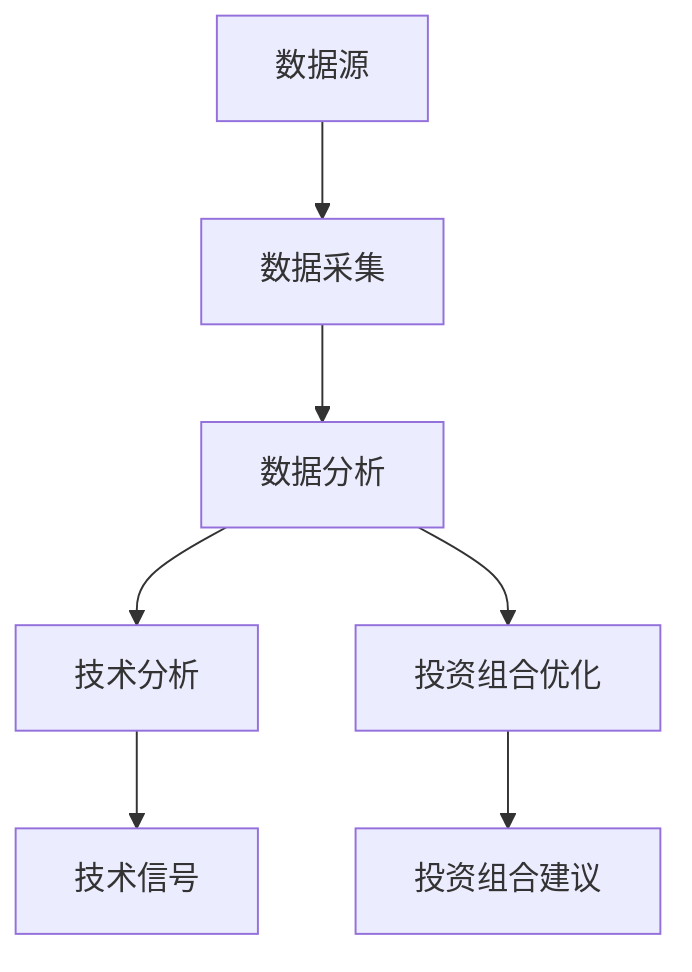
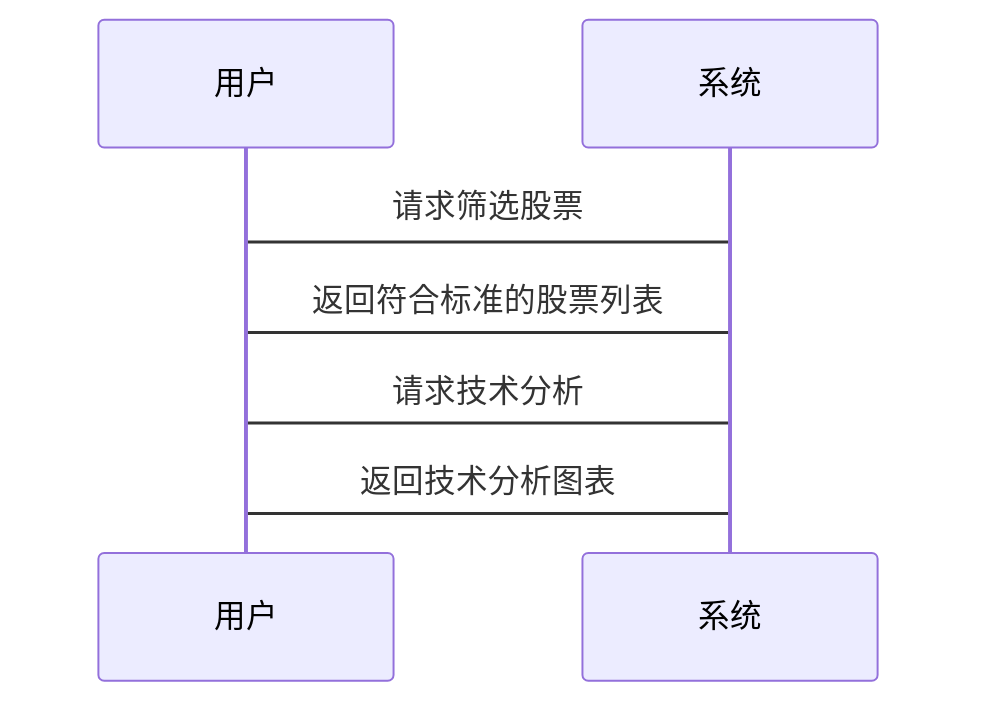
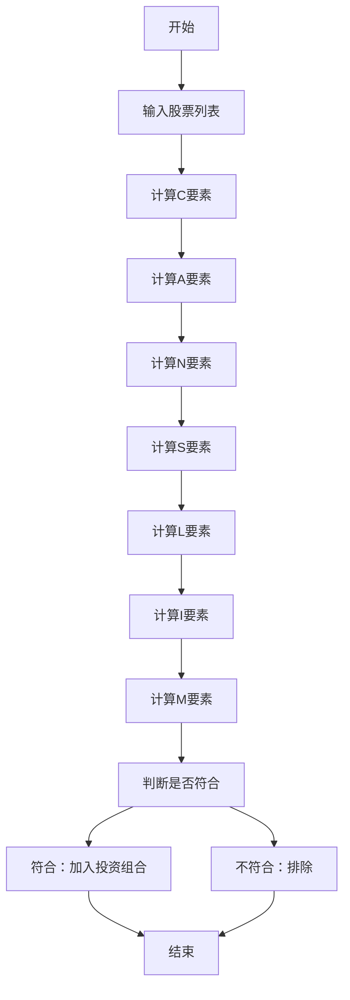

                 

<think>
好的，现在我需要根据用户的详细要求，撰写一篇关于威廉·奥尼尔CANSLIM策略的博客文章。首先，我得理解CANSLIM的每一个要素，并确保文章结构清晰，内容详实。我会从背景介绍开始，逐步展开每个要素的分析，最后结合系统设计和实战案例，确保读者能够全面理解策略的应用。同时，我需要使用技术语言，结合图表和代码，使文章更具专业性和可读性。接下来，我会按照用户提供的目录大纲，逐部分撰写，确保每个章节都涵盖必要的内容，并满足所有格式和深度的要求。
</think>

# 威廉·奥尼尔的成长价值投资：CANSLIM策略的应用

## 关键词：CANSLIM，威廉·奥尼尔，价值投资，投资策略，成长股

## 摘要：  
威廉·奥尼尔的CANSLIM策略是一种基于成长股的价值投资方法，通过分析企业的基本面、管理层、行业地位等因素，结合技术分析，帮助投资者做出明智的投资决策。本文将详细解析CANSLIM策略的核心要素，分析其数学模型和系统架构，并通过实际案例展示其在投资中的应用，为投资者提供科学的决策依据。

---

## 第一部分：CANSLIM策略概述

### 第1章：CANSLIM策略的背景与核心概念

#### 1.1 价值投资的起源与发展

- **1.1.1 价值投资的基本定义**  
  价值投资是一种投资策略，强调以低于内在价值的价格买入优质股票，长期持有，等待其价值回归。其核心在于识别具有持续竞争优势和良好管理的公司。

- **1.1.2 价值投资的核心理念**  
  价值投资并非寻找便宜的股票，而是寻找便宜的优秀公司。投资者应关注企业的基本面，如盈利能力、财务状况和管理层质量。

- **1.1.3 威廉·奥尼尔的贡献与CANSLIM策略的提出**  
  威廉·奥尼尔在成长股投资领域独树一帜，提出了CANSLIM策略，将成长股投资系统化，强调通过八个核心要素筛选出具有成长潜力的公司。

#### 1.2 CANSLIM策略的定义与特点

- **1.2.1 CANSLIM策略的定义**  
  CANSLIM策略是一种以成长股为核心的投资方法，通过八个要素（C、A、N、S、L、I、M）评估企业的投资价值。

- **1.2.2 CANSLIM策略的核心要素**  
  - **C**：资金管理与投资组合优化。  
  - **A**：行业分析与竞争优势。  
  - **N**：新产品与管理层变动。  
  - **S**：供给与需求分析。  
  - **L**：股价表现与技术分析。  
  - **I**：机构投资者动向。  
  - **M**：市场趋势与宏观经济环境。

- **1.2.3 CANSLIM策略与传统价值投资的区别**  
  CANSLIM策略更注重成长性和市场因素，结合技术分析，而传统价值投资更侧重于企业内在价值和长期持有。

#### 1.3 CANSLIM策略的投资哲学

- **1.3.1 长期投资与短期波动的平衡**  
  CANSLIM策略强调在长期投资中关注短期价格波动，以优化买入和卖出时机。

- **1.3.2 企业基本面分析的重要性**  
  基本面分析是CANSLIM策略的核心，通过分析企业的财务状况、行业地位和竞争优势，筛选出具有成长潜力的公司。

- **1.3.3 投资决策中的心理因素**  
  投资者应克服情绪化决策，严格按照策略筛选股票，避免市场的短期波动影响长期判断。

---

## 第二部分：CANSLIM策略的核心要素分析

### 第2章：CANSLIM策略的八个要素

#### 2.1 C：资金管理与投资组合优化

- **2.1.1 资金分配的原则**  
  资金分配应基于个股的投资价值和风险偏好，避免过度集中或分散。

- **2.1.2 投资组合的构建与风险控制**  
  构建投资组合时，应考虑个股的相关性，分散投资以降低风险。

- **2.1.3 资金管理的数学模型与公式**  
  资金分配可采用现代投资组合理论（MPT）模型，优化风险和收益的平衡。

$$ \text{收益} = \sum_{i=1}^n w_i r_i $$
$$ \text{风险} = \sqrt{\sum_{i=1}^n \sum_{j=1}^n w_i w_j \sigma_i \sigma_j \rho_{ij}} $$

其中，$w_i$ 是第i只股票的权重，$r_i$ 是其预期收益，$\sigma_i$ 是其收益的标准差，$\rho_{ij}$ 是两只股票之间的相关系数。

#### 2.2 A：行业分析与竞争优势

- **2.2.1 行业分析的基本方法**  
  通过分析行业的市场规模、增长潜力和竞争结构，评估行业前景。

- **2.2.2 企业竞争优势的识别**  
  核心竞争力包括成本优势、技术优势、品牌优势等。

- **2.2.3 行业周期对投资决策的影响**  
  行业处于上升周期时，企业成长性更高，投资机会更多。

#### 2.3 N：新产品与管理层

- **2.3.1 新产品对企业价值的影响**  
  新产品推出可带来收入增长和利润率提升，增强企业竞争力。

- **2.3.2 管理层能力的评估标准**  
  评估管理层的过往业绩、战略眼光和决策能力。

- **2.3.3 管理层变动对股价的影响**  
  管理层变动可能导致股价波动，需谨慎评估新管理层的能力。

#### 2.4 S：供给与需求分析

- **2.4.1 供给与需求的基本理论**  
  供给与需求决定市场均衡价格，影响企业的销售收入和利润。

- **2.4.2 行业供需格局对企业的影响**  
  供不应求时，企业可提高产品价格，增加利润。

- **2.4.3 供给与需求分析的实战案例**  
  某行业因需求激增，企业扩产，股价上涨。

#### 2.5 L：股价表现与技术分析

- **2.5.1 股价走势的基本分析**  
  股价走势反映市场对企业的认知，需结合技术分析判断趋势。

- **2.5.2 技术分析在投资决策中的应用**  
  使用K线图、均线、成交量等指标，识别买入和卖出信号。

- **2.5.3 股价形态与趋势的识别方法**  
  识别上升趋势、头肩顶等形态，辅助投资决策。

---

## 第三部分：CANSLIM策略的系统设计与实现

### 第3章：系统分析与架构设计

#### 3.1 系统功能设计

- **3.1.1 系统功能模块**  
  - 数据采集模块：收集股票数据、行业数据、新闻等。  
  - 数据分析模块：计算各项指标，筛选符合CANSLIM标准的股票。  
  - 技术分析模块：生成技术分析图表，提供买卖信号。  
  - 投资组合管理模块：优化投资组合，实时监控。

#### 3.2 系统架构设计

- **3.2.1 系统架构图**  
  使用Mermaid绘制系统架构图，展示各模块之间的关系。



#### 3.3 系统接口设计

- **3.3.1 数据接口**  
  与数据源（如Yahoo Finance）对接，获取实时数据。

- **3.3.2 用户接口**  
  提供友好的用户界面，展示分析结果和投资建议。

#### 3.4 系统交互流程

- **3.4.1 交互流程图**  
  使用Mermaid绘制用户与系统的交互流程。



---

## 第四部分：项目实战与应用

### 第4章：项目实战与应用

#### 4.1 环境配置

- **4.1.1 环境搭建**  
  使用Python和相关库（如Pandas、Matplotlib、Yahoo Finance API）。

#### 4.2 代码实现

- **4.2.1 数据采集**  
  使用Yahoo Finance API获取股票数据。

```python
import pandas_datareader as pdr

data = pdr.get_data_yahoo('AAPL', start='2020-01-01', end='2023-12-31')
```

- **4.2.2 数据分析与筛选**  
  计算各项指标，筛选符合CANSLIM标准的股票。

```python
def calculate_score(data):
    # 示例：计算得分
    score = 0
    # 根据各项指标计算得分
    return score

selected_stocks = []
for stock in stocks:
    data = pdr.get_data_yahoo(stock, start='2020-01-01', end='2023-12-31')
    score = calculate_score(data)
    if score > 70:
        selected_stocks.append(stock)
```

- **4.2.3 技术分析与信号生成**  
  使用技术指标生成买卖信号。

```python
import talib

close = data['Close']
# 计算MA
data['MA20'] = talib.SMA(close, 20)
# 生成交叉信号
data['signal'] = 0
data['signal'][data['MA20'] > close] = 1
data['signal'][data['MA20'] < close] = -1
```

#### 4.3 案例分析

- **4.3.1 实战案例**  
  分析某成长股的CANSLIM要素，展示筛选过程和投资决策。

#### 4.4 代码解读与分析

- **4.4.1 核心代码解析**  
  详细解读数据采集、筛选和分析的代码，说明每一步的作用。

---

## 第五部分：总结与扩展阅读

### 第5章：总结与展望

#### 5.1 总结

- **5.1.1 CANSLIM策略的核心总结**  
  CANSLIM策略通过八个要素筛选成长股，结合技术分析优化投资决策。

- **5.1.2 投资中的注意事项**  
  投资者应持续学习，根据市场变化调整策略。

#### 5.2 扩展阅读

- **5.2.1 推荐书籍**  
  - 《巴菲特的思考》  
  - 《投资最重要的事》

#### 5.3 未来展望

- **5.3.1 系统优化方向**  
  引入机器学习算法，提升筛选和预测的准确性。

---

## 附录：CANSLIM策略表格与流程图

### 附录A：CANSLIM策略筛选表格

| 股票代码 | C（资金分配） | A（行业分析） | N（新产品） | S（供给与需求） | L（股价表现） | I（机构动向） | M（市场趋势） | 是否符合 |
|----------|--------------|--------------|------------|-----------------|---------------|---------------|-------------|---------|
| AAPL     | 高           | 高           | 高         | 高              | 上升           | 高            | 上升        | 是     |

### 附录B：CANSLIM筛选流程图



---

## 作者：AI天才研究院/AI Genius Institute & 禅与计算机程序设计艺术 /Zen And The Art of Computer Programming

