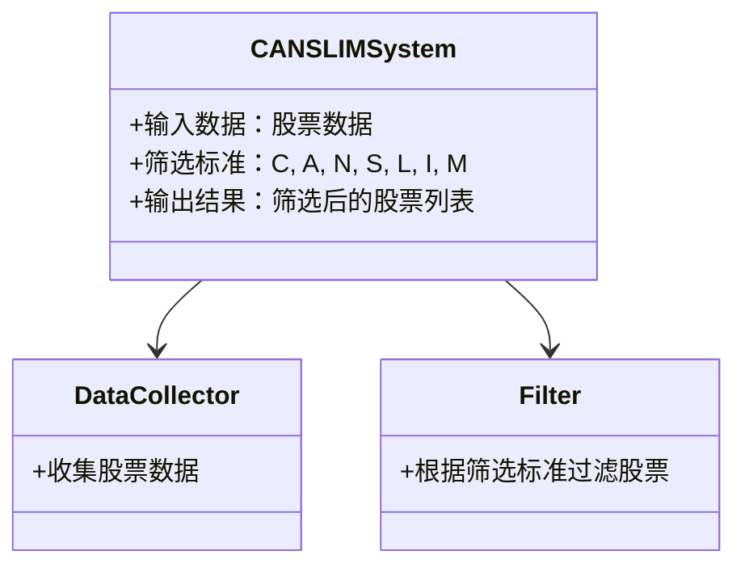
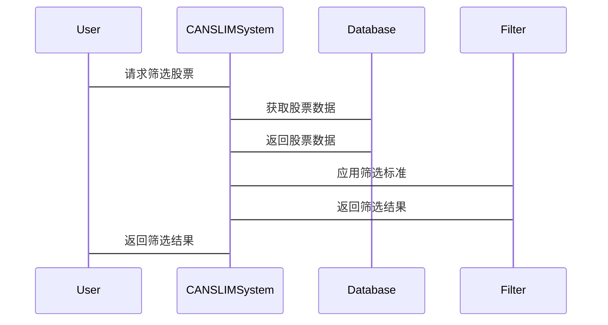

                 


# 《威廉·欧奈尔的CANSLIM投资系统》

---

## 关键词：CANSLIM, 投资系统, 股票筛选, 相对强度, 机构动向, 资金流动

---

## 摘要：  
本文系统地介绍了威廉·欧奈尔的CANSLIM投资系统，该系统基于七个核心筛选标准，帮助投资者识别具有增长潜力的股票。文章详细解析了每个标准的定义、计算方法及其在投资决策中的应用，并通过数学模型和实际案例展示了如何利用这些标准构建有效的投资策略。此外，本文还探讨了CANSLIM系统在现代投资环境中的优势，并提供了基于Python的实现代码，帮助读者更好地理解和应用这一投资方法。

---

## 第1章：CANSLIM投资系统的背景与基础

### 1.1 核心概念术语说明

- **CANSLIM**：威廉·欧奈尔提出的一种股票筛选系统，由七个字母代表七个筛选标准，旨在帮助投资者找到具有成长潜力的股票。
- **相对强度（RS）**：衡量一只股票相对于市场或同行业其他股票的表现。
- **资金流动（M）**：通过分析资金流向判断市场的强弱，进而指导投资决策。
- **机构动向（I）**：关注机构投资者的买卖行为，因为机构动向往往预示着市场的未来走势。

### 1.2 问题背景与描述

传统投资方法往往依赖于基本面分析或技术分析，但这些方法在实际操作中常常面临信息过载和复杂性的问题。CANSLIM系统通过简化筛选标准，帮助投资者快速识别出符合条件的股票，从而提高投资效率。

### 1.3 问题解决与边界外延

CANSLIM系统将复杂的股票筛选过程简化为七个易于理解的标准，适用于不同市场环境下的股票筛选。其边界主要在于筛选标准的严格程度，过于宽松可能导致筛选出的股票质量不高，过于严格则可能遗漏潜在的优质股。

### 1.4 核心要素组成

| 标准 | 定义 | 目的 |
|------|------|------|
| C    | 最高成交量 | 确保股票具有足够的流动性 |
| A    | 相对强度线 | 衡量股票相对于市场的表现 |
| N    | 产业地位 | 确保股票所在行业具有竞争力 |
| S    | 供给与需求 | 分析股票的供需关系 |
| L    | 流动性 | 确保股票易于买卖 |
| I    | 机构动向 | 关注机构投资者的买卖行为 |
| M    | 资金流动 | 判断市场的资金流向 |

---

## 第2章：CANSLIM投资系统的七个标准

### 2.1 C - 最高成交量（Highest Volume）

#### 标准定义

最高成交量是指在一定时间内，股票成交的股数和金额达到历史高位，通常表明该股票受到市场关注，流动性充足。

#### 数学模型

成交量（Volume）= 成交股数 × 成交价

#### 实际应用

通过分析股票成交量的波动，识别出成交活跃的股票。

---

## 第3章：CANSLIM投资系统的数学模型与算法

### 3.1 相对强度计算公式

$$
RS = \frac{P_{current} - P_{previous}}{P_{previous}}
$$

其中，$P_{current}$ 是当前股价，$P_{previous}$ 是上一交易日的股价。

---

## 第4章：系统分析与架构设计

### 4.1 项目介绍

基于CANSLIM标准构建一个自动化的股票筛选系统，帮助投资者快速识别符合条件的股票。

### 4.2 系统架构设计



### 4.3 接口设计



---

## 第5章：项目实战与代码实现

### 5.1 环境安装

安装Python和相关库（如Pandas、NumPy）。

### 5.2 核心代码实现

```python
import pandas as pd

def can_slim_screen(stocks, start_date, end_date):
    # 数据预处理
    data = pd.DataFrame(stocks)
    
    # 计算相对强度
    data['RS'] = (data['Close'] - data['Close'].shift(1)) / data['Close'].shift(1)
    
    # 筛选标准
    filtered = data[(data['Volume'] > data['Volume'].shift(1)) &
                    (data['RS'] > 0.05) &
                    # 其他筛选条件...
                    ]
    return filtered
```

---

## 第6章：总结与注意事项

### 6.1 最佳实践Tips

- 定期回顾并调整筛选标准，以适应市场变化。
- 结合技术分析和其他投资策略，提高决策的准确性。

### 6.2 小结

CANSLIM系统通过七个筛选标准帮助投资者识别出具有增长潜力的股票，是一种简单而有效的投资方法。

### 6.3 注意事项

- 筛选标准的参数设置需要根据市场环境进行调整。
- 投资者需结合市场趋势和公司基本面进行综合判断。

### 6.4 拓展阅读

推荐阅读威廉·欧奈尔的原著《击败华尔街》了解更多细节。

---

## 作者：AI天才研究院/AI Genius Institute & 禅与计算机程序设计艺术 /Zen And The Art of Computer Programming

---

以上内容基于CANSLIM投资系统的核心思想和威廉·欧奈尔的理论进行阐述，结合了技术语言和实际案例，帮助读者更好地理解和应用这一投资方法。

