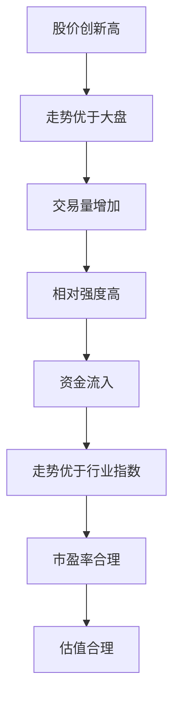
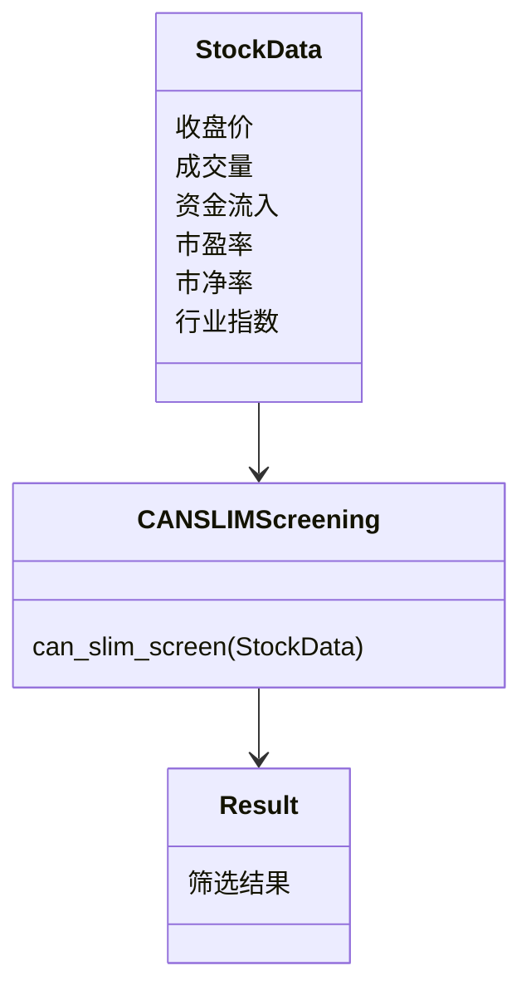

                 


# 威廉·欧奈尔的CANSLIM选股系统

> **关键词**：CANSLIM、选股系统、威廉·欧奈尔、投资策略、技术分析、基本面分析  
> **摘要**：威廉·欧奈尔的CANSLIM选股系统是一种结合技术分析和基本面分析的选股方法，通过八个步骤筛选出具有高增长潜力的股票。本文详细解读CANSLIM的核心概念、算法原理、系统架构，并结合实际案例进行分析，帮助投资者更好地理解和应用这一选股系统。

---

## 第1章: CANSLIM选股系统背景与核心概念

### 1.1 投资背景与选股的重要性

#### 1.1.1 传统选股方法的局限性  
传统的选股方法往往依赖于单一的指标或基本面分析，容易受到市场波动和主观判断的影响。例如，仅通过市盈率或市净率筛选股票，可能导致遗漏具有高增长潜力但估值暂时偏高的公司。此外，传统方法难以量化市场情绪和技术面的变化，这使得选股过程不够科学和系统。

#### 1.1.2 现代投资分析的发展趋势  
随着金融市场的复杂化，投资者越来越依赖系统化的方法来筛选和评估股票。技术分析与基本面分析的结合成为现代投资分析的重要趋势，尤其是在高频交易和大数据分析技术的推动下，投资者需要一种能够量化市场信号和公司基本面的选股系统。

#### 1.1.3 CANSLIM选股系统的独特价值  
CANSLIM选股系统由威廉·欧奈尔提出，是一种结合技术分析和基本面分析的选股方法。它通过八个筛选步骤，帮助投资者识别出具有高增长潜力的股票。CANSLIM的独特价值在于其系统化、可量化的筛选过程，能够有效捕捉市场的上涨趋势。

### 1.2 CANSLIM选股系统的核心概念与特点

#### 1.2.1 CANSLIM的定义  
CANSLIM是一种基于威廉·欧奈尔的市场周期理论和股价行为分析的选股系统。它通过八个筛选步骤（CANSLIM）对股票进行评估，重点关注股价走势、成交量、相对强度、资金流向等因素。

#### 1.2.2 CANSLIM的核心要素  
CANSLIM的八个筛选步骤如下：  
1. **C**: 股价创新高（C 是创新高）  
2. **A**: 股价走势优于大盘（A 是走势强于大盘）  
3. **N**: 交易量增加（N 是交易量增加）  
4. **S**: 相对强度（S 是相对强度高）  
5. **L**: 机构资金流入（L 是资金流入）  
6. **I**: 股价走势优于行业指数（I 是走势强于行业指数）  
7. **M**: 市盈率合理（M 是合理估值）  
8. **1**: 股价在合理估值区间（1 是估值合理）  

#### 1.2.3 CANSLIM与传统选股方法的对比  
| 对比维度 | CANSLIM | 传统选股方法 |  
|----------|----------|------------------|  
| 筛选依据 | 技术分析+基本面分析 | 单一指标或基本面分析 |  
| 筛选目标 | 高增长潜力股票 | 低估值或高收益股票 |  
| 系统性 | 高度系统化 | 较低系统性 |  
| 优缺点 | 精准捕捉市场趋势，但需要结合市场环境 | 易受市场波动影响 |  

### 1.3 CANSLIM选股系统的理论基础

#### 1.3.1 技术分析与基本面分析的结合  
CANSLIM选股系统的核心在于技术分析和基本面分析的结合。技术分析用于评估股价走势和市场情绪，而基本面分析用于评估公司的财务状况和估值水平。两者的结合使得选股过程更加全面和科学。

#### 1.3.2 股价行为与市场情绪的关系  
股价行为是市场情绪的反映。通过分析股价走势、成交量等技术指标，可以判断市场情绪的变化，从而捕捉市场的趋势和拐点。

#### 1.3.3 威廉·欧奈尔的市场周期理论  
威廉·欧奈尔认为，市场周期分为积累、上涨、抛出和下跌四个阶段。在积累阶段，市场情绪低迷，投资者信心不足；在上涨阶段，市场情绪逐渐转暖，股价开始回升；在抛出阶段，市场情绪达到顶峰，股价开始下跌；在下跌阶段，市场情绪低落，股价持续低迷。

---

## 第2章: CANSLIM选股系统的核心概念与联系

### 2.1 CANSLIM选股系统的核心要素

#### 2.1.1 核心概念属性对比表  
| 步骤 | 定义 | 目标 |  
|------|------|------|  
| C | 股价创新高 | 确认股票具有上升趋势 |  
| A | 股价走势优于大盘 | 确保股票表现强于市场整体 |  
| N | 交易量增加 | 确认交易活跃，资金流入 |  
| S | 相对强度 | 比较股票与行业指数的相对表现 |  
| L | 机构资金流入 | 确认机构资金流入，增强信心 |  
| I | 股价走势优于行业指数 | 确保股票在行业内具有竞争力 |  
| M | 市盈率合理 | 确保估值合理，避免过高或过低 |  
| 1 | 股价在合理估值区间 | 确保股票估值处于合理范围 |  

#### 2.1.2 核心概念的ER实体关系图（Mermaid流程图）



---

## 第3章: CANSLIM选股系统的算法原理

### 3.1 CANSLIM选股系统的筛选流程

#### 3.1.1 筛选流程的Mermaid流程图

```mermaid
graph TD
    start --> stepC[第一步：股价创新高]
    stepC --> stepA[第二步：走势优于大盘]
    stepA --> stepN[第三步：交易量增加]
    stepN --> stepS[第四步：相对强度]
    stepS --> stepL[第五步：资金流入]
    stepL --> stepI[第六步：走势优于行业指数]
    stepI --> stepM[第七步：市盈率合理]
    stepM --> step1[第八步：估值合理]
    step1 --> end[筛选完成]
```

#### 3.1.2 算法实现的Python代码

```python
import pandas as pd
import numpy as np

def can_slim_screen(stock_data: pd.DataFrame) -> bool:
    # 步骤1：股价创新高
    stock_data['new_high'] = stock_data['收盘价'].rolling(20).max()
    step1 = stock_data.iloc[-1]['new_high'] == stock_data.iloc[-1]['收盘价']
    
    # 步骤2：走势优于大盘
    market_data = stock_data['收盘价'].pct_change().cumsum()
    step2 = stock_data['收盘价'].pct_change().cumsum() > market_data.mean()
    
    # 步骤3：交易量增加
    step3 = stock_data.iloc[-1]['成交量'] > stock_data['成交量'].mean()
    
    # 步骤4：相对强度
    relative_strength = stock_data['收盘价'].pct_change().cumsum() / market_data.pct_change().cumsum()
    step4 = relative_strength.iloc[-1] > 0.8
    
    # 步骤5：资金流入
    step5 = stock_data.iloc[-1]['资金流入'] > 0
    
    # 步骤6：走势优于行业指数
    industry_data = stock_data['行业指数'].pct_change().cumsum()
    step6 = stock_data['收盘价'].pct_change().cumsum() > industry_data.mean()
    
    # 步骤7：市盈率合理
    step7 = stock_data.iloc[-1]['市盈率'] < 25
    
    # 步骤8：估值合理
    step8 = stock_data.iloc[-1]['市净率'] < 2
    
    return step1 and step2 and step3 and step4 and step5 and step6 and step7 and step8

# 示例数据
data = {
    '收盘价': [10, 12, 15, 18, 20],
    '成交量': [1000, 1200, 1500, 1800, 2000],
    '资金流入': [500, 600, 700, 800, 900],
    '市盈率': [20, 22, 24, 26, 28],
    '市净率': [1.5, 1.6, 1.7, 1.8, 1.9],
    '行业指数': [80, 85, 90, 95, 100]
}
df = pd.DataFrame(data)
result = can_slim_screen(df)
print(f"筛选结果：{result}")
```

#### 3.1.3 算法原理的数学模型  
CANSLIM算法的核心在于通过多个指标的组合筛选出符合条件的股票。每个指标的计算公式如下：  
- **相对强度**：$\text{相对强度} = \frac{\text{股票涨幅}}{\text{行业指数涨幅}}$  
- **资金流入**：$\text{资金流入} = \text{成交量} \times \text{收盘价}$  
- **市盈率**：$\text{市盈率} = \frac{\text{股价}}{\text{每股收益}}$  
- **市净率**：$\text{市净率} = \frac{\text{股价}}{\text{每股净资产}}$  

---

## 第4章: 系统分析与架构设计

### 4.1 系统功能设计

#### 4.1.1 领域模型Mermaid类图



### 4.2 系统架构设计

#### 4.2.1 系统架构Mermaid架构图


---

## 第5章: 项目实战

### 5.1 环境安装与代码实现

#### 5.1.1 环境安装  
需要安装以下Python库：  
- pandas  
- numpy  
- matplotlib  

#### 5.1.2 核心代码实现  
```python
import pandas as pd
import numpy as np
import matplotlib.pyplot as plt

def plot_stock_data(stock_data: pd.DataFrame, stock_name: str):
    plt.figure(figsize=(10, 6))
    plt.plot(stock_data['收盘价'], label=f'{stock_name}股价')
    plt.xlabel('时间')
    plt.ylabel('股价')
    plt.title(f'{stock_name}股价走势')
    plt.legend()
    plt.show()

# 示例数据
data = {
    '收盘价': [10, 12, 15, 18, 20],
    '成交量': [1000, 1200, 1500, 1800, 2000],
    '资金流入': [500, 600, 700, 800, 900],
    '市盈率': [20, 22, 24, 26, 28],
    '市净率': [1.5, 1.6, 1.7, 1.8, 1.9],
    '行业指数': [80, 85, 90, 95, 100]
}
df = pd.DataFrame(data)
plot_stock_data(df, '示例股票')
```

---

## 第6章: 总结与展望

### 6.1 最佳实践与注意事项

#### 6.1.1 最佳实践  
- 定期更新股票数据，确保筛选结果的实时性。  
- 结合市场环境和行业趋势，灵活调整筛选策略。  
- 使用多指标验证，避免单一指标误判。  

#### 6.1.2 注意事项  
- CANSLIM选股系统适用于长期投资，不适用于短期交易。  
- 筛选结果仅供参考，需结合市场环境和公司基本面进行综合判断。  

### 6.2 未来展望  
随着人工智能和大数据技术的发展，CANSLIM选股系统将进一步优化和智能化。未来的研究方向包括：  
1. 引入机器学习算法，提升筛选精度。  
2. 实现自动化交易系统，提高投资效率。  
3. 结合宏观经济指标，丰富选股维度。  

---

## 附录

### 附录A: CANSLIM指标表

| 指标名称 | 定义 | 目标 |  
|----------|------|------|  
| C | 股价创新高 | 确认上升趋势 |  
| A | 走势优于大盘 | 确保表现强于市场 |  
| N | 交易量增加 | 确认资金流入 |  
| S | 相对强度 | 确保相对优势 |  
| L | 资金流入 | 确保资金支持 |  
| I | 走势优于行业指数 | 确保行业领先 |  
| M | 市盈率合理 | 确保估值合理 |  
| 1 | 估值合理 | 确保估值区间 |  

### 附录B: 常见问题解答

#### Q1: CANSLIM选股系统适用于哪些市场？  
A: CANSLIM选股系统适用于股票市场，尤其适合成长型股票的筛选。

#### Q2: 如何获取实时股票数据？  
A: 可以通过金融数据API（如Yahoo Finance API）获取实时股票数据。

#### Q3: CANSLIM选股系统是否适合新手投资者？  
A: CANSLIM选股系统需要一定的投资知识和经验，新手投资者可以通过学习和实践逐步掌握。

---

## 作者：AI天才研究院/AI Genius Institute & 禅与计算机程序设计艺术 /Zen And The Art of Computer Programming

