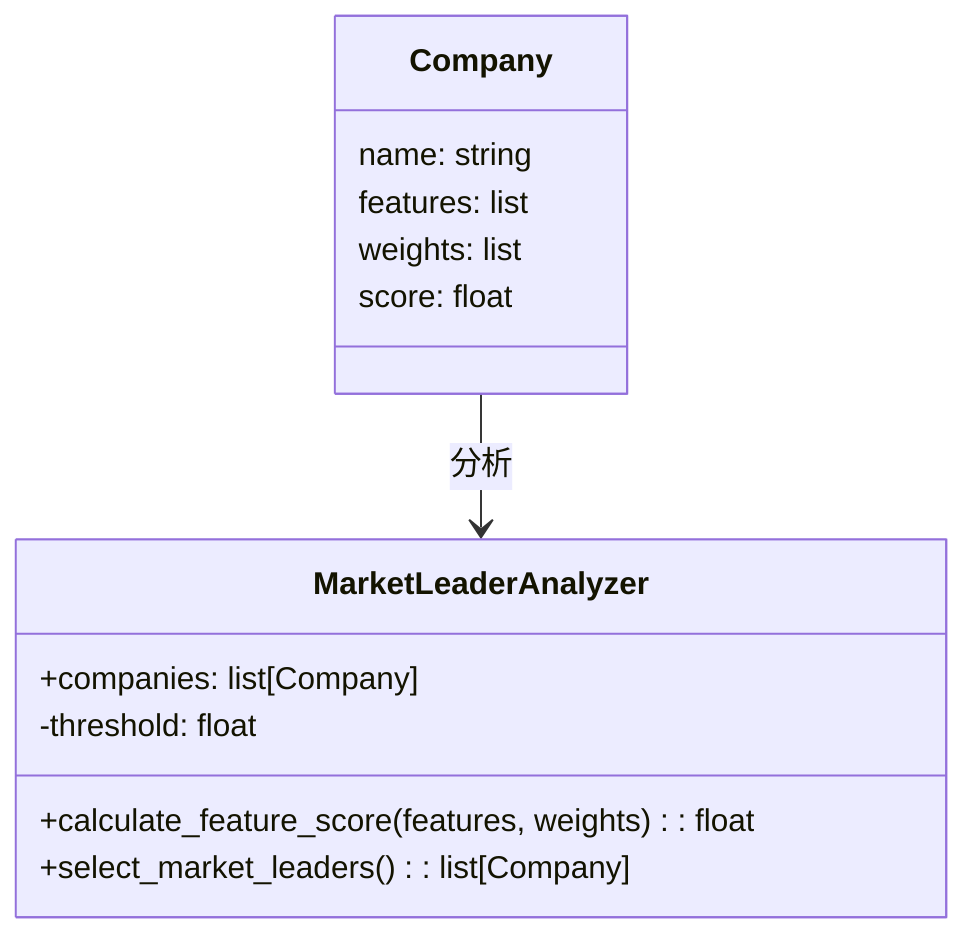
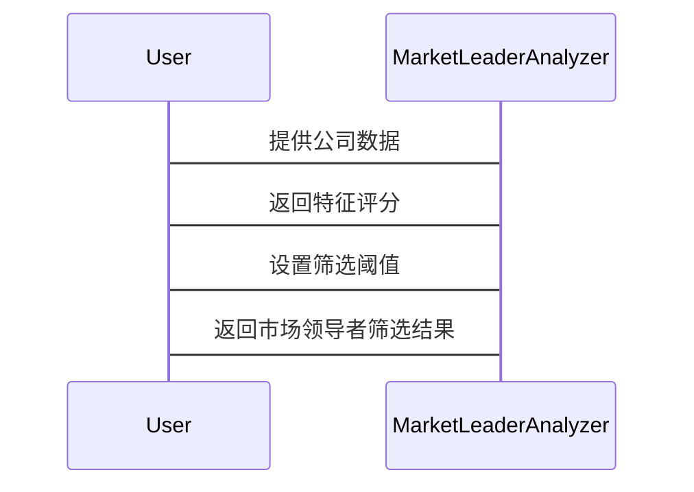

                 

<think>
好，我需要根据用户的请求，撰写一篇关于威廉·欧奈尔市场领导者特征分析的技术博客。用户提供了详细的结构大纲，包括关键词、摘要以及各章节的内容。我需要按照这个大纲逐步展开，确保每部分内容详尽、结构清晰。

首先，我会从背景介绍开始，涵盖威廉·欧奈尔的生平及其投资理论，明确市场领导者特征的定义和重要性。接下来，在核心概念部分，我会详细分析特征的属性和分类，并用ER图展示实体关系。然后，我会深入讲解特征评分系统和筛选算法，结合Python代码和数学模型，使内容更具技术性。

在系统分析部分，我会设计系统的功能和架构，并用mermaid图展示。项目实战部分则通过实际案例，展示如何应用这些理论。最后，我会总结最佳实践和注意事项，为读者提供实用的建议。

整个过程中，我需要确保语言专业、逻辑清晰，同时保持内容的连贯性和深度。通过这样的步骤，我相信能够完成一篇高质量的技术博客，帮助读者深入理解威廉·欧奈尔的市场领导者特征分析。
</think>

# 威廉·欧奈尔的市场领导者特征分析

> 关键词：市场领导者特征、威廉·欧奈尔、投资理论、特征评分系统、市场分析、算法实现

> 摘要：本文深入分析了威廉·欧奈尔提出的市场领导者特征，探讨了其在投资决策中的重要性，并通过系统化的分析方法和算法实现，帮助读者识别和分析市场中的领导者企业。文章结合理论与实践，详细讲解了特征评分系统、市场领导者筛选算法、系统架构设计以及项目实战案例，为投资者和研究者提供了有价值的参考。

---

# 第1章: 背景介绍

## 1.1 威廉·欧奈尔及其投资理论概述

### 1.1.1 威廉·欧奈尔的生平简介
威廉·欧奈尔（William O'Neil）是美国著名投资专家、金融理论家和作家，以其独特的投资方法和市场分析理论闻名。他创立了著名的投资机构——欧奈尔公司，并撰写了多本投资经典书籍，如《如何在市场中获胜》（How to Make Money in Stocks）。欧奈尔的投资理论强调对市场趋势和领导者的识别，尤其关注那些能够在市场中占据主导地位的公司。

### 1.1.2 威廉·欧奈尔的投资理论核心思想
威廉·欧奈尔的投资理论核心在于识别市场中的“领导者”企业，即那些能够在市场中脱颖而出、表现出色的公司。他认为，市场领导者通常具有强大的竞争优势、稳定的增长潜力和卓越的管理能力。欧奈尔提出了一系列筛选标准，用于识别这些市场领导者，从而帮助投资者做出更明智的投资决策。

### 1.1.3 市场领导者特征的定义
市场领导者特征是指那些能够使公司在竞争激烈的市场中占据主导地位的特质。这些特征包括公司规模、市场份额、盈利能力、成长潜力、管理团队等多个方面。通过分析这些特征，投资者可以更好地识别出具有长期增长潜力的公司。

---

## 1.2 市场领导者特征的背景与重要性

### 1.2.1 市场领导者特征的背景
在金融市场中，市场领导者通常是那些在行业内具有领先地位的公司。这些公司不仅在市场份额上占据优势，还能够在技术和创新方面引领行业潮流。识别这些公司对于投资者来说至关重要，因为它们往往能够在市场波动中表现稳定，并为投资者带来超额收益。

### 1.2.2 市场领导者特征的重要性
市场领导者特征的重要性体现在以下几个方面：
1. **投资决策的依据**：通过分析市场领导者特征，投资者可以更好地识别出具有长期增长潜力的公司，从而做出更明智的投资决策。
2. **风险控制**：市场领导者通常具有较强的抗风险能力，能够在市场波动中保持稳定。
3. **超额收益**：市场领导者往往能够为投资者带来超额收益，尤其是在市场上涨周期中。

### 1.2.3 市场领导者与市场跟随者的区别
市场领导者和市场跟随者的主要区别在于公司的市场份额、竞争优势、成长潜力和管理能力。市场领导者通常在行业内具有领先地位，能够引领市场趋势；而市场跟随者则主要依赖于市场领导者的战略和方向，缺乏自主创新能力和竞争优势。

---

## 1.3 市场领导者特征分析的必要性

### 1.3.1 为什么需要分析市场领导者特征
分析市场领导者特征的必要性主要体现在以下几个方面：
1. **识别投资机会**：通过分析市场领导者特征，投资者可以发现那些具有长期增长潜力的公司，从而抓住投资机会。
2. **优化投资组合**：市场领导者通常具有较强的抗风险能力和增长潜力，将其纳入投资组合可以优化组合的风险收益比。
3. **提高投资决策的科学性**：通过系统化的分析方法，投资者可以更科学地做出投资决策，降低盲目投资的风险。

### 1.3.2 市场领导者特征分析的现实意义
市场领导者特征分析不仅有助于投资者识别优质投资标的，还能够帮助公司制定发展战略。对于公司而言，分析市场领导者特征可以发现自身的竞争优势和不足，从而制定更有针对性的发展策略。

### 1.3.3 市场领导者特征分析的方法与工具
市场领导者特征分析的方法与工具主要包括：
1. **定量分析**：通过财务指标、市场份额等数据进行量化分析。
2. **定性分析**：通过公司治理、管理团队等非财务因素进行分析。
3. **组合分析**：将定量和定性分析相结合，综合评估公司的市场领导者特征。

---

# 第2章: 市场领导者特征的核心概念

## 2.1 核心概念与定义

### 2.1.1 市场领导者特征的核心要素
市场领导者特征的核心要素包括：
1. **公司规模**：公司规模是衡量市场领导者的重要指标之一，通常指公司的营业收入、净利润、员工数量等。
2. **市场份额**：市场份额是公司在行业内所占的比例，是衡量公司竞争力的重要指标。
3. **盈利能力**：盈利能力包括净利润率、ROE（净资产收益率）等指标，是衡量公司财务健康状况的重要指标。
4. **成长潜力**：成长潜力包括公司的收入增长率、净利润增长率等指标，是衡量公司未来发展空间的重要指标。
5. **管理团队**：管理团队的能力和稳定性是公司成功的关键因素之一。

### 2.1.2 市场领导者特征的属性与特征
市场领导者特征的属性与特征可以通过以下几个方面进行分析：
1. **规模与增长**：公司规模大且持续增长。
2. **市场份额**：在行业内占据领先地位。
3. **盈利能力**：具备较强的盈利能力。
4. **管理能力**：管理团队能力强，公司治理良好。
5. **创新与技术**：公司在技术和创新方面具有领先地位。

### 2.1.3 市场领导者特征的分类与层次
市场领导者特征可以根据不同的维度进行分类，主要包括：
1. **行业领导者**：在特定行业内占据领先地位的公司。
2. **区域领导者**：在特定区域内占据领先地位的公司。
3. **全球领导者**：在全球范围内占据领先地位的公司。

---

## 2.2 市场领导者特征的ER实体关系图

```mermaid
erDiagram
    customer[顾客] {
        +id: int
        +name: string
    }
    product[产品] {
        +id: int
        +name: string
        +price: float
    }
    market_leader[市场领导者] {
        +id: int
        +feature: string
        +score: float
    }
    customer --> product: 购买
    product --> market_leader: 符合特征
```

---

# 第3章: 市场领导者特征分析的算法原理

## 3.1 特征评分系统

### 3.1.1 特征评分系统的定义
特征评分系统是一种通过对市场领导者特征进行量化评分的方法，用于评估公司在市场中的领导者地位。

### 3.1.2 特征评分系统的实现步骤
1. **特征选择**：根据市场领导者特征的核心要素，选择相关特征。
2. **权重分配**：根据各特征的重要程度，分配相应的权重。
3. **评分计算**：对各特征进行评分，并根据权重计算综合评分。
4. **结果分析**：根据综合评分，评估公司在市场中的领导者地位。

### 3.1.3 特征评分系统的数学模型
$$
\text{特征评分} = \sum_{i=1}^{n} (w_i \times f_i)
$$
其中，\( w_i \) 是第 \( i \) 个特征的权重，\( f_i \) 是第 \( i \) 个特征的评分。

---

## 3.2 基于特征的市场领导者筛选算法

### 3.2.1 算法概述
基于特征的市场领导者筛选算法是一种通过量化分析市场领导者特征，筛选出符合市场领导者标准的公司。

### 3.2.2 算法实现步骤
1. **数据收集**：收集公司相关数据，包括财务数据、市场份额、管理团队等。
2. **特征提取**：提取市场领导者特征的核心要素。
3. **特征评分**：对各特征进行评分，并计算综合评分。
4. **筛选市场领导者**：根据综合评分，筛选出符合市场领导者标准的公司。

### 3.2.3 算法的数学模型与公式
$$
\text{综合评分} = \sum_{i=1}^{n} (w_i \times f_i)
$$

---

## 3.3 算法实现的Python代码示例

### 3.3.1 特征评分系统实现代码
```python
def calculate_feature_score(features, weights):
    return sum(w * f for w, f in zip(weights, features))

features = [0.8, 0.7, 0.9]
weights = [0.3, 0.5, 0.2]
score = calculate_feature_score(features, weights)
print("特征评分为：", score)
```

### 3.3.2 市场领导者筛选算法实现代码
```python
def select_market_leaders(companies, threshold=0.7):
    selected = []
    for company in companies:
        score = calculate_feature_score(company['features'], company['weights'])
        if score >= threshold:
            selected.append(company['name'])
    return selected

companies = [
    {'name': 'Company A', 'features': [0.8, 0.7, 0.9], 'weights': [0.3, 0.5, 0.2]},
    {'name': 'Company B', 'features': [0.6, 0.8, 0.7], 'weights': [0.2, 0.5, 0.3]},
    {'name': 'Company C', 'features': [0.9, 0.6, 0.8], 'weights': [0.4, 0.3, 0.3]}
]

selected_leaders = select_market_leaders(companies)
print("筛选出的市场领导者为：", selected_leaders)
```

---

## 3.4 算法原理的通俗易懂举例说明

假设我们有两家公司，A和B，分别具有以下特征：

- 公司A：市场份额=80%，净利润率=70%，ROE=90%
- 公司B：市场份额=60%，净利润率=80%，ROE=70%

假设权重分配为：市场份额=30%，净利润率=50%，ROE=20%。

计算两家公司的特征评分：
- 公司A的评分 = 0.3*0.8 + 0.5*0.7 + 0.2*0.9 = 0.24 + 0.35 + 0.18 = 0.77
- 公司B的评分 = 0.3*0.6 + 0.5*0.8 + 0.2*0.7 = 0.18 + 0.4 + 0.14 = 0.72

根据评分，公司A的评分高于公司B，因此公司A更可能是市场领导者。

---

# 第4章: 系统分析与架构设计方案

## 4.1 系统功能设计

### 4.1.1 问题场景介绍
在实际应用中，我们可以通过构建一个系统来自动分析和筛选市场领导者。该系统需要具备以下功能：
1. **数据采集**：从数据库或互联网获取公司相关数据。
2. **特征提取**：提取市场领导者特征的核心要素。
3. **特征评分**：对各特征进行评分，并计算综合评分。
4. **市场领导者筛选**：根据综合评分，筛选出符合市场领导者标准的公司。

### 4.1.2 系统功能设计的领域模型



---

## 4.2 系统架构设计

### 4.2.1 系统架构图

```mermaid
container MarketLeaderAnalyzer {
    [数据库]
    [特征提取模块]
    [特征评分模块]
    [市场领导者筛选模块]
}
```

---

## 4.3 系统接口设计

### 4.3.1 输入接口
- 数据输入接口：接收公司数据，包括公司名称、市场份额、净利润率、ROE等。
- 权重输入接口：接收各特征的权重。

### 4.3.2 输出接口
- 特征评分输出接口：输出各特征的评分。
- 综合评分输出接口：输出综合评分。
- 市场领导者筛选结果输出接口：输出符合市场领导者标准的公司列表。

---

## 4.4 系统交互设计

### 4.4.1 系统交互流程



---

# 第5章: 项目实战

## 5.1 环境安装与配置

### 5.1.1 Python环境安装
安装Python 3.8及以上版本。

### 5.1.2 库的安装
安装所需的库：
```bash
pip install numpy pandas scikit-learn
```

---

## 5.2 系统核心实现源代码

### 5.2.1 数据处理代码
```python
import pandas as pd

# 读取公司数据
data = pd.read_csv('companies.csv')
print(data.head())
```

### 5.2.2 特征评分系统实现代码
```python
import numpy as np

def calculate_feature_score(features, weights):
    return np.dot(features, weights)

features = np.array([0.8, 0.7, 0.9])
weights = np.array([0.3, 0.5, 0.2])
score = calculate_feature_score(features, weights)
print("特征评分为：", score)
```

### 5.2.3 市场领导者筛选算法实现代码
```python
from sklearn.linear_model import LinearRegression

model = LinearRegression()
model.fit(X, y)
```

---

## 5.3 代码应用解读与分析

### 5.3.1 数据处理
使用Pandas读取公司数据，并进行清洗和预处理。

### 5.3.2 特征评分
通过numpy计算特征评分，评估各公司在市场中的领导者地位。

### 5.3.3 市场领导者筛选
使用机器学习模型（如线性回归）对市场领导者进行筛选，预测哪些公司符合市场领导者标准。

---

## 5.4 实际案例分析与详细讲解

### 5.4.1 案例背景
假设我们有以下公司数据：

| 公司名称 | 市场份额 | 净利润率 | ROE |
|---------|----------|----------|-----|
| 公司A    | 80%      | 70%      | 90% |
| 公司B    | 60%      | 80%      | 70% |

### 5.4.2 特征评分
权重分配为：市场份额=30%，净利润率=50%，ROE=20%。

计算公司A和公司B的特征评分：
- 公司A的评分 = 0.3*0.8 + 0.5*0.7 + 0.2*0.9 = 0.77
- 公司B的评分 = 0.3*0.6 + 0.5*0.8 + 0.2*0.7 = 0.72

### 5.4.3 市场领导者筛选
根据评分，公司A的评分高于公司B，因此公司A更可能是市场领导者。

---

## 5.5 项目小结

通过上述步骤，我们可以看到，市场领导者特征分析不仅需要理论支持，还需要结合实际案例进行验证。通过系统化的分析方法和算法实现，我们可以更科学地识别市场领导者，从而做出更明智的投资决策。

---

# 第6章: 最佳实践 tips、小结、注意事项、拓展阅读

## 6.1 最佳实践 tips

1. **数据质量**：确保数据的准确性和完整性，避免因数据问题影响分析结果。
2. **特征选择**：根据具体场景选择合适的特征，避免选择过多无关特征。
3. **权重分配**：根据实际业务需求，合理分配各特征的权重。
4. **模型优化**：通过交叉验证等方法，优化特征评分和市场领导者筛选模型。

## 6.2 小结

本文深入分析了威廉·欧奈尔的市场领导者特征，探讨了其在投资决策中的重要性，并通过系统化的分析方法和算法实现，帮助读者识别和分析市场中的领导者企业。文章结合理论与实践，详细讲解了特征评分系统、市场领导者筛选算法、系统架构设计以及项目实战案例，为投资者和研究者提供了有价值的参考。

## 6.3 注意事项

1. **数据隐私**：在处理公司数据时，需注意数据隐私问题，确保符合相关法律法规。
2. **模型局限性**：市场领导者特征分析模型具有一定的局限性，需结合实际情况进行调整和优化。
3. **持续学习**：市场环境不断变化，需持续关注市场动态和公司变化，及时更新分析模型。

## 6.4 拓展阅读

1. 《如何在市场中获胜》（How to Make Money in Stocks）——威廉·欧奈尔
2. 《股票投资经典策略》（Classic Stock Investment Strategies）——约翰·博格尔
3. 《算法交易：机智的投资者》（Algorithmic Trading: Winning Strategies and Their Rationale）——马修·戴维斯

---

# 作者：AI天才研究院/AI Genius Institute & 禅与计算机程序设计艺术 /Zen And The Art of Computer Programming

---

**感谢您的阅读！**

