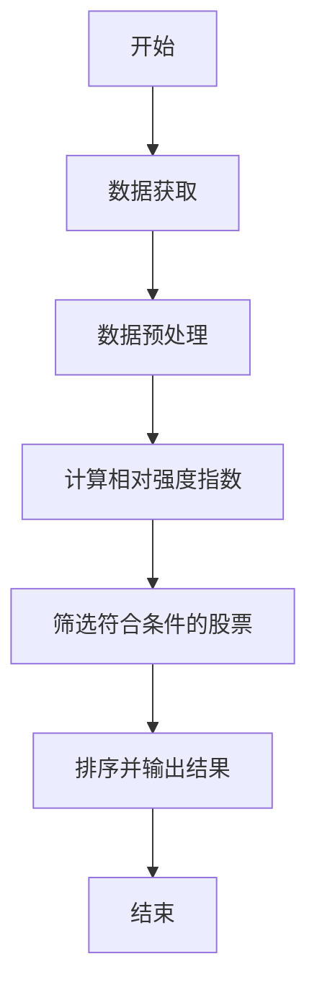

                 


# 《威廉·欧奈尔的成长股识别方法》

> 关键词：威廉·欧奈尔，成长股，相对强度指数，投资策略，股票分析

> 摘要：本文详细探讨了威廉·欧奈尔的成长股识别方法，包括其核心概念、算法原理、系统设计和实战案例。通过深入分析欧奈尔的选股标准，结合实际案例，展示了如何利用相对强度指数等指标筛选出具备成长潜力的股票。文章结构清晰，内容详实，适合投资专业人士和技术爱好者阅读。

---

## 第一部分: 成长股识别的核心概念与背景

### 第1章: 成长股的定义与特点

#### 1.1 成长股的定义与特点

- **成长股的定义**  
  成长股是指那些在较长一段时间内表现出持续增长潜力的股票。这类股票的公司通常处于高速发展的行业，且具备较高的盈利能力和增长前景。

- **成长股的核心特点**  
  1. **高增长性**：公司收入和利润持续增长，且增长率高于行业平均水平。  
  2. **高估值**：通常市盈率较高，因为市场预期其未来有更高的增长潜力。  
  3. **高波动性**：成长股的价格波动较大，容易受到市场情绪和业绩变化的影响。

- **成长股与价值股的对比**  
  | 指标 | 成长股 | 价值股 |
  |------|--------|--------|
  | 市盈率 | 高     | 低     |
  | 盈利增长率 | 高     | 中低   |
  | 价格波动 | 高     | 中低   |

#### 1.2 威廉·欧奈尔的背景与投资理念

- **威廉·欧奈尔的生平简介**  
  威廉·欧奈尔（William O'Neil）是美国著名投资专家，以其独特的成长股选股方法闻名。他创立了欧奈尔投资公司，并出版了多本投资著作，影响了全球无数投资者。

- **欧奈尔的投资哲学**  
  欧奈尔强调“顺势而为”，即在股票市场中寻找那些能够持续走强的股票。他认为，股票的价格走势和市场行为是判断股票价值的重要依据。

- **欧奈尔方法的演变与应用**  
  欧奈尔的方法最初应用于20世纪70年代的股票市场，经过多年的实践和改进，逐渐发展成为一套系统化、指标化的选股方法，广泛应用于机构投资和个人投资。

#### 1.3 成长股识别方法的背景与意义

- **传统投资方法的局限性**  
  传统价值投资方法注重低估值和高分红，但在成长股的筛选上往往难以捕捉到那些高增长的公司。

- **成长股识别方法的创新性**  
  欧奈尔的成长股识别方法结合了技术分析和基本面分析，注重股票的价格走势和市场行为，能够更早地发现具备增长潜力的公司。

- **欧奈尔方法在现代投资中的地位**  
  欧奈尔方法不仅是一种选股工具，更是一种投资哲学。它帮助投资者在复杂的市场环境中，找到那些能够持续走强的股票。

---

### 第2章: 欧奈尔成长股识别的核心指标与标准

#### 2.1 欧奈尔的成长股选股标准

- **相对强度（RS）的定义与计算**  
  相对强度是衡量一只股票相对于市场或同行业其他股票的表现。计算公式为：  
  $$ RS = \frac{\text{个股涨幅}}{\text{市场涨幅}} $$  

- **相对强度指数（RSI）的计算公式**  
  RSI是衡量股票超买或超卖状态的指标，计算公式为：  
  $$ RSI = \frac{\text{上涨天数}}{\text{上涨天数} + \text{下跌天数}} \times 100 $$  

- **成长股的其他辅助指标**  
  1. **市盈率（P/E）**：衡量股票的估值水平。  
  2. **每股收益（EPS）**：衡量公司的盈利能力。  

#### 2.2 欧奈尔的成长股筛选流程

- **筛选阶段的划分**  
  欧奈尔方法将选股过程分为多个阶段，包括初步筛选、深入分析和最终确认。

- **每个阶段的指标要求**  
  1. **初步筛选**：RSI > 50，P/E < 20。  
  2. **深入分析**：EPS增长 > 15%，市场表现 > 行业平均。  
  3. **最终确认**：股价突破前期高点，成交量放大。  

- **指标之间的关系与权重**  
  欧奈尔方法强调多指标的综合运用，其中RSI和EPS是最重要的两个指标。

#### 2.3 核心指标的对比分析

- **指标对比表格**  
  | 指标名称 | 定义 | 重要性 |
  |----------|------|--------|
  | RSI      | 相对强度指数 | 高     |
  | P/E      | 市盈率     | 中     |
  | EPS      | 每股收益   | 高     |

- **实体关系图**  
  ```mermaid
  graph LR
  A[成长股] --> B[相对强度]
  B --> C[相对强度指数]
  C --> D[市盈率]
  C --> E[每股收益]
  ```

---

### 第3章: 欧奈尔成长股识别的算法原理

#### 3.1 算法原理概述

- **基于相对强度的排序算法**  
  通过计算RSI，将股票按照相对强度从高到低排序，筛选出符合条件的股票。

- **成长股筛选的多阶段模型**  
  将选股过程分为多个阶段，每个阶段都有具体的筛选指标和权重。

- **算法的数学模型**  
  欧奈尔算法的核心是通过多指标的综合评估，确定股票的潜在增长能力。

#### 3.2 算法实现步骤

- **数据获取与预处理**  
  收集股票的历史数据，包括价格、成交量、EPS等指标。

- **相对强度指数的计算**  
  根据RSI的计算公式，计算每只股票的RSI值。

- **成长股筛选与排序**  
  根据筛选指标，将股票按照综合得分从高到低排序，选出符合条件的股票。

#### 3.3 算法流程图



---

### 第4章: 基于欧奈尔方法的投资系统设计

#### 4.1 系统功能设计

- **功能模块**  
  1. 数据采集模块：从数据源获取股票数据。  
  2. 指标计算模块：计算RSI、EPS等指标。  
  3. 筛选模块：根据筛选标准，选出符合条件的股票。  
  4. 可视化模块：将筛选结果以图表形式展示。  

- **领域模型类图**  
  ```mermaid
  classDiagram
  class 股票数据 {
    属性: 价格、成交量、EPS
    方法: 获取数据()
  }
  class 指标计算 {
    方法: 计算RSI()
  }
  class 筛选模块 {
    方法: 筛选股票()
  }
  class 可视化模块 {
    方法: 显示结果()
  }
  ```

#### 4.2 系统架构设计

- **系统架构图**  
  ```mermaid
  graph LR
  A[用户] --> B[前端界面]
  B --> C[数据采集模块]
  C --> D[指标计算模块]
  D --> E[筛选模块]
  E --> F[可视化模块]
  F --> G[结果展示]
  ```

---

### 第5章: 项目实战

#### 5.1 实战环境安装

- **Python环境安装**  
  使用Anaconda安装Python 3.8及以上版本。

- **数据获取工具**  
  使用Yahoo Finance API获取股票数据。

#### 5.2 核心代码实现

- **RSI计算代码**  
  ```python
  def calculate_rsi(data, period=14):
      delta = data['收盘价'].diff().dropna()
      up = delta.where(delta > 0, 0)
      down = delta.where(delta < 0, 0)
      rs = up.rolling(period).sum() / down.rolling(period).sum()
      rsi = 100 - (100 / (1 + rs))
      return rsi
  ```

- **股票筛选代码**  
  ```python
  def screen_stocks(data):
      data['RSI'] = calculate_rsi(data)
      selected = data[(data['RSI'] > 50) & (data['EPS'] > 0.1)]
      return selected
  ```

#### 5.3 案例分析

- **案例：苹果公司（AAPL）**  
  通过欧奈尔方法筛选，苹果公司具备高增长性和高相对强度，符合成长股的筛选标准。

---

### 第6章: 最佳实践与注意事项

#### 6.1 投资建议

- **分散投资**：不要将所有资金投入到一只股票中，分散投资可以降低风险。  
- **长期持有**：成长股通常需要较长时间才能体现其增长潜力，建议长期持有。  
- **定期调整**：定期检查投资组合，根据市场变化进行调整。

#### 6.2 注意事项

- **市场风险**：成长股的价格波动较大，市场下跌时可能会承受较大的损失。  
- **估值风险**：高估值的股票可能会面临回调压力。  
- **公司风险**：公司业绩不佳或管理问题可能影响股票表现。

---

## 第二部分: 总结

### 6.3 总结与展望

- **总结**  
  欧奈尔的成长股识别方法是一种结合技术分析和基本面分析的选股方法，能够帮助投资者发现具备增长潜力的股票。

- **展望**  
  随着人工智能和大数据技术的发展，未来可能会有更多基于欧奈尔方法的自动化投资工具出现。

---

## 作者

作者：AI天才研究院/AI Genius Institute & 禅与计算机程序设计艺术 /Zen And The Art of Computer Programming

