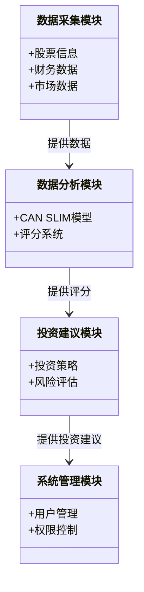

                 


# 《威廉·欧奈尔的机构投资者行为分析》

## 关键词：机构投资者、威廉·欧奈尔、CAN SLIM模型、投资策略、行为分析、技术分析

## 摘要：本文深入分析了威廉·欧奈尔的机构投资者行为分析方法，结合CAN SLIM模型，探讨了机构投资者的决策逻辑、行为模式及其对投资策略的影响。通过技术分析和系统设计，展示了如何利用这些方法进行投资决策优化。

---

## 第一部分: 机构投资者行为分析背景介绍

## 第2章: 机构投资者行为分析概述

### 2.1 机构投资者的定义与特征

#### 2.1.1 机构投资者的定义

机构投资者是指那些代表其他人的资金进行投资的组织或机构，包括共同基金、对冲基金、保险公司、养老基金等。这些机构通常管理着大量的资金，具有专业化的投资团队和丰富的资源。

#### 2.1.2 机构投资者的核心特征

- **资金规模大**：机构投资者通常管理的资金规模较大，具有较大的市场影响力。
- **专业性**：拥有专业的投资团队和丰富的市场经验，能够进行深入的市场研究和分析。
- **长期性**：机构投资者通常注重长期投资，追求稳定的投资回报。
- **合规性**：受严格的监管和合规要求，必须遵守相关的法律法规。

#### 2.1.3 机构投资者与个人投资者的对比

- **目标**：机构投资者通常以追求长期稳定的收益为目标，而个人投资者可能更注重短期收益。
- **风险承受能力**：机构投资者的风险承受能力较强，而个人投资者的风险承受能力有限。
- **决策流程**：机构投资者的决策流程较为复杂，需要经过多个层级的审批，而个人投资者的决策更为灵活。

### 2.2 机构投资者行为分析的背景与意义

#### 2.2.1 投资市场的发展现状

随着全球资本市场的快速发展，机构投资者在市场中扮演着越来越重要的角色。机构投资者的决策行为直接影响着市场的波动和资产价格的变化。

#### 2.2.2 机构投资者在市场中的地位

机构投资者是市场的主要参与者之一，其行为对市场的流动性和价格发现起着至关重要的作用。机构投资者的大量资金流入和流出会影响市场的供需关系，从而影响资产价格的波动。

#### 2.2.3 行为分析对投资决策的重要性

通过分析机构投资者的行为模式，可以帮助投资者更好地理解市场的趋势和潜在的风险。机构投资者的行为分析可以为个人投资者提供重要的参考，帮助其做出更明智的投资决策。

---

## 第3章: 机构投资者行为分析的核心概念与联系

### 3.1 机构投资者行为的核心概念

#### 3.1.1 投资决策的驱动因素

机构投资者的决策受到多种因素的影响，包括市场环境、公司基本面、宏观经济指标、政策变化等。这些因素共同构成了机构投资者的投资决策模型。

#### 3.1.2 市场情绪与投资者行为的关系

市场情绪是影响投资者行为的重要因素之一。当市场情绪乐观时，机构投资者更倾向于买入资产；当市场情绪悲观时，机构投资者更倾向于卖出资产。

#### 3.1.3 机构投资者的群体特征

机构投资者通常具有相似的投资目标和风险偏好，但由于管理的策略和目标不同，不同机构投资者的行为模式可能会有所不同。

### 3.2 核心概念的属性特征对比

#### 3.2.1 投资目标与风险偏好的对比表

| 投资目标       | 风险偏好       |
|----------------|----------------|
| 长期资本增值   | 高风险         |
| 稳定的现金流   | 中风险         |
| 短期套利机会   | 低风险         |

#### 3.2.2 投资策略与市场周期的关联性

投资策略的选择与市场周期密切相关。在牛市中，机构投资者倾向于采取积极的投资策略；在熊市中，机构投资者倾向于采取防御性的投资策略。

#### 3.2.3 机构投资者的决策链路分析

机构投资者的决策过程通常包括以下几个步骤：

1. **市场分析**：分析市场环境和宏观经济指标。
2. **公司研究**：研究公司的基本面，包括财务状况、盈利能力等。
3. **策略制定**：根据市场环境和公司研究结果制定投资策略。
4. **风险评估**：评估投资策略的风险，并制定风险管理计划。
5. **执行决策**：根据制定的策略执行投资决策。
6. **监控与调整**：持续监控市场变化和投资组合的表现，并根据需要进行调整。

### 3.3 机构投资者行为的ER实体关系图

```mermaid
erDiagram
    actor 机构投资者 {
        +id: int
        +目标: string
        +风险偏好: int
        +投资策略: string
    }
    actor 市场环境 {
        +id: int
        +市场情绪: int
        +经济指标: string
        +政策影响: string
    }
    actor 投资决策 {
        +id: int
        +决策时间: datetime
        +决策结果: string
        +决策依据: string
    }
    机构投资者 --> 市场环境 : 受影响
    机构投资者 --> 投资决策 : 制定
    市场环境 --> 投资决策 : 影响
```

---

## 第4章: 机构投资者行为分析的算法原理

### 4.1 基于CAN SLIM模型的算法原理

#### 4.1.1 CAN SLIM模型概述

CAN SLIM模型是由威廉·欧奈尔提出的一种股票筛选方法，旨在帮助投资者识别出具有成长性和强健性的股票。CAN SLIM模型包括以下几个步骤：

- **C**：公司治理
- **A**：盈利能力
- **N**：新股发行
- **S**：供需关系
- **L**：机构投资者的动向
- **I**：行业地位
- **M**：市场表现

#### 4.1.2 CAN SLIM模型的筛选标准

##### 1. 公司治理（C）

公司治理是机构投资者在选择股票时的重要考虑因素之一。机构投资者通常倾向于投资治理结构良好、管理团队稳定、透明度高的公司。

##### 2. 盈利能力（A）

盈利能力是衡量公司财务健康状况的重要指标。机构投资者通常倾向于投资盈利能力稳定且持续增长的公司。

##### 3. 新股发行（N）

新股发行是指公司为了筹集资金而发行新的股票。机构投资者在选择股票时，需要考虑新股发行的时机和数量，以避免稀释现有股东的权益。

##### 4. 供需关系（S）

供需关系是指市场上对某种股票的需求与供给之间的关系。机构投资者在选择股票时，需要考虑市场的供需状况，以避免在市场供过于求时买入股票。

##### 5. 机构投资者的动向（L）

机构投资者的动向是指机构投资者在市场上的买卖行为。通过分析机构投资者的动向，可以判断市场的趋势和潜在的投资机会。

##### 6. 行业地位（I）

行业地位是指公司在行业中的竞争地位。机构投资者通常倾向于投资在行业中具有领先地位的公司，以确保其具有持续的竞争优势。

##### 7. 市场表现（M）

市场表现是指股票在市场上的价格走势。机构投资者在选择股票时，通常会参考股票的历史价格走势，以预测未来的市场表现。

#### 4.1.3 CAN SLIM模型的数学模型

威廉·欧奈尔的CAN SLIM模型可以通过以下数学公式进行量化分析：

$$
\text{投资价值} = \sum_{i=1}^{7} w_i \cdot f_i
$$

其中，\( w_i \) 是每个筛选标准的权重，\( f_i \) 是每个筛选标准的评分。通过计算投资价值，可以判断出股票的投资价值，从而为机构投资者提供决策依据。

---

## 第5章: 机构投资者行为分析的系统分析与架构设计

### 5.1 系统分析

#### 5.1.1 系统目标

设计一个基于CAN SLIM模型的机构投资者行为分析系统，帮助机构投资者更好地识别投资机会和风险。

#### 5.1.2 系统功能需求

- 数据采集：采集股票的基本信息、财务数据、市场数据等。
- 数据分析：根据CAN SLIM模型对股票进行筛选和评分。
- 投资建议：根据分析结果生成投资建议。
- 风险管理：评估投资组合的风险并制定风险管理计划。

#### 5.1.3 系统功能设计



#### 5.1.4 系统架构设计


---

## 第6章: 机构投资者行为分析的项目实战

### 6.1 环境安装

为了运行本文中的代码示例，读者需要安装以下环境：

- Python 3.8+
- NumPy
- Pandas
- Matplotlib

### 6.2 系统核心实现源代码

以下是一个基于CAN SLIM模型的Python代码示例：

```python
import numpy as np
import pandas as pd
import matplotlib.pyplot as plt

# 加载数据
data = pd.read_csv('stock_data.csv')

# 计算投资价值
def calculate_investment_value(row):
    w = [0.2, 0.2, 0.15, 0.15, 0.1, 0.1, 0.05]
    f = [row['治理评分'], row['盈利能力评分'], row['新股发行评分'], row['供需关系评分'], row['机构动向评分'], row['行业地位评分'], row['市场表现评分']]
    return sum(w[i] * f[i] for i in range(7))

data['投资价值'] = data.apply(calculate_investment_value, axis=1)

# 可视化投资价值分布
plt.hist(data['投资价值'], bins=10, alpha=0.5)
plt.xlabel('投资价值')
plt.ylabel('数量')
plt.title('投资价值分布')
plt.show()
```

### 6.3 代码应用解读与分析

上述代码示例展示了如何基于CAN SLIM模型计算股票的投资价值，并通过可视化工具展示投资价值的分布情况。机构投资者可以根据投资价值的高低，选择具有较高投资价值的股票进行投资。

### 6.4 实际案例分析

以某上市公司为例，假设其各项评分如下：

- 治理评分：80
- 盈利能力评分：75
- 新股发行评分：60
- 供需关系评分：70
- 机构动向评分：85
- 行业地位评分：70
- 市场表现评分：65

计算投资价值：

$$
\text{投资价值} = 0.2 \times 80 + 0.2 \times 75 + 0.15 \times 60 + 0.15 \times 70 + 0.1 \times 85 + 0.1 \times 70 + 0.05 \times 65 = 70.5
$$

由于投资价值为70.5，高于平均值，因此该股票具有较高的投资价值。

### 6.5 项目小结

通过本文的项目实战部分，我们展示了如何利用CAN SLIM模型进行股票筛选和投资决策。机构投资者可以利用该模型，结合市场环境和公司基本面，制定出更科学的投资策略。

---

## 第7章: 机构投资者行为分析的最佳实践

### 7.1 最佳实践 tips

- **持续学习**：投资市场变化莫测，机构投资者需要不断学习新的知识和技能，以应对市场的变化。
- **风险管理**：机构投资者需要注重风险管理，制定科学的风险管理计划，以降低投资风险。
- **技术与基本面结合**：机构投资者应该将技术分析和基本面分析相结合，以提高投资决策的准确性。
- **团队协作**：机构投资者需要加强团队协作，充分发挥团队的专业优势，提高投资决策的效率。

### 7.2 小结

通过对威廉·欧奈尔的机构投资者行为分析方法的探讨，我们可以看到，机构投资者的行为模式具有一定的规律性。机构投资者可以通过CAN SLIM模型等工具，结合市场环境和公司基本面，制定出更科学的投资策略。

### 7.3 注意事项

- **数据的准确性**：机构投资者在进行行为分析时，需要确保数据的准确性和完整性，以提高分析结果的可靠性。
- **模型的适用性**：机构投资者在使用CAN SLIM模型时，需要根据实际情况进行调整和优化，以适应不同的市场环境。
- **市场的变化**：投资市场具有不确定性，机构投资者需要时刻关注市场的变化，及时调整投资策略。

### 7.4 拓展阅读

- 《机构投资者的圣经》
- 《投资学基础》
- 《威廉·欧奈尔的投资哲学》

---

## 作者：AI天才研究院/AI Genius Institute & 禅与计算机程序设计艺术 /Zen And The Art of Computer Programming

---

希望这篇文章能够为读者提供有价值的信息和启发，帮助机构投资者更好地理解和应用威廉·欧奈尔的行为分析方法。

