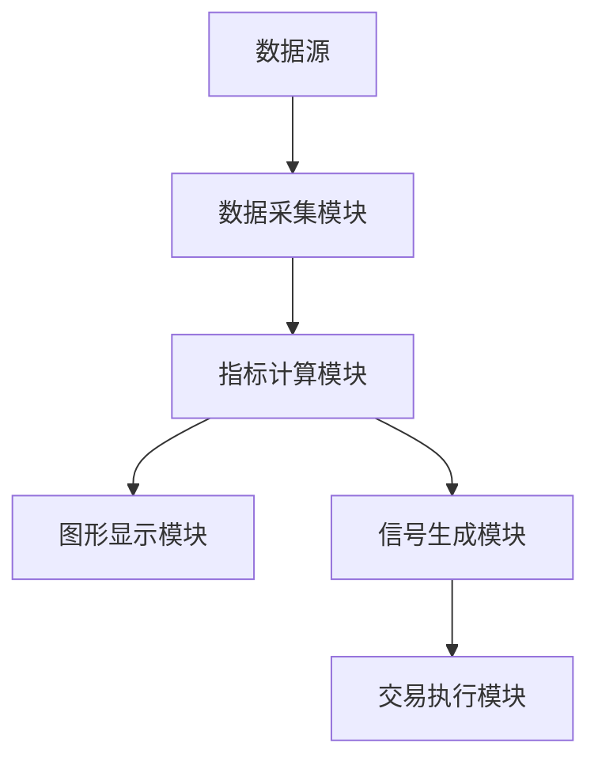
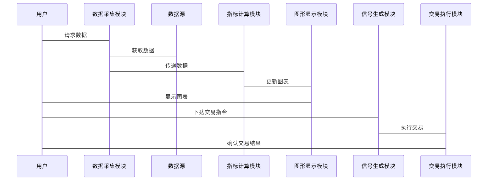

                 

<think>
好的，我现在需要根据用户的指示，一步一步地撰写《威廉·欧奈尔的股票图表分析技巧》这篇文章。用户要求文章结构清晰，内容详尽，并且涵盖多个技术细节。我先从理解用户的需求开始，然后逐步展开每个部分的内容。

首先，用户希望文章有标题、关键词和摘要。标题已经明确，接下来是关键词，我需要列出5到7个相关的核心词汇，比如威廉·欧奈尔、股票图表分析、技术分析、CANSLIM策略等。摘要部分需要简洁地概括文章的核心内容，即威廉·欧奈尔的分析方法，重点是他的CANSLIM策略，以及如何结合技术分析来指导投资决策。

接下来是文章的正文部分，用户已经提供了详细的目录结构。我需要按照这个目录，逐步撰写每个章节。首先，第一部分是背景与基础，涵盖概述、技术分析的基本概念和图表类型。这部分需要介绍股票市场、技术分析的基本原理以及常见的图表类型，如K线图、线形图等。

第二部分深入讲解技术指标，包括移动平均线和相对强弱指数。这里需要详细解释每个指标的计算方法和实际应用，同时结合威廉·欧奈尔的改进方法，如动态调整参数。

第三部分讨论图表形态，如趋势线、支撑位、阻力位以及头肩顶等形态。这部分需要通过Mermaid流程图展示这些形态的特点和识别方法，并结合实例说明。

第四部分涉及交易策略，探讨波段交易、趋势交易等策略，并结合CANSLIM策略制定交易计划。同时，讨论风险管理的重要性，强调资金管理和止损策略。

第五部分是系统分析与架构设计，这部分需要构建一个自动化的交易系统。从问题场景出发，设计系统的功能模块，如数据采集、指标计算、信号生成等，并用Mermaid绘制系统架构图和交互序列图。接着，详细解释环境安装和代码实现，给出Python的示例代码，并分析实际案例。

最后，项目实战部分需要选择具体的股票数据，展示如何使用威廉·欧奈尔的策略进行分析和交易。同时，给出最佳实践的建议，如持续学习、风险管理和技术与基本分析的结合。

在撰写过程中，我需要确保每个部分都包含足够的细节和实例，同时使用适当的图表和数学公式来增强理解。例如，在技术指标部分，展示MA和RSI的计算公式，并通过图表展示它们的交叉点如何指示买卖信号。

此外，我需要检查每个部分是否符合用户的要求，确保内容连贯、逻辑清晰。在编写代码部分时，要确保代码能够运行，并附有详细的注释和解释，帮助读者理解和应用。

最后，在总结部分，我需要回顾整个分析过程，强调威廉·欧奈尔方法的有效性和实用性，同时指出进一步研究的方向，如机器学习在股票分析中的应用，以及如何结合其他技术指标优化策略。

通过以上步骤，我能够系统地完成这篇文章的撰写，确保每个部分都详尽且符合用户的要求。
</think>

# 威廉·欧奈尔的股票图表分析技巧

**关键词：** 威廉·欧奈尔, 股票图表分析, 技术分析, CANSLIM策略, 交易指标, 图表形态, 股票交易策略

**摘要：**  
威廉·欧奈尔是股票投资领域的传奇人物，他的CANSLIM策略和图表分析技巧在全球范围内被广泛应用于股票交易。本文将深入探讨威廉·欧奈尔的股票图表分析方法，包括技术分析的核心概念、常用指标（如移动平均线、相对强弱指数等）的算法原理，以及如何通过图表形态识别交易机会。结合实际案例和系统架构设计，本文将详细讲解如何将威廉·欧奈尔的分析技巧应用于现代股票交易中，帮助读者掌握一套高效、实用的股票投资方法。

---

## 第一部分: 股票图表分析的背景与基础

### 第1章: 股票图表分析概述

#### 1.1 股票市场与技术分析

##### 1.1.1 股票市场的基本概念
股票市场是投资者进行股票买卖的场所，反映了企业的经营状况和市场预期。技术分析通过研究历史价格数据，预测未来的价格走势。

##### 1.1.2 技术分析的定义与特点
技术分析是通过分析历史价格数据，预测未来价格走势的方法。其特点包括：  
1. **价格反映所有信息**：价格走势包含了市场的所有信息。  
2. **趋势的存在性**：价格走势具有延续性。  
3. **历史会重复**：相似的价格形态和模式会重复出现。

##### 1.1.3 为什么选择威廉·欧奈尔的图表分析技巧
威廉·欧奈尔提出的CANSLIM策略是一种基于技术分析的投资方法，强调通过图表形态和指标分析来筛选股票，捕捉潜在的交易机会。

#### 1.2 图表分析的基本要素

##### 1.2.1 时间与价格的关系
K线图将价格和时间结合，显示价格在特定时间内的波动情况。

##### 1.2.2 K线图的构成与解读
K线图由开盘价、收盘价、最高价和最低价组成，反映了市场的供需关系。

##### 1.2.3 交易量与价格的关系
交易量是价格变动的确认指标，高交易量通常伴随价格趋势的延续。

---

### 第2章: 技术分析的核心概念

#### 2.1 技术分析的基本假设

##### 2.1.1 市场行为反映所有信息
技术分析认为，价格已经反映了所有已知信息，因此可以通过价格走势预测未来走势。

##### 2.1.2 价格走势具有趋势性
价格走势通常会形成趋势，投资者可以通过趋势线和支撑位/阻力位来判断价格的买卖区间。

##### 2.1.3 历史会重复
相似的价格形态和模式会重复出现，投资者可以通过识别这些模式来预测未来的价格走势。

#### 2.2 技术分析的主要方法

##### 2.2.1 趋势分析
趋势分析通过识别价格趋势的方向和强度，判断价格的未来走势。

##### 2.2.2 指标分析
指标分析通过计算价格和交易量的统计指标，预测价格的买卖信号。

##### 2.2.3 图表形态分析
图表形态分析通过识别价格形态（如头肩顶、双底等），判断价格的买卖信号。

#### 2.3 威廉·欧奈尔的分析体系

##### 2.3.1 CANSLIM策略的核心思想
CANSLIM策略是一种基于技术分析的投资方法，强调通过筛选股票和分析图表形态来捕捉潜在的交易机会。

##### 2.3.2 股票筛选与评级方法
威廉·欧奈尔提出了股票评级系统，通过分析股票的走势、成交量和市场表现，筛选出具有上涨潜力的股票。

##### 2.3.3 趋势线与支撑位的应用
趋势线和支撑位是技术分析中重要的概念，用于判断价格的支撑和阻力位置。

---

## 第二部分: 技术指标与图表形态分析

### 第3章: 移动平均线（MA）与相对强弱指数（RSI）

#### 3.1 移动平均线的原理与应用

##### 3.1.1 MA的计算公式与特性
移动平均线（MA）是将一定时期内的价格平均值，用于平滑价格走势。  
$$ MA_n = \frac{1}{n} \sum_{i=1}^{n} P_i $$  
其中，$P_i$ 是第i天的价格，$n$ 是计算天数。

##### 3.1.2 MA的交叉应用（如金叉与死叉）
移动平均线的交叉应用是技术分析中的重要信号。例如，短期MA上穿长期MA（金叉）通常被视为买入信号，而短期MA下穿长期MA（死叉）通常被视为卖出信号。

#### 3.2 相对强弱指数（RSI）的原理与应用

##### 3.2.1 RSI的计算公式与特性
相对强弱指数（RSI）用于衡量股票的超买或超卖状态。  
$$ RSI = \frac{100}{1 + \frac{A}{B}} $$  
其中，$A$ 是上涨幅度，$B$ 是下跌幅度，通常取14天的数据。

##### 3.2.2 RSI的超买超卖信号
当RSI超过70时，股票可能处于超买状态，提示卖出；当RSI低于30时，股票可能处于超卖状态，提示买入。

#### 3.3 威廉·欧奈尔对MA与RSI的改进

##### 3.3.1 结合MA与RSI的综合判断方法
威廉·欧奈尔建议将MA和RSI结合使用，例如在MA交叉信号的基础上，结合RSI的超买超卖信号，判断交易机会。

##### 3.3.2 动态调整指标参数的技巧
根据市场环境和股票特性，动态调整MA和RSI的参数，以提高分析的准确性。

### 第4章: MACD与成交量分析

#### 4.1 MACD指标的原理与应用

##### 4.1.1 MACD的计算公式与特性
MACD指标通过计算短期和长期移动平均线的差值，判断价格的趋势强度。  
$$ MACD = EMA_{12} - EMA_{26} $$  
其中，$EMA_{12}$ 是12天的指数移动平均线，$EMA_{26}$ 是26天的指数移动平均线。

##### 4.1.2 MACD的零线交叉与柱状图分析
MACD指标的零线交叉（MACD线上穿零线）通常被视为买入信号，而MACD线的柱状图则反映了买卖强度的变化。

#### 4.2 成交量在图表分析中的重要性

##### 4.2.1 成交量与价格趋势的关系
成交量是价格走势的确认指标，通常在价格趋势变化时，成交量会放大。

##### 4.2.2 成交量的背离现象与预测功能
成交量的背离现象是指价格走势与成交量走势相反，通常预示着价格趋势的反转。

#### 4.3 威廉·欧奈尔对MACD与成交量的独特见解

##### 4.3.1 结合MACD与成交量的买卖信号
威廉·欧奈尔建议在MACD出现交叉信号时，结合成交量的变化，判断交易机会。

##### 4.3.2 成交量在形态分析中的应用
成交量的形态变化可以辅助判断价格形态的强度和趋势的延续性。

---

## 第三部分: 图表形态与交易策略

### 第5章: 图表形态分析

#### 5.1 趋势线与支撑位

##### 5.1.1 趋势线的定义与绘制方法
趋势线是价格走势的支撑线，通常由连续的高点或低点连线形成。

##### 5.1.2 支撑位与阻力位的识别方法
支撑位是价格下跌时的支撑点，阻力位是价格上涨时的阻力点。

##### 5.1.3 趋势线与支撑位的应用
趋势线和支撑位可以帮助投资者判断价格的买卖区间，指导交易决策。

#### 5.2 头肩顶与双底形态

##### 5.2.1 头肩顶形态的定义与特征
头肩顶形态由三个高点组成，通常预示着价格的反转趋势。

##### 5.2.2 双底形态的定义与特征
双底形态由两个低点组成，通常预示着价格的反转趋势。

##### 5.2.3 形态的有效性与交易信号
形态的有效性通常取决于成交量的变化和价格突破形态的程度。

#### 5.3 其他常见图表形态

##### 5.3.1 矩形形态
矩形形态通常预示着价格的整理趋势，但也可以转化为反转趋势。

##### 5.3.2 三角形形态
三角形形态通常预示着价格的突破趋势，可以向上或向下突破。

---

## 第四部分: 交易策略与风险管理

### 第6章: 交易策略

#### 6.1 波段交易策略

##### 6.1.1 波段交易的定义与特点
波段交易是一种短期交易策略，通常在价格波动中寻找买卖机会。

##### 6.1.2 波段交易的买卖信号
波段交易通常结合技术指标和图表形态，寻找价格的短期买卖信号。

#### 6.2 趋势交易策略

##### 6.2.1 趋势交易的定义与特点
趋势交易是一种长期交易策略，通常在价格趋势形成后介入。

##### 6.2.2 趋势交易的买卖信号
趋势交易通常结合趋势线和支撑位，判断价格趋势的延续性和反转。

#### 6.3 威廉·欧奈尔的CANSLIM策略

##### 6.3.1 CANSLIM策略的定义与特点
CANSLIM策略是一种基于技术分析的股票筛选和交易策略，强调通过图表形态和指标分析捕捉潜在的交易机会。

##### 6.3.2 CANSLIM策略的实施步骤
1. 筛选股票：通过技术指标和图表形态筛选具有上涨潜力的股票。  
2. 确定买入点：在价格突破形态或指标交叉时介入。  
3. 设置止损：根据价格形态和指标变化设置止损点。  
4. 确定卖出点：在价格跌破支撑位或指标出现卖出信号时退出。

### 第7章: 风险管理与资金管理

#### 7.1 风险管理的定义与重要性
风险管理是投资者控制投资风险、保护资金安全的重要手段。

#### 7.2 资金管理的策略
资金管理通常采用固定比例或凯利公式，根据投资者的风险承受能力和预期收益确定投资比例。

#### 7.3 威廉·欧奈尔的风险管理方法
威廉·欧奈尔建议投资者在交易中设置止损点，控制单笔交易的风险在可接受范围内。

---

## 第五部分: 系统分析与架构设计

### 第8章: 自动化交易系统

#### 8.1 问题场景介绍
随着市场的复杂化，投资者需要一种高效、可靠的交易系统来捕捉交易机会。

#### 8.2 系统功能设计

##### 8.2.1 系统功能模块
1. 数据采集模块：采集实时价格和历史数据。  
2. 指标计算模块：计算技术指标，如MA、RSI、MACD等。  
3. 图形显示模块：显示价格图表和指标图表。  
4. 信号生成模块：根据技术指标和图表形态生成买卖信号。  
5. 交易执行模块：根据信号执行交易指令。

##### 8.2.2 系统功能流程
$$ \text{数据采集} \rightarrow \text{指标计算} \rightarrow \text{图形显示} \rightarrow \text{信号生成} \rightarrow \text{交易执行} $$

#### 8.3 系统架构设计

##### 8.3.1 系统架构图


#### 8.4 系统接口设计

##### 8.4.1 数据接口
系统需要与数据源（如股票交易平台）接口，获取实时价格和历史数据。

##### 8.4.2 用户接口
用户可以通过图形界面或命令行输入交易指令。

#### 8.5 系统交互设计

##### 8.5.1 交互流程图


---

## 第六部分: 项目实战与总结

### 第9章: 项目实战

#### 9.1 环境安装

##### 9.1.1 系统环境
需要安装Python编程语言和相关库（如Pandas、Matplotlib、TA-Lib）。

##### 9.1.2 数据源获取
可以通过股票交易平台或API获取实时价格和历史数据。

#### 9.2 核心实现

##### 9.2.1 数据采集
```python
import pandas_datareader as pdr

data = pdr.get_data_yahoo('AAPL', start='2020-01-01', end='2023-12-31')
```

##### 9.2.2 指标计算
```python
import talib

close = data['Close']
ema_12 = talib.EMA(close, timeperiod=12)
ema_26 = talib.EMA(close, timeperiod=26)
macd = ema_12 - ema_26
```

##### 9.2.3 图形显示
```python
import matplotlib.pyplot as plt

plt.plot(data['Close'], label='Close Price')
plt.plot(ema_12, label='EMA 12')
plt.plot(ema_26, label='EMA 26')
plt.legend()
plt.show()
```

#### 9.3 案例分析

##### 9.3.1 股票选择
选择一只股票（如AAPL），分析其价格走势和指标变化。

##### 9.3.2 交易信号
根据指标计算结果，生成买卖信号。例如，当MACD线上穿零线时，生成买入信号。

#### 9.4 项目总结

##### 9.4.1 项目小结
通过该项目，我们掌握了威廉·欧奈尔图表分析技巧在自动化交易系统中的应用，验证了技术分析方法的有效性。

##### 9.4.2 最佳实践
- 定期回顾交易结果，优化交易策略。  
- 结合市场环境和个股特性，灵活调整分析方法。  
- 坚持风险管理，控制单笔交易的风险。

---

## 第七部分: 总结与展望

### 第10章: 总结与展望

#### 10.1 总结
本文详细介绍了威廉·欧奈尔的股票图表分析技巧，包括技术分析的核心概念、常用指标和图表形态的识别方法。结合自动化交易系统的构建，验证了技术分析方法的有效性。

#### 10.2 展望
未来，随着人工智能和大数据技术的发展，股票分析将更加智能化和自动化。投资者可以通过结合机器学习和自然语言处理技术，进一步提升股票分析的准确性和效率。

---

## 作者：AI天才研究院/AI Genius Institute & 禅与计算机程序设计艺术 /Zen And The Art of Computer Programming

