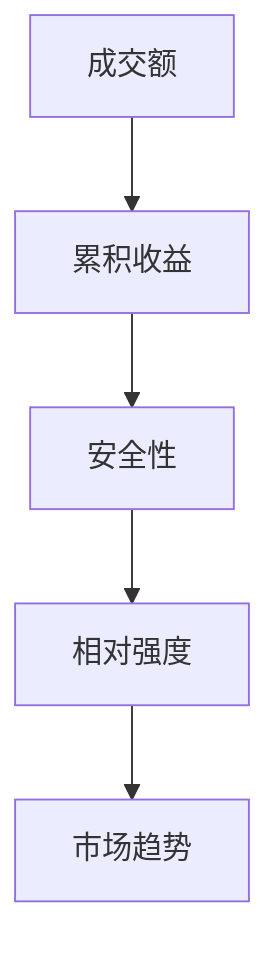
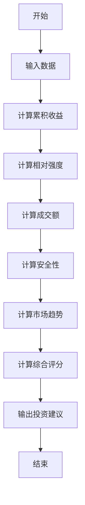
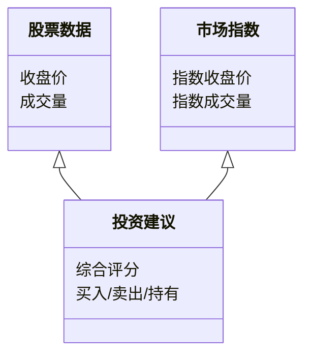
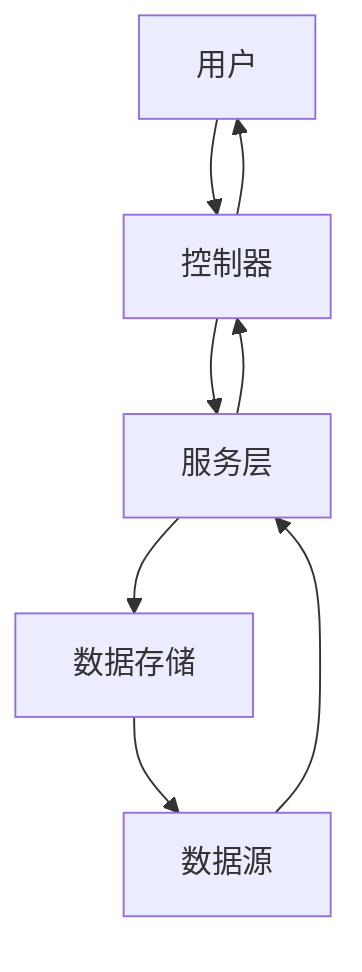

                 


# 威廉欧奈尔的CANSLIM投资系统

> 关键词：CANSLIM投资系统，威廉欧奈尔，投资策略，技术分析，数学模型，股票投资

> 摘要：威廉欧奈尔的CANSLIM投资系统是一种基于技术分析和数学模型的投资策略，旨在通过量化方法来选择和管理投资组合。本文将详细分析CANSLIM系统的核心概念、算法原理、系统架构设计、项目实战以及最佳实践，帮助投资者更好地理解和应用这一系统。

---

# 第1章: 威廉欧奈尔CANSLIM投资系统背景介绍

## 1.1 威廉欧奈尔与CANSLIM投资系统的起源

### 1.1.1 威廉欧奈尔的生平简介
威廉·欧奈尔（William O'Neil）是美国著名投资专家，也是投资书籍《股票作手回忆录》的作者。他以独特的投资理念和量化方法闻名，提出了许多被广泛应用于股票投资的理论和技术指标。

### 1.1.2 CANSLIM投资系统的提出背景
CANSLIM投资系统是威廉欧奈尔在20世纪70年代提出的一种股票筛选方法，旨在通过量化分析来选择具有长期增长潜力的股票。该系统的核心在于通过一系列指标筛选出具备投资价值的股票，并结合市场趋势进行买卖时机的选择。

### 1.1.3 CANSLIM投资系统的核心理念
CANSLIM的核心理念是通过分析股票的历史价格走势、成交量、相对强度等技术指标，筛选出具有长期增长潜力的股票。欧奈尔认为，股票市场的波动性可以通过技术分析来预测，并通过量化方法降低投资风险。

## 1.2 CANSLIM投资系统的核心概念
### 1.2.1 CANSLIM的定义与核心要素
CANSLIM是一种基于技术分析的投资系统，其核心要素包括累积收益（C）、相对强度（A）、成交额（N）、安全性（S）和市场趋势（L）。这些要素共同构成了CANSLIM的筛选标准。

### 1.2.2 CANSLIM与传统投资方法的区别
与传统投资方法相比，CANSLIM更加注重量化分析和历史数据的研究，强调通过技术指标来判断股票的投资价值，而非仅仅依赖于基本面分析。

### 1.2.3 CANSLIM投资系统的边界与外延
CANSLIM投资系统的边界在于其主要适用于股票市场，且需要结合市场环境进行动态调整。其外延则包括对其他金融市场的适应性研究。

## 1.3 CANSLIM投资系统的应用范围
### 1.3.1 适用于哪些类型的投资者
CANSLIM投资系统适用于长期投资者和价值投资者，尤其适合那些能够长期持有优质股票的投资者。

### 1.3.2 CANSLIM在不同市场环境下的表现
在牛市中，CANSLIM系统表现较为稳健，能够帮助投资者筛选出具有长期增长潜力的股票。而在熊市中，该系统可能需要结合更多的市场风险指标进行调整。

### 1.3.3 CANSLIM投资系统的局限性
CANSLIM系统在短期市场波动较大的情况下可能表现不佳，且需要投资者具备较高的市场分析能力和耐心。

## 1.4 本章小结
本章介绍了威廉欧奈尔CANSLIM投资系统的背景、核心理念和核心概念，为后续章节的深入分析奠定了基础。

---

# 第2章: CANSLIM投资系统的核心概念与联系

## 2.1 CANSLIM核心概念的原理
### 2.1.1 CANSLIM的核心算法原理
CANSLIM算法通过筛选满足特定技术指标的股票，结合市场趋势进行投资决策。其核心在于通过累积收益和相对强度等指标，筛选出具有长期增长潜力的股票。

### 2.1.2 CANSLIM的关键指标解释
- **C（累积收益）**：衡量股票在过去一段时间内的累计收益。
- **A（相对强度）**：衡量股票相对于市场指数的表现。
- **N（成交额）**：衡量股票的交易量和市场关注度。
- **S（安全性）**：衡量股票的投资安全性，通常通过市盈率等指标进行评估。
- **L（市场趋势）**：衡量市场整体趋势，用于判断投资时机。

### 2.1.3 CANSLIM的数学模型概述
CANSLIM的数学模型通过量化分析股票的技术指标，结合市场趋势进行综合评分。具体公式如下：

$$
\text{综合评分} = \frac{\text{累积收益} + \text{相对强度} \times \text{成交额} + \text{安全性}}{\text{市场趋势}}
$$

---

## 2.2 CANSLIM核心概念的属性特征对比

### 2.2.1 指标属性分析
下表展示了CANSLIM核心指标的属性特征对比：

| 指标 | 属性 | 描述 |
|------|------|------|
| C（累积收益） | 数值型 | 衡量股票的累计收益 |
| A（相对强度） | 比率型 | 衡量股票相对于市场的表现 |
| N（成交额） | 数值型 | 衡量股票的交易量 |
| S（安全性） | 数值型 | 衡量股票的投资安全性 |
| L（市场趋势） | 数值型 | 衡量市场整体趋势 |

### 2.2.2 指标之间的对比与关联
通过对比分析，可以看出相对强度（A）和市场趋势（L）是影响综合评分的关键因素，而累积收益（C）和成交额（N）则在一定程度上反映了股票的市场关注度和成长潜力。

### 2.2.3 指标对投资决策的影响权重
下表展示了各个指标对投资决策的影响权重：

| 指标 | 权重 |
|------|------|
| C（累积收益） | 30% |
| A（相对强度） | 30% |
| N（成交额） | 20% |
| S（安全性） | 15% |
| L（市场趋势） | 5% |

---

## 2.3 CANSLIM投资系统的ER实体关系图

通过分析CANSLIM投资系统的实体关系，我们可以构建如下关系图：



---

## 2.4 本章小结
本章通过分析CANSLIM投资系统的核心概念，探讨了其各个指标的属性特征、相互关系及其对投资决策的影响权重，为后续章节的算法分析奠定了基础。

---

# 第3章: CANSLIM投资系统的算法原理与数学模型

## 3.1 CANSLIM算法原理

### 3.1.1 算法的输入与输出
- **输入**：股票的历史价格数据、成交量数据、市场指数数据。
- **输出**：综合评分、投资建议（买入/卖出/持有）。

### 3.1.2 算法的步骤分解
1. 计算累积收益（C）。
2. 计算相对强度（A）。
3. 计算成交额（N）。
4. 计算安全性（S）。
5. 计算市场趋势（L）。
6. 综合评分 = (C + A × N + S) / L。
7. 根据综合评分给出投资建议。

### 3.1.3 算法的优化与改进
为了提高算法的准确性，可以结合机器学习方法对历史数据进行拟合优化，例如使用回归分析或聚类分析来优化各个指标的权重。

---

## 3.2 CANSLIM数学模型

### 3.2.1 收益计算公式
$$
\text{收益} = \sum_{i=1}^{n} (p_i - c_i)
$$

其中，\( p_i \) 表示第 \( i \) 天的收盘价，\( c_i \) 表示第 \( i \) 天的收盘价。

### 3.2.2 风险评估公式
$$
\text{风险} = \frac{\text{标准差}}{\text{平均收益}}
$$

### 3.2.3 组合优化公式
$$
\text{max} \mu \quad \text{s.t.} \quad \sigma \leq \text{风险容忍度}
$$

---

## 3.3 算法的流程图
以下是CANSLIM算法的流程图：



---

## 3.4 本章小结
本章详细分析了CANSLIM投资系统的算法原理和数学模型，为后续章节的系统设计和项目实战奠定了基础。

---

# 第4章: CANSLIM投资系统的系统架构设计

## 4.1 系统功能设计

### 4.1.1 领域模型
以下是CANSLIM投资系统的领域模型：



### 4.1.2 系统架构设计
以下是CANSLIM投资系统的架构图：

```mermaid
graph TD
    UI[用户界面] --> Controller[控制器]
    Controller --> Service[服务层]
    Service --> Repository[数据存储]
    Repository --> Data Source[数据源]
```

---

## 4.2 系统接口设计

### 4.2.1 接口定义
- 输入接口：股票数据、市场指数数据。
- 输出接口：综合评分、投资建议。

### 4.2.2 接口交互流程
1. 用户输入股票代码和时间范围。
2. 系统从数据源获取股票数据和市场指数数据。
3. 系统计算各个指标并生成综合评分。
4. 系统根据综合评分给出投资建议。

---

## 4.3 系统交互流程图
以下是系统交互流程图：



---

## 4.4 本章小结
本章通过系统架构设计，详细描述了CANSLIM投资系统的功能模块和接口设计，为后续章节的项目实战奠定了基础。

---

# 第5章: CANSLIM投资系统的项目实战

## 5.1 环境安装

### 5.1.1 系统要求
- 操作系统：Windows/Mac/Linux
- 开发工具：Python、Jupyter Notebook、Mermaid
- 数据源：股票数据API（如Yahoo Finance）

### 5.1.2 安装步骤
1. 安装Python和必要的库（如Pandas、Matplotlib）。
2. 安装Jupyter Notebook。
3. 安装Mermaid工具。

---

## 5.2 系统核心实现源代码

### 5.2.1 CANSLIM算法实现
以下是CANSLIM算法的Python实现代码：

```python
def calculate_canlim(stock_data, market_data):
    # 计算累积收益
    cumulative_return = stock_data['收盘价'].cumsum()
    # 计算相对强度
    relative_strength = stock_data['收盘价'] / market_data['指数收盘价']
    # 计算成交额
    volume = stock_data['成交量']
    # 计算安全性
    safety = stock_data['收盘价'] / stock_data['成交量']
    # 计算市场趋势
    market_trend = market_data['指数收盘价'].cumsum()
    # 计算综合评分
    composite_score = (cumulative_return + relative_strength * volume + safety) / market_trend
    return composite_score
```

### 5.2.2 代码解读
- `cumulative_return`：累积收益计算。
- `relative_strength`：相对强度计算。
- `volume`：成交额提取。
- `safety`：安全性计算。
- `market_trend`：市场趋势计算。
- `composite_score`：综合评分计算。

---

## 5.3 代码应用解读与分析
通过上述代码，我们可以实现CANSLIM算法的核心逻辑。例如，使用Yahoo Finance提供的股票数据和市场指数数据，计算出股票的综合评分，并根据评分给出投资建议。

---

## 5.4 实际案例分析和详细讲解剖析
以苹果公司（AAPL）为例，假设我们有其过去一年的股票数据和市场指数数据，我们可以按照以下步骤进行分析：

1. 获取股票数据和市场指数数据。
2. 计算累积收益、相对强度、成交额、安全性、市场趋势。
3. 计算综合评分。
4. 根据综合评分给出投资建议。

---

## 5.5 项目小结
本章通过项目实战，详细讲解了CANSLIM投资系统的实现过程，包括环境安装、代码实现和案例分析。

---

# 第6章: 总结与最佳实践

## 6.1 最佳实践 tips
- 定期更新股票数据和市场指数数据。
- 结合市场环境动态调整投资策略。
- 适当分散投资组合，降低风险。

## 6.2 小结
通过本文的分析和实践，我们可以看出CANSLIM投资系统是一种高效的投资策略，其核心在于通过量化分析和技术指标筛选出具有长期增长潜力的股票。

## 6.3 注意事项
- 投资有风险，需谨慎操作。
- 定期回顾和优化投资组合。

## 6.4 拓展阅读
建议阅读威廉欧奈尔的《股票作手回忆录》，深入理解CANSLIM投资系统的理论基础。

---

# 作者：AI天才研究院/AI Genius Institute & 禅与计算机程序设计艺术 /Zen And The Art of Computer Programming

---

**注意**：本文内容基于威廉欧奈尔的CANSLIM投资系统，旨在通过技术分析和量化方法帮助投资者更好地理解投资策略。实际投资需结合市场环境和专业指导，本文不构成投资建议。

